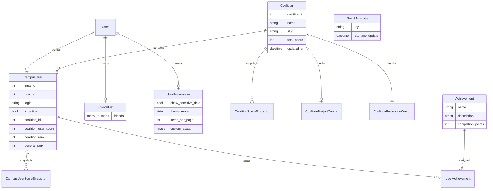

*This project has been created as part of the 42 curriculum by Fernando Morenilla, Augusto Jesus Rodriguez Linares, Luis Ayala, Francisco J Vizcaya and German Gasset.*

# AEDLPH

## Description

AEDLPH is a web platform for the 42 coalitions tournament. It combines OAuth login, campus data synchronization, rankings, user profiles, achievements, and chat.

The project is built as a full-stack Django and Next.js application. The backend synchronizes data from the 42 API, persists local snapshots, and exposes APIs for the frontend. The frontend renders the dashboards, charts, status views, and supporting UX around authentication and social features.

## Instructions

### Requirements

- Docker and Docker Compose
- GNU Make

### Run the full stack

```bash
make full-up
```

This starts the frontend, backend, database, and supporting services from `docker-compose.dev.yml`.

Then open:

```
https://localhost
```

### HTTPS

Every connection from a browser, a script or an external API goes through an
nginx reverse proxy that terminates TLS. **443 is the only port published to the
host**: the frontend and the backend are reachable on the internal Docker
network only, so there is no plain-HTTP way into the application. Traffic
between containers stays unencrypted, which the subject allows.

The proxy serves everything from a single origin, which is also why the frontend
needs no API URL configured — it calls `/api/...` relative to whatever address
it was loaded from:

| Path | Served by |
|---|---|
| `/api/`, `/admin/`, `/static/`, `/media/` | Django (`backend:8000`) |
| everything else | Next.js (`frontend:3000`) |

Django itself is proxy-aware: `SECURE_PROXY_SSL_HEADER` makes it trust the
`X-Forwarded-Proto` header the proxy sets, so it treats requests as secure and
sets `Secure` cookies. That header can only come from the proxy, since nothing
else can reach the container.

#### Certificates

On first start the proxy generates a **self-signed** certificate into the
`tls_certs` volume. Browsers will warn once — choose *Advanced → Proceed*. That
bypass exists because HSTS is deliberately not enabled; turning it on with a
self-signed certificate removes the click-through and locks you out.

A certificate is only issued when none exists, and the volume survives rebuilds,
so it is not regenerated on its own. Issue a fresh one with:

```bash
make certs-reset
```

Nothing needs editing first. The target works out the names to certify at run
time and passes them to the proxy:

| Source | Example |
|---|---|
| loopback | `DNS:localhost`, `IP:127.0.0.1` |
| machine name (`hostname`) | `DNS:<hostname>`, `DNS:<hostname>.local` |
| current LAN address (`ip route get`) | `IP:<detected>` |

The LAN address is read from the route actually used for outbound traffic, so it
picks the real interface rather than one of the Docker bridges. Override either
part when you need to:

```bash
make certs-reset HOST_IP=10.11.12.13
make certs-reset TLS_SAN=DNS:localhost,IP:127.0.0.1
```

Because the certificate changes, browsers show the warning again the first time.

#### Reaching the app from another machine

By default everything points at `https://localhost`, which only works on the
machine running the stack. To serve it under an address others can reach:

```bash
make evaluation                            # uses the detected LAN IP
make evaluation EVAL_HOST=<hostname>.local # stable across DHCP leases
make evaluation EVAL_HOST=localhost        # put it back
```

That one command rewrites `FRONTEND_URL`, `FT_REDIRECT_URI`,
`CORS_ALLOWED_ORIGINS` and `CSRF_TRUSTED_ORIGINS` in `.env`, reissues the
certificate for the new address, and recreates the backend and frontend
containers — `env_file` is only read when a container is created, so a plain
restart would not pick the change up.

It is safe to re-run: the rewrite replaces whatever host is currently
configured rather than matching the literal string `localhost`, so it cannot
accumulate. The previous file is kept as `.env.bak`.

`NEXT_PUBLIC_API_URL` is deliberately left empty throughout — the frontend calls
the API relative to whatever origin it was loaded from, so it never needs to
change.

##### Prefer the `.local` name over the IP

Campus addresses come from DHCP and **do change** — ours moved twice in a single
afternoon. Both the IP and the mDNS name are in the certificate, but only the
name survives a new lease.

This matters most for **OAuth**, the one part `make evaluation` cannot fix by
itself: 42 only accepts a `redirect_uri` that is registered on the application,
byte for byte. An IP-based URI has to be re-registered every time the lease
changes — possibly mid-evaluation. Register the `.local` form **once**:

```
https://<hostname>.local/api/auth/42/callback/
```

and `make evaluation EVAL_HOST=<hostname>.local` will keep working forever
without touching intra again. Keep the `https://localhost/...` URI registered
alongside it for local work; 42 accepts several.

mDNS resolution requires the *client* to support `.local` names: macOS and most
Linux distributions do out of the box, Windows needs Bonjour installed. The IP
is in the certificate as a fallback for clients that cannot resolve it.

#### Evaluation-day procedure

```bash
make evaluation EVAL_HOST=<hostname>.local   # or plain `make evaluation` for the IP
make full-up
```

Then check, before anyone is watching:

```bash
curl -sk https://localhost/api/health/
docker compose -f docker-compose.dev.yml exec -T backend python manage.py shell -c \
  "from sync.models import CampusUser; from django.contrib.auth.models import User; \
   print('roster', CampusUser.objects.count(), '| superusers', User.objects.filter(is_superuser=True).count())"
```

You want a non-zero roster and at least one superuser. If the database was
wiped, the roster has to be re-synced or parts of the app will fail quietly:

```bash
make back-syncapi MODE=full     # ~2 minutes
```

Say "https" out loud when handing over the URL. Browsers default to `http://`,
there is no listener on port 80, and the resulting connection error looks like a
broken stack.

#### Django admin

```
https://localhost/admin/
```

Create the first account with `make back-superuser`.

### Backend commands

```bash
make back-up
make back-migrate
make back-syncdb
make back-syncapi
make back-logs
```

### Frontend commands

```bash
make front-up
make front-logs
```

### Useful notes

- Configuration lives in `.env` at the repository root; copy `.env.example` to get started.
- `FT_REDIRECT_URI` must be registered verbatim on the 42 application, and now uses `https://`.
- The cron-based sync jobs are registered through Django and executed in the backend container.

## Resources

### Technical references

- Django documentation: https://docs.djangoproject.com/
- Next.js documentation: https://nextjs.org/docs
- MDN Web Docs: https://developer.mozilla.org/
- 42 API documentation: https://api.intra.42.fr/apidoc

### AI usage

AI was used to draft and refine the README structure, legal-page copy, and compliance-oriented summaries of the codebase. It was also used to cross-check the README requirements against the repository contents. The application design, feature set, and implementation details remain grounded in the code present in the repository.

## Team Information

The repository history shows these main contributors. The roles below reflect the main responsibilities visible in the codebase, not necessarily a formal staffing chart.

- Fernando Morenilla - Frontend developer. Responsible for the app shell, routing, and UI composition.
- Augusto Jesus Rodriguez Linares - Backend and sync lead. Responsible for the 42 data ingestion pipeline, snapshots, and cron-driven synchronization.
- GGasset - Full-stack developer. Responsible for gameplay, coalition, and product-facing features across the interface.
- Luis Ayala - Backend developer. Responsible for user data, preferences, and social/user models.
- Francisco J Vizcaya - Full-stack developer. Responsible for support features, validation, and feature integration.

## Project Management

The work was organized around shared repository branches, Markdown design documents, Docker-based environments, and iterative feature delivery. The repository itself does not include a dedicated exported issue board, so the visible process is documentation-driven and commit-driven.

- Task distribution: split by backend sync, frontend UX, social features, and supporting infrastructure.
- Meetings and coordination: not recorded in the repository.
- Tools visible in the repo: Git, Docker Compose, Makefile targets, and the documentation under `doc/`.
- Communication channels: not recorded in the repository.

## Technical Stack

### Frontend

- Next.js 16 with the App Router
- React 19
- TypeScript
- Tailwind CSS
- Zustand for client state
- Recharts for visualizations

### Backend

- Django
- Django REST Framework
- Simple JWT
- django-crontab for scheduled jobs
- Requests for API integration with 42

### Database

- PostgreSQL

PostgreSQL was chosen because the application needs relational integrity, indexed snapshots, one-to-one user settings, and time-based analytics over coalition and user history.

### Other notable technologies

- Docker and Docker Compose for local development
- Cron inside the backend container for scheduled jobs
- Pillow for avatar uploads
- WebSockets-ready app structure for realtime features

## Database Schema

The schema centers on campus users, coalitions, snapshots, preferences, and social data.



Key relationships:

- `CampusUser` stores the local copy of 42 campus data and links to a Django `User` when available.
- `CoalitionScoreSnapshot` and `CampusUserScoreSnapshot` preserve historical rankings by day.
- `UserPreferences` stores per-user UI and privacy settings.
- `FriendsList` tracks social lists and friend requests.
- `SyncMetadata` stores the last successful synchronization timestamp.

## Features List

- OAuth-based login and protected application shell. Main contributors: Fernando Morenilla, Luis Ayala.
- 42 campus synchronization, coalition ingestion, ranking recomputation, and daily snapshots. Main contributors: Augusto Jesus Rodriguez Linares.
- Coalition dashboards and score visualizations. Main contributors: GGasset, Augusto Jesus Rodriguez Linares.
- User preferences, custom avatars, and profile-related storage. Main contributors: Luis Ayala.
- Achievements and gamification storage. Main contributors: Francisco J Vizcaya, GGasset.
- Chat and social surfaces in the project structure. Main contributors: GGasset, Fernando Morenilla.
- Status page and backend health visibility. Main contributors: Fernando Morenilla, Augusto Jesus Rodriguez Linares.

## Modules

The documented optional modules implemented in this repository are:

1. Custom Major - Campus Data Sync and Temporal Snapshot Engine (+2 points)

Why it was chosen:

- The project depends on continuously changing 42 data.
- The team needed resilience against API rate limits and temporary failures.
- Historical snapshots are required for rankings and analytics.

How it was implemented:

- OAuth token handling and request pacing for the 42 API.
- Paginated sync pipelines for users and coalitions.
- Upsert-based persistence into local models.
- Daily score snapshots for users and coalitions.
- Cron-driven execution inside the backend container.

Main contributors:

- Augusto Jesus Rodriguez Linares

Repository evidence:

- `backend/sync/services.py`
- `backend/sync/management/commands/sync_campus_users.py`
- `backend/cron_scheduler/apps.py`
- `backend/sync/models.py`

2. Real-time Features - Game Events (+2 points)

The multiplayer game and its invitations use Django Channels instead of browser
polling. HTTP endpoints remain authoritative for commands, while WebSockets
broadcast state changes immediately to both players.

Implementation highlights:

- JWT authentication from the existing HttpOnly access-token cookie.
- A private channel group for each authenticated user.
- Redis-backed channel layers for multi-process event delivery.
- Real-time invitation, acceptance, move, forfeit, rematch, and friendship events.
- Heartbeats and exponential client reconnection.
- No private move choices are included in WebSocket event payloads.

Repository evidence:

- `backend/authentication/websocket.py`
- `backend/games/consumers.py`
- `backend/games/events.py`
- `backend/games/routing.py`
- `frontend/lib/gameSocket.ts`
- `frontend/components/GameNotifications.tsx`
- `frontend/app/games/page.tsx`

3. Complete Web-based Game (+2 points)

PPTLS supports live matches between two authenticated friends. Invitations,
hidden choices, scoring, win conditions, forfeits, rematches, rounds, and match
state are validated and persisted by Django.

Repository evidence:

- `backend/games/models.py`
- `backend/games/services.py`
- `backend/games/views.py`
- `backend/games/tests.py`
- `backend/games/test_websockets.py`
- `frontend/app/games/page.tsx`

4. Public API - API Keys, Rate Limiting, and Data Endpoints (+2 points)

The `public_api` FastAPI service exposes a documented public interface over the
shared database. Protected endpoints require `X-API-Key`, raw keys are only
shown once, stored keys are hashed, and each key has an enforced
`requests_per_minute` quota backed by Redis.

Implementation highlights:

- Protected API key lifecycle endpoints using `POST`, `GET`, `PUT`, and `DELETE`.
- User and coalition read endpoints with filtering, sorting, and pagination.
- Redis-backed per-key rate limiting with `429 Too Many Requests` responses.
- `make api-create-key` for creating a real one-time key during evaluation.
- Public API documentation and smoke tests under `public_api/doc/` and
  `public_api/tests/`.

Repository evidence:

- `public_api/app/api/v1/routes/api_keys.py`
- `public_api/app/api/v1/routes/users.py`
- `public_api/app/api/v1/routes/coalitions.py`
- `public_api/app/services/api_key_service.py`
- `public_api/app/services/rate_limit_service.py`
- `public_api/doc/public_api_setup_and_usage.md`
- `public_api/tests/api_test_key.py`

## Individual Contributions

### Fernando Morenilla

- Frontend app shell and layout
- Public legal pages and footer accessibility links
- Status and UI integration work

### Augusto Jesus Rodriguez Linares

- 42 synchronization pipeline
- Cron registration and scheduled execution
- Snapshot persistence and ranking recomputation
- Backend health and sync metadata

### GGasset

- Coalition-facing and product-facing UI work
- Feature integration across the interface
- Support for gameplay and visualization surfaces

### Luis Ayala

- User data and preferences models
- Social relationships and avatar-related persistence
- Backend support for user-facing customization

### Francisco J Vizcaya

- Achievement and supporting backend structures
- Feature integration and validation work
- Shared implementation support for the broader project

### Challenges and how they were handled

- 42 API throughput and volatility were handled with pagination, retries, and pacing.
- Historical ranking data was handled with daily snapshot tables and indexed relationships.

## Compliance Notes

- The repository includes public Privacy Policy and Terms of Service pages linked from the app footer.
- The documentation in `doc/` complements this README with architectural and functional references.
