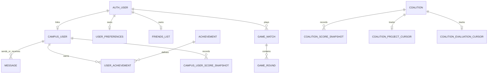

*This project has been created as part of the 42 curriculum by [42 logins pending team confirmation].*

# AEDLPH

## Description

AEDLPH is a web platform for the 42 Madrid coalition competition. It imports campus data from the 42 API, stores current and historical rankings, and provides coalition dashboards, user profiles, friendships, direct chat, achievements, advanced leaderboards, and a two-player Rock-Paper-Scissors-Lizard-Spock game.

The application is split into independently containerized frontend, backend, database, realtime, public API, status, backup, mail, and reverse-proxy services. Nginx is the only browser-facing entry point and terminates HTTPS. Django owns authentication and the application domain, PostgreSQL is the shared source of truth, Redis supports WebSocket delivery and API rate limiting, and Next.js renders the user interface.

## Instructions

### Prerequisites

- Docker Engine with Docker Compose v2
- GNU Make
- A 42 OAuth application and its client credentials
- Git

### Configuration

Copy the example environment file and set at least `FT_CLIENT_ID`, `FT_CLIENT_SECRET`, and `SECRET_KEY`:

```bash
cp .env.example .env
```

The default local origin is `https://localhost:8443`. The OAuth application must register this callback exactly:

```text
https://localhost:8443/api/auth/42/callback/
```

The supplied `.env.example` also configures PostgreSQL, Redis, SMTP/Mailpit, CORS, CSRF, the public API, backups, and service health checks. Development defaults are not production secrets.

### Start and stop the complete stack

```bash
make full-up
make full-down
```

Open:

- Application: `https://localhost:8443`
- System status: `https://localhost:8443/status`
- Django admin: `https://localhost:8443/admin/`
- Mailpit: `https://localhost:8443/mailpit/`
- Public API documentation: `https://localhost:8443/api/v1/docs`

The proxy creates a persistent self-signed development certificate on first start. Accept the browser warning. To regenerate it, run `make certs-reset`.

### Initialize and inspect the data

```bash
make back-migrate
make back-superuser
make back-syncapi MODE=full
make back-logs
make front-logs
```

`make back-syncapi` accepts `MODE=full`, `MODE=users`, or `MODE=coalitions`. The backend entrypoint also installs the configured cron jobs; the full campus sync runs periodically inside the backend container.

### Evaluation on multiple computers

Use a LAN-reachable host before starting the stack:

```bash
make evaluation
make full-up
```

Or use a stable mDNS name:

```bash
make evaluation EVAL_HOST=<hostname>.local
make full-up
```

Register the resulting callback, including port `8443`, in the 42 OAuth application. The command updates the origin-related variables in `.env`, saves `.env.bak`, renews the certificate, and recreates the affected containers.

### Tests and operational checks

```bash
make back-test
make status-test
python public_api/tests/api_test_key.py evaluation --base-url https://localhost:8443
python public_api/tests/public_api.py --base-url https://localhost:8443 --api-key <one-time-key>
curl -sk https://localhost:8443/api/health/
curl -sk https://localhost:8443/api/status/
```

The frontend exposes `npm run lint` and `npm run build` from `frontend/`. The public API scripts are live-stack smoke tests, not isolated unit tests.

### Backup and recovery

```bash
make db-backup
make db-backup-ls
make db-restore BACKUP_FILE=backups/postgres/<dump>.sql.gz
```

Restore replaces the current database and is destructive. The `db-backup` service creates a validated backup every six hours and keeps automatic backups for seven days by default.

### Disaster recovery procedure

1. Inspect services with `docker compose -f docker-compose.dev.yml ps` and review the `backend` and `db` logs.
2. Check `https://localhost:8443/api/health/` and `https://localhost:8443/api/status/`.
3. List the available dumps with `make db-backup-ls` and select an explicit known-good file.
4. If the current state is still valuable, create a final dump with `make db-backup` before restoring.
5. Run `make db-restore BACKUP_FILE=backups/postgres/<dump>.sql.gz`. The restore script validates the archive, coordinates the backend service, and restores PostgreSQL.
6. Verify container health, login, principal pages, synchronization metadata, and expected restored records.
7. Keep older dumps until the recovery has been fully validated. Automatic dumps are local and unencrypted, so production use requires encrypted off-host copies.

## Resources

### Technical references

- [Django documentation](https://docs.djangoproject.com/)
- [Django REST framework documentation](https://www.django-rest-framework.org/)
- [Django Channels documentation](https://channels.readthedocs.io/)
- [Next.js documentation](https://nextjs.org/docs)
- [FastAPI documentation](https://fastapi.tiangolo.com/)
- [PostgreSQL documentation](https://www.postgresql.org/docs/)
- [Redis documentation](https://redis.io/docs/)
- [42 API documentation](https://api.intra.42.fr/apidoc)
- [MDN Web Docs](https://developer.mozilla.org/)

### Use of artificial intelligence

AI tools were used to help structure and edit documentation, compare subject requirements with repository evidence, and identify stale paths or unsupported claims. AI output was not treated as proof: module status, architecture, test coverage, routes, and limitations were checked against the `main` branch. Team members remain responsible for understanding and defending every claimed implementation. No application feature is claimed solely because an AI tool or an older document described it.

## Team Information

The contributors visible in the repository are Fernando Morenilla, Augusto Jesus Rodriguez Linares, German Gasset, Luis Felipe Ayala Sarabia, and Francisco J. Vizcaya. Their 42 logins and the formal assignments below must be confirmed by the team before evaluation.

| Required role | Assigned member | Role responsibility |
|---|---|---|
| Product Owner | **Pending team confirmation** | Defines product priorities, accepts delivered value, and keeps the result aligned with user and subject needs. |
| Project Manager / Scrum Master | **Pending team confirmation** | Coordinates planning, meetings, blockers, task distribution, and delivery follow-up. |
| Technical Lead | **Pending team confirmation** | Maintains architecture and engineering consistency and coordinates integration and technical quality. |
| Developers | All five contributors | Design, implement, review, test, document, and demonstrate their assigned areas. |

### Evidence-based implementation responsibilities

These are technical contribution areas supported by file history; they are not substitutes for the formal roles above.

- **Fernando Morenilla:** frontend architecture and app shell, leaderboard and reusable UI work, authentication UX, user/social integration, and deployment integration.
- **Augusto Jesus Rodriguez Linares:** campus synchronization, temporal snapshots, game backend and realtime integration, operational health, and recovery documentation.
- **German Gasset:** user and social backend work, coalition/product features, chat, and cross-layer feature integration.
- **Luis Felipe Ayala Sarabia:** user/profile and social features, frontend/backend integration, and supporting application features.
- **Francisco J. Vizcaya:** public API, API-key lifecycle and documentation, supporting backend structures, and integration work.

## Project Management

Git and repository history demonstrate branch-based delivery, pull-request integration, feature-oriented commits, Docker Compose environments, Make targets, and Markdown specifications. The repository does not reliably prove the team's meeting cadence, management board, or communication channel, so those facts must be supplied by the team rather than invented.

| Practice | Current documented answer |
|---|---|
| Work distribution | By feature area: sync/data, frontend UX, users/social/chat, game/realtime, public API, and operations. |
| Version control | Git branches, commits, and integration into `main`. |
| Task-management tool | **Pending team confirmation.** |
| Meeting type and frequency | **Pending team confirmation.** |
| Main communication channel | **Pending team confirmation.** |
| Technical coordination | Docker Compose, Make, repository documentation, tests, and shared code review/integration. |

## Technical Stack

| Layer | Technology | Reason for the choice |
|---|---|---|
| Frontend | Next.js 16, React 19, TypeScript | File-based routing, server/client component support, typed UI code, and a mature React ecosystem. |
| Styling and UI | Tailwind CSS 4, CSS variables, Lucide, Recharts | Consistent tokens and reusable components, accessible vector icons, and data visualization. |
| Client state | Zustand | Small shared stores without a large state-management framework. |
| Backend | Django 5, Django REST framework | Mature authentication, migrations, admin, ORM, validation, and REST APIs. |
| Realtime | Django Channels, Daphne, Redis | Authenticated ASGI WebSockets with cross-process group delivery. |
| Public API | FastAPI, SQLAlchemy | An independently documented API service with typed schemas and explicit key/rate-limit concerns. |
| Database | PostgreSQL 16 | Relational constraints, transactions, indexes, migrations, and efficient historical queries. |
| Operations | Docker Compose, Nginx, Make, cron | Reproducible services, one HTTPS origin, short operational commands, and scheduled sync jobs. |
| Local email | Mailpit | Safe inspection of registration, password, and deletion emails without external delivery. |

### Container responsibilities

- `frontend`: renders the Next.js application and static assets.
- `backend`: runs migrations, cron, and Daphne for Django HTTP and WebSocket traffic.
- `db`: stores all relational application, game, chat, sync, and API-key data.
- `redis`: provides Channels delivery and public API rate-limit counters.
- `public_api`: exposes the API-key-protected FastAPI interface.
- `status`: probes frontend, backend, database, Redis, and public API independently of Next.js.
- `db-backup`: creates and retains automatic PostgreSQL dumps.
- `mailpit`: captures development email.
- `proxy`: terminates TLS and routes the single public origin to internal services.

## Database Schema

The central schema is defined by Django migrations; the public API reads the same PostgreSQL database through SQLAlchemy. The diagram focuses on domain relationships and omits framework session/token tables.



Important models and constraints:

- `CampusUser` is the normalized local 42 profile and may link one-to-one to a Django user.
- `CoalitionScoreSnapshot` and `CampusUserScoreSnapshot` enforce one snapshot per entity and date.
- `FriendsList` holds symmetric friendships and directed pending requests.
- `Message` persists direct messages between campus users.
- `GameMatch` and `GameRound` persist invitations, hidden moves, scores, results, forfeits, and rematches.
- `UserPreferences` stores theme, pagination, privacy/notification settings, custom display name, and avatar.
- `SyncMetadata` records successful synchronization timestamps.
- The public API's `ApiKey` data stores hashed keys and quota metadata; raw keys are returned only when created.

Primary schema evidence: `backend/sync/models.py`, `backend/users/models.py`, `backend/chat/models.py`, `backend/games/models.py`, `backend/authentication/models.py`, and `public_api/app/models/api_key.py`.

## Features List

| Feature | What it does | Implementation owners evidenced by history |
|---|---|---|
| Authentication | Email registration and verification, password login/reset, rotating JWT cookies, logout, and 42 OAuth linking/login. | Fernando, German, Augusto, Luis |
| Campus sync and snapshots | Imports users/coalitions, retries transient failures, computes ranks, records daily history, and runs incrementally or fully. | Augusto (primary), Fernando |
| Coalition dashboards | Shows coalition details, scores, members, trends, and rankings. | Fernando, German, Augusto |
| Advanced leaderboard | Searches users and filters by coalition, level, and points; sorts columns and paginates results. | Fernando (primary), Augusto |
| Profiles and friends | Displays profiles, online status, avatars, friendships, and pending requests. | German, Fernando, Luis |
| Direct chat | Persists one-to-one messages and uses WebSockets for message and typing delivery. | German, Fernando, Luis |
| Game | Runs authenticated friend matches of Rock-Paper-Scissors-Lizard-Spock with server-side rules and realtime notifications. | Augusto (primary), Luis, Francisco |
| Public API | Exposes users, coalitions, and API-key lifecycle endpoints with documentation and Redis quotas. | Francisco (primary), Augusto, Fernando |
| Health and recovery | Publishes aggregate status, creates backups, supports restore, and documents incident recovery. | Augusto, Fernando, Francisco |

## Modules

### Scoring policy

The current evidence-based total is **22 points**: eight Major modules (16 points) and six Minor modules (6 points). Standard user management is defendable because authenticated users can update profile information through the preferences API in addition to using the avatar, friends, online-status, and profile-page features. GDPR is defendable through readable data export, confirmed account deletion, and the deletion confirmation email. PWA is absent from `main` and is not claimed. Advanced chat is also not claimed because blocking, chat-to-game invitations, read receipts, and complete chat reconnection are missing.

| # | Module | Type | Points | Status |
|---:|---|---|---:|---|
| 1 | Use a framework for both the frontend and backend | Major | 2 | Defendable |
| 2 | Implement real-time features using WebSockets or similar technology | Major | 2 | Defendable |
| 3 | Allow users to interact with other users | Major | 2 | Defendable |
| 4 | A public API to interact with the database with a secured API key, rate limiting, documentation, and at least 5 endpoints | Major | 2 | Defendable |
| 5 | Use an ORM for the database | Minor | 1 | Defendable |
| 6 | Custom-made design system with reusable components, including a proper color palette, typography, and icons (minimum: 10 reusable components) | Minor | 1 | Defendable |
| 7 | Implement an advanced search functionality | Minor | 1 | Defendable |
| 8 | Standard user management and authentication | Major | 2 | Defendable |
| 9 | Implement remote authentication with OAuth 2.0 | Minor | 1 | Defendable |
| 10 | Implement a complete web-based game where users can play against each other | Major | 2 | Defendable |
| 11 | Remote players — Enable two players on separate computers to play the same game in real-time | Major | 2 | Defendable |
| 12 | Health check and status page system with automated backups and disaster recovery procedures | Minor | 1 | Defendable |
| 13 | GDPR compliance features | Minor | 1 | Defendable |
| 14 | Campus Data Sync and Temporal Snapshot Engine | Major | 2 | Defendable custom module |

### 1. Use a framework for both the frontend and backend

- **Type / value:** Major, +2.
- **Subject requirements:** use frameworks for both frontend and backend; the full application must still satisfy the global requirements.
- **Actual implementation:** Next.js/React/TypeScript implements the frontend and Django/DRF implements the backend. FastAPI is used for the separate public API.
- **Main evidence:** `frontend/package.json`, `frontend/app/layout.tsx`, `backend/config/settings/settings.py`, `backend/config/urls.py`, `backend/requirements.txt`.
- **Tests:** Django suites under `backend/*/tests.py`, status pytest suite, frontend ESLint/build checks.
- **Responsible contributors:** the full team; Fernando is the primary frontend contributor and Augusto/German/Luis contributed heavily to Django domains.
- **Evaluation demo:** start the stack, navigate between Next.js pages, call a Django `/api/` route, and show framework configuration and container logs.
- **Status:** **Defendable**.

### 2. Implement real-time features using WebSockets or similar technology

- **Type / value:** Major, +2.
- **Subject requirements:** realtime updates, graceful connection/disconnection handling, and efficient broadcasting.
- **Actual implementation:** authenticated Django Channels consumers serve game/friend and chat sockets; Redis backs private user groups; the game client sends heartbeat pings and retries with bounded exponential delays after offline/visibility/disconnect events.
- **Main evidence:** `backend/config/asgi.py`, `backend/authentication/websocket.py`, `backend/config/realtime.py`, `backend/games/consumers.py`, `backend/games/events.py`, `backend/chat/consumers.py`, `frontend/lib/gameSocket.ts`, `frontend/hooks/useChatSocket.ts`.
- **Tests:** `backend/games/test_websockets.py`, realtime assertions in `backend/games/tests.py` and `backend/users/tests.py`, and `backend/chat/tests.py`.
- **Responsible contributors:** Augusto, German, Luis, Fernando.
- **Evaluation demo:** open two authenticated browsers, create/accept a friendship or game invitation, show the immediate notification, then temporarily disconnect one client and show game-socket reconnection.
- **Status:** **Defendable** for game/friend realtime. Advanced chat is not claimed.

### 3. Allow users to interact with other users

- **Type / value:** Major, +2.
- **Subject requirements:** basic chat, a profile system, and friend operations to add, remove, and list friends.
- **Actual implementation:** profile pages expose campus and social information; REST endpoints manage requests and friendships; direct messages are persisted and delivered by WebSocket; online state is updated by heartbeat.
- **Main evidence:** `backend/users/views.py`, `backend/users/services.py`, `backend/users/models.py`, `backend/chat/models.py`, `backend/chat/consumers.py`, `frontend/app/users/[login]/page.tsx`, `frontend/components/Chat.tsx`, `frontend/components/Notifications.tsx`.
- **Tests:** friendship/realtime coverage in `backend/users/tests.py`; chat WebSocket coverage in `backend/chat/tests.py`.
- **Responsible contributors:** German, Fernando, Luis, Augusto.
- **Evaluation demo:** search for a user, send and accept a friend request, inspect both profiles/friend lists, exchange direct messages, and remove the friend.
- **Status:** **Defendable** as basic interaction only.

### 4. A public API to interact with the database with a secured API key, rate limiting, documentation, and at least 5 endpoints

- **Type / value:** Major, +2.
- **Subject requirements:** secure API keys, rate limiting, documentation, at least five endpoints, and `GET`, `POST`, `PUT`, and `DELETE` methods.
- **Actual implementation:** FastAPI exposes health, API-key creation/read/update/revocation, user list/detail, and coalition list/detail routes. Keys are generated once, stored as hashes, and checked against Redis per-key quotas; protected routes require `X-API-Key`.
- **Main evidence:** `public_api/app/main.py`, `public_api/app/api/v1/routes/api_keys.py`, `public_api/app/api/v1/routes/users.py`, `public_api/app/api/v1/routes/coalitions.py`, `public_api/app/services/api_key_service.py`, `public_api/app/services/rate_limit_service.py`, `public_api/doc/public_api_setup_and_usage.md`.
- **Tests:** live lifecycle/rate-limit smoke test `public_api/tests/api_test_key.py` and endpoint smoke test `public_api/tests/public_api.py`.
- **Responsible contributors:** Francisco (primary), Augusto, Fernando.
- **Evaluation demo:** run `python public_api/tests/api_test_key.py evaluation --base-url https://localhost:8443`, use Swagger at `/api/v1/docs`, and show the third request returning `429` for a key limited to two requests per minute.
- **Status:** **Defendable**.

### 5. Use an ORM for the database

- **Type / value:** Minor, +1.
- **Subject requirements:** use an object-relational mapper for database access.
- **Actual implementation:** Django ORM manages application models and migrations; SQLAlchemy maps the public API to the shared PostgreSQL schema.
- **Main evidence:** `backend/sync/models.py`, `backend/games/models.py`, `backend/users/models.py`, `backend/chat/models.py`, `backend/*/migrations/`, `public_api/app/models/`, `public_api/app/db/session.py`.
- **Tests:** all Django domain tests create/query ORM records; public API smoke tests exercise SQLAlchemy reads and key writes.
- **Responsible contributors:** all backend contributors.
- **Evaluation demo:** show a model, its migration, a service query, and the resulting record through Django admin or the API.
- **Status:** **Defendable**.

### 6. Custom-made design system with reusable components, including a proper color palette, typography, and icons (minimum: 10 reusable components)

- **Type / value:** Minor, +1.
- **Subject requirements:** consistent color palette, typography, iconography, and at least ten reusable components.
- **Actual implementation:** semantic light/dark and coalition color tokens live in global CSS; Inter is the shared typeface; Lucide supplies icons; the frontend contains more than ten reusable components including `AuthLayout`, `Header`, `Footer`, `NavLink`, `NavProfile`, `ThemeProvider`, `CardContainer`, `CustomButton`, `IconActionButton`, `StatCard`, `CoalitionPointsChart`, and authentication form primitives.
- **Main evidence:** `frontend/app/globals.css`, `frontend/app/layout.tsx`, and `frontend/components/`.
- **Tests:** no dedicated component test suite; frontend lint/build and manual cross-page/theme review are the available checks.
- **Responsible contributors:** Fernando (primary), Augusto, Luis, Francisco.
- **Evaluation demo:** switch light/dark themes and show the same tokens/buttons/cards/navigation across dashboard, leaderboard, coalition, profile, and game pages.
- **Status:** **Defendable**, with manual rather than automated visual testing.

### 7. Implement an advanced search functionality

- **Type / value:** Minor, +1.
- **Subject requirements:** search plus filters, sorting, and pagination.
- **Actual implementation:** the leaderboard searches login/display name, filters multiple coalitions and level/point ranges, sorts multiple columns in either direction, supports saved presets, and paginates with selectable page sizes. Public API user listing separately supports coalition/activity/level filters, allow-listed sorting, and pagination.
- **Main evidence:** `frontend/hooks/useLeaderboard.ts`, `frontend/app/leaderboard/_components/LeaderboardFilters.tsx`, `frontend/app/leaderboard/_components/LeaderboardPagination.tsx`, `frontend/app/leaderboard/_components/LeaderboardView.tsx`, `public_api/app/api/v1/routes/users.py`, `public_api/app/services/user_service.py`.
- **Tests:** no dedicated automated leaderboard test; the public API live test covers paginated/sorted requests.
- **Responsible contributors:** Fernando (primary), Augusto, Francisco.
- **Evaluation demo:** search by partial login, combine coalition and numeric ranges, sort a column, change page size, and move between pages.
- **Status:** **Defendable**, with a noted automated-test gap.

### 8. Standard user management and authentication

- **Type / potential value:** Major, +2.
- **Subject requirements:** users can update profile information, upload an avatar with a default fallback, add friends and see online status, and access profile pages.
- **Actual implementation:** authenticated users can update profile information, including `custom_username`, through `PATCH /api/users/preferences/`. The application also provides custom avatar upload/removal with fallback behavior, friend requests and removal, heartbeat-based online status, and public user profile pages. The graphical settings modal handles avatar and account preferences; `custom_username` can be demonstrated directly through the authenticated API.
- **Main evidence:** `backend/users/models.py`, `backend/users/views.py`, `frontend/app/users/_components/UserConfigurationModal.tsx`, and `frontend/lib/userApi.ts`. The current settings UI has no display-name editor.
- **Tests:** `backend/users/tests.py` covers profile history and friendship behavior, while `backend/authentication/tests.py` covers account and authentication behavior. Avatar and `custom_username` updates should additionally be demonstrated through the authenticated API.
- **Responsible contributors:** German, Fernando, Luis, Augusto.
- **Evaluation demo:** update `custom_username` with an authenticated `PATCH /api/users/preferences/` request, upload/remove an avatar, add a friend, show online status, and open both profile pages.
- **Status:** **Defendable**.

### 9. Implement remote authentication with OAuth 2.0

- **Type / value:** Minor, +1.
- **Subject requirements:** secure remote authentication through OAuth 2.0.
- **Actual implementation:** 42 authorization URL, callback, login, and account-link flows validate returned identity, prevent duplicate identity links, issue secure JWT cookies, and preserve the registered local email where appropriate.
- **Main evidence:** `backend/authentication/views.py`, `backend/authentication/serializers.py`, `backend/authentication/urls.py`, `frontend/app/login/page.tsx`, and `frontend/app/guest/page.tsx`.
- **Tests:** OAuth callback/link/login scenarios in `backend/authentication/tests.py`.
- **Responsible contributors:** Fernando, German, Augusto.
- **Evaluation demo:** log in through 42 with the registered HTTPS callback and show the resulting linked campus profile and authenticated session.
- **Status:** **Defendable**.

### 10. Implement a complete web-based game where users can play against each other

- **Type / value:** Major, +2.
- **Subject requirements:** a complete playable web game with live matches, clear rules and win/loss conditions, and a 2D or 3D presentation.
- **Actual implementation:** Rock-Paper-Scissors-Lizard-Spock supports friend invitations, best-to-3 or best-to-5 scoring, hidden simultaneous choices, server-side resolution, wins/losses/ties, forfeits, persistent rounds, rematches, and a graphical web interface.
- **Main evidence:** `backend/games/models.py`, `backend/games/services.py`, `backend/games/views.py`, `frontend/app/games/page.tsx`, `frontend/lib/rpsls.ts`.
- **Tests:** comprehensive rule/state/API tests in `backend/games/tests.py` and socket tests in `backend/games/test_websockets.py`.
- **Responsible contributors:** Augusto (primary), Luis, Francisco.
- **Evaluation demo:** invite a friend, accept, submit both hidden moves, finish a match to its target score, and request a rematch.
- **Status:** **Defendable**.

### 11. Remote players — Enable two players on separate computers to play the same game in real-time

- **Type / value:** Major, +2.
- **Subject requirements:** players on separate computers join the same game, state is synchronized in realtime, latency/disconnection are handled gracefully, and the experience remains smooth with reconnection support.
- **Actual implementation:** both clients address the same HTTPS origin over the LAN, game state is authoritative and persistent in Django/PostgreSQL, private WebSocket events invalidate/refetch state immediately, and the game socket reconnects with heartbeat and bounded backoff. A disconnected player can reload persisted match state; forfeits handle abandoned matches.
- **Main evidence:** `Makefile` (`evaluation`), `nginx/nginx.conf`, `backend/games/events.py`, `backend/games/consumers.py`, `frontend/lib/gameSocket.ts`, `frontend/app/games/page.tsx`.
- **Tests:** two authenticated socket communicators are covered in `backend/games/test_websockets.py`; API state transitions are covered in `backend/games/tests.py`. Physical two-computer behavior remains a required manual evaluation check.
- **Responsible contributors:** Augusto (primary), Fernando, Luis.
- **Evaluation demo:** use `make evaluation`, open the LAN URL on two computers with different users, complete a match, disconnect/reconnect one device, and show restored current state.
- **Status:** **Defendable**, conditional on the mandatory two-computer demonstration succeeding in the evaluation network.

### 12. Health check and status page system with automated backups and disaster recovery procedures

- **Type / value:** Minor, +1.
- **Subject requirements:** health checks, a status page, automated backups, and disaster recovery procedures.
- **Actual implementation:** an independent FastAPI status service checks frontend, Django, PostgreSQL, Redis, public API, and last sync; Nginx exposes status/health endpoints even when Next.js is unavailable. The backup sidecar creates validated dumps every six hours with seven-day retention; Make targets provide manual backup/restore; a recovery runbook defines diagnosis and restoration.
- **Main evidence:** `status_service/app/main.py`, `status_service/app/checks.py`, `docker-compose.dev.yml`, `scripts/automated_backup_db.sh`, `scripts/backup_db.sh`, `scripts/restore_db.sh`, and the disaster recovery procedure in this README.
- **Tests:** five pytest checks in `status_service/tests/test_main.py`; backup and restore are operational/manual procedures.
- **Responsible contributors:** Augusto, Fernando, Francisco.
- **Evaluation demo:** open `/status`, stop a monitored service to show degraded status, restart it, create/list a backup, and explain the documented restore flow without destructively restoring unless prepared.
- **Status:** **Defendable**.

### 13. GDPR compliance features

- **Type / potential value:** Minor, +1.
- **Subject requirements:** users can request their data, delete their account with confirmation, receive a readable export, and receive confirmation emails for data operations.
- **Actual implementation:** authenticated users can request and download an indented, readable JSON export. Account deletion requires explicit confirmation in the UI, removes the account data, and sends a confirmation email to the account owner after deletion. The email failure path is handled without undoing a completed deletion.
- **Main evidence:** `backend/users/views.py`, `backend/users/services.py`, `frontend/lib/userApi.ts`, `frontend/app/privacy/page.tsx`, `backend/authentication/emails.py`.
- **Tests:** account deletion, successful confirmation email delivery, and email-failure behavior are covered in `backend/authentication/tests.py`. The readable export is available through the authenticated users endpoint and should also be demonstrated manually.
- **Responsible contributors:** Fernando, German, Luis, Augusto.
- **Evaluation demo:** download and inspect the readable JSON export, request account deletion through the confirmation modal, and inspect the resulting confirmation email in Mailpit.
- **Status:** **Defendable**.

### 14. Campus Data Sync and Temporal Snapshot Engine

- **Type / value:** Custom Major, +2.
- **Subject requirements:** a custom module must add substantial, relevant functionality with complexity comparable to a Major module; its rationale, challenge, value, implementation, ownership, and lack of shortcut must be documented.
- **Actual implementation:** the engine obtains and caches 42 machine tokens, paginates upstream datasets, paces and retries requests, normalizes/upserts users and coalitions, tolerates missing upstream users, performs incremental project/evaluation updates, recalculates ranks, records dated coalition/user snapshots, backfills history, records sync metadata, and runs in full/users/coalitions modes by command and cron. The application reads local data and snapshots instead of depending on the upstream API for every page load.
- **Why it is Major:** it combines external API reliability, non-trivial normalization and reconciliation, temporal data modeling, incremental cursors, ranking computation, scheduled operations, and product-facing historical analytics. A one-time import or direct API proxy would not provide those properties.
- **Main evidence:** `backend/sync/services.py`, `backend/sync/projects.py`, `backend/sync/evaluations.py`, `backend/sync/score_snapshots_backfill.py`, `backend/sync/models.py`, `backend/sync/management/commands/sync_campus_users.py`, `backend/cron_scheduler/apps.py`, `backend/coalitions/services.py`.
- **Tests:** retry, 404 tolerance, incremental timestamp guards, and snapshot backfill/ranking tests in `backend/sync/tests.py`.
- **Responsible contributors:** Augusto (primary), Fernando, with integration contributions from the wider team.
- **Evaluation demo:** run a limited or full sync, show metrics and `SyncMetadata`, inspect normalized records and snapshot uniqueness, rerun to demonstrate idempotent upserts, and open a historical coalition/user chart.
- **Status:** **Defendable custom Major**. See [the dedicated rationale](doc/README_CUSTOM_MAJOR.md).

## Individual Contributions

The following summary is based on repository history and current file ownership. The team should correct it if a contribution happened outside the visible history.

### Fernando Morenilla

- Built and integrated much of the Next.js application shell, navigation, authentication UX, leaderboard, and reusable UI.
- Contributed to user/social pages, design-system adoption, and deployment-facing frontend behavior.
- Integrated multiple backend features into evaluable user flows.

### Augusto Jesus Rodriguez Linares

- Designed and implemented the 42 data-sync pipeline, temporal snapshots, incremental score processing, and cron operation.
- Led the persisted multiplayer game and its WebSocket notifications/reconnection integration.
- Contributed health, backup, recovery, HTTPS evaluation, and technical documentation work.

### German Gasset

- Implemented substantial user, friendship, chat, coalition, and product-facing behavior across backend and frontend.
- Contributed application models, social workflows, and feature integration.

### Luis Felipe Ayala Sarabia

- Contributed user/profile, social, chat, game, and frontend/backend integration work.
- Supported application data structures and user-facing behavior.

### Francisco J. Vizcaya

- Led the FastAPI public API, API-key lifecycle, rate limiting integration, endpoint documentation, and smoke scripts.
- Contributed supporting backend structures and cross-feature validation/integration.

### Main technical challenges

- Unreliable and rate-limited upstream data was addressed with pacing, retry, local normalization, incremental cursors, and persistent snapshots.
- Multiple authenticated clients were synchronized with authoritative HTTP commands and private Redis-backed WebSocket events.
- A multi-service application was exposed through one TLS origin while keeping backend services private to the Compose network.
- Database recovery was made demonstrable with validated dumps, explicit restore targets, service coordination, and a runbook.

## Known Limitations and Known Bugs

- The first-line 42 logins and formal PO, PM/Scrum Master, and Technical Lead assignments still require team confirmation.
- Project-management tool, meeting cadence, and communication channel are not recoverable from code history and must be added by the team.
- Profile-name updates are exposed through the authenticated preferences API rather than as a dedicated field in the graphical settings modal; prepare the API demonstration before evaluation.
- GDPR confirmation email is tied to the destructive account-deletion operation; prepare Mailpit and a disposable account for the evaluation demonstration.
- Advanced chat is not claimed: user blocking, game invitations from chat, read receipts, and complete chat reconnection are absent.
- PWA assets and behavior were removed from `main`; PWA is not a module and must not be demonstrated.
- Remote-player readiness must be verified manually on two separate computers and the evaluation LAN before presentation.
- Design-system and advanced-search behavior have no dedicated frontend automated test suite.
- Public API checks are live-stack smoke scripts rather than isolated unit tests.
- Development TLS uses a self-signed certificate, so every evaluation device must accept it.
- Automated backups remain local and unencrypted; production use would require off-host encrypted storage and regular recovery drills.
