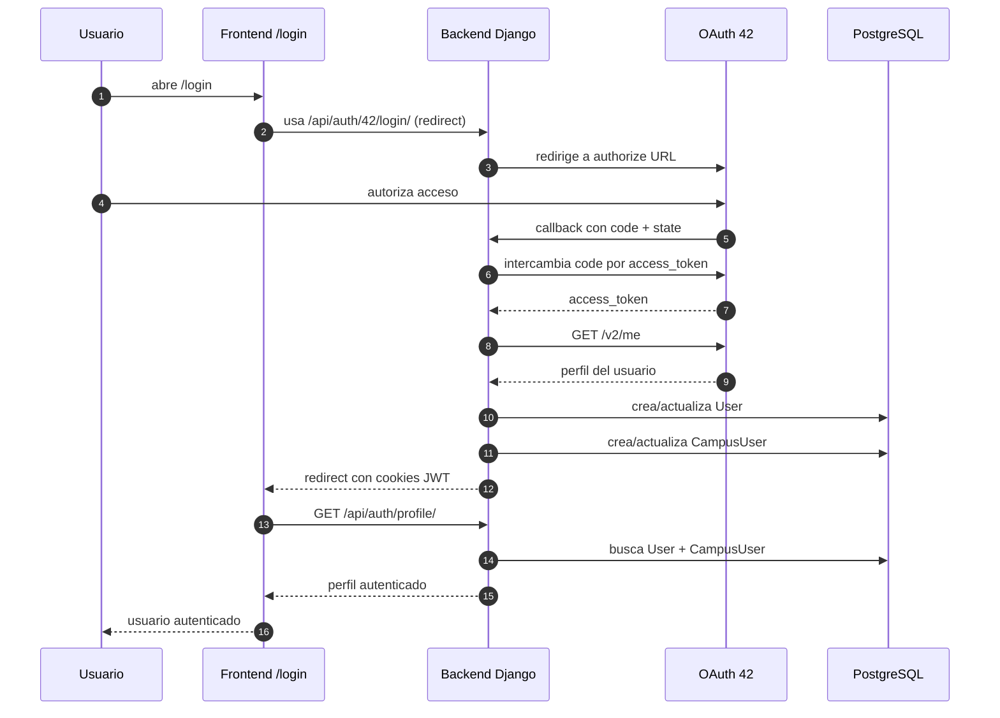

# Flujo de autenticación explicado

## 1. Resumen general de autenticación

El proyecto usa un flujo de autenticación basado en **OAuth 42**. Eso significa que el usuario **no crea una contraseña propia en esta app**, sino que se autentica con su cuenta de 42 y el backend decide si puede entrar y cómo persistir su identidad local.

### Qué es OAuth 42

Es el mecanismo por el cual:

1. el usuario es redirigido a 42;
2. 42 le pide autorización;
3. 42 devuelve un `code` al backend;
4. el backend intercambia ese `code` por un token;
5. el backend consulta `/v2/me`;
6. a partir de esa respuesta crea o actualiza el usuario local.

### Por qué se usa

Se usa porque el dominio del proyecto depende de datos reales del campus 42:

- login
- campus
- nivel
- wallet
- avatar
- identidad del usuario en la API

### Qué papel cumple Django

El backend Django hace casi todo el trabajo sensible:

- genera la URL de autorización;
- valida el `state` OAuth;
- intercambia `code` por token;
- consulta la API `/v2/me`;
- crea o actualiza `User`;
- crea o actualiza `CampusUser`;
- emite cookies JWT;
- devuelve el perfil autenticado al frontend.

### Qué papel cumple el frontend

El frontend:

- muestra la pantalla de login;
- redirige al backend o a 42;
- mantiene estado local de sesión en Zustand;
- llama a `/api/auth/profile/` para saber quién soy;
- protege rutas privadas con `AuthLayout`;
- usa cookies automáticamente con `credentials: "include"`.

### Qué diferencia hay entre `User` y `CampusUser`

#### `User`

Es el usuario interno de Django:

- sirve para autenticación y sesión;
- vive en `auth_user`;
- tiene `username`, `email`, etc.

#### `CampusUser`

Es el perfil sincronizado desde 42:

- `intra_id`
- `login`
- `display_name`
- `avatar_url`
- `wallet`
- `correction_points`
- `coalition_user_score`
- métricas de proyectos y correcciones

Conclusión:

- `User` = identidad interna de Django
- `CampusUser` = perfil rico del dominio sincronizado desde 42

## 2. Diagrama Mermaid del login



### Cómo leer este diagrama

- el usuario entra por `/login`;
- el frontend actual no llama primero a `login-url`, sino que manda al usuario al endpoint de redirect;
- el backend orquesta todo OAuth;
- tras el callback, el backend deja cookies y manda al usuario de vuelta al frontend;
- el frontend confirma la sesión llamando a `/api/auth/profile/`.

## 3. Endpoints de autenticación

Archivo principal de rutas:
- [backend/authentication/urls.py](/home/aurodrig/Desktop/arepa/backend/authentication/urls.py:1)

| Endpoint | Método | Archivo | Función / clase | Qué hace | Público o privado |
|---|---|---|---|---|---|
| `/api/auth/42/login-url/` | `GET` | `backend/authentication/views.py` | `OAuth42LoginUrlView.get` | Devuelve JSON con `authorize_url` | Público |
| `/api/auth/42/login/` | `GET` | `backend/authentication/views.py` | `OAuth42LoginView.get` | Redirige directamente a 42 | Público |
| `/api/auth/42/callback/` | `GET` | `backend/authentication/views.py` | `OAuth42CallbackView.get` | Recibe `code`, crea/actualiza usuario y emite cookies | Público |
| `/api/auth/profile/` | `GET` | `backend/authentication/views.py` | `UserProfileView.get` | Devuelve perfil autenticado | Privado |
| `/api/auth/token/refresh/` | `POST` | `backend/authentication/views.py` | `AuthTokenRefreshView.post` | Refresca `access_token` desde `refresh_token` | Público |
| `/api/auth/logout/` | `POST` | `backend/authentication/views.py` | `AuthLogoutView.post` | Limpia cookies y cierra sesión local | Público |

### Nota importante

El endpoint `login-url` **existe**, pero el frontend actual de login **no lo usa**.

El login actual usa:

- `GET /api/auth/42/login/`

en vez de:

- pedir `authorize_url` por JSON y luego redirigir.

Eso no está mal, pero conviene saberlo porque el flujo real es un poco distinto del “frontend pide login-url y luego redirige”.

## 4. Explicación backend archivo por archivo

## 4.1 `backend/authentication/views.py`

Archivo:
- [backend/authentication/views.py](/home/aurodrig/Desktop/arepa/backend/authentication/views.py:1)

### Qué hace

Es el corazón del login.

Contiene:

- helpers OAuth;
- helpers de cookies JWT;
- lógica para crear/actualizar `CampusUser`;
- vistas de login, callback, profile, refresh y logout.

### Funciones y clases principales

#### `_build_42_authorize_url`

Líneas aproximadas:
- [backend/authentication/views.py](/home/aurodrig/Desktop/arepa/backend/authentication/views.py:24)

Qué hace:

- lee `FT_CLIENT_ID`, `FT_REDIRECT_URI`, `FT_API_BASE_URL`;
- genera un `state` aleatorio;
- guarda ese `state` en `request.session`;
- construye la URL final de autorización de 42.

Variables de entorno usadas:

- `FT_CLIENT_ID`
- `FT_REDIRECT_URI`
- `FT_API_BASE_URL`

Riesgos:

- si faltan `FT_CLIENT_ID` o `FT_REDIRECT_URI`, devuelve error `500`.

#### `_cookie_options`

Líneas aproximadas:
- [backend/authentication/views.py](/home/aurodrig/Desktop/arepa/backend/authentication/views.py:48)

Qué hace:

- centraliza opciones de cookies JWT.

Variables usadas:

- `JWT_COOKIE_SECURE`
- `JWT_COOKIE_SAMESITE`

Devuelve:

- `httponly=True`
- `secure=...`
- `samesite=...`
- `path="/"`.

#### `_set_auth_cookies`

Líneas aproximadas:
- [backend/authentication/views.py](/home/aurodrig/Desktop/arepa/backend/authentication/views.py:56)

Qué hace:

- guarda dos cookies:
  - `access_token`
  - `refresh_token`

Se apoya en:

- `settings.SIMPLE_JWT`

para calcular duración de access y refresh.

#### `_clear_auth_cookies`

Líneas aproximadas:
- [backend/authentication/views.py](/home/aurodrig/Desktop/arepa/backend/authentication/views.py:74)

Qué hace:

- borra las cookies de auth.

Se usa en:

- logout;
- refresh inválido.

#### `_upsert_campus_user_from_42_payload`

Líneas aproximadas:
- [backend/authentication/views.py](/home/aurodrig/Desktop/arepa/backend/authentication/views.py:79)

Qué hace:

- busca `CampusUser` por `intra_id`;
- si no existe, lo crea con defaults;
- si existe, lo actualiza;
- enlaza `django_user`;
- rellena login, email, avatar, wallet, correction points y nivel.

Relación con `User`:

- fija `campus_user.django_user = user`

Relación con `CampusUser`:

- es exactamente la función que lo crea o actualiza a partir de `/v2/me`.

Punto frágil:

- no rellena aquí toda la información de coalición ni todos los campos avanzados del sync;
- eso queda más bien para los procesos `sync`.

#### `OAuth42LoginUrlView`

Líneas aproximadas:
- [backend/authentication/views.py](/home/aurodrig/Desktop/arepa/backend/authentication/views.py:138)

Qué hace:

- devuelve `{"authorize_url": ...}`.

Permiso:

- `AllowAny`

#### `OAuth42LoginView`

Líneas aproximadas:
- [backend/authentication/views.py](/home/aurodrig/Desktop/arepa/backend/authentication/views.py:148)

Qué hace:

- redirige directamente a la URL OAuth construida.

Permiso:

- `AllowAny`

#### `OAuth42CallbackView`

Líneas aproximadas:
- [backend/authentication/views.py](/home/aurodrig/Desktop/arepa/backend/authentication/views.py:158)

Qué hace:

1. lee `code` y `state`;
2. valida `state` con lo guardado en sesión;
3. pide token a `/oauth/token`;
4. pide perfil a `/v2/me`;
5. comprueba que exista `login`;
6. comprueba que el usuario pertenezca al campus con id `22` (42 Madrid);
7. hace `get_or_create(User, username=login)`;
8. actualiza email si hace falta;
9. llama a `_upsert_campus_user_from_42_payload`;
10. crea `RefreshToken.for_user(user)`;
11. mete cookies JWT;
12. redirige al frontend a `/?auth=1`.

Variables de entorno usadas:

- `FRONTEND_URL`
- `FT_API_BASE_URL`
- `FT_CLIENT_ID`
- `FT_CLIENT_SECRET`
- `FT_REDIRECT_URI`

Restricción importante:

- solo permite usuarios del campus con `id == 22`

Errores posibles:

- `Authorization code not provided`
- `Invalid OAuth state`
- `Failed to obtain access token`
- `Access token not found in response`
- `Failed to fetch user data`
- `Missing login in 42 payload`
- `not_in_madrid_campus`

Detalle frágil:

- el login page frontend solo traduce unos pocos códigos de error;
- algunos mensajes backend llegarán como texto genérico en query string y no tendrán una traducción bonita.

#### `UserProfileView`

Líneas aproximadas:
- [backend/authentication/views.py](/home/aurodrig/Desktop/arepa/backend/authentication/views.py:246)

Qué hace:

- usa `request.user`;
- busca `CampusUser` enlazado;
- calcula `campus_rank`;
- resuelve avatar custom si existe;
- devuelve un payload de perfil para frontend.

Permiso:

- `IsAuthenticated`

Error posible:

- `Profile not found` si existe `User` pero no `CampusUser`.

#### `AuthTokenRefreshView`

Líneas aproximadas:
- [backend/authentication/views.py](/home/aurodrig/Desktop/arepa/backend/authentication/views.py:286)

Qué hace:

- toma `refresh` de `request.data` o de cookie `refresh_token`;
- valida usando `TokenRefreshSerializer`;
- si falla, limpia cookies y devuelve `401`;
- si va bien, reescribe cookie `access_token`;
- opcionalmente reescribe `refresh_token` si viene rotado.

Permiso:

- `AllowAny`

Detalle importante:

- el frontend no manda el refresh manualmente;
- normalmente el backend lo toma desde cookie.

#### `AuthLogoutView`

Líneas aproximadas:
- [backend/authentication/views.py](/home/aurodrig/Desktop/arepa/backend/authentication/views.py:324)

Qué hace:

- responde `200`;
- limpia cookies.

Permiso:

- `AllowAny`

---

## 4.2 `backend/authentication/authentication.py`

Archivo:
- [backend/authentication/authentication.py](/home/aurodrig/Desktop/arepa/backend/authentication/authentication.py:1)

### Qué hace

Define una clase de autenticación custom para DRF:

- `CookieJWTAuthentication`

### Por qué existe

SimpleJWT normalmente espera header `Authorization`.

Aquí además se quiere soportar:

- cookie `access_token`

### Cómo funciona

Líneas clave:
- [backend/authentication/authentication.py](/home/aurodrig/Desktop/arepa/backend/authentication/authentication.py:7)

Lógica:

1. intenta leer `Authorization` header;
2. si no existe, intenta `request.COOKIES['access_token']`;
3. si no hay token, devuelve `None`;
4. si lo hay, lo valida;
5. devuelve `(user, validated_token)`.

### Relación con Django / DRF

Se usa como auth por defecto en:
- [backend/config/settings/settings.py](/home/aurodrig/Desktop/arepa/backend/config/settings/settings.py:161)

### Error común

- pensar que el frontend debe guardar y reenviar tokens manualmente;
- aquí el objetivo es justo lo contrario: usar cookies.

---

## 4.3 `backend/authentication/urls.py`

Archivo:
- [backend/authentication/urls.py](/home/aurodrig/Desktop/arepa/backend/authentication/urls.py:1)

### Qué hace

Declara las rutas del módulo auth.

### Cómo se relaciona con Django

Estas rutas se montan bajo:

- `/api/auth/`

desde:
- `config/urls.py`

### Qué define

- `42/login-url/`
- `42/login/`
- `42/callback/`
- `profile/`
- `token/refresh/`
- `logout/`

---

## 4.4 `backend/authentication/models.py`

Archivo:
- [backend/authentication/models.py](/home/aurodrig/Desktop/arepa/backend/authentication/models.py:1)

### Estado real

No define modelos activos.

Solo contiene este comentario:

```python
"""Authentication app uses Django's built-in User model as source of truth."""
```

### Qué significa

- esta app ya no mantiene un modelo propio de perfil;
- el modelo base de auth es `User` de Django;
- el perfil rico está en `CampusUser`.

---

## 4.5 `backend/config/settings/settings.py`

Archivo:
- [backend/config/settings/settings.py](/home/aurodrig/Desktop/arepa/backend/config/settings/settings.py:160)

### Qué aporta al flujo auth

#### DRF

```python
REST_FRAMEWORK = {
    'DEFAULT_AUTHENTICATION_CLASSES': (
        'authentication.authentication.CookieJWTAuthentication',
    ),
    'DEFAULT_PERMISSION_CLASSES': (
        'rest_framework.permissions.IsAuthenticated',
    ),
}
```

Significa:

- por defecto las vistas requieren auth;
- la auth por defecto busca JWT en header o cookie.

#### JWT

```python
SIMPLE_JWT = {
    'ACCESS_TOKEN_LIFETIME': timedelta(minutes=15),
    'REFRESH_TOKEN_LIFETIME': timedelta(days=7),
}
```

Eso fija:

- access token corto;
- refresh token más largo.

### Errores posibles relacionados

- cookies válidas pero access expirado;
- refresh ausente o inválido;
- CORS mal configurado aunque la auth del backend esté bien.

## 5. Explicación frontend archivo por archivo

## 5.1 `frontend/app/login/page.tsx`

Archivo:
- [frontend/app/login/page.tsx](/home/aurodrig/Desktop/arepa/frontend/app/login/page.tsx:1)

### Qué hace

Muestra la pantalla de login y dispara la redirección a auth.

### Cómo llama al backend

No hace `fetch`.

Usa:

```ts
window.location.href = getLoginUrl()
```

Líneas:
- [frontend/app/login/page.tsx](/home/aurodrig/Desktop/arepa/frontend/app/login/page.tsx:16)

### Qué endpoint usa de verdad

- `/api/auth/42/login/`

### Manejo de errores

Lee `window.location.search` y busca `error`.

Mapea algunos casos:

- `oauth_failed`
- `not_in_campus_db`
- `not_in_madrid_campus`

Fragilidad real:

- el backend actual redirige también errores genéricos con mensajes libres;
- esos mensajes no están todos mapeados a textos UX bonitos.

---

## 5.2 `frontend/lib/authApi.ts`

Archivo:
- [frontend/lib/authApi.ts](/home/aurodrig/Desktop/arepa/frontend/lib/authApi.ts:1)

### Qué hace

Es la capa de API del frontend para auth.

### Funciones principales

#### `getLoginUrl`

Devuelve string:

```ts
${AUTH_BASE_URL}/42/login/
```

Ojo:

- no devuelve `login-url/`;
- devuelve directamente el endpoint redirect.

#### `refreshAccessToken`

Hace:

```ts
fetch(`${AUTH_BASE_URL}/token/refresh/`, {
  method: "POST",
  credentials: "include",
})
```

Detalles importantes:

- usa `credentials: "include"`;
- deduplica refresh concurrente con `refreshInFlight`.

#### `authFetch`

Hace:

1. request con `credentials: "include"`;
2. si viene `401`, intenta refresh;
3. repite request;
4. si sigue mal, lanza `ApiHttpError`.

#### `getProfile`

Llama a:

- `GET /api/auth/profile/`

#### `postLogout`

Llama a:

- `POST /api/auth/logout/`

### Por qué usa `credentials: "include"`

Porque el frontend no guarda el token manualmente. Necesita que el navegador mande cookies automáticamente.

---

## 5.3 `frontend/hooks/useAuth.ts`

Archivo:
- [frontend/hooks/useAuth.ts](/home/aurodrig/Desktop/arepa/frontend/hooks/useAuth.ts:1)

### Qué hace

Mantiene el estado de autenticación en Zustand.

### Qué guarda

- `user`
- `status`
- `error`
- `hasHydrated`

### Persistencia

Usa:

```ts
persist(..., {
  name: "auth-store",
  storage: createJSONStorage(() => localStorage),
  partialize: (state) => ({ user: state.user }),
})
```

Eso significa:

- persiste solo `user`;
- no persiste el token;
- el token sigue viviendo en cookie.

### `initializeAuth`

Es la función clave.

Hace:

1. pone `status = "loading"`;
2. llama a `getProfile()`;
3. si recibe perfil, mapea datos y pone `authenticated`;
4. si recibe `401`, pone `unauthenticated`;
5. si hay error temporal pero había usuario local, conserva estado como autenticado con error.

### `logout`

Llama a:

- `postLogout()`

y luego limpia sesión local aunque backend falle.

Fragilidad honesta:

- el store persiste `user`, así que el frontend puede arrancar con “huella” de usuario local aunque luego la cookie real ya no exista;
- por eso `initializeAuth` es importante para reconciliar estado.

---

## 5.4 `frontend/components/AuthLayout.tsx`

Archivo:
- [frontend/components/AuthLayout.tsx](/home/aurodrig/Desktop/arepa/frontend/components/AuthLayout.tsx:1)

### Qué hace

Es la pieza central de protección de rutas en frontend.

### Rutas públicas

En este archivo:
- [frontend/components/AuthLayout.tsx](/home/aurodrig/Desktop/arepa/frontend/components/AuthLayout.tsx:11)

```ts
const PUBLIC_ROUTES = ["/login", "/status", "/offline"]
```

### Cómo protege rutas

Decide así:

#### Si la ruta es pública y no hay usuario local

- limpia sesión;
- no hace bootstrap innecesario.

#### Si la ruta es privada y no hay usuario local ni `auth=1`

- limpia sesión;
- luego acabará redirigiendo a `/login`.

#### Si hay hint `auth=1`

Eso viene del callback backend:

- `/?auth=1`

y se usa para forzar bootstrap después del login.

### Cómo redirige

No usa `router.push`, usa:

- `router.replace(...)`

por ejemplo:

- a `/`
- a `/login`

### Qué carga además de auth

Una vez autenticado:

- llama a `getCoalitions()`
- llama a `getMyPreferences()`
- aplica `setTheme(...)`
- guarda `leaderboard.defaultPerPage` en localStorage

### Cómo mantiene sesión

Cada 10 minutos, si estás autenticado:

```ts
window.setInterval(() => {
  void initializeAuth()
}, 10 * 60 * 1000)
```

No es un refresh directo del token, pero sí una comprobación periódica del perfil.

---

## 5.5 `frontend/components/NavProfile.tsx`

Archivo:
- [frontend/components/NavProfile.tsx](/home/aurodrig/Desktop/arepa/frontend/components/NavProfile.tsx:1)

### Qué hace

Muestra la parte visual del usuario logueado en la navegación:

- avatar
- acceso al perfil
- icono de logout

### Cómo se conecta con auth

Lee:

- `user`
- `logout`

desde `useAuthStore`.

### Qué hace el logout aquí

El icono de logout dispara:

```ts
onClick={logout}
```

o sea, usa directamente la acción del store.

## 6. Flujo completo paso a paso

Aquí está el flujo real, paso a paso.

### 1. Usuario entra en `/login`

Se carga:
- [frontend/app/login/page.tsx](/home/aurodrig/Desktop/arepa/frontend/app/login/page.tsx:10)

### 2. Frontend pide login-url al backend

**Aquí hay un matiz importante**:

- el diseño podría hacerlo;
- pero el frontend actual **no pide** `login-url`.

Lo que hace hoy es:

- redirigir directamente a `/api/auth/42/login/`.

### 3. Backend genera URL de 42

Eso ocurre en:

- `_build_42_authorize_url()`

Archivo:
- [backend/authentication/views.py](/home/aurodrig/Desktop/arepa/backend/authentication/views.py:24)

### 4. Usuario autoriza en 42

Lo hace fuera de la app, en la pantalla OAuth de 42.

### 5. 42 vuelve al callback

Vuelve a:

- `/api/auth/42/callback/`

### 6. Backend intercambia `code` por token

Lo hace con:

```python
requests.post(f'{base_url}/oauth/token', data={...})
```

en:
- [backend/authentication/views.py](/home/aurodrig/Desktop/arepa/backend/authentication/views.py:180)

### 7. Backend pide `/v2/me`

Lo hace con:

```python
requests.get(f'{base_url}/v2/me', headers={'Authorization': f'Bearer {access_token}'})
```

en:
- [backend/authentication/views.py](/home/aurodrig/Desktop/arepa/backend/authentication/views.py:202)

### 8. Backend crea o actualiza `User`

Lo hace con:

```python
User.objects.get_or_create(username=login, defaults={"email": email})
```

en:
- [backend/authentication/views.py](/home/aurodrig/Desktop/arepa/backend/authentication/views.py:229)

### 9. Backend crea o actualiza `CampusUser`

Lo hace llamando a:

- `_upsert_campus_user_from_42_payload(user, user_42)`

en:
- [backend/authentication/views.py](/home/aurodrig/Desktop/arepa/backend/authentication/views.py:238)

### 10. Backend emite cookies JWT

Lo hace en:

- `_set_auth_cookies(response, refresh)`

en:
- [backend/authentication/views.py](/home/aurodrig/Desktop/arepa/backend/authentication/views.py:240)

### 11. Frontend llama a `/api/auth/profile/`

Eso lo hace:

- `getProfile()` en `authApi.ts`
- `initializeAuth()` en `useAuth.ts`

### 12. `useAuthStore` guarda sesión

Mapea el perfil a:

- `id`
- `username`
- `email`
- `avatar`
- `login`
- `coalition`
- `intraLevel`
- `walletAmount`
- etc.

### Pseudocódigo

```text
FUNCIÓN login_oauth_42():

    usuario entra en /login
    frontend pide login-url
    redirigir a 42 OAuth

    SI 42 devuelve code:
        backend intercambia code por token
        backend pide /v2/me
        crear o actualizar User
        crear o actualizar CampusUser
        emitir cookies JWT
        frontend llama a /api/auth/profile/
        useAuthStore guarda sesión

    SI algo falla:
        devolver error de autenticación
```

## 7. Explicación de JWT y cookies

### Qué es access token

Es el token corto que autentica requests normales.

En este proyecto:

- vive en cookie `access_token`;
- dura `15 minutos`.

### Qué es refresh token

Es el token largo que sirve para generar un nuevo access token.

En este proyecto:

- vive en cookie `refresh_token`;
- dura `7 días`.

### Qué significa `HttpOnly`

Que JavaScript del navegador **no puede leer directamente la cookie**.

Ventaja:

- reduce exposición a robo por JS malicioso.

### Qué significa `SameSite`

Controla cuándo el navegador manda la cookie en requests cross-site.

Aquí se toma de:

- `JWT_COOKIE_SAMESITE`

### Qué significa `Secure`

Que la cookie solo debería viajar por HTTPS cuando está activado.

Aquí se toma de:

- `JWT_COOKIE_SECURE`

### Por qué el frontend no guarda tokens manualmente

Porque el diseño elegido es:

- cookies HttpOnly;
- navegador manda cookies;
- frontend solo mantiene estado de usuario, no secretos.

### Por qué se usa `credentials: "include"`

Porque si no lo haces:

- el navegador no manda cookies al backend;
- `/api/auth/profile/`, refresh y logout fallan.

## 8. Explicación de `AuthLayout`

Archivo:
- [frontend/components/AuthLayout.tsx](/home/aurodrig/Desktop/arepa/frontend/components/AuthLayout.tsx:1)

### Qué rutas son públicas

- `/login`
- `/status`
- `/offline`

### Qué rutas son privadas

Todo lo demás, por ejemplo:

- `/`
- `/coalitions`
- `/leaderboard`
- `/users/...`

### Cómo decide redirigir a `/login`

Cuando:

- `isReady` es `true`;
- `isAuthenticated` es `false`;
- la ruta no es pública.

Entonces hace:

```ts
router.replace("/login")
```

### Cómo carga perfil, preferencias y coaliciones

#### Perfil

No lo carga directamente `AuthLayout`, sino mediante:

- `initializeAuth()`

#### Coaliciones

Cuando ya estás autenticado:

- llama una vez a `getCoalitions()`

#### Preferencias

Cuando ya estás autenticado:

- llama una vez a `getMyPreferences()`
- aplica `setTheme(...)`

### Pseudocódigo

```text
FUNCIÓN auth_layout(pathname):

    decidir si la ruta es pública o privada
    revisar si hay usuario persistido

    SI la ruta es privada:
        ejecutar initializeAuth()

    SI initializeAuth confirma sesión:
        cargar coaliciones
        cargar preferencias
        mantener refresh periódico

    SI no hay sesión y la ruta es privada:
        redirigir a /login

    renderizar children según estado
```

## 9. Sintaxis importante

## `@api_view`

En los archivos revisados **no aparece `@api_view`**.

El backend auth usa:

- clases basadas en `APIView`

## `permission_classes`

Aparece en las clases de DRF para decir quién puede entrar.

Ejemplo:

```python
permission_classes = [AllowAny]
```

o:

```python
permission_classes = [IsAuthenticated]
```

## `AllowAny` / `IsAuthenticated`

- `AllowAny`
  - endpoint público
- `IsAuthenticated`
  - requiere usuario autenticado

## `JsonResponse` / `Response`

En auth se usa sobre todo:

- `Response` de DRF

No `JsonResponse`.

`JsonResponse` sí aparece más en endpoints globales del backend, pero no es el patrón dominante de este módulo auth.

## Refresh token

Aquí el refresh se hace:

- contra `/api/auth/token/refresh/`
- normalmente usando cookie `refresh_token`

## `fetch`

El frontend usa `fetch` nativo del navegador.

Ejemplo:

```ts
fetch(url, {
  credentials: "include",
})
```

## `credentials: "include"`

Hace que se manden cookies al backend aunque el frontend esté en otro origen (`localhost:3000` vs `localhost:8000`).

## Zustand store

`useAuthStore` es un store global cliente.

Sirve para:

- mantener `user`;
- mantener `status`;
- exponer `initializeAuth` y `logout`.

## `useEffect`

Se usa mucho para:

- arrancar bootstrap auth;
- leer query params de error;
- cargar coaliciones y preferencias;
- refrescar estado periódicamente.

## `router.push`

En los archivos revisados **no aparece `router.push`** en este flujo.

Lo que se usa es:

- `router.replace(...)`

para evitar dejar pasos intermedios inútiles en el historial.

## 10. Errores comunes

### `FT_CLIENT_ID` incorrecto

Síntoma:

- no se puede construir o usar bien OAuth.

### `FT_CLIENT_SECRET` incorrecto

Síntoma:

- falla el intercambio `code -> token`.

### `redirect URI` no coincide

Síntoma:

- 42 rechaza el callback o el token exchange.

Variable implicada:

- `FT_REDIRECT_URI`

### Cookies no se guardan

Posibles causas:

- `Secure=True` en entorno sin HTTPS;
- problemas `SameSite`;
- navegador bloqueando terceros según configuración.

### CORS bloquea cookies

Posibles causas:

- origen frontend no permitido;
- falta `credentials: "include"` en frontend.

### `profile` devuelve `401`

Posibles causas:

- no hay `access_token`;
- access expirado y refresh falla;
- cookie no viaja.

### Refresh falla

Posibles causas:

- no hay `refresh_token`;
- refresh expiró;
- serializer lo considera inválido.

### `User` existe pero `CampusUser` no

Síntoma:

- `/api/auth/profile/` devuelve `404 Profile not found`.

### Usuario fuera del campus esperado

Síntoma:

- el callback redirige con:
  - `not_in_madrid_campus`

Porque el backend exige campus `id == 22`.

## 11. Qué puedo decir en evaluación

### Explicación corta del login

> El usuario no inicia sesión con contraseña propia, sino con OAuth de 42. El backend recibe el callback, consulta `/v2/me`, crea o actualiza el `User` interno y enlaza o crea el `CampusUser`.

### Explicación de sesión

> La sesión no se mantiene guardando tokens en localStorage. El backend emite cookies JWT `HttpOnly` y el frontend usa `credentials: "include"` para que el navegador las envíe automáticamente.

### Explicación de protección de rutas

> El frontend usa `AuthLayout` para distinguir rutas públicas y privadas. Si no hay sesión válida, redirige a `/login`.

### Explicación de `CampusUser`

> `User` es la identidad interna de Django, pero `CampusUser` es el perfil de dominio sincronizado desde 42. Necesitamos ambos.

## 12. Checklist de comprensión

- [ ] Entiendo qué es OAuth 42
- [ ] Entiendo qué hace `login-url`
- [ ] Entiendo qué hace `callback`
- [ ] Entiendo cómo se crean `User` y `CampusUser`
- [ ] Entiendo qué son cookies `HttpOnly`
- [ ] Entiendo cómo el frontend sabe si estoy logueado
- [ ] Entiendo qué hace `AuthLayout`
- [ ] Entiendo cómo probar login/logout

## 13. Pseudocódigo global del flujo auth

```text
FUNCIÓN autenticacion_completa():

    frontend obtiene URL OAuth
    usuario autoriza en 42
    backend recibe callback
    backend pide perfil a 42
    crear o actualizar User y CampusUser
    guardar access y refresh token en cookies HttpOnly

    frontend llama a /api/auth/profile/ con credentials include

    SI profile responde 200:
        guardar sesión en useAuthStore
        permitir rutas privadas

    SI profile responde 401:
        intentar refresh
        reintentar petición o limpiar sesión

    devolver "usuario autenticado"
```
