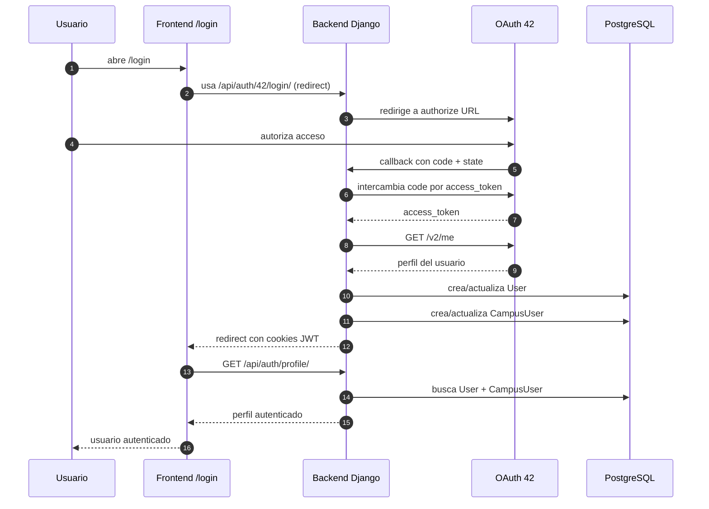

# Flujo de autenticación explicado

## 1. Resumen general de autenticación

El proyecto usa un flujo de autenticación basado en **OAuth 42**. Eso significa que el usuario **no crea una contraseña propia en esta app**, sino que se autentica con su cuenta de 42 y el backend decide si puede entrar y cómo persistir su identidad local.

### Qué es OAuth 42

Es el mecanismo por el cual:

1. el usuario es redirigido a 42;
2. 42 le pide autorización;
3. 42 devuelve un `code` al backend;
4. el backend intercambia ese `code` por un token;
5. el backend consulta `/v2/me`;
6. a partir de esa respuesta crea o actualiza el usuario local.

### Por qué se usa

Se usa porque el dominio del proyecto depende de datos reales del campus 42:

- login
- campus
- nivel
- wallet
- avatar
- identidad del usuario en la API

### Qué papel cumple Django

El backend Django hace casi todo el trabajo sensible:

- genera la URL de autorización;
- valida el `state` OAuth;
- intercambia `code` por token;
- consulta la API `/v2/me`;
- crea o actualiza `User`;
- crea o actualiza `CampusUser`;
- emite cookies JWT;
- devuelve el perfil autenticado al frontend.

### Qué papel cumple el frontend

El frontend:

- muestra la pantalla de login;
- redirige al backend o a 42;
- mantiene estado local de sesión en Zustand;
- llama a `/api/auth/profile/` para saber quién soy;
- protege rutas privadas con `AuthLayout`;
- usa cookies automáticamente con `credentials: "include"`.

### Qué diferencia hay entre `User` y `CampusUser`

#### `User`

Es el usuario interno de Django:

- sirve para autenticación y sesión;
- vive en `auth_user`;
- tiene `username`, `email`, etc.

#### `CampusUser`

Es el perfil sincronizado desde 42:

- `intra_id`
- `login`
- `display_name`
- `avatar_url`
- `wallet`
- `correction_points`
- `coalition_user_score`
- métricas de proyectos y correcciones

Conclusión:

- `User` = identidad interna de Django
- `CampusUser` = perfil rico del dominio sincronizado desde 42

## 2. Diagrama Mermaid del login



### Cómo leer este diagrama

- el usuario entra por `/login`;
- el frontend actual no llama primero a `login-url`, sino que manda al usuario al endpoint de redirect;
- el backend orquesta todo OAuth;
- tras el callback, el backend deja cookies y manda al usuario de vuelta al frontend;
- el frontend confirma la sesión llamando a `/api/auth/profile/`.

## 3. Endpoints de autenticación

Archivo principal de rutas:
- [backend/authentication/urls.py](/home/aurodrig/Desktop/arepa/backend/authentication/urls.py:1)

| Endpoint | Método | Archivo | Función / clase | Qué hace | Público o privado |
|---|---|---|---|---|---|
| `/api/auth/42/login-url/` | `GET` | `backend/authentication/views.py` | `OAuth42LoginUrlView.get` | Devuelve JSON con `authorize_url` | Público |
| `/api/auth/42/login/` | `GET` | `backend/authentication/views.py` | `OAuth42LoginView.get` | Redirige directamente a 42 | Público |
| `/api/auth/42/callback/` | `GET` | `backend/authentication/views.py` | `OAuth42CallbackView.get` | Recibe `code`, crea/actualiza usuario y emite cookies | Público |
| `/api/auth/profile/` | `GET` | `backend/authentication/views.py` | `UserProfileView.get` | Devuelve perfil autenticado | Privado |
| `/api/auth/token/refresh/` | `POST` | `backend/authentication/views.py` | `AuthTokenRefreshView.post` | Refresca `access_token` desde `refresh_token` | Público |
| `/api/auth/logout/` | `POST` | `backend/authentication/views.py` | `AuthLogoutView.post` | Limpia cookies y cierra sesión local | Público |

### Nota importante

El endpoint `login-url` **existe**, pero el frontend actual de login **no lo usa**.

El login actual usa:

- `GET /api/auth/42/login/`

en vez de:

- pedir `authorize_url` por JSON y luego redirigir.

Eso no está mal, pero conviene saberlo porque el flujo real es un poco distinto del “frontend pide login-url y luego redirige”.

### Tabla backend ↔ frontend del flujo auth

Esta tabla conecta la acción visible del usuario con el archivo real del frontend, el endpoint backend implicado, la view que responde, el modelo tocado y el resultado observable.

| Acción del usuario o del runtime | Archivo frontend | Endpoint backend | View backend | Modelo afectado | Resultado |
|---|---|---|---|---|---|
| Pulsar el botón "Acceder con 42" | [frontend/app/login/page.tsx](/home/aurodrig/Desktop/arepa/frontend/app/login/page.tsx:16) | `GET /api/auth/42/login/` | `OAuth42LoginView` | Ninguno todavía | El navegador sale de la app y va a 42 |
| Volver desde 42 con `code` y `state` | No lo procesa React; vuelve el navegador al backend | `GET /api/auth/42/callback/` | `OAuth42CallbackView` | `User`, `CampusUser`, sesión Django | Se valida OAuth, se crean/actualizan datos y se emiten cookies JWT |
| Arranque tras `/?auth=1` o bootstrap de sesión | [frontend/components/AuthLayout.tsx](/home/aurodrig/Desktop/arepa/frontend/components/AuthLayout.tsx:35), [frontend/hooks/useAuth.ts](/home/aurodrig/Desktop/arepa/frontend/hooks/useAuth.ts:59) | `GET /api/auth/profile/` | `UserProfileView` | `User`, `CampusUser`, `UserPreferences` | El frontend averigua quién es el usuario actual |
| Una request protegida recibe `401` | [frontend/lib/authApi.ts](/home/aurodrig/Desktop/arepa/frontend/lib/authApi.ts:57) | `POST /api/auth/token/refresh/` | `AuthTokenRefreshView` | Sin modelo de negocio; rota/valida JWT | Se renueva el `access_token` si el `refresh_token` sigue siendo válido |
| Pulsar logout en navegación | [frontend/components/NavProfile.tsx](/home/aurodrig/Desktop/arepa/frontend/components/NavProfile.tsx:10), [frontend/hooks/useAuth.ts](/home/aurodrig/Desktop/arepa/frontend/hooks/useAuth.ts:45) | `POST /api/auth/logout/` | `AuthLogoutView` | Cookies de auth; estado local de sesión | Se limpian cookies y el store local borra la sesión |
| Entrar en una ruta privada sin sesión válida | [frontend/components/AuthLayout.tsx](/home/aurodrig/Desktop/arepa/frontend/components/AuthLayout.tsx:57) | Normalmente no llega a backend si ya sabe que no hay sesión | `AuthLayout` decide en cliente | Ninguno directamente | Redirección a `/login` con `router.replace("/login")` |

## 4. Explicación backend archivo por archivo

## 4.1 `backend/authentication/views.py`

Archivo:
- [backend/authentication/views.py](/home/aurodrig/Desktop/arepa/backend/authentication/views.py:1)

### Qué hace

Es el corazón del login.

Contiene:

- helpers OAuth;
- helpers de cookies JWT;
- lógica para crear/actualizar `CampusUser`;
- vistas de login, callback, profile, refresh y logout.

### Funciones y clases principales

#### `_build_42_authorize_url`

Líneas aproximadas:
- [backend/authentication/views.py](/home/aurodrig/Desktop/arepa/backend/authentication/views.py:24)

Qué hace:

- lee `FT_CLIENT_ID`, `FT_REDIRECT_URI`, `FT_API_BASE_URL`;
- genera un `state` aleatorio;
- guarda ese `state` en `request.session`;
- construye la URL final de autorización de 42.

Variables de entorno usadas:

- `FT_CLIENT_ID`
- `FT_REDIRECT_URI`
- `FT_API_BASE_URL`

Riesgos:

- si faltan `FT_CLIENT_ID` o `FT_REDIRECT_URI`, devuelve error `500`.

Fragmento real corto:

Archivo:
- [backend/authentication/views.py](/home/aurodrig/Desktop/arepa/backend/authentication/views.py:24)

```python
client_id = os.getenv('FT_CLIENT_ID')
redirect_uri = os.getenv('FT_REDIRECT_URI')
base_url = os.getenv('FT_API_BASE_URL', 'https://api.intra.42.fr').rstrip('/')

state = secrets.token_urlsafe(32)
request.session['oauth42_state'] = state

params = {
    'client_id': client_id,
    'redirect_uri': redirect_uri,
    'response_type': 'code',
}
```

Qué significa:

- el backend lee la configuración OAuth desde entorno;
- genera un `state` aleatorio para proteger el callback;
- guarda ese `state` en sesión antes de redirigir a 42.

Cómo se traduce al pseudocódigo:

- "leer variables OAuth";
- "fabricar state anti-CSRF";
- "guardar state en sesión";
- "montar authorize URL final".

Pseudocódigo local:

```text
FUNCIÓN _build_42_authorize_url(request):

    leer FT_CLIENT_ID y FT_REDIRECT_URI

    SI falta configuración:
        devolver error 500

    generar state aleatorio
    guardar state en request.session
    construir URL /oauth/authorize con client_id, redirect_uri y state
    devolver auth_url
```

#### `_cookie_options`

Líneas aproximadas:
- [backend/authentication/views.py](/home/aurodrig/Desktop/arepa/backend/authentication/views.py:48)

Qué hace:

- centraliza opciones de cookies JWT.

Variables usadas:

- `JWT_COOKIE_SECURE`
- `JWT_COOKIE_SAMESITE`

Devuelve:

- `httponly=True`
- `secure=...`
- `samesite=...`
- `path="/"`.

#### `_set_auth_cookies`

Líneas aproximadas:
- [backend/authentication/views.py](/home/aurodrig/Desktop/arepa/backend/authentication/views.py:56)

Qué hace:

- guarda dos cookies:
  - `access_token`
  - `refresh_token`

Se apoya en:

- `settings.SIMPLE_JWT`

para calcular duración de access y refresh.

Fragmento real corto:

Archivo:
- [backend/authentication/views.py](/home/aurodrig/Desktop/arepa/backend/authentication/views.py:56)

```python
response.set_cookie(
    'access_token',
    str(refresh_token.access_token),
    max_age=access_lifetime,
    **options,
)
response.set_cookie(
    'refresh_token',
    str(refresh_token),
    max_age=refresh_lifetime,
    **options,
)
```

Qué significa:

- el backend no devuelve los tokens al frontend como JSON para que React los guarde;
- los escribe directamente como cookies `HttpOnly`;
- una cookie es corta (`access_token`) y la otra larga (`refresh_token`).

Cómo se traduce al pseudocódigo:

- "tomar refresh JWT";
- "derivar access";
- "escribir ambas cookies con opciones seguras".

Pseudocódigo local:

```text
FUNCIÓN _set_auth_cookies(response, refresh_token):

    leer opciones de cookie
    calcular lifetime de access y refresh desde SIMPLE_JWT

    escribir cookie access_token
    escribir cookie refresh_token

    devolver response con sesión persistida en navegador
```

#### `_clear_auth_cookies`

Líneas aproximadas:
- [backend/authentication/views.py](/home/aurodrig/Desktop/arepa/backend/authentication/views.py:74)

Qué hace:

- borra las cookies de auth.

Se usa en:

- logout;
- refresh inválido.

#### `_upsert_campus_user_from_42_payload`

Líneas aproximadas:
- [backend/authentication/views.py](/home/aurodrig/Desktop/arepa/backend/authentication/views.py:79)

Qué hace:

- busca `CampusUser` por `intra_id`;
- si no existe, lo crea con defaults;
- si existe, lo actualiza;
- enlaza `django_user`;
- rellena login, email, avatar, wallet, correction points y nivel.

Relación con `User`:

- fija `campus_user.django_user = user`

Relación con `CampusUser`:

- es exactamente la función que lo crea o actualiza a partir de `/v2/me`.

Punto frágil:

- no rellena aquí toda la información de coalición ni todos los campos avanzados del sync;
- eso queda más bien para los procesos `sync`.

Fragmento real corto:

Archivo:
- [backend/authentication/views.py](/home/aurodrig/Desktop/arepa/backend/authentication/views.py:88)

```python
campus_user, _created = CampusUser.objects.get_or_create(
    intra_id=intra_id,
    defaults={
        'django_user': user,
        'user_id': intra_id,
        'login': user_payload.get('login') or user.username,
        'email': user_payload.get('email') or user.email or '',
        'display_name': user_payload.get('displayname') or user.username,
    },
)
```

Qué significa:

- `intra_id` es la clave de reconciliación contra 42;
- si el usuario de campus no existe, se crea con un bloque de defaults;
- si ya existe, se reutiliza ese registro y luego se actualizan campos mutables.

Cómo se traduce al pseudocódigo:

- "buscar CampusUser por intra_id";
- "si no existe, crearlo";
- "si existe, completar o corregir datos locales".

Pseudocódigo local:

```text
FUNCIÓN _upsert_campus_user_from_42_payload(user, payload_42):

    leer intra_id desde payload
    SI intra_id falta:
        devolver None

    buscar CampusUser por intra_id usando get_or_create
    enlazar django_user = user
    actualizar login, email, avatar, wallet, correction_points
    buscar nivel dentro de cursus_users -> 42cursus
    guardar CampusUser
    devolver CampusUser
```

#### `OAuth42LoginUrlView`

Líneas aproximadas:
- [backend/authentication/views.py](/home/aurodrig/Desktop/arepa/backend/authentication/views.py:138)

Qué hace:

- devuelve `{"authorize_url": ...}`.

Permiso:

- `AllowAny`

#### `OAuth42LoginView`

Líneas aproximadas:
- [backend/authentication/views.py](/home/aurodrig/Desktop/arepa/backend/authentication/views.py:148)

Qué hace:

- redirige directamente a la URL OAuth construida.

Permiso:

- `AllowAny`

#### `OAuth42CallbackView`

Líneas aproximadas:
- [backend/authentication/views.py](/home/aurodrig/Desktop/arepa/backend/authentication/views.py:158)

Qué hace:

1. lee `code` y `state`;
2. valida `state` con lo guardado en sesión;
3. pide token a `/oauth/token`;
4. pide perfil a `/v2/me`;
5. comprueba que exista `login`;
6. comprueba que el usuario pertenezca al campus con id `22` (42 Madrid);
7. hace `get_or_create(User, username=login)`;
8. actualiza email si hace falta;
9. llama a `_upsert_campus_user_from_42_payload`;
10. crea `RefreshToken.for_user(user)`;
11. mete cookies JWT;
12. redirige al frontend a `/?auth=1`.

Variables de entorno usadas:

- `FRONTEND_URL`
- `FT_API_BASE_URL`
- `FT_CLIENT_ID`
- `FT_CLIENT_SECRET`
- `FT_REDIRECT_URI`

Restricción importante:

- solo permite usuarios del campus con `id == 22`

Errores posibles:

- `Authorization code not provided`
- `Invalid OAuth state`
- `Failed to obtain access token`
- `Access token not found in response`
- `Failed to fetch user data`
- `Missing login in 42 payload`
- `not_in_madrid_campus`

Detalle frágil:

- el login page frontend solo traduce unos pocos códigos de error;
- algunos mensajes backend llegarán como texto genérico en query string y no tendrán una traducción bonita.

Fragmento real corto:

Archivo:
- [backend/authentication/views.py](/home/aurodrig/Desktop/arepa/backend/authentication/views.py:168)

```python
code = request.query_params.get('code')
received_state = request.query_params.get('state')
expected_state = request.session.pop('oauth42_state', None)

if not code:
    return _redirect_with_error('Authorization code not provided')

if not expected_state or not received_state or received_state != expected_state:
    return _redirect_with_error('Invalid OAuth state')
```

Qué significa:

- el callback no confía ciegamente en lo que vuelve de 42;
- primero exige un `code`;
- luego compara el `state` recibido con el que guardó antes en sesión;
- usa `pop`, así que ese `state` se consume una sola vez.

Cómo se traduce al pseudocódigo:

- "leer code y state";
- "rechazar callback sin code";
- "rechazar callback cuyo state no coincida";
- "solo entonces seguir con token exchange y `/v2/me`".

Pseudocódigo local:

```text
FUNCIÓN OAuth42CallbackView.get(request):

    leer code y state del callback
    recuperar y consumir oauth42_state desde sesión

    SI falta code:
        redirigir a /login con error

    SI state no coincide:
        redirigir a /login con error

    pedir access_token a 42
    pedir /v2/me con ese token
    validar login y campus permitido
    crear o actualizar User
    crear o actualizar CampusUser
    crear RefreshToken.for_user(user)
    setear cookies JWT
    redirigir al frontend con ?auth=1
```

#### `UserProfileView`

Líneas aproximadas:
- [backend/authentication/views.py](/home/aurodrig/Desktop/arepa/backend/authentication/views.py:246)

Qué hace:

- usa `request.user`;
- busca `CampusUser` enlazado;
- calcula `campus_rank`;
- resuelve avatar custom si existe;
- devuelve un payload de perfil para frontend.

Permiso:

- `IsAuthenticated`

Error posible:

- `Profile not found` si existe `User` pero no `CampusUser`.

#### `AuthTokenRefreshView`

Líneas aproximadas:
- [backend/authentication/views.py](/home/aurodrig/Desktop/arepa/backend/authentication/views.py:286)

Qué hace:

- toma `refresh` de `request.data` o de cookie `refresh_token`;
- valida usando `TokenRefreshSerializer`;
- si falla, limpia cookies y devuelve `401`;
- si va bien, reescribe cookie `access_token`;
- opcionalmente reescribe `refresh_token` si viene rotado.

Permiso:

- `AllowAny`

Detalle importante:

- el frontend no manda el refresh manualmente;
- normalmente el backend lo toma desde cookie.

#### `AuthLogoutView`

Líneas aproximadas:
- [backend/authentication/views.py](/home/aurodrig/Desktop/arepa/backend/authentication/views.py:324)

Qué hace:

- responde `200`;
- limpia cookies.

Permiso:

- `AllowAny`

---

## 4.2 `backend/authentication/authentication.py`

Archivo:
- [backend/authentication/authentication.py](/home/aurodrig/Desktop/arepa/backend/authentication/authentication.py:1)

### Qué hace

Define una clase de autenticación custom para DRF:

- `CookieJWTAuthentication`

### Por qué existe

SimpleJWT normalmente espera header `Authorization`.

Aquí además se quiere soportar:

- cookie `access_token`

### Cómo funciona

Líneas clave:
- [backend/authentication/authentication.py](/home/aurodrig/Desktop/arepa/backend/authentication/authentication.py:7)

Lógica:

1. intenta leer `Authorization` header;
2. si no existe, intenta `request.COOKIES['access_token']`;
3. si no hay token, devuelve `None`;
4. si lo hay, lo valida;
5. devuelve `(user, validated_token)`.

### Relación con Django / DRF

Se usa como auth por defecto en:
- [backend/config/settings/settings.py](/home/aurodrig/Desktop/arepa/backend/config/settings/settings.py:161)

### Error común

- pensar que el frontend debe guardar y reenviar tokens manualmente;
- aquí el objetivo es justo lo contrario: usar cookies.

Fragmento real corto:

Archivo:
- [backend/authentication/authentication.py](/home/aurodrig/Desktop/arepa/backend/authentication/authentication.py:7)

```python
header = self.get_header(request)
if header is not None:
    raw_token = self.get_raw_token(header)
else:
    raw_token = request.COOKIES.get('access_token')
if raw_token is None:
    return None
validated_token = self.get_validated_token(raw_token)
return self.get_user(validated_token), validated_token
```

Qué significa:

- primero intenta el camino estándar de `Authorization: Bearer ...`;
- si no existe, usa la cookie `access_token`;
- si no hay token por ningún lado, DRF considera al request no autenticado;
- si lo hay y es válido, DRF ya puede poblar `request.user`.

Cómo se traduce al pseudocódigo:

- "leer token de header";
- "si no hay, probar cookie";
- "si no hay token, devolver no autenticado";
- "si hay token válido, resolver user".

Pseudocódigo local:

```text
FUNCIÓN CookieJWTAuthentication.authenticate(request):

    intentar leer Authorization header

    SI no existe header:
        leer access_token desde cookies

    SI no hay token:
        devolver None

    validar token JWT
    resolver usuario asociado
    devolver (user, validated_token)
```

---

## 4.3 `backend/authentication/urls.py`

Archivo:
- [backend/authentication/urls.py](/home/aurodrig/Desktop/arepa/backend/authentication/urls.py:1)

### Qué hace

Declara las rutas del módulo auth.

### Cómo se relaciona con Django

Estas rutas se montan bajo:

- `/api/auth/`

desde:
- `config/urls.py`

### Qué define

- `42/login-url/`
- `42/login/`
- `42/callback/`
- `profile/`
- `token/refresh/`
- `logout/`

---

## 4.4 `backend/authentication/models.py`

Archivo:
- [backend/authentication/models.py](/home/aurodrig/Desktop/arepa/backend/authentication/models.py:1)

### Estado real

No define modelos activos.

Solo contiene este comentario:

```python
"""Authentication app uses Django's built-in User model as source of truth."""
```

### Qué significa

- esta app ya no mantiene un modelo propio de perfil;
- el modelo base de auth es `User` de Django;
- el perfil rico está en `CampusUser`.

---

## 4.5 `backend/config/settings/settings.py`

Archivo:
- [backend/config/settings/settings.py](/home/aurodrig/Desktop/arepa/backend/config/settings/settings.py:160)

### Qué aporta al flujo auth

#### DRF

```python
REST_FRAMEWORK = {
    'DEFAULT_AUTHENTICATION_CLASSES': (
        'authentication.authentication.CookieJWTAuthentication',
    ),
    'DEFAULT_PERMISSION_CLASSES': (
        'rest_framework.permissions.IsAuthenticated',
    ),
}
```

Significa:

- por defecto las vistas requieren auth;
- la auth por defecto busca JWT en header o cookie.

#### JWT

```python
SIMPLE_JWT = {
    'ACCESS_TOKEN_LIFETIME': timedelta(minutes=15),
    'REFRESH_TOKEN_LIFETIME': timedelta(days=7),
}
```

Eso fija:

- access token corto;
- refresh token más largo.

### Errores posibles relacionados

- cookies válidas pero access expirado;
- refresh ausente o inválido;
- CORS mal configurado aunque la auth del backend esté bien.

## 5. Explicación frontend archivo por archivo

## 5.1 `frontend/app/login/page.tsx`

Archivo:
- [frontend/app/login/page.tsx](/home/aurodrig/Desktop/arepa/frontend/app/login/page.tsx:1)

### Qué hace

Muestra la pantalla de login y dispara la redirección a auth.

### Cómo llama al backend

No hace `fetch`.

Usa:

```ts
window.location.href = getLoginUrl()
```

Líneas:
- [frontend/app/login/page.tsx](/home/aurodrig/Desktop/arepa/frontend/app/login/page.tsx:16)

### Qué endpoint usa de verdad

- `/api/auth/42/login/`

### Manejo de errores

Lee `window.location.search` y busca `error`.

Mapea algunos casos:

- `oauth_failed`
- `not_in_campus_db`
- `not_in_madrid_campus`

Fragilidad real:

- el backend actual redirige también errores genéricos con mensajes libres;
- esos mensajes no están todos mapeados a textos UX bonitos.

---

## 5.2 `frontend/lib/authApi.ts`

Archivo:
- [frontend/lib/authApi.ts](/home/aurodrig/Desktop/arepa/frontend/lib/authApi.ts:1)

### Qué hace

Es la capa de API del frontend para auth.

### Funciones principales

#### `getLoginUrl`

Devuelve string:

```ts
${AUTH_BASE_URL}/42/login/
```

Ojo:

- no devuelve `login-url/`;
- devuelve directamente el endpoint redirect.

#### `refreshAccessToken`

Hace:

```ts
fetch(`${AUTH_BASE_URL}/token/refresh/`, {
  method: "POST",
  credentials: "include",
})
```

Detalles importantes:

- usa `credentials: "include"`;
- deduplica refresh concurrente con `refreshInFlight`.

Fragmento real corto:

Archivo:
- [frontend/lib/authApi.ts](/home/aurodrig/Desktop/arepa/frontend/lib/authApi.ts:29)

```ts
if (refreshInFlight) {
  return refreshInFlight
}
refreshInFlight = fetch(`${AUTH_BASE_URL}/token/refresh/`, {
  method: "POST",
  credentials: "include",
})
  .then(async (response) => {
```

Qué significa:

- si dos requests fallan a la vez con `401`, el frontend no lanza dos refresh paralelos;
- reusa la misma promesa en vuelo;
- el navegador manda la cookie `refresh_token` automáticamente.

Cómo se traduce al pseudocódigo:

- "si ya hay refresh en marcha, esperar ese";
- "si no, lanzar uno nuevo con cookies incluidas".

Pseudocódigo local:

```text
FUNCIÓN refreshAccessToken():

    SI ya existe refreshInFlight:
        devolver esa promesa

    lanzar POST /api/auth/token/refresh/ con credentials include

    SI responde mal:
        lanzar error HTTP

    limpiar refreshInFlight al terminar
```

#### `authFetch`

Hace:

1. request con `credentials: "include"`;
2. si viene `401`, intenta refresh;
3. repite request;
4. si sigue mal, lanza `ApiHttpError`.

Fragmento real corto:

Archivo:
- [frontend/lib/authApi.ts](/home/aurodrig/Desktop/arepa/frontend/lib/authApi.ts:57)

```ts
let response = await fetch(url, { ...init, credentials: "include" })
if (response.status === 401) {
  await refreshAccessToken()
  response = await fetch(url, { ...init, credentials: "include" })
}
if (!response.ok) {
  throw await ApiHttpError.fromResponse(response, fallbackMessage)
}
```

Qué significa:

- `authFetch` centraliza el patrón "probar, refrescar, reintentar";
- el resto del frontend no tiene que repetir esa lógica endpoint por endpoint;
- si incluso el segundo intento falla, ya propaga el error normalizado.

Cómo se traduce al pseudocódigo:

- "hacer request autenticada";
- "si el access expiró, refrescar";
- "reintentar una vez";
- "si sigue fallando, elevar error".

Pseudocódigo local:

```text
FUNCIÓN authFetch(url, init):

    hacer fetch con credentials include

    SI responde 401:
        ejecutar refreshAccessToken()
        repetir fetch

    SI la respuesta final no es OK:
        lanzar ApiHttpError

    devolver response
```

#### `getProfile`

Llama a:

- `GET /api/auth/profile/`

#### `postLogout`

Llama a:

- `POST /api/auth/logout/`

### Por qué usa `credentials: "include"`

Porque el frontend no guarda el token manualmente. Necesita que el navegador mande cookies automáticamente.

---

## 5.3 `frontend/hooks/useAuth.ts`

Archivo:
- [frontend/hooks/useAuth.ts](/home/aurodrig/Desktop/arepa/frontend/hooks/useAuth.ts:1)

### Qué hace

Mantiene el estado de autenticación en Zustand.

### Qué guarda

- `user`
- `status`
- `error`
- `hasHydrated`

### Persistencia

Usa:

```ts
persist(..., {
  name: "auth-store",
  storage: createJSONStorage(() => localStorage),
  partialize: (state) => ({ user: state.user }),
})
```

Eso significa:

- persiste solo `user`;
- no persiste el token;
- el token sigue viviendo en cookie.

### `initializeAuth`

Es la función clave.

Hace:

1. pone `status = "loading"`;
2. llama a `getProfile()`;
3. si recibe perfil, mapea datos y pone `authenticated`;
4. si recibe `401`, pone `unauthenticated`;
5. si hay error temporal pero había usuario local, conserva estado como autenticado con error.

### `logout`

Llama a:

- `postLogout()`

y luego limpia sesión local aunque backend falle.

Fragilidad honesta:

- el store persiste `user`, así que el frontend puede arrancar con “huella” de usuario local aunque luego la cookie real ya no exista;
- por eso `initializeAuth` es importante para reconciliar estado.

Fragmento real corto:

Archivo:
- [frontend/hooks/useAuth.ts](/home/aurodrig/Desktop/arepa/frontend/hooks/useAuth.ts:59)

```ts
set({ status: "loading", error: null });
try {
  const profile = await getProfile();
  if (!profile) {
    set({ user: null, status: "unauthenticated", error: null });
    return;
  }
  set({ user: { id: profile.user_id, login: profile.login }, status: "authenticated" });
} catch (error) {
```

Qué significa:

- el store no da por buena la sesión solo porque haya datos persistidos;
- vuelve a consultar el backend;
- si el backend confirma el perfil, pasa a `authenticated`;
- si no, corrige el estado local.

Cómo se traduce al pseudocódigo:

- "poner loading";
- "pedir profile al backend";
- "si profile existe, hidratar user";
- "si falla con 401, marcar no autenticado".

Pseudocódigo local:

```text
FUNCIÓN initializeAuth():

    SI ya está cargando:
        salir

    poner status = loading

    intentar GET /api/auth/profile/

    SI hay perfil:
        mapear payload backend a user local
        poner status = authenticated

    SI hay 401:
        limpiar user
        poner status = unauthenticated

    SI hay error transitorio y había user local:
        conservar sesión local con error visible
```

---

## 5.4 `frontend/components/AuthLayout.tsx`

Archivo:
- [frontend/components/AuthLayout.tsx](/home/aurodrig/Desktop/arepa/frontend/components/AuthLayout.tsx:1)

### Qué hace

Es la pieza central de protección de rutas en frontend.

### Rutas públicas

En este archivo:
- [frontend/components/AuthLayout.tsx](/home/aurodrig/Desktop/arepa/frontend/components/AuthLayout.tsx:11)

```ts
const PUBLIC_ROUTES = ["/login", "/status", "/offline"]
```

### Cómo protege rutas

Decide así:

#### Si la ruta es pública y no hay usuario local

- limpia sesión;
- no hace bootstrap innecesario.

#### Si la ruta es privada y no hay usuario local ni `auth=1`

- limpia sesión;
- luego acabará redirigiendo a `/login`.

#### Si hay hint `auth=1`

Eso viene del callback backend:

- `/?auth=1`

y se usa para forzar bootstrap después del login.

### Cómo redirige

No usa `router.push`, usa:

- `router.replace(...)`

por ejemplo:

- a `/`
- a `/login`

### Qué carga además de auth

Una vez autenticado:

- llama a `getCoalitions()`
- llama a `getMyPreferences()`
- aplica `setTheme(...)`
- guarda `leaderboard.defaultPerPage` en localStorage

### Cómo mantiene sesión

Cada 10 minutos, si estás autenticado:

```ts
window.setInterval(() => {
  void initializeAuth()
}, 10 * 60 * 1000)
```

No es un refresh directo del token, pero sí una comprobación periódica del perfil.

Fragmento real corto:

Archivo:
- [frontend/components/AuthLayout.tsx](/home/aurodrig/Desktop/arepa/frontend/components/AuthLayout.tsx:57)

```ts
if (isAuthenticated && hasAuthHint) {
  router.replace(pathname);
  return;
}
if (isAuthenticated && pathname === "/login") {
  router.replace("/");
  return;
}
if (!isAuthenticated && !isPublicRoute(pathname)) {
  router.replace("/login");
}
```

Qué significa:

- `AuthLayout` no solo "decora" pantallas;
- también gobierna la navegación tras el bootstrap auth;
- borra `?auth=1` del callback;
- evita que un usuario autenticado se quede en `/login`;
- protege las rutas privadas.

Cómo se traduce al pseudocódigo:

- "si ya entraste por callback, limpia el query param";
- "si estás autenticado, saca al usuario de login";
- "si no estás autenticado y la ruta es privada, manda a login".

Pseudocódigo local:

```text
FUNCIÓN AuthLayout():

    esperar a que el store hydrate
    distinguir ruta pública vs privada

    SI hay auth=1 o hay que reconciliar sesión:
        ejecutar initializeAuth()

    SI el usuario queda autenticado:
        limpiar ?auth=1 con router.replace(pathname)
        evitar permanecer en /login
        cargar coaliciones y preferencias

    SI el usuario no está autenticado y la ruta es privada:
        router.replace("/login")

    renderizar layout público o privado según estado final
```

---

## 5.5 `frontend/components/NavProfile.tsx`

Archivo:
- [frontend/components/NavProfile.tsx](/home/aurodrig/Desktop/arepa/frontend/components/NavProfile.tsx:1)

### Qué hace

Muestra la parte visual del usuario logueado en la navegación:

- avatar
- acceso al perfil
- icono de logout

### Cómo se conecta con auth

Lee:

- `user`
- `logout`

desde `useAuthStore`.

### Qué hace el logout aquí

El icono de logout dispara:

```ts
onClick={logout}
```

o sea, usa directamente la acción del store.

## 6. Flujo completo paso a paso

Aquí está el flujo real, paso a paso.

### 1. Usuario entra en `/login`

Se carga:
- [frontend/app/login/page.tsx](/home/aurodrig/Desktop/arepa/frontend/app/login/page.tsx:10)

### 2. Frontend dispara el inicio de login

**Aquí hay un matiz importante**:

- el diseño podría hacerlo;
- pero el frontend actual **no pide** `login-url`.

Lo que hace hoy es:

- redirigir directamente a `/api/auth/42/login/`.

### 3. Backend genera URL de 42

Eso ocurre en:

- `_build_42_authorize_url()`

Archivo:
- [backend/authentication/views.py](/home/aurodrig/Desktop/arepa/backend/authentication/views.py:24)

### 4. Usuario autoriza en 42

Lo hace fuera de la app, en la pantalla OAuth de 42.

### 5. 42 vuelve al callback

Vuelve a:

- `/api/auth/42/callback/`

### 6. Backend intercambia `code` por token

Lo hace con:

```python
requests.post(f'{base_url}/oauth/token', data={...})
```

en:
- [backend/authentication/views.py](/home/aurodrig/Desktop/arepa/backend/authentication/views.py:180)

### 7. Backend pide `/v2/me`

Lo hace con:

```python
requests.get(f'{base_url}/v2/me', headers={'Authorization': f'Bearer {access_token}'})
```

en:
- [backend/authentication/views.py](/home/aurodrig/Desktop/arepa/backend/authentication/views.py:202)

### 8. Backend crea o actualiza `User`

Lo hace con:

```python
User.objects.get_or_create(username=login, defaults={"email": email})
```

en:
- [backend/authentication/views.py](/home/aurodrig/Desktop/arepa/backend/authentication/views.py:229)

### 9. Backend crea o actualiza `CampusUser`

Lo hace llamando a:

- `_upsert_campus_user_from_42_payload(user, user_42)`

en:
- [backend/authentication/views.py](/home/aurodrig/Desktop/arepa/backend/authentication/views.py:238)

### 10. Backend emite cookies JWT

Lo hace en:

- `_set_auth_cookies(response, refresh)`

en:
- [backend/authentication/views.py](/home/aurodrig/Desktop/arepa/backend/authentication/views.py:240)

### 11. Frontend llama a `/api/auth/profile/`

Eso lo hace:

- `getProfile()` en `authApi.ts`
- `initializeAuth()` en `useAuth.ts`

### 12. `useAuthStore` guarda sesión

Mapea el perfil a:

- `id`
- `username`
- `email`
- `avatar`
- `login`
- `coalition`
- `intraLevel`
- `walletAmount`
- etc.

### Pseudocódigo

```text
FUNCIÓN login_oauth_42():

    usuario entra en /login
    frontend redirige a /api/auth/42/login/
    backend redirige a 42 OAuth

    SI 42 devuelve code:
        backend intercambia code por token
        backend pide /v2/me
        crear o actualizar User
        crear o actualizar CampusUser
        emitir cookies JWT
        frontend llama a /api/auth/profile/
        useAuthStore guarda sesión

    SI algo falla:
        devolver error de autenticación
```

## 7. Explicación de JWT y cookies

### Qué es access token

Es el token corto que autentica requests normales.

En este proyecto:

- vive en cookie `access_token`;
- dura `15 minutos`.

### Qué es refresh token

Es el token largo que sirve para generar un nuevo access token.

En este proyecto:

- vive en cookie `refresh_token`;
- dura `7 días`.

### Qué significa `HttpOnly`

Que JavaScript del navegador **no puede leer directamente la cookie**.

Ventaja:

- reduce exposición a robo por JS malicioso.

### Qué significa `SameSite`

Controla cuándo el navegador manda la cookie en requests cross-site.

Aquí se toma de:

- `JWT_COOKIE_SAMESITE`

### Qué significa `Secure`

Que la cookie solo debería viajar por HTTPS cuando está activado.

Aquí se toma de:

- `JWT_COOKIE_SECURE`

### Por qué el frontend no guarda tokens manualmente

Porque el diseño elegido es:

- cookies HttpOnly;
- navegador manda cookies;
- frontend solo mantiene estado de usuario, no secretos.

### Por qué se usa `credentials: "include"`

Porque si no lo haces:

- el navegador no manda cookies al backend;
- `/api/auth/profile/`, refresh y logout fallan.

## 8. Explicación de `AuthLayout`

Archivo:
- [frontend/components/AuthLayout.tsx](/home/aurodrig/Desktop/arepa/frontend/components/AuthLayout.tsx:1)

### Qué rutas son públicas

- `/login`
- `/status`
- `/offline`

### Qué rutas son privadas

Todo lo demás, por ejemplo:

- `/`
- `/coalitions`
- `/leaderboard`
- `/users/...`

### Cómo decide redirigir a `/login`

Cuando:

- `isReady` es `true`;
- `isAuthenticated` es `false`;
- la ruta no es pública.

Entonces hace:

```ts
router.replace("/login")
```

### Cómo carga perfil, preferencias y coaliciones

#### Perfil

No lo carga directamente `AuthLayout`, sino mediante:

- `initializeAuth()`

#### Coaliciones

Cuando ya estás autenticado:

- llama una vez a `getCoalitions()`

#### Preferencias

Cuando ya estás autenticado:

- llama una vez a `getMyPreferences()`
- aplica `setTheme(...)`

### Pseudocódigo

```text
FUNCIÓN auth_layout(pathname):

    comprobar si la ruta es pública
    comprobar si hay user persistido y si existe auth=1

    SI la ruta es pública y no hay user:
        limpiar sesión local y no bootstrapear de más

    SI la ruta es privada y hay que reconciliar estado:
        ejecutar initializeAuth()

    SI initializeAuth confirma sesión:
        cargar coaliciones
        cargar preferencias
        programar comprobación periódica del perfil

    SI no hay sesión y la ruta es privada:
        router.replace("/login")

    SI ya estás autenticado y sigues en /login:
        router.replace("/")

    renderizar children según estado final
```

## 9. Sintaxis importante explicada

Esta sección traduce la sintaxis real del repo a lenguaje de evaluación. La idea no es memorizar firmas exactas, sino entender qué responsabilidad tiene cada pieza.

### `APIView`

Qué es:

- la clase base de Django REST Framework para construir endpoints como clases;
- permite definir métodos como `get()` o `post()`.

Ejemplo real:

Archivo:
- [backend/authentication/views.py](/home/aurodrig/Desktop/arepa/backend/authentication/views.py:138)

```python
class OAuth42LoginView(APIView):
    permission_classes = [AllowAny]

    def get(self, request):
        auth_url, _state, error_response = _build_42_authorize_url(request)
        if error_response:
            return error_response
        return redirect(auth_url)
```

Pseudocódigo mental:

- "esta clase responde a un endpoint HTTP";
- "cuando entra un GET, ejecuta la lógica del login".

Error común:

- pensar que `APIView` ya autentica todo sola. No: la autenticación efectiva depende también de `permission_classes` y de la configuración DRF.

### `permission_classes`

Qué es:

- la lista de permisos que una view exige antes de ejecutar su lógica.

Ejemplo real:

Archivo:
- [backend/authentication/views.py](/home/aurodrig/Desktop/arepa/backend/authentication/views.py:247)

```python
class UserProfileView(APIView):
    permission_classes = [IsAuthenticated]

    def get(self, request):
        user = request.user
```

Pseudocódigo mental:

- "antes de entrar aquí, DRF verifica si este usuario puede acceder".

Error común:

- confundir permisos con autenticación. La autenticación responde "quién eres"; el permiso responde "puedes entrar o no".

### `AllowAny`

Qué es:

- permiso abierto; no exige sesión previa.

Ejemplo real:

Archivo:
- [backend/authentication/views.py](/home/aurodrig/Desktop/arepa/backend/authentication/views.py:158)

```python
class OAuth42CallbackView(APIView):
    permission_classes = [AllowAny]
```

Pseudocódigo mental:

- "esta puerta está abierta porque el usuario aún no tiene la sesión local montada".

Error común:

- pensar que `AllowAny` es inseguro por sí mismo. En login y callback es normal, porque el control real va por `state`, `code` y validaciones del backend.

### `IsAuthenticated`

Qué es:

- permiso que exige un usuario autenticado.

Ejemplo real:

Archivo:
- [backend/authentication/views.py](/home/aurodrig/Desktop/arepa/backend/authentication/views.py:246)

```python
class UserProfileView(APIView):
    permission_classes = [IsAuthenticated]
```

Pseudocódigo mental:

- "solo entro aquí si `request.user` pudo resolverse desde el JWT".

Error común:

- creer que basta con mandar un `user_id`. No: lo que valida DRF aquí es el token JWT.

### `requests.post`

Qué es:

- la llamada HTTP saliente que hace el backend hacia otro servicio, aquí la API de 42.

Ejemplo real:

Archivo:
- [backend/authentication/views.py](/home/aurodrig/Desktop/arepa/backend/authentication/views.py:181)

```python
token_data = requests.post(
    f'{base_url}/oauth/token',
    data={
        'grant_type': 'authorization_code',
        'client_id': os.getenv('FT_CLIENT_ID'),
        'client_secret': os.getenv('FT_CLIENT_SECRET'),
        'code': code,
    },
    timeout=10
)
```

Pseudocódigo mental:

- "el backend cambia el `code` OAuth por un `access_token` real".

Error común:

- confundir este `requests.post` del backend con un `fetch` del navegador. Esto corre en Django, no en React.

### `requests.get`

Qué es:

- otra llamada saliente del backend, usada aquí para pedir el perfil a 42.

Ejemplo real:

Archivo:
- [backend/authentication/views.py](/home/aurodrig/Desktop/arepa/backend/authentication/views.py:203)

```python
user_data = requests.get(
    f'{base_url}/v2/me',
    headers={'Authorization': f'Bearer {access_token}'},
    timeout=10
)
```

Pseudocódigo mental:

- "con el token recién conseguido, pedir a 42 quién es el usuario".

Error común:

- olvidar el header `Bearer`, lo que hace que `/v2/me` falle aunque el token exista.

### `get_or_create`

Qué es:

- helper ORM que busca un registro y, si no existe, lo crea.

Ejemplo real:

Archivo:
- [backend/authentication/views.py](/home/aurodrig/Desktop/arepa/backend/authentication/views.py:229)

```python
user, _created = User.objects.get_or_create(
    username=login,
    defaults={"email": email},
)
```

Pseudocódigo mental:

- "si ya conozco a este login, reutilizo su `User`; si no, lo doy de alta".

Error común:

- pensar que `defaults` se aplica siempre. No: solo se usa cuando el registro se crea por primera vez.

### `update_or_create`

Qué es:

- helper ORM parecido a `get_or_create`, pero además actualiza campos si el registro ya existía.

Ejemplo real del repo:

Archivo:
- [backend/sync/services.py](/home/aurodrig/Desktop/arepa/backend/sync/services.py:196)

```python
_, created = Coalition.objects.update_or_create(
    coalition_id=coalition_id,
    defaults={
        'name': coalition.get('name') or '',
        'slug': coalition.get('slug') or '',
        'total_score': coalition.get('score') or 0,
    },
)
```

Pseudocódigo mental:

- "si la coalición existe, actualizarla; si no, crearla".

Error común:

- usar `get_or_create` cuando de verdad querías sincronizar datos mutables.

### `set_cookie`

Qué es:

- método de la respuesta HTTP para escribir una cookie en el navegador.

Ejemplo real:

Archivo:
- [backend/authentication/views.py](/home/aurodrig/Desktop/arepa/backend/authentication/views.py:61)

```python
response.set_cookie(
    'access_token',
    str(refresh_token.access_token),
    max_age=access_lifetime,
    **options,
)
```

Pseudocódigo mental:

- "guardar el token en una cookie con tiempo de vida y flags de seguridad".

Error común:

- creer que `set_cookie` guarda algo en la base de datos. No: modifica la respuesta HTTP.

### `delete_cookie`

Qué es:

- método de la respuesta HTTP para pedir al navegador que olvide una cookie.

Ejemplo real:

Archivo:
- [backend/authentication/views.py](/home/aurodrig/Desktop/arepa/backend/authentication/views.py:74)

```python
response.delete_cookie('access_token', path=options['path'], samesite=options['samesite'])
response.delete_cookie('refresh_token', path=options['path'], samesite=options['samesite'])
```

Pseudocódigo mental:

- "borrar access y refresh cuando hago logout o detecto refresh inválido".

Error común:

- borrar solo una de las dos cookies y dejar una sesión inconsistente.

### `RefreshToken.for_user`

Qué es:

- helper de SimpleJWT para emitir un refresh token para un usuario concreto.

Ejemplo real:

Archivo:
- [backend/authentication/views.py](/home/aurodrig/Desktop/arepa/backend/authentication/views.py:240)

```python
refresh = RefreshToken.for_user(user)
response = redirect(f"{frontend_url}/?auth=1")
_set_auth_cookies(response, refresh)
```

Pseudocódigo mental:

- "crear el refresh token raíz de esta sesión y de él derivar el access token".

Error común:

- pensar que `for_user` ya hace login completo. No: luego hay que persistir ese token, aquí mediante cookies.

### `TokenRefreshSerializer`

Qué es:

- serializer de SimpleJWT que valida un refresh token y, si procede, genera un nuevo access token.

Ejemplo real:

Archivo:
- [backend/authentication/views.py](/home/aurodrig/Desktop/arepa/backend/authentication/views.py:295)

```python
serializer = TokenRefreshSerializer(data={'refresh': refresh_token})
if not serializer.is_valid():
    response = Response({'error': 'Invalid refresh token'}, status=status.HTTP_401_UNAUTHORIZED)
    _clear_auth_cookies(response)
    return response
validated = serializer.validated_data
```

Pseudocódigo mental:

- "validar refresh";
- "si es bueno, sacar nuevo access";
- "si es malo, limpiar sesión".

Error común:

- intentar refrescar con el access token en lugar del refresh token.

### `credentials: "include"`

Qué es:

- la opción de `fetch` que obliga al navegador a mandar cookies en requests cross-origin.

Ejemplo real:

Archivo:
- [frontend/lib/authApi.ts](/home/aurodrig/Desktop/arepa/frontend/lib/authApi.ts:58)

```ts
let response = await fetch(url, { ...init, credentials: "include" })
```

Pseudocódigo mental:

- "haz esta request como navegador autenticado por cookies".

Error común:

- olvidarlo en `/profile`, refresh o logout y luego culpar al backend de un `401`.

### Zustand `persist`

Qué es:

- middleware de Zustand para persistir parte del store en `localStorage`.

Ejemplo real:

Archivo:
- [frontend/hooks/useAuth.ts](/home/aurodrig/Desktop/arepa/frontend/hooks/useAuth.ts:83)

```ts
persist(
  (set, get) => ({ ... }),
  {
    name: "auth-store",
    storage: createJSONStorage(() => localStorage),
    partialize: (state) => ({ user: state.user }),
  }
)
```

Pseudocódigo mental:

- "guardar una huella ligera del usuario para que la UI no arranque completamente vacía".

Error común:

- creer que aquí se están persistiendo los JWT. No: solo se persiste `user`.

### `router.replace`

Qué es:

- navegación del router de Next.js que reemplaza la URL actual en el historial.

Ejemplo real:

Archivo:
- [frontend/components/AuthLayout.tsx](/home/aurodrig/Desktop/arepa/frontend/components/AuthLayout.tsx:59)

```ts
if (isAuthenticated && pathname === "/login") {
  router.replace("/");
  return;
}
if (!isAuthenticated && !isPublicRoute(pathname)) {
  router.replace("/login");
}
```

Pseudocódigo mental:

- "mover al usuario a la ruta correcta sin dejar una pantalla intermedia inútil en el back button".

Error común:

- usar `push` para redirecciones de guardia y acabar ensuciando el historial del usuario.

### `useEffect`

Qué es:

- hook de React para ejecutar efectos secundarios cuando cambia estado o cambian dependencias.

Ejemplo real:

Archivo:
- [frontend/components/AuthLayout.tsx](/home/aurodrig/Desktop/arepa/frontend/components/AuthLayout.tsx:35)

```ts
useEffect(() => {
  if (!hasHydrated || hasInitializedRef.current) {
    return;
  }
  hasInitializedRef.current = true;
  void initializeAuth();
}, [clearSession, hasHydrated, initializeAuth, pathname, searchParams, user]);
```

Pseudocódigo mental:

- "cuando el layout ya puede decidir, bootstrapear auth una sola vez".

Error común:

- no vigilar las dependencias y provocar bootstraps repetidos o bucles de redirección.

## 10. Errores comunes y debugging

### `FT_CLIENT_ID` incorrecto

Síntoma:

- no se puede construir o usar bien OAuth.

### `FT_CLIENT_SECRET` incorrecto

Síntoma:

- falla el intercambio `code -> token`.

### `redirect URI` no coincide

Síntoma:

- 42 rechaza el callback o el token exchange.

Variable implicada:

- `FT_REDIRECT_URI`

### Cookies no se guardan

Posibles causas:

- `Secure=True` en entorno sin HTTPS;
- problemas `SameSite`;
- navegador bloqueando terceros según configuración.

### CORS bloquea cookies

Posibles causas:

- origen frontend no permitido;
- falta `credentials: "include"` en frontend.

### `profile` devuelve `401`

Posibles causas:

- no hay `access_token`;
- access expirado y refresh falla;
- cookie no viaja.

### Refresh falla

Posibles causas:

- no hay `refresh_token`;
- refresh expiró;
- serializer lo considera inválido.

### `User` existe pero `CampusUser` no

Síntoma:

- `/api/auth/profile/` devuelve `404 Profile not found`.

### Usuario fuera del campus esperado

Síntoma:

- el callback redirige con:
  - `not_in_madrid_campus`

Porque el backend exige campus `id == 22`.

### Cómo debuguear auth paso a paso

Si el login parece "mágicamente roto", conviene seguir siempre el mismo orden. Saltarse pasos suele hacer perder tiempo.

#### 1. Revisar `backend/.env`

Comprobar que el backend realmente tiene cargadas estas variables:

- `FT_CLIENT_ID`
- `FT_CLIENT_SECRET`
- `FT_REDIRECT_URI`
- `FT_API_BASE_URL`
- `FRONTEND_URL`
- `JWT_COOKIE_SECURE`
- `JWT_COOKIE_SAMESITE`

Referencia de uso:
- [backend/authentication/views.py](/home/aurodrig/Desktop/arepa/backend/authentication/views.py:25)
- [backend/authentication/views.py](/home/aurodrig/Desktop/arepa/backend/authentication/views.py:185)

#### 2. Verificar `FT_CLIENT_ID`

Si está mal:

- la authorize URL puede construirse con credenciales inválidas;
- 42 puede rechazar el flujo antes o después del redirect.

Se usa en:
- [backend/authentication/views.py](/home/aurodrig/Desktop/arepa/backend/authentication/views.py:25)
- [backend/authentication/views.py](/home/aurodrig/Desktop/arepa/backend/authentication/views.py:185)

#### 3. Verificar `FT_CLIENT_SECRET`

Si está mal:

- el callback llegará;
- pero el intercambio `code -> access_token` fallará en `requests.post(...)`.

Se usa en:
- [backend/authentication/views.py](/home/aurodrig/Desktop/arepa/backend/authentication/views.py:186)

#### 4. Verificar `FT_REDIRECT_URI`

Si no coincide con la registrada en 42:

- el login puede parecer correcto hasta el callback;
- pero 42 rechazará el intercambio o el redirect final.

Se usa en:
- [backend/authentication/views.py](/home/aurodrig/Desktop/arepa/backend/authentication/views.py:26)
- [backend/authentication/views.py](/home/aurodrig/Desktop/arepa/backend/authentication/views.py:188)

#### 5. Revisar cookies en DevTools

En el navegador, revisar:

- si aparecen `access_token` y `refresh_token`;
- si son `HttpOnly`;
- si el `Path` es `/`;
- si `SameSite` y `Secure` encajan con tu entorno local.

Referencia de escritura:
- [backend/authentication/views.py](/home/aurodrig/Desktop/arepa/backend/authentication/views.py:61)
- [backend/authentication/views.py](/home/aurodrig/Desktop/arepa/backend/authentication/views.py:67)

#### 6. Revisar la pestaña Network

Orden mínimo a seguir:

1. `GET /api/auth/42/login/`
2. redirect a 42
3. `GET /api/auth/42/callback/?code=...&state=...`
4. `GET /api/auth/profile/`
5. si hay `401`, `POST /api/auth/token/refresh/`

Si el fallo está en el callback, mira si llega `code`, si el `state` cuadra y si el backend responde con redirect limpio o con `?error=...`.

#### 7. Probar `/api/auth/profile/`

Es la forma más rápida de saber si la sesión backend-frontend está realmente viva.

Resultado esperado:

- `200` con payload de perfil si la cookie `access_token` es válida;
- `401` si no viaja la cookie o expiró y no se pudo refrescar;
- `404 Profile not found` si existe `User` pero falta `CampusUser`.

Referencia:
- [backend/authentication/views.py](/home/aurodrig/Desktop/arepa/backend/authentication/views.py:246)

#### 8. Revisar logs backend

Buscar especialmente:

- errores al intercambiar token con 42;
- errores al pedir `/v2/me`;
- errores de CORS/cookies;
- respuestas `401` en refresh;
- problemas al construir URLs por variables vacías.

Pista honesta:

- si el fallo es de red contra 42, suele aparecer antes de tocar base de datos;
- si el fallo es de perfil local, suele aparecer ya en `/api/auth/profile/`.

#### 9. Revisar `User` y `CampusUser` en shell Django

Comprobar:

- si existe `User(username=login)`;
- si existe `CampusUser(intra_id=...)`;
- si `CampusUser.django_user` apunta al `User` correcto;
- si el `login` y el `email` cuadran;
- si el usuario quedó medio creado tras un callback fallido.

Qué buscar:

- `User` existe pero `CampusUser` no;
- `CampusUser` existe pero no enlaza con `django_user`;
- `CampusUser` tiene `login` o `display_name` obsoletos;
- el usuario quedó fuera del campus permitido.

Referencia:
- [backend/authentication/views.py](/home/aurodrig/Desktop/arepa/backend/authentication/views.py:229)
- [backend/authentication/views.py](/home/aurodrig/Desktop/arepa/backend/authentication/views.py:238)

#### 10. Revisar el bootstrap frontend

Aunque el backend haya emitido bien las cookies, todavía puede fallar la reconciliación cliente.

Mirar:

- si `initializeAuth()` se ejecuta;
- si `authFetch` manda `credentials: "include"`;
- si `AuthLayout` te expulsa a `/login` antes de tiempo;
- si el store persistido tiene un usuario viejo que luego se corrige.

Referencias:
- [frontend/lib/authApi.ts](/home/aurodrig/Desktop/arepa/frontend/lib/authApi.ts:57)
- [frontend/hooks/useAuth.ts](/home/aurodrig/Desktop/arepa/frontend/hooks/useAuth.ts:59)
- [frontend/components/AuthLayout.tsx](/home/aurodrig/Desktop/arepa/frontend/components/AuthLayout.tsx:35)

## 11. Qué puedo decir en evaluación

### Explicación corta del login

> El usuario no inicia sesión con contraseña propia, sino con OAuth de 42. El backend recibe el callback, consulta `/v2/me`, crea o actualiza el `User` interno y enlaza o crea el `CampusUser`.

### Explicación de sesión

> La sesión no se mantiene guardando tokens en localStorage. El backend emite cookies JWT `HttpOnly` y el frontend usa `credentials: "include"` para que el navegador las envíe automáticamente.

### Explicación de protección de rutas

> El frontend usa `AuthLayout` para distinguir rutas públicas y privadas. Si no hay sesión válida, redirige a `/login`.

### Explicación de `CampusUser`

> `User` es la identidad interna de Django, pero `CampusUser` es el perfil de dominio sincronizado desde 42. Necesitamos ambos.

## 12. Checklist de comprensión

- [ ] Entiendo qué es OAuth 42
- [ ] Entiendo qué hace `login-url`
- [ ] Entiendo qué hace `callback`
- [ ] Entiendo cómo se crean `User` y `CampusUser`
- [ ] Entiendo qué son cookies `HttpOnly`
- [ ] Entiendo cómo el frontend sabe si estoy logueado
- [ ] Entiendo qué hace `AuthLayout`
- [ ] Entiendo cómo probar login/logout

## 13. Pseudocódigo global del flujo auth

```text
FUNCIÓN autenticacion_completa():

    frontend obtiene URL OAuth
    usuario autoriza en 42
    backend recibe callback
    backend pide perfil a 42
    crear o actualizar User y CampusUser
    guardar access y refresh token en cookies HttpOnly

    frontend llama a /api/auth/profile/ con credentials include

    SI profile responde 200:
        guardar sesión en useAuthStore
        permitir rutas privadas

    SI profile responde 401:
        intentar refresh
        reintentar petición o limpiar sesión

    devolver "usuario autenticado"
```

## 14. Quiz final tipo test (25 preguntas)

### Preguntas

#### 1. ¿Qué endpoint recibe el callback OAuth después de autorizar en 42?

- A. `/api/auth/profile/`
- B. `/api/auth/42/callback/`
- C. `/api/auth/token/refresh/`
- D. `/api/auth/logout/`

#### 2. ¿Para qué sirve el `state` OAuth guardado en `request.session`?

- A. Para guardar el `refresh_token`
- B. Para elegir la ruta de redirect del frontend
- C. Para validar que el callback corresponde al login iniciado y evitar peticiones forjadas
- D. Para almacenar el perfil de 42

#### 3. En este flujo, ¿qué es realmente el `code` que devuelve 42?

- A. El JWT final de sesión
- B. Un código temporal que el backend debe intercambiar por un token
- C. El identificador interno de `User`
- D. El valor de la cookie `access_token`

#### 4. ¿Cuál es la diferencia correcta entre `User` y `CampusUser`?

- A. `User` es el perfil rico de 42 y `CampusUser` es solo para admin
- B. `User` guarda auth interna; `CampusUser` guarda el perfil de dominio sincronizado desde 42
- C. Ambos modelos guardan exactamente lo mismo
- D. `CampusUser` sustituye completamente a `User`

#### 5. ¿Qué helper del backend escribe las cookies de sesión?

- A. `_cookie_options`
- B. `_clear_auth_cookies`
- C. `_set_auth_cookies`
- D. `_build_42_authorize_url`

#### 6. ¿Qué ventaja principal aporta que las cookies sean `HttpOnly`?

- A. Que el JWT dura más tiempo
- B. Que JavaScript del navegador no puede leer directamente la cookie
- C. Que el backend no tiene que validar el token
- D. Que el frontend puede meter el token en Zustand

#### 7. Si no existe header `Authorization`, ¿dónde busca `CookieJWTAuthentication` el token?

- A. En `localStorage`
- B. En `sessionStorage`
- C. En `request.data`
- D. En `request.COOKIES['access_token']`

#### 8. ¿Qué hace `authFetch` cuando la primera respuesta llega con `401`?

- A. Borra el store y nunca reintenta
- B. Lanza error inmediatamente
- C. Intenta `refreshAccessToken()` y repite la request una vez
- D. Redirige siempre a `/login`

#### 9. ¿Qué endpoint usa el frontend para refrescar el access token?

- A. `/api/auth/42/login/`
- B. `/api/auth/token/refresh/`
- C. `/api/auth/profile/`
- D. `/api/auth/42/login-url/`

#### 10. ¿Qué significa `credentials: "include"` en este proyecto?

- A. Que el navegador mandará cookies junto a la request
- B. Que el frontend añade el JWT al body
- C. Que el backend responde en JSON seguro
- D. Que React persiste el usuario automáticamente

#### 11. ¿Qué persiste realmente `useAuthStore` en `localStorage`?

- A. `access_token` y `refresh_token`
- B. Solo el `user` serializado
- C. La sesión Django completa
- D. El `state` OAuth

#### 12. ¿Para qué sirve el query param `?auth=1` tras el callback?

- A. Para pedir el refresh token manualmente
- B. Para que el frontend sepa que vuelve de un login recién completado y fuerce bootstrap
- C. Para indicar que el usuario es admin
- D. Para saltarse la validación de cookies

#### 13. ¿Cuál de estas rutas está marcada como pública en `AuthLayout`?

- A. `/leaderboard`
- B. `/users/student01`
- C. `/status`
- D. `/coalitions`

#### 14. Si `/api/auth/profile/` devuelve `404 Profile not found`, ¿qué situación encaja mejor?

- A. El `refresh_token` expiró
- B. El usuario no pertenece a 42 Madrid
- C. Existe `User`, pero no se encontró `CampusUser` enlazado
- D. El frontend olvidó `router.replace`

#### 15. En `get_or_create`, ¿cuándo se aplican los `defaults`?

- A. Siempre
- B. Solo cuando el registro no existía y se crea
- C. Solo si la transacción hace rollback
- D. Nunca; son decorativos

#### 16. ¿Por qué `AuthLayout` usa `router.replace(...)` en lugar de `router.push(...)`?

- A. Porque `replace` repara cookies dañadas
- B. Porque `push` no existe en Next.js
- C. Porque evita dejar pasos intermedios inútiles en el historial
- D. Porque `replace` fuerza el refresh token

#### 17. ¿Qué variable suele romper el intercambio `code -> token` si está mal configurada aunque el callback llegue?

- A. `FT_CLIENT_SECRET`
- B. `PUBLIC_ROUTES`
- C. `AUTH_BASE_URL`
- D. `custom_avatar`

#### 18. ¿Qué restricción de campus aplica el callback actual?

- A. Solo usuarios con campus `id == 1`
- B. Solo usuarios con campus `id == 22`
- C. Solo staff de Django
- D. Ninguna; cualquier campus entra

#### 19. ¿De dónde toma normalmente el backend el `refresh_token` en `AuthTokenRefreshView`?

- A. De `request.user`
- B. De `request.session`
- C. De `request.data` o, más habitualmente, de la cookie `refresh_token`
- D. Del query string

#### 20. ¿Qué valida `TokenRefreshSerializer` en este flujo?

- A. El `code` OAuth
- B. El `state`
- C. El `refresh_token`
- D. El `CampusUser`

#### 21. ¿Qué función convierte el payload de `/v2/me` en datos locales de `CampusUser`?

- A. `initializeAuth`
- B. `authFetch`
- C. `_upsert_campus_user_from_42_payload`
- D. `getProfile`

#### 22. ¿Qué archivo frontend dispara la redirección directa a `/api/auth/42/login/` usando `window.location.href`?

- A. `frontend/hooks/useAuth.ts`
- B. `frontend/app/login/page.tsx`
- C. `frontend/components/AuthLayout.tsx`
- D. `frontend/lib/statusApi.ts`

#### 23. ¿Cuál es la fuente de verdad de autenticación interna en el backend?

- A. `CampusUser`
- B. `UserPreferences`
- C. `User` de Django
- D. Zustand

#### 24. Si las cookies no se guardan en local, ¿qué grupo de causas es el más probable?

- A. `Secure`, `SameSite`, bloqueo del navegador o CORS/credentials mal alineados
- B. `CampusUser` sin avatar
- C. `router.replace("/")`
- D. `display_name` vacío

#### 25. ¿Por qué la UI puede arrancar con un usuario visible y luego pasar a `unauthenticated`?

- A. Porque React destruye cookies al montar
- B. Porque Zustand persiste `user`, pero `initializeAuth()` reconcilia luego con el backend real
- C. Porque `AuthLayout` nunca consulta el backend
- D. Porque `AllowAny` invalida la sesión

### Respuestas y explicación breve

1. **B**. El callback real entra por `/api/auth/42/callback/`. Referencia: sección 3; [backend/authentication/urls.py](/home/aurodrig/Desktop/arepa/backend/authentication/urls.py:14).
2. **C**. El `state` protege frente a callbacks ajenos o forjados. Referencia: sección 4.1 `_build_42_authorize_url`; [backend/authentication/views.py](/home/aurodrig/Desktop/arepa/backend/authentication/views.py:35).
3. **B**. El `code` no es el JWT final; es un código temporal para el intercambio OAuth. Referencia: sección 6, paso 6; [backend/authentication/views.py](/home/aurodrig/Desktop/arepa/backend/authentication/views.py:181).
4. **B**. `User` es auth interna; `CampusUser` es perfil rico de dominio. Referencia: sección 1; [backend/authentication/models.py](/home/aurodrig/Desktop/arepa/backend/authentication/models.py:1).
5. **C**. `_set_auth_cookies` escribe `access_token` y `refresh_token`. Referencia: sección 4.1; [backend/authentication/views.py](/home/aurodrig/Desktop/arepa/backend/authentication/views.py:56).
6. **B**. `HttpOnly` impide que JavaScript lea la cookie directamente. Referencia: sección 7.
7. **D**. La auth custom cae a `request.COOKIES.get('access_token')`. Referencia: sección 4.2; [backend/authentication/authentication.py](/home/aurodrig/Desktop/arepa/backend/authentication/authentication.py:10).
8. **C**. `authFetch` intenta refresh y repite una vez. Referencia: sección 5.2; [frontend/lib/authApi.ts](/home/aurodrig/Desktop/arepa/frontend/lib/authApi.ts:58).
9. **B**. El refresh va contra `/api/auth/token/refresh/`. Referencia: sección 3; [backend/authentication/urls.py](/home/aurodrig/Desktop/arepa/backend/authentication/urls.py:16).
10. **A**. Sin `credentials: "include"` las cookies no viajan. Referencia: sección 7 y sección 9; [frontend/lib/authApi.ts](/home/aurodrig/Desktop/arepa/frontend/lib/authApi.ts:58).
11. **B**. El store persiste solo `user`, no los JWT. Referencia: sección 5.3; [frontend/hooks/useAuth.ts](/home/aurodrig/Desktop/arepa/frontend/hooks/useAuth.ts:91).
12. **B**. `?auth=1` sirve como pista de "vengo del callback y toca bootstrap". Referencia: sección 5.4 y sección 8; [frontend/components/AuthLayout.tsx](/home/aurodrig/Desktop/arepa/frontend/components/AuthLayout.tsx:32).
13. **C**. `PUBLIC_ROUTES = ["/login", "/status", "/offline"]`. Referencia: sección 5.4; [frontend/components/AuthLayout.tsx](/home/aurodrig/Desktop/arepa/frontend/components/AuthLayout.tsx:11).
14. **C**. El `404` de profile apunta a un `User` sin `CampusUser` enlazado. Referencia: sección 4.1 `UserProfileView`; [backend/authentication/views.py](/home/aurodrig/Desktop/arepa/backend/authentication/views.py:253).
15. **B**. `defaults` solo se aplica en la rama de creación. Referencia: sección 9 `get_or_create`; [backend/authentication/views.py](/home/aurodrig/Desktop/arepa/backend/authentication/views.py:229).
16. **C**. `replace` evita llenar el historial con redirects técnicos. Referencia: sección 5.4 y sección 9; [frontend/components/AuthLayout.tsx](/home/aurodrig/Desktop/arepa/frontend/components/AuthLayout.tsx:59).
17. **A**. Un `FT_CLIENT_SECRET` malo rompe el `requests.post` del token exchange. Referencia: sección 10; [backend/authentication/views.py](/home/aurodrig/Desktop/arepa/backend/authentication/views.py:186).
18. **B**. El callback exige campus con `id == 22`. Referencia: sección 4.1 `OAuth42CallbackView`; [backend/authentication/views.py](/home/aurodrig/Desktop/arepa/backend/authentication/views.py:224).
19. **C**. El refresh puede venir en body, pero normalmente se toma de la cookie `refresh_token`. Referencia: sección 4.1 `AuthTokenRefreshView`; [backend/authentication/views.py](/home/aurodrig/Desktop/arepa/backend/authentication/views.py:290).
20. **C**. `TokenRefreshSerializer` valida el refresh token. Referencia: sección 9; [backend/authentication/views.py](/home/aurodrig/Desktop/arepa/backend/authentication/views.py:295).
21. **C**. Esa función es `_upsert_campus_user_from_42_payload`. Referencia: sección 4.1; [backend/authentication/views.py](/home/aurodrig/Desktop/arepa/backend/authentication/views.py:79).
22. **B**. `frontend/app/login/page.tsx` usa `window.location.href = getLoginUrl()`. Referencia: sección 5.1; [frontend/app/login/page.tsx](/home/aurodrig/Desktop/arepa/frontend/app/login/page.tsx:16).
23. **C**. La auth base usa `User` de Django como fuente interna. Referencia: sección 4.4; [backend/authentication/models.py](/home/aurodrig/Desktop/arepa/backend/authentication/models.py:1).
24. **A**. Los fallos típicos aquí son `Secure`, `SameSite`, navegador y desajustes CORS/credentials. Referencia: sección 10.
25. **B**. El store recuerda `user`, pero `initializeAuth()` lo valida luego contra `/api/auth/profile/`. Referencia: sección 5.3; [frontend/hooks/useAuth.ts](/home/aurodrig/Desktop/arepa/frontend/hooks/useAuth.ts:59).
