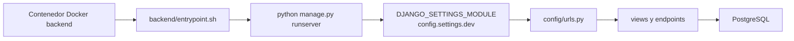
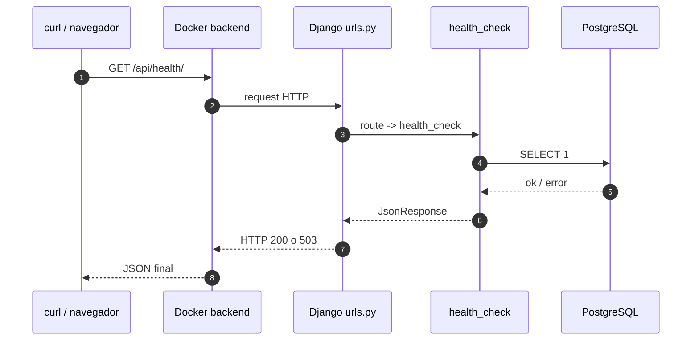

# Configuración base del backend Django explicada

## 1. Resumen general del backend Django

En este proyecto, **Django es el núcleo del backend**. Su papel no es solo servir una API, sino coordinar varias responsabilidades:

- autenticar usuarios mediante OAuth de 42;
- exponer endpoints REST para frontend;
- leer y escribir en PostgreSQL;
- ejecutar sincronizaciones contra la API de 42;
- ofrecer endpoints operativos globales como `/api/health/` y `/api/status/`.

### Qué papel cumple el backend

El backend actúa como capa intermedia entre:

- el **frontend Next.js**, que hace peticiones HTTP desde el navegador;
- la **base de datos PostgreSQL**, que guarda el estado persistente;
- la **API de 42**, de donde se importan usuarios, coaliciones y métricas.

### Cómo se conecta con PostgreSQL

La conexión se configura en [backend/config/settings/settings.py](/home/aurodrig/Desktop/arepa/backend/config/settings/settings.py:96) mediante:

- `DATABASE_URL`, si existe;
- o variables sueltas:
  - `DB_NAME`
  - `DB_USER`
  - `DB_PASSWORD`
  - `DB_HOST`
  - `DB_PORT`

En Docker de desarrollo, el host esperado suele ser `db`.

### Cómo se conecta con el frontend

El frontend habla con el backend usando:

- `http://localhost:8000` en desarrollo;
- cookies JWT `HttpOnly` para auth;
- CORS permitido desde `localhost:3000`.

### Apps internas reales del backend

Según [backend/config/settings/settings.py](/home/aurodrig/Desktop/arepa/backend/config/settings/settings.py:37), las apps propias instaladas son:

- `authentication`
- `sync`
- `coalitions`
- `users`
- `cron_scheduler`

## 2. Diagrama Mermaid del arranque del backend



### Cómo leer este diagrama

- `Docker backend` representa el contenedor del servicio `backend`.
- `entrypoint.sh` es el script que arranca el proceso principal.
- `manage.py` es el lanzador estándar de Django.
- `DJANGO_SETTINGS_MODULE` decide qué settings se cargan.
- `config/urls.py` decide a qué vista va cada request.
- las vistas como `health_check` o `status_check` ejecutan lógica de negocio o comprobaciones.
- si la vista necesita datos, consulta PostgreSQL.

## 3. Explicación de `backend/manage.py`

Archivo:
- [backend/manage.py](/home/aurodrig/Desktop/arepa/backend/manage.py:1)

### Qué hace

Es el **punto de entrada estándar de Django** para comandos administrativos.

### Por qué existe

Sin `manage.py`, Django no tendría un lanzador cómodo para comandos como:

- `runserver`
- `migrate`
- `makemigrations`
- `shell`
- `createsuperuser`
- comandos custom como `sync_campus_users`

### Cuándo se ejecuta

Se usa:

- cuando el contenedor backend arranca con `runserver`;
- cuando ejecutas comandos tipo `python manage.py migrate`;
- cuando Make llama a comandos backend dentro de Docker.

### Cómo se relaciona con Django

Las líneas clave son:

```python
os.environ.setdefault('DJANGO_SETTINGS_MODULE', 'config.settings.dev')
from django.core.management import execute_from_command_line
execute_from_command_line(sys.argv)
```

### Qué es `DJANGO_SETTINGS_MODULE`

Es la variable que le dice a Django **qué archivo de settings debe cargar**.

En este repo, en [backend/manage.py](/home/aurodrig/Desktop/arepa/backend/manage.py:9), se fija por defecto a:

```python
config.settings.dev
```

Eso significa:

- si no se fuerza otra cosa desde fuera, Django arrancará en modo de settings de desarrollo;
- `dev.py` importa el settings base y pone `DEBUG = True`.

### Qué hace `execute_from_command_line`

Es la función de Django que:

1. lee `sys.argv`;
2. interpreta el subcomando;
3. carga settings, apps, ORM y el resto del framework;
4. ejecuta el comando pedido.

### Ejemplos de comandos que pasan por `manage.py`

#### Migraciones

```bash
python manage.py migrate
```

Pasa por:
- `manage.py`
- settings
- app registry
- sistema de migraciones

#### Crear migraciones

```bash
python manage.py makemigrations
```

#### Shell Django

```bash
python manage.py shell
```

#### Sync custom

```bash
python manage.py sync_campus_users --mode=full
```

Ese comando está implementado en:
- [backend/sync/management/commands/sync_campus_users.py](/home/aurodrig/Desktop/arepa/backend/sync/management/commands/sync_campus_users.py:1)

### Pseudocódigo

```text
FUNCIÓN manage_py():

    definir DJANGO_SETTINGS_MODULE
    cargar Django
    leer comando CLI

    SI el comando es migrate:
        aplicar migraciones

    SI el comando es shell:
        abrir shell con modelos cargados

    SI el comando es custom:
        localizar clase Command
        ejecutar handle()

    devolver código de salida
```

### Relación con Docker

En desarrollo, el contenedor backend arranca finalmente con:

```bash
python manage.py runserver 0.0.0.0:8000
```

Eso se lanza desde:
- [backend/entrypoint.sh](/home/aurodrig/Desktop/arepa/backend/entrypoint.sh:1)

### Errores comunes

- `Couldn't import Django`
  - Django no está instalado en la imagen o el entorno está roto.
- `ModuleNotFoundError` en apps o settings
  - alguna ruta o dependencia no carga.
- migraciones pendientes
  - el servidor arranca, pero ciertas vistas fallan al tocar tablas inexistentes.

## 4. Explicación de settings

Archivos revisados:

- [backend/config/settings/settings.py](/home/aurodrig/Desktop/arepa/backend/config/settings/settings.py:1)
- [backend/config/settings/dev.py](/home/aurodrig/Desktop/arepa/backend/config/settings/dev.py:1)
- [backend/config/settings/prod.py](/home/aurodrig/Desktop/arepa/backend/config/settings/prod.py:1)

## 4.1 `settings.py`

### Qué hace

Es el **settings base real del proyecto**. Aquí está casi toda la configuración importante.

### Por qué existe

Centraliza:

- apps instaladas;
- middleware;
- base de datos;
- DRF;
- JWT;
- CORS;
- static/media;
- cron jobs.

### Variables de entorno usadas

En este archivo se usan directamente:

- `SECRET_KEY`
- `DEBUG`
- `ALLOWED_HOSTS`
- `DATABASE_URL`
- `DB_NAME`
- `DB_USER`
- `DB_PASSWORD`
- `DB_HOST`
- `DB_PORT`

### `INSTALLED_APPS`

Bloque:
- [backend/config/settings/settings.py](/home/aurodrig/Desktop/arepa/backend/config/settings/settings.py:37)

Incluye:

#### Apps de Django

- `django.contrib.admin`
- `django.contrib.auth`
- `django.contrib.contenttypes`
- `django.contrib.sessions`
- `django.contrib.messages`
- `django.contrib.staticfiles`

#### Apps de terceros

- `rest_framework`
- `rest_framework_simplejwt`
- `django_crontab`
- `corsheaders`

#### Apps del proyecto

- `authentication`
- `sync`
- `coalitions`
- `users`
- `cron_scheduler`

### Qué significa

- Django carga modelos, admin, señales, migraciones y configuración de todas esas apps.
- Si una app no está aquí, Django no la conoce.

### `MIDDLEWARE`

Bloque:
- [backend/config/settings/settings.py](/home/aurodrig/Desktop/arepa/backend/config/settings/settings.py:64)

Contiene:

- `SecurityMiddleware`
- `SessionMiddleware`
- `CorsMiddleware`
- `CommonMiddleware`
- `CsrfViewMiddleware`
- `AuthenticationMiddleware`
- `MessageMiddleware`
- `XFrameOptionsMiddleware`

### Qué hace cada grupo

- seguridad y headers base;
- sesiones;
- CORS;
- normalización HTTP;
- CSRF;
- autenticación por request;
- mensajes internos de Django;
- protección frente a `iframe`.

### CORS

Bloques:
- [backend/config/settings/settings.py](/home/aurodrig/Desktop/arepa/backend/config/settings/settings.py:55)
- [backend/config/settings/settings.py](/home/aurodrig/Desktop/arepa/backend/config/settings/settings.py:62)

Configuración real:

- `CORS_ALLOWED_ORIGINS`
  - `http://localhost:3000`
  - `http://127.0.0.1:3000`
  - más dos hosts adicionales
- `CORS_ALLOW_CREDENTIALS = True`

Esto es importante porque:

- el frontend manda cookies;
- sin `credentials` y CORS correctos, auth no funcionaría.

### CSRF

El middleware CSRF existe:
- [backend/config/settings/settings.py](/home/aurodrig/Desktop/arepa/backend/config/settings/settings.py:69)

Pero:

- no hay configuración explícita visible en este archivo para `CSRF_TRUSTED_ORIGINS`;
- no hay una personalización específica de cookies CSRF aquí.

Conclusión honesta:

- CSRF está activo por middleware;
- la configuración avanzada de CSRF no está desarrollada aquí de forma explícita.

### `DATABASES`

Bloque:
- [backend/config/settings/settings.py](/home/aurodrig/Desktop/arepa/backend/config/settings/settings.py:96)

Funciona en dos modos:

#### Si existe `DATABASE_URL`

Usa:

```python
dj_database_url.parse(DATABASE_URL, conn_max_age=600)
```

#### Si no existe `DATABASE_URL`

Usa configuración tradicional:

```python
ENGINE = django.db.backends.postgresql
NAME = DB_NAME
USER = DB_USER
PASSWORD = DB_PASSWORD
HOST = DB_HOST
PORT = DB_PORT
```

### Cómo se relaciona con PostgreSQL

Este bloque es el que hace que Django se conecte a la base del contenedor `db`.

### `REST_FRAMEWORK`

Bloque:
- [backend/config/settings/settings.py](/home/aurodrig/Desktop/arepa/backend/config/settings/settings.py:160)

Configuración real:

- auth por defecto:
  - `authentication.authentication.CookieJWTAuthentication`
- permisos por defecto:
  - `IsAuthenticated`

Conclusión:

- por defecto, casi todas las APIs son privadas;
- las vistas públicas deben abrirse explícitamente con `AllowAny`.

### `SIMPLE_JWT`

Bloque:
- [backend/config/settings/settings.py](/home/aurodrig/Desktop/arepa/backend/config/settings/settings.py:170)

Configura:

- `ACCESS_TOKEN_LIFETIME = 15 minutos`
- `REFRESH_TOKEN_LIFETIME = 7 días`
- sin rotación de refresh tokens
- tipo de header `Bearer`

### Cookies

En `settings.py` no aparece una configuración global completa de cookies JWT.

La parte importante de cookies está realmente en:
- [backend/authentication/views.py](/home/aurodrig/Desktop/arepa/backend/authentication/views.py:35)

Ahí se usan estas variables de entorno:

- `JWT_COOKIE_SECURE`
- `JWT_COOKIE_SAMESITE`

Conclusión exacta:

- `settings.py` define JWT;
- las opciones concretas de cookies se terminan de aplicar en las vistas de auth.

### `ALLOWED_HOSTS`

Bloque:
- [backend/config/settings/settings.py](/home/aurodrig/Desktop/arepa/backend/config/settings/settings.py:29)

Se construye desde:

```python
os.getenv("ALLOWED_HOSTS", "localhost,127.0.0.1")
```

Importa porque:

- si haces requests desde un host no permitido, Django puede rechazarlas.

### `STATIC` y `MEDIA`

Bloques:
- [backend/config/settings/settings.py](/home/aurodrig/Desktop/arepa/backend/config/settings/settings.py:151)

Configuración real:

- `STATIC_URL = 'static/'`
- `MEDIA_URL = '/media/'`
- `MEDIA_ROOT = BASE_DIR / 'media'`

Importancia:

- `MEDIA` se usa especialmente para avatares custom de usuario.

### `CRONJOBS`

Bloque:
- [backend/config/settings/settings.py](/home/aurodrig/Desktop/arepa/backend/config/settings/settings.py:179)

Configuración real:

```python
('*/20 * * * *', 'django.core.management.call_command', ['sync_campus_users', '--mode=full'])
```

Significa:

- cada 20 minutos;
- se llama al management command `sync_campus_users --mode=full`.

Además:

- `CRONTAB_COMMAND_PREFIX` carga `/app/.env`;
- `CRONTAB_COMMAND_SUFFIX` redirige salida a stdout/stderr del contenedor.

Esto es importante en Docker porque hace visibles los logs del cron con:

```bash
docker compose -f docker-compose.dev.yml logs backend
```

### Configuración de API 42

En `settings.py` no aparece una sección explícita con `FT_CLIENT_ID` y similares.

Eso no significa que no exista integración con 42. Significa que:

- las variables se usan más directamente en vistas y servicios;
- por ejemplo en:
  - `authentication/views.py`
  - `sync/services.py`

Las variables relevantes están documentadas en:
- [backend/.env.example](/home/aurodrig/Desktop/arepa/backend/.env.example:1)

## 4.2 `dev.py`

Archivo:
- [backend/config/settings/dev.py](/home/aurodrig/Desktop/arepa/backend/config/settings/dev.py:1)

### Qué hace

Importa el settings base y fuerza:

```python
DEBUG = True
```

### Por qué existe

Permite separar:

- base común;
- ajustes concretos de desarrollo.

### Quién lo usa

Lo usan por defecto:

- `manage.py`
- `asgi.py`
- `wsgi.py`

Porque todos apuntan a `config.settings.dev`.

### Relación con Docker

Es el settings real que usa el backend dentro del contenedor en desarrollo.

### Error común

- pensar que `settings.py` es el único archivo activo;
- en realidad el módulo cargado por defecto es `config.settings.dev`.

## 4.3 `prod.py`

Archivo:
- [backend/config/settings/prod.py](/home/aurodrig/Desktop/arepa/backend/config/settings/prod.py:1)

### Estado real

Está **vacío**.

### Qué significa

- existe la intención de tener settings de producción;
- pero hoy no hay configuración real de producción en este archivo.

### Conclusión honesta

No se puede documentar una configuración productiva real aquí porque **no está implementada**.

### Error común

Si alguien intentara usar:

```bash
DJANGO_SETTINGS_MODULE=config.settings.prod
```

el proyecto muy probablemente no arrancaría correctamente, porque `prod.py` no importa ni define la configuración base.

## 5. Explicación de `urls.py`

Archivo:
- [backend/config/urls.py](/home/aurodrig/Desktop/arepa/backend/config/urls.py:1)

### Qué hace

Define el **enrutado global** del backend Django.

### Por qué existe

Django necesita un archivo raíz que diga:

- qué URL va a qué vista;
- qué subárboles de rutas delega en otras apps.

### Cuándo se usa

Se usa en **cada request HTTP** que entra al backend.

### Cómo se relaciona con Django

Está referenciado por:

```python
ROOT_URLCONF = 'config.urls'
```

en [backend/config/settings/settings.py](/home/aurodrig/Desktop/arepa/backend/config/settings/settings.py:75).

### Sintaxis Django importante

#### `path(...)`

Sirve para declarar rutas.

Ejemplo:

```python
path('api/health/', health_check, name='health-check')
```

#### `include(...)`

Sirve para delegar un prefijo de URL a otro archivo de rutas.

Ejemplo:

```python
path('api/auth/', include(auth_urls))
```

Eso significa:

- el prefijo `api/auth/` se sigue resolviendo dentro de `authentication/urls.py`.

### Rutas globales reales

Bloque:
- [backend/config/urls.py](/home/aurodrig/Desktop/arepa/backend/config/urls.py:27)

Rutas presentes:

- `/`
- `/admin/`
- `/api/health/`
- `/api/status/`
- `/api/message/`
- `/api/auth/...`
- `/api/coalitions/...`
- `/api/users/...`

### Dónde están `/api/health/` y `/api/status/`

Se definen aquí:

- [backend/config/urls.py](/home/aurodrig/Desktop/arepa/backend/config/urls.py:30)
- [backend/config/urls.py](/home/aurodrig/Desktop/arepa/backend/config/urls.py:31)

Apuntan a:

- `health_check`
- `status_check`

de [backend/config/views.py](/home/aurodrig/Desktop/arepa/backend/config/views.py:1)

### Cómo se incluyen authentication, users y coalitions

```python
path('api/auth/', include(auth_urls))
path('api/coalitions/', include(coalition_urls))
path('api/users/', include(user_urls))
```

### Y `sync`

No hay `include()` para una API pública de `sync` en este archivo.

Conclusión:

- `sync` existe como app;
- pero no expone aquí un árbol de rutas públicas propio.

### Static/media en debug

Bloque:
- [backend/config/urls.py](/home/aurodrig/Desktop/arepa/backend/config/urls.py:38)

Si `DEBUG` es `True`, Django sirve ficheros `MEDIA` directamente.

## 6. Explicación de `views.py`

Archivo:
- [backend/config/views.py](/home/aurodrig/Desktop/arepa/backend/config/views.py:1)

Este archivo contiene endpoints globales pequeños, especialmente los de health/status.

## 6.1 `_check_database`

Archivo:
- [backend/config/views.py](/home/aurodrig/Desktop/arepa/backend/config/views.py:11)

### Qué recibe

- no recibe parámetros explícitos

### Qué devuelve

Una tupla:

- `('ok', None)` si la DB responde
- `('error', '<mensaje>')` si falla

### Qué problema resuelve

Permite distinguir si el backend está vivo pero la base de datos no responde.

### Explicación bloque por bloque

#### Abrir cursor

```python
with connection.cursor() as cursor:
```

- pide a Django una conexión SQL real.

#### Ejecutar consulta mínima

```python
cursor.execute('SELECT 1')
cursor.fetchone()
```

- hace la comprobación más barata posible;
- no depende de tablas de negocio.

#### Capturar error

```python
except DatabaseError as exc:
    return 'error', str(exc)
```

- si PostgreSQL no responde, devuelve error legible.

### Cómo se prueba

Normal:

```bash
curl -i http://localhost:8000/api/health/
```

Prueba de fallo:

```bash
docker compose -f docker-compose.dev.yml stop db
curl -i http://localhost:8000/api/health/
```

## 6.2 `_get_last_sync_time`

Archivo:
- [backend/config/views.py](/home/aurodrig/Desktop/arepa/backend/config/views.py:22)

### Qué recibe

- no recibe parámetros

### Qué devuelve

- `None` si no hay metadata;
- o un `ISO string` con el último sync.

### Qué problema resuelve

Permite que `/api/status/` muestre el último momento en que el sistema sincronizó datos de campus.

### Explicación bloque por bloque

#### Buscar metadata

```python
SyncMetadata.objects.filter(key='campus_sync').only('last_time_update').first()
```

- busca la fila clave `campus_sync`.

#### Validar nulos

```python
if metadata is None or metadata.last_time_update is None:
    return None
```

#### Serializar fecha

```python
return metadata.last_time_update.isoformat()
```

### Cómo se prueba

```bash
curl -i http://localhost:8000/api/status/
```

Y revisando el campo:

- `last_sync`

## 6.3 `health_check`

Archivo:
- [backend/config/views.py](/home/aurodrig/Desktop/arepa/backend/config/views.py:44)

### Qué recibe

- `request`

### Qué devuelve

Un `JsonResponse` con:

- `service`
- `status`
- `database`
- opcionalmente `error`

Status code:

- `200` si todo está bien
- `503` si la DB falla

### Qué problema resuelve

Da una señal rápida y simple para:

- Docker healthcheck;
- observabilidad básica;
- pruebas manuales.

### Explicación bloque por bloque

#### Llamar a `_check_database`

```python
database_status, error = _check_database()
```

#### Resolver estado general

```python
status = 'ok' if database_status == 'ok' else 'error'
```

#### Construir payload

```python
payload = {
    'service': SERVICE_NAME,
    'status': status,
    'database': database_status,
}
```

#### Añadir detalle si falla

```python
if error:
    payload['error'] = error
```

#### Elegir código HTTP

```python
return JsonResponse(payload, status=200 if status == 'ok' else 503)
```

### Cómo se prueba

```bash
curl -i http://localhost:8000/api/health/
```

## 6.4 `status_check`

Archivo:
- [backend/config/views.py](/home/aurodrig/Desktop/arepa/backend/config/views.py:58)

### Qué recibe

- `request`

### Qué devuelve

Un `JsonResponse` con:

- `service`
- `status`
- `database`
- `last_sync`
- `timestamp`
- opcionalmente `error`

Código:

- `200` si está sano
- `503` si la DB falla

### Qué problema resuelve

Es más informativo que `/api/health/`.

Sirve para:

- la página pública `/status`;
- debugging rápido;
- comprobación de sincronización reciente.

### Explicación bloque por bloque

#### Comprobar base de datos

```python
database_status, error = _check_database()
```

#### Resolver estado general

```python
status = 'ok' if database_status == 'ok' else 'error'
```

#### Construir respuesta

```python
payload = {
    'service': SERVICE_NAME,
    'status': status,
    'database': database_status,
    'last_sync': _get_last_sync_time() if database_status == 'ok' else None,
    'timestamp': timezone.now().isoformat(),
}
```

Puntos importantes:

- `last_sync` solo se consulta si la DB está accesible;
- `timestamp` siempre refleja la hora actual del backend.

#### Añadir error si hace falta

```python
if error:
    payload['error'] = error
```

#### Elegir código HTTP

```python
return JsonResponse(payload, status=200 if status == 'ok' else 503)
```

### Cómo se prueba

```bash
curl -i http://localhost:8000/api/status/
```

Y en navegador:

```text
http://localhost:3000/status
```

## 7. Explicación de `asgi.py` y `wsgi.py`

Archivos:

- [backend/config/asgi.py](/home/aurodrig/Desktop/arepa/backend/config/asgi.py:1)
- [backend/config/wsgi.py](/home/aurodrig/Desktop/arepa/backend/config/wsgi.py:1)

## 7.1 Qué es WSGI

WSGI es la interfaz clásica entre:

- aplicaciones Python web síncronas;
- y servidores como Gunicorn o uWSGI.

## 7.2 Qué es ASGI

ASGI es una interfaz más moderna que soporta:

- async;
- websockets;
- long-lived connections;
- servidores como Uvicorn/Daphne.

## 7.3 Para qué sirven en este proyecto

Ambos archivos exponen una variable:

- `application`

que Django y servidores externos pueden usar para arrancar la app.

### `asgi.py`

Líneas clave:
- [backend/config/asgi.py](/home/aurodrig/Desktop/arepa/backend/config/asgi.py:14)
- [backend/config/asgi.py](/home/aurodrig/Desktop/arepa/backend/config/asgi.py:16)

Hace:

```python
os.environ.setdefault('DJANGO_SETTINGS_MODULE', 'config.settings.dev')
application = get_asgi_application()
```

### `wsgi.py`

Líneas clave:
- [backend/config/wsgi.py](/home/aurodrig/Desktop/arepa/backend/config/wsgi.py:14)
- [backend/config/wsgi.py](/home/aurodrig/Desktop/arepa/backend/config/wsgi.py:16)

Hace:

```python
os.environ.setdefault('DJANGO_SETTINGS_MODULE', 'config.settings.dev')
application = get_wsgi_application()
```

## 7.4 Cuál se usa normalmente en desarrollo

En este repo, el desarrollo normal entra por:

```bash
python manage.py runserver
```

Así que:

- el desarrollador normalmente no toca directamente ni `asgi.py` ni `wsgi.py`;
- existen porque Django los genera y porque son el punto estándar para servidores externos.

## 7.5 Relación con Docker

El contenedor backend no invoca explícitamente ni Uvicorn ni Gunicorn en este flujo de desarrollo.

Usa:

- `entrypoint.sh`
- `manage.py runserver`

## 7.6 Error común

- pensar que `asgi.py` o `wsgi.py` están “rotos” por no usarse a diario;
- en realidad simplemente son puntos de integración preparados para otros modos de despliegue.

## 8. Flujo de una request

Ejemplo:

```bash
curl http://localhost:8000/api/health/
```

### Paso a paso

1. `curl` llama a `localhost:8000`.
2. Docker redirige al puerto del contenedor backend.
3. Django recibe la request HTTP.
4. `ROOT_URLCONF` apunta a `config.urls`.
5. `urls.py` encuentra la ruta `api/health/`.
6. Django llama a `health_check(request)`.
7. `health_check()` llama a `_check_database()`.
8. `_check_database()` ejecuta `SELECT 1` sobre PostgreSQL.
9. Si responde, Django construye JSON con `status: ok`.
10. Devuelve respuesta `200`.

### Pseudocódigo

```text
FUNCIÓN request_health():

    recibir GET /api/health/
    resolver URL en config/urls.py
    ejecutar health_check()
    ejecutar _check_database()

    SI SELECT 1 funciona:
        devolver JSON con status=ok y HTTP 200

    SI SELECT 1 falla:
        devolver JSON con status=error y HTTP 503
```

### Sequence diagram



## 9. Comandos útiles relacionados

### `make back-migrate`

Qué hace:

- ejecuta `python manage.py migrate` en un contenedor backend temporal.

Cuándo usarlo:

- tras añadir o recibir migraciones nuevas.

### `make back-shell`

Qué hace:

- abre shell Django.

Cuándo usarlo:

- inspección manual de modelos, queries y estado de DB.

### `make back-showmigrations`

Qué hace:

- lista migraciones y su estado.

Cuándo usarlo:

- comprobar si el esquema está aplicado o no.

### `docker compose logs backend`

Qué hace:

- muestra logs del backend.

Útil para:

- errores de arranque;
- problemas de import;
- healthcheck fallando.

### `curl http://localhost:8000/api/health/`

Qué hace:

- prueba salud simple de backend + DB.

### `curl http://localhost:8000/api/status/`

Qué hace:

- prueba estado ampliado con `last_sync` y `timestamp`.

## 10. Errores comunes

### Settings mal configurado

Síntomas:

- Django no arranca;
- errores de import o configuración.

### Falta `backend/.env`

Síntomas:

- fallan credenciales DB;
- fallan variables OAuth 42;
- auth o sync no funcionan.

### Base de datos no disponible

Síntomas:

- `/api/health/` devuelve `503`;
- stack de error de conexión PostgreSQL.

### `ALLOWED_HOSTS` incorrecto

Síntomas:

- Django puede rechazar requests con `DisallowedHost`.

### CORS / CSRF bloqueando frontend

Síntomas:

- frontend no puede leer respuestas;
- auth con cookies no funciona como esperas;
- requests desde otro host/puerto se bloquean.

### Endpoint health devuelve error

Síntomas:

- `curl /api/health/` da `503`;
- Docker marca backend `unhealthy`.

Causas típicas:

- DB caída;
- migraciones rotas;
- backend arrancado pero sin acceso real a PostgreSQL.

### Migraciones pendientes

Síntomas:

- algunas vistas fallan al tocar tablas o columnas que aún no existen.

## 11. Qué puedo decir en evaluación

Estas frases te sirven para explicarlo de forma simple:

### Qué hace el backend

> El backend está hecho en Django y actúa como capa central del sistema: autentica usuarios, expone la API, consulta PostgreSQL y sincroniza datos con la API de 42.

### Cómo se enrutan las APIs

> Django usa `config/urls.py` como router raíz. Ahí se definen endpoints globales como `/api/health/` y `/api/status/`, y además se delegan prefijos a las apps `authentication`, `coalitions` y `users` mediante `include()`.

### Cómo se configura la DB

> La base de datos se configura en `settings.py`. Si existe `DATABASE_URL`, Django la parsea directamente; si no, usa las variables `DB_NAME`, `DB_USER`, `DB_PASSWORD`, `DB_HOST` y `DB_PORT`.

### Cómo funcionan `/api/health/` y `/api/status/`

> `/api/health/` hace una comprobación mínima de base de datos con `SELECT 1` y devuelve `200` o `503`. `/api/status/` reutiliza esa comprobación y además devuelve el último sync conocido y un timestamp actual del backend.

## 12. Checklist de comprensión

- [ ] Entiendo qué hace `manage.py`
- [ ] Entiendo qué es `settings.py`
- [ ] Entiendo `INSTALLED_APPS`
- [ ] Entiendo `MIDDLEWARE`
- [ ] Entiendo cómo se configura la DB
- [ ] Entiendo `urls.py`
- [ ] Entiendo `/api/health/`
- [ ] Entiendo `/api/status/`
- [ ] Entiendo ASGI/WSGI
- [ ] Entiendo cómo probar el backend

## 13. Pseudocódigo global del flujo del backend

```text
FUNCIÓN backend_django():

    Docker arranca backend
    entrypoint invoca manage.py o runserver
    Django carga settings
    settings registra apps, middleware y DATABASES
    urls.py expone endpoints globales y subrutas

    SI entra una request:
        pasar por middleware
        resolver path
        ejecutar view

        SI la view necesita DB:
            consultar PostgreSQL

        devolver JSON o error

    devolver "backend configurado y sirviendo API"
```
