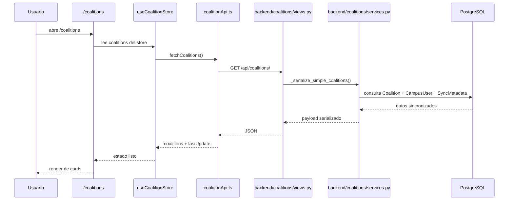

# Coalitions Feature - Explicación técnica

## 1. Resumen general

La feature de coaliciones es la capa que convierte los datos sincronizados desde 42 en una experiencia de producto para:

- ver el estado general de las coaliciones;
- navegar al detalle de cada coalición;
- consultar rankings de usuarios;
- comparar score actual con snapshots anteriores.

### Qué representa una coalición en la app

En la app, una coalición representa:

- un grupo competitivo del campus;
- su score total actual;
- sus miembros y miembros activos;
- métricas agregadas de proyectos y correcciones;
- un histórico limitado de evolución gracias a snapshots diarios.

El modelo real de coalición no vive en `backend/coalitions/models.py`, sino en:

- [backend/sync/models.py](/home/aurodrig/Desktop/arepa/backend/sync/models.py:5) `Coalition`

De hecho, [backend/coalitions/models.py](/home/aurodrig/Desktop/arepa/backend/coalitions/models.py:1) solo contiene una nota diciendo que esta app expone APIs y servicios, pero que los datos vienen de `sync.models`.

### Diferencia entre datos actuales y snapshots

Hay dos capas de datos:

#### Datos actuales

Salen sobre todo de:

- `sync.models.Coalition`
- `sync.models.CampusUser`

Ejemplos:

- score actual de la coalición;
- nivel medio actual;
- score actual del usuario dentro de la coalición;
- ranking actual.

#### Snapshots

Salen de:

- `sync.models.CoalitionScoreSnapshot`
- `sync.models.CampusUserScoreSnapshot`

Sirven para comparar el presente con el pasado:

- cambio de score en 24h;
- cambio en 7 días;
- cambio en 30 días;
- cambio de ranking.

Limitación importante:

- los snapshots son **diarios**, no intradía;
- solo hay un snapshot por entidad y por día;
- por tanto, la app puede mostrar evolución diaria, pero no curvas reales hora a hora.

### Qué muestra `/coalitions`

La ruta:

- [frontend/app/coalitions/page.tsx](/home/aurodrig/Desktop/arepa/frontend/app/coalitions/page.tsx:1)

muestra:

- una grid de tarjetas de coalición;
- ordenadas por score descendente;
- usando datos del store global `useCoalitionStore`.

Cada card enseña:

- nombre e imagen;
- score;
- miembros activos;
- correcciones;
- proyectos;
- nivel medio;
- un “24h” visual.

Pero aquí hay una limitación real:

- el listado no dispara `getCoalitionDetails()`;
- el campo `scoreChange24h` de la card depende de `coalition.details`;
- por tanto, en el listado ese dato puede quedar en `0` si el detalle no se ha cargado antes.

### Qué muestra `/coalitions/[name]`

La ruta:

- [frontend/app/coalitions/[name]/page.tsx](/home/aurodrig/Desktop/arepa/frontend/app/coalitions/[name]/page.tsx:13)

muestra:

- portada y avatar de coalición;
- score total;
- proyectos de temporada;
- miembros activos y total;
- correcciones;
- nivel medio;
- cambios 24h/semana/mes;
- distribución de niveles;
- top members;
- acceso al leaderboard filtrado por coalición.

También monta:

- `PointsEvolutionChart`

pero esa gráfica sigue usando **datos mock**, no snapshots reales.

### Qué muestra `/leaderboard`

La ruta:

- [frontend/app/leaderboard/page.tsx](/home/aurodrig/Desktop/arepa/frontend/app/leaderboard/page.tsx:12)

soporta dos vistas:

- `view=coalition-points`
- `view=corrections`

Así el leaderboard actúa como dos rankings distintos:

1. ranking por puntos de coalición;
2. ranking por número de correcciones.

Ambos parten del mismo dataset base (`ranking` en `useCoalitionStore`), pero la vista de correcciones recalcula el orden en frontend.

## 2. Diagrama Mermaid general

```mermaid
flowchart LR
    A[sync.models] --> B[backend/coalitions/services.py]
    B --> C[backend/coalitions/views.py]
    C --> D[frontend/lib/coalitionApi.ts]
    D --> E[useCoalitionStore]
    D --> F[useLeaderboard.ts]
    E --> G[/coalitions]
    E --> H[/coalitions/[name]]
    E --> I[/leaderboard]
    F --> I
```

### Cómo leer el diagrama

- `sync.models` es la base de datos local real de la que parte la feature.
- `coalitions/services.py` compone respuestas de negocio a partir de esos modelos.
- `coalitions/views.py` convierte esas respuestas en endpoints HTTP.
- `coalitionApi.ts` hace las llamadas desde el frontend.
- `useCoalitionStore` es el store principal usado por la feature.
- `useLeaderboard.ts` existe, pero no es el camino principal de render hoy.
- Las páginas `/coalitions`, `/coalitions/[name]` y `/leaderboard` consumen ese estado.

## 3. Endpoints backend

Las rutas globales se montan en:

- [backend/config/urls.py](/home/aurodrig/Desktop/arepa/backend/config/urls.py:34)

con:

```python
path('api/coalitions/', include(coalition_urls))
```

Y las rutas internas están en:

- [backend/coalitions/urls.py](/home/aurodrig/Desktop/arepa/backend/coalitions/urls.py:6)

| Endpoint | Método | Función/clase | Archivo | Qué devuelve | Modelos usados | ¿Requiere auth? |
| --- | --- | --- | --- | --- | --- | --- |
| `/api/coalitions/` | `GET` | `CoalitionSimpleView.get` | [backend/coalitions/views.py](/home/aurodrig/Desktop/arepa/backend/coalitions/views.py:8) | lista simple de coaliciones o una coalición si llega `slug` | `Coalition`, `CampusUser`, `SyncMetadata` | Sí |
| `/api/coalitions/users-ranking/` | `GET` | `UserRankingView.get` | [backend/coalitions/views.py](/home/aurodrig/Desktop/arepa/backend/coalitions/views.py:30) | ranking paginado de usuarios | `CampusUser`, `CampusUserScoreSnapshot` | Sí |
| `/api/coalitions/details/?coalition=<slug>` | `GET` | `CoalitionSingleDetailView.get` | [backend/coalitions/views.py](/home/aurodrig/Desktop/arepa/backend/coalitions/views.py:50) | detalle ampliado de una coalición | `Coalition`, `CampusUser`, `CoalitionScoreSnapshot` | Sí |

### Query params importantes

#### `/api/coalitions/`

- `slug` opcional

#### `/api/coalitions/users-ranking/`

- `coalition` opcional
- `page`
- `per_page`

#### `/api/coalitions/details/`

- `coalition` obligatorio

## 4. Backend `services.py`

Archivo:

- [backend/coalitions/services.py](/home/aurodrig/Desktop/arepa/backend/coalitions/services.py:1)

Este archivo es la capa de negocio de la feature. No habla con 42: **solo lee modelos locales ya sincronizados**.

### Tabla de funciones clave

| Función | Líneas aprox. | Qué recibe | Qué devuelve | Qué consulta | Qué calcula | Riesgo o limitación |
| --- | --- | --- | --- | --- | --- | --- |
| `_get_scored_users_queryset` | 12-16 | `coalition_slug` opcional | `QuerySet[CampusUser]` | `CampusUser` | filtra usuarios con score y opcionalmente por coalición | excluye score `0`, así que no todos los usuarios aparecen |
| `_get_last_time_update` | 19-23 | nada | `datetime \| None` | `SyncMetadata` | recupera el último sync general | no refleja sync de proyectos/correcciones por separado |
| `_get_rank_change` | 26-35 | rank actual y anterior | `(delta, status)` | ninguno | diferencia de ranking | si falta histórico devuelve `None` |
| `_resolve_user_avatar_url` | 38-53 | `CampusUser`, request opcional | URL de avatar | `CampusUser`, `UserPreferences` | prioriza avatar custom sobre avatar sync | hace fallback a query extra si no viene `preferences` precargado |
| `_get_current_coalition_rank` | 55-60 | coalición | entero | `Coalition` | ranking actual por score total | tie-break por nombre, no por snapshot |
| `_get_level_distribution` | 62-96 | `coalition_slug` | distribución + media | `CampusUser` | buckets de nivel y nivel medio | recorre niveles en Python |
| `_get_score_change` | 98-139 | `coalition_slug` | cambios 1/7/30d + rank | `Coalition`, `CoalitionScoreSnapshot` | score delta y rank delta | depende de snapshots diarios; si faltan, devuelve `None` |
| `_get_top_members` | 141-155 | slug, limit, request | top users + counts | `CampusUser`, `UserPreferences` | top 3 por puntos | orden solo por score actual |
| `_get_project_totals` | 157-165 | slug | dict | `CampusUser` | suma proyectos | depende de que esos contadores estén sincronizados |
| `_get_evaluation_totals` | 167-175 | slug | dict | `CampusUser` | suma correcciones | igual: depende de sync previo |
| `_serialize_simple_coalitions` | 180-213 | `coalition_slug` opcional | lista o una coalición | `Coalition`, `CampusUser` | payload resumido | solo coge las 4 primeras coaliciones |
| `_serialize_coalition_details` | 215-241 | `coalition_slug`, request | dict o `None` | `Coalition`, `CampusUser`, `CoalitionScoreSnapshot` | payload ampliado | no incluye serie real para la gráfica |
| `_get_sync_user_ranks` | 243-257 | `sync_user` | rank global | `CampusUser` | rank actual de un usuario | no devuelve rank de coalición pese al nombre plural |
| `_get_user_ranking_queryset` | 259-270 | filtro coalición | `QuerySet` ordenado | `CampusUser` | base del leaderboard | filtro acepta slug, nombre o id, pero todo en una sola consulta |
| `_serialize_user_ranking` | 272-318 | filtro, page, per_page, request | payload paginado | `CampusUser`, `CampusUserScoreSnapshot` | ranking y cambios respecto a snapshot | usa `distinct('campus_user_id')`, dependiente de PostgreSQL |

### 4.1 Listado de coaliciones

#### `_serialize_simple_coalitions()`

Archivo:

- [backend/coalitions/services.py](/home/aurodrig/Desktop/arepa/backend/coalitions/services.py:180)

Qué hace:

- lee las coaliciones ordenadas por score;
- limita a `[:4]`;
- añade agregados derivados:
  - `member_count`
  - `active_members`
  - `average_level`
  - `evaluations_done_total`
  - `evaluations_done_current_season`
  - `projects_delivered_total`
  - `projects_delivered_current_season`

Fragmento relevante:

```python
coalitions = list(SyncedCoalition.objects.order_by('-total_score', 'name')[:4])
```

Esto significa que el endpoint simple asume **4 coaliciones**.

Riesgo:

- si un día hubiese más coaliciones en el dataset, este endpoint no devolvería todas.

### 4.2 Detalle de coalición

#### `_serialize_coalition_details()`

Archivo:

- [backend/coalitions/services.py](/home/aurodrig/Desktop/arepa/backend/coalitions/services.py:215)

Qué compone:

- distribución de niveles;
- media de nivel;
- score change 24h / weekly / monthly;
- campus rank actual;
- rank change y status;
- top members;
- total y activos;
- métricas de correcciones;
- métricas de proyectos.

Qué no compone:

- no devuelve una serie temporal real para dibujar la gráfica de evolución;
- por eso el frontend usa `PointsEvolutionChart` con datos mock.

### 4.3 Ranking de usuarios

#### `_get_user_ranking_queryset()`

Archivo:

- [backend/coalitions/services.py](/home/aurodrig/Desktop/arepa/backend/coalitions/services.py:259)

Qué hace:

- parte de usuarios con score (`coalition_user_score != 0`);
- si hay filtro de coalición, acepta:
  - `coalition_slug`
  - `coalition_name`
  - `coalition_id` si el filtro es numérico
- ordena por:
  - `-coalition_user_score`
  - `intra_id`

#### `_serialize_user_ranking()`

Archivo:

- [backend/coalitions/services.py](/home/aurodrig/Desktop/arepa/backend/coalitions/services.py:272)

Qué devuelve:

- `page`
- `per_page`
- `total`
- `total_pages`
- `users`

Cada usuario incluye:

- rank global;
- login y display name;
- avatar;
- coalición;
- puntos;
- nivel;
- correcciones;
- cambios de rank global y de rank de coalición.

Pero detalle importante:

- esos campos de “rank change” sí salen del backend;
- el frontend actual no los tipa ni los consume en `coalitionApi.ts`.

### 4.4 Cambios de score 1/7/30 días

#### `_get_score_change()`

Archivo:

- [backend/coalitions/services.py](/home/aurodrig/Desktop/arepa/backend/coalitions/services.py:98)

Cómo funciona:

1. busca la coalición actual;
2. calcula `today` y `previous_day`;
3. para cada ventana `1`, `7`, `30`, busca el snapshot más cercano anterior o igual a esa fecha;
4. resta `coalition.total_score - reference_snapshot.total_score`.

Eso convierte snapshots diarios en un delta simple.

Limitación:

- si no hay snapshot suficientemente antiguo, devuelve `None`;
- no hay interpolación ni backfill automático.

### 4.5 Top members

#### `_get_top_members()`

Archivo:

- [backend/coalitions/services.py](/home/aurodrig/Desktop/arepa/backend/coalitions/services.py:141)

Qué hace:

- cuenta todos los miembros de la coalición;
- cuenta los activos con score;
- saca top `limit` ordenando por `-coalition_user_score`.

Usa:

```python
select_related('django_user', 'django_user__preferences')
```

Eso reduce queries extra para el avatar personalizado.

### 4.6 `last_time_update`

#### `_get_last_time_update()`

Archivo:

- [backend/coalitions/services.py](/home/aurodrig/Desktop/arepa/backend/coalitions/services.py:19)

Qué hace:

- lee `SyncMetadata(key='campus_sync')`;
- devuelve la marca temporal o `None`.

Ese dato se expone al frontend como:

- `last_time_update` en `/api/coalitions/`

### 4.7 Snapshots

Los snapshots se usan en dos puntos:

- `CoalitionScoreSnapshot` para cambios de coalición;
- `CampusUserScoreSnapshot` para cambios de ranking de usuarios.

Punto técnico importante:

```python
.order_by('campus_user_id', '-snapshot_date').distinct('campus_user_id')
```

Eso está en `_serialize_user_ranking()` y depende de una característica propia de PostgreSQL. Es correcto aquí porque el proyecto usa Postgres, pero no es portable tal cual a SQLite/MySQL.

## 5. Backend `views.py`

Archivo:

- [backend/coalitions/views.py](/home/aurodrig/Desktop/arepa/backend/coalitions/views.py:1)

Las tres vistas son `APIView` de DRF y todas llevan:

```python
permission_classes = [IsAuthenticated]
```

Así que:

- sin sesión válida, devuelven `401`.

### `CoalitionSimpleView`

Archivo:

- [backend/coalitions/views.py](/home/aurodrig/Desktop/arepa/backend/coalitions/views.py:8)

Flujo:

1. lee `slug` desde `request.query_params`;
2. lee `last_time_update`;
3. si hay `slug`, llama a `_serialize_simple_coalitions(coalition_slug=slug)`;
4. si no existe, responde `404`;
5. si no hay `slug`, responde la lista completa.

### `UserRankingView`

Archivo:

- [backend/coalitions/views.py](/home/aurodrig/Desktop/arepa/backend/coalitions/views.py:30)

Flujo:

1. lee `coalition`, `page` y `per_page`;
2. normaliza esos enteros con fallback;
3. llama a `_serialize_user_ranking(...)`;
4. devuelve `200`.

No hay try/except explícito en la vista para errores internos del servicio.

### `CoalitionSingleDetailView`

Archivo:

- [backend/coalitions/views.py](/home/aurodrig/Desktop/arepa/backend/coalitions/views.py:50)

Flujo:

1. exige query param `coalition`;
2. si falta, devuelve `400`;
3. llama a `_serialize_coalition_details(...)`;
4. si no hay resultado, devuelve `404`;
5. si existe, responde `200`.

## 6. Frontend API

Archivo:

- [frontend/lib/coalitionApi.ts](/home/aurodrig/Desktop/arepa/frontend/lib/coalitionApi.ts:1)

### Qué hace

Este archivo es la puerta de entrada del frontend a la feature de coaliciones.

Funciones públicas:

- `fetchCoalitions()`
- `fetchRanking()`
- `fetchCoalitionDetails()`

### Qué endpoint llama cada una

| Función | Endpoint | Método | Qué devuelve en frontend |
| --- | --- | --- | --- |
| `fetchCoalitions()` | `/api/coalitions/` | `GET` | `{ coalitions, lastUpdate }` |
| `fetchRanking()` | `/api/coalitions/users-ranking/` | `GET` | `RankingPage` |
| `fetchCoalitionDetails(slug)` | `/api/coalitions/details/?coalition=<slug>` | `GET` | `CoalitionDetails` |

### Uso de `authFetchJson`

`coalitionApi.ts` no usa `fetch` directo, sino:

- `authFetchJson` desde [frontend/lib/authApi.ts](/home/aurodrig/Desktop/arepa/frontend/lib/authApi.ts:85)

Eso implica:

- `credentials: "include"` siempre;
- si llega `401`, intenta `POST /api/auth/token/refresh/`;
- luego reintenta la petición original.

### Tipos que devuelve

Se apoya en:

- [frontend/types/index.ts](/home/aurodrig/Desktop/arepa/frontend/types/index.ts:75) `Coalition`
- [frontend/types/index.ts](/home/aurodrig/Desktop/arepa/frontend/types/index.ts:93) `RankingEntry`
- [frontend/types/index.ts](/home/aurodrig/Desktop/arepa/frontend/types/index.ts:106) `RankingPage`

### Comportamiento importante del ranking

`fetchRanking()` no se queda con una página:

1. pide la primera página;
2. si hay más páginas, las descarga en paralelo por lotes de 4;
3. concatena todos los usuarios;
4. devuelve una sola página lógica con todos los usuarios.

Eso significa que el frontend:

- trae el ranking completo;
- y luego pagina localmente.

Ventaja:

- simplifica filtros y sorting client-side.

Riesgo:

- si el ranking crece mucho, esta estrategia puede ser pesada.

## 7. Zustand stores

### `useCoalitionStore`

Archivo:

- [frontend/hooks/useCoalition.ts](/home/aurodrig/Desktop/arepa/frontend/hooks/useCoalition.ts:41)

Este sí es el store principal de la feature.

#### Estado que guarda

- `coalitions`
- `ranking`
- `rankingMeta`
- `isCoalitionsLoading`
- `isRankingLoading`
- `maxScore`
- `error`
- `lastUpdate`

#### Acciones

- `getCoalitions()`
- `getRanking(options?)`
- `getCoalitionDetails(slug)`
- `setError(msg)`

#### Cómo carga datos

`getCoalitions()`:

- llama a `fetchCoalitions()`;
- calcula `maxScore`;
- formatea `lastUpdate` como “hace X min/h”.

`getRanking()`:

- llama a `fetchRanking()`;
- guarda la lista completa de usuarios.

`getCoalitionDetails()`:

- llama a `fetchCoalitionDetails(slug)`;
- fusiona el detalle dentro de la coalición correspondiente del array.

#### Loading y error

- activa flags `isCoalitionsLoading` e `isRankingLoading`;
- guarda `error` si algo falla.

#### Limitación

En `getRanking()`, `rankingMeta.total` se rellena con `rankingPage.users.length`.

Como `fetchRanking()` ya descarga todos los usuarios, eso suele coincidir con el total real. Pero el concepto de “paginación del backend” queda aplanado y el frontend termina trabajando con paginación local.

### `useLeaderboard.ts`

Archivo:

- [frontend/hooks/useLeaderboard.ts](/home/aurodrig/Desktop/arepa/frontend/hooks/useLeaderboard.ts:106)

Existe, pero hay que decirlo claramente:

- **no es un store Zustand**;
- es un hook React tradicional;
- y en el flujo actual **no es el hook que usa la página `/leaderboard`**.

La ruta principal usa:

- `LeaderboardView.tsx`

que reimplementa internamente buena parte de esa lógica.

Por tanto, `useLeaderboard.ts` parece más bien:

- un hook auxiliar/experimental;
- o una versión anterior del controlador del leaderboard.

Sí contiene:

- filtros;
- presets demo;
- sorting;
- paginación local;
- mapping de coaliciones;

pero no es el camino principal de render hoy.

## 8. Páginas frontend

## `/coalitions`

Archivo:

- [frontend/app/coalitions/page.tsx](/home/aurodrig/Desktop/arepa/frontend/app/coalitions/page.tsx:6)

### Qué componentes usa

- `CoalitionCard`

### Qué datos necesita

- `coalitions`
- `isCoalitionsLoading`

### Qué hook/store usa

- `useCoalitionStore()`

### Qué renderiza

- skeleton si está cargando y no hay datos;
- grid de 4 cards de coalición ordenadas por score.

### Loading / error / empty

- loading: sí tiene skeleton;
- error: no renderiza error explícito;
- empty: si `coalitions` está vacío, la grid queda vacía sin empty state dedicado.

## `/coalitions/[name]`

Archivo:

- [frontend/app/coalitions/[name]/page.tsx](/home/aurodrig/Desktop/arepa/frontend/app/coalitions/[name]/page.tsx:13)

### Qué componentes usa

- `CardContainer`
- `CustomButton`
- `StatCard`
- `PointsEvolutionChart`

### Qué datos necesita

- `coalitions`
- `maxScore`
- `getCoalitionDetails`

### Qué hook/store usa

- `useCoalitionStore()`

### Qué renderiza

- hero con cover;
- KPIs;
- progresión 24h/7d/30d;
- gráfica;
- distribución de niveles;
- top members.

### Loading / error / empty

- loading: renderiza `Loading...`;
- not found: card con mensaje “Coalition not found”;
- error de detalle: no hay UI dedicada, depende del store global.

### Fragilidad importante

La ruta dinámica usa `name`, y la búsqueda se hace así:

```python
c.name.toLowerCase() === name.toLowerCase()
```

Es decir:

- no usa `slug` como clave principal del path;
- depende del nombre lowercase;
- esto es más frágil que rutear por `slug`.

## `/leaderboard`

Archivo:

- [frontend/app/leaderboard/page.tsx](/home/aurodrig/Desktop/arepa/frontend/app/leaderboard/page.tsx:12)

### Qué componentes usa

- `LeaderboardUsers`
- `LeaderboardCorrections`

Y ambos montan:

- `LeaderboardView`

### Qué datos necesita

- `ranking`
- `coalitions`
- estado del usuario autenticado

### Qué hooks usa

- `useSearchParams()`
- dentro de `LeaderboardView`:
  - `useCoalitionStore`
  - `useAuthStore`

### Qué renderiza

- tabs entre ranking por puntos y por correcciones;
- panel de filtros;
- KPIs agregados;
- tabla;
- paginación local.

### Loading / error / empty

- loading: skeleton si `isRankingLoading` y no hay ranking;
- empty: “No hay usuarios para mostrar.” si no hay ranking;
- empty con filtros: fila “No hay usuarios que coincidan...”;
- error: no renderiza el `error` del store de forma explícita.

## 9. Componentes

| Componente | Archivo | Props | Qué muestra | De dónde vienen sus datos |
| --- | --- | --- | --- | --- |
| `CoalitionCard` | [frontend/app/coalitions/_components/CoalitionCard.tsx](/home/aurodrig/Desktop/arepa/frontend/app/coalitions/_components/CoalitionCard.tsx:7) | `coalition`, `index` | card resumen de coalición | `useCoalitionStore().coalitions` |
| `PointsEvolutionChart` | [frontend/app/coalitions/_components/PointsEvolutionChart.tsx](/home/aurodrig/Desktop/arepa/frontend/app/coalitions/_components/PointsEvolutionChart.tsx:48) | `color`, `title` | gráfica de evolución | datos mock internos |
| `LeaderboardView` | [frontend/app/leaderboard/_components/LeaderboardView.tsx](/home/aurodrig/Desktop/arepa/frontend/app/leaderboard/_components/LeaderboardView.tsx:75) | `mode` | tabla y filtros del leaderboard | `useCoalitionStore`, `useAuthStore` |
| `LeaderboardFilters` | [frontend/app/leaderboard/_components/LeaderboardFilters.tsx](/home/aurodrig/Desktop/arepa/frontend/app/leaderboard/_components/LeaderboardFilters.tsx:8) | múltiples props de filtros y callbacks | panel lateral de filtros | estado local de `LeaderboardView` |
| `LeaderboardPagination` | [frontend/app/leaderboard/_components/LeaderboardPagination.tsx](/home/aurodrig/Desktop/arepa/frontend/app/leaderboard/_components/LeaderboardPagination.tsx:5) | `currentPage`, `perPage`, callbacks, `summary`, `totalPages` | controles de paginación | `LeaderboardView` |
| `LeaderboardUsers` | [frontend/app/leaderboard/_components/LeaderboardUsers.tsx](/home/aurodrig/Desktop/arepa/frontend/app/leaderboard/_components/LeaderboardUsers.tsx:5) | ninguna | wrapper para ranking por puntos | pasa `mode="coalition-points"` |
| `LeaderboardCorrections` | [frontend/app/leaderboard/_components/LeaderboardCorrections.tsx](/home/aurodrig/Desktop/arepa/frontend/app/leaderboard/_components/LeaderboardCorrections.tsx:5) | ninguna | wrapper para ranking por correcciones | pasa `mode="corrections"` |
| `LeaderboardRankingRow` | [frontend/app/leaderboard/_components/LeaderboardRankingRow.tsx](/home/aurodrig/Desktop/arepa/frontend/app/leaderboard/_components/LeaderboardRankingRow.tsx:14) | `coalition`, `formattedPoints`, `isCurrentUser`, `user` | fila de ranking | **actualmente no se usa** por `LeaderboardView` |

## 10. Flujo completo con Mermaid `sequenceDiagram`



### Cómo leer el flujo

- la página no construye nada por sí sola;
- el store dispara la carga;
- `coalitionApi.ts` habla con el backend autenticado;
- las views llaman a servicios;
- los servicios leen solo PostgreSQL local;
- la UI renderiza cuando el store queda poblado.

## 11. Sintaxis importante

### En backend

#### `QuerySet`

Un `QuerySet` es una consulta ORM perezosa.

Ejemplo:

```python
CampusUser.objects.exclude(coalition_user_score=0)
```

#### `filter`

Añade condiciones.

```python
queryset.filter(coalition_slug=coalition_slug)
```

#### `order_by`

Ordena resultados.

```python
SyncedCoalition.objects.order_by('-total_score', 'name')
```

#### `aggregate`

Calcula sumas o medias.

```python
coalition_users.aggregate(average_level=Avg('level'))
```

#### `select_related`

Hace join para relaciones `ForeignKey` / `OneToOne`.

```python
select_related('django_user', 'django_user__preferences')
```

#### `Response`

Objeto HTTP de DRF.

```python
return Response({'coalitions': ...}, status=status.HTTP_200_OK)
```

#### `query params`

Se leen con:

```python
request.query_params.get('coalition')
```

### En frontend

#### `fetch` / `authFetch`

`coalitionApi.ts` usa `authFetchJson`, que a su vez:

- manda cookies;
- intenta refresh al recibir `401`.

#### Zustand `set`

Ejemplo:

```ts
set({ isCoalitionsLoading: true })
```

#### `useEffect`

Se usa para disparar cargas o sincronizar estado cuando cambian dependencias.

#### `map`

Se usa para transformar arrays en UI o payloads.

#### conditional rendering

Ejemplo:

```tsx
if (isRankingLoading && ranking.length === 0) { ... }
```

#### TypeScript interfaces

Están en:

- [frontend/types/index.ts](/home/aurodrig/Desktop/arepa/frontend/types/index.ts:1)

y definen la forma local de:

- `Coalition`
- `RankingEntry`
- `RankingPage`

## 12. Errores comunes

### No hay datos sincronizados

Síntomas:

- `/coalitions` vacío;
- ranking vacío;
- detalle sin resultados.

Causa:

- `sync_campus_users` no ha corrido o falló.

### Snapshots vacíos

Síntomas:

- cambios 24h/7d/30d en `null`;
- detalle con histórico pobre.

Causa:

- todavía no hay suficiente histórico diario.

### Slug o nombre de coalición incorrecto

Síntoma:

- `/coalitions/[name]` devuelve “not found”.

Causa:

- la ruta busca por `name.toLowerCase()`, no por `slug`.

### Ranking pesado

Síntoma:

- leaderboard tarda más de lo esperado.

Causa:

- el frontend descarga el ranking completo y luego pagina localmente.

### Filtros y paginación

Síntoma:

- números de resumen no coinciden con lo esperado.

Causa:

- hay mezcla entre total descargado y paginación local.

### Usuario sin coalición

Síntoma:

- perfil o ranking sin datos coherentes.

Causa:

- `CampusUser` puede existir sin todos los campos de coalición bien rellenos si el sync quedó incompleto.

### `last_sync` antiguo

Síntoma:

- footer o cards muestran datos “viejos”.

Causa:

- `last_time_update` depende de `SyncMetadata`, no de cargas parciales del frontend.

### Gráfica mock

Síntoma:

- la gráfica parece real, pero no cambia con el backend.

Causa:

- [frontend/app/coalitions/_components/PointsEvolutionChart.tsx](/home/aurodrig/Desktop/arepa/frontend/app/coalitions/_components/PointsEvolutionChart.tsx:8) usa arrays hardcodeados.

## 13. Cómo probar

### En navegador

1. abre `/coalitions`
2. abre `/coalitions/<nombre>`
3. abre `/leaderboard`
4. cambia entre `view=coalition-points` y `view=corrections`

### Con `curl`

Importante:

- estos endpoints requieren auth;
- sin cookies válidas devolverán `401`.

Pruebas mínimas:

```bash
curl -i http://localhost:8000/api/coalitions/
curl -i "http://localhost:8000/api/coalitions/details/?coalition=zefiria"
curl -i "http://localhost:8000/api/coalitions/users-ranking/?page=1&per_page=10"
```

Esos comandos sirven para comprobar:

- que la ruta existe;
- que exige autenticación.

Para probar con sesión real:

- haz login en el navegador;
- usa DevTools `Network`;
- inspecciona las respuestas JSON reales.

### Desde shell Django

```bash
make back-shell
```

Consultas útiles:

```python
from sync.models import Coalition, CampusUser, CoalitionScoreSnapshot, CampusUserScoreSnapshot, SyncMetadata

Coalition.objects.values('name', 'slug', 'total_score')
CampusUser.objects.filter(coalition_slug='zefiria').count()
CoalitionScoreSnapshot.objects.filter(coalition__slug='zefiria').order_by('-snapshot_date')[:5]
CampusUser.objects.filter(coalition_slug='zefiria').order_by('-coalition_user_score')[:10]
SyncMetadata.objects.filter(key='campus_sync').first()
```

## 14. Qué puedo decir en evaluación

- “La feature de coaliciones no consulta 42 en tiempo real; se apoya en datos ya sincronizados en PostgreSQL.”
- “La app separa datos actuales de snapshots: el estado actual sale de `Coalition` y `CampusUser`, y los cambios temporales salen de snapshots diarios.”
- “`/api/coalitions/` da el resumen, `/api/coalitions/details/` da el detalle y `/api/coalitions/users-ranking/` da el ranking.”
- “El backend construye respuestas agregadas sumando proyectos, correcciones, niveles y top members desde los modelos locales.”
- “El frontend usa `coalitionApi.ts` y `useCoalitionStore` para cargar la feature.”
- “El leaderboard actual descarga el ranking completo y luego pagina y filtra en cliente.”
- “La gráfica de evolución de puntos todavía está mockeada; el resto del detalle sí sale del backend.”

## 15. Checklist de comprensión

- [ ] Entiendo de dónde salen los datos de coaliciones
- [ ] Entiendo qué hace `/api/coalitions/`
- [ ] Entiendo qué hace `/api/coalitions/details/`
- [ ] Entiendo qué hace `/api/coalitions/users-ranking/`
- [ ] Entiendo cómo se usan snapshots
- [ ] Entiendo cómo el frontend carga coaliciones
- [ ] Entiendo cómo funciona leaderboard
- [ ] Entiendo cómo probar la feature

## 16. Pseudocódigo global de la feature de coaliciones

```text
FUNCIÓN feature_coalitions():

    leer Coalition y CampusUser desde PostgreSQL
    agregar scores, niveles, proyectos y correcciones
    consultar snapshots para cambios históricos

    exponer:
        /api/coalitions/
        /api/coalitions/details/
        /api/coalitions/users-ranking/

    en frontend:
        coalitionApi.ts consume backend
        useCoalitionStore guarda estado
        useLeaderboard añade filtros y UX
        páginas renderizan cards, detalle y ranking

    SI faltan snapshots:
        algunas gráficas o cambios serán pobres o nulos
```

## 17. Quiz final tipo test (20 preguntas)

### 1. ¿Qué endpoint sirve el resumen de coaliciones?
- A. `/api/status/`
- B. `/api/coalitions/`
- C. `/api/auth/profile/`
- D. `/api/users/details/`
- Respuesta correcta: B
- Explicación: devuelve el listado agregado de coaliciones.

### 2. ¿Qué endpoint sirve el detalle de una coalición?
- A. `/api/coalitions/details/`
- B. `/api/auth/logout/`
- C. `/api/health/`
- D. `/api/auth/42/callback/`
- Respuesta correcta: A
- Explicación: entrega nivel, top members, cambios de score y más.

### 3. ¿Qué endpoint sirve el ranking de usuarios?
- A. `/api/coalitions/users-ranking/`
- B. `/api/status/`
- C. `/api/users/preferences/`
- D. `/api/auth/token/refresh/`
- Respuesta correcta: A
- Explicación: es la base del leaderboard.

### 4. ¿Qué modelo representa el estado actual de una coalición?
- A. `CampusUserScoreSnapshot`
- B. `Coalition`
- C. `UserPreferences`
- D. `SyncMetadata`
- Respuesta correcta: B
- Explicación: guarda el estado agregado actual.

### 5. ¿De dónde sale el histórico de score y rank de coalición?
- A. De `FriendsList`
- B. De `CoalitionScoreSnapshot`
- C. De JWT
- D. De `User`
- Respuesta correcta: B
- Explicación: los snapshots alimentan tendencias temporales.

### 6. ¿Qué archivo backend agrega correcciones y proyectos por coalición?
- A. `backend/authentication/views.py`
- B. `backend/coalitions/services.py`
- C. `frontend/lib/coalitionApi.ts`
- D. `backend/entrypoint.sh`
- Respuesta correcta: B
- Explicación: ahí vive la lógica de negocio agregada.

### 7. ¿Qué store frontend guarda listado y ranking?
- A. `useAuthStore`
- B. `useCoalitionStore`
- C. `useTheme`
- D. `useSearchParams`
- Respuesta correcta: B
- Explicación: centraliza coaliciones, ranking y estado de carga.

### 8. ¿Qué hook frontend añade filtros avanzados al leaderboard?
- A. `useUserStore`
- B. `useLeaderboard`
- C. `useEffect`
- D. `usePathname`
- Respuesta correcta: B
- Explicación: encapsula la lógica de UX del ranking.

### 9. ¿Qué archivo cliente transforma `snake_case` del backend a `camelCase`?
- A. `frontend/lib/coalitionApi.ts`
- B. `frontend/app/layout.tsx`
- C. `backend/coalitions/views.py`
- D. `frontend/components/Header.tsx`
- Respuesta correcta: A
- Explicación: la capa API adapta el contrato para React.

### 10. ¿Qué lectura es correcta sobre `PointsEvolutionChart`?
- A. Hoy está conectado totalmente a un histórico real robusto
- B. La documentación deja claro que sigue siendo un punto frágil o mock parcial
- C. Es el componente de logout
- D. Sustituye a snapshots
- Respuesta correcta: B
- Explicación: es una de las partes que no está tan sólida como el resto.

### 11. ¿Qué función obtiene totales de correcciones por coalición?
- A. `_get_last_time_update`
- B. `_get_evaluation_totals`
- C. `_resolve_user_avatar_url`
- D. `_request_42_token`
- Respuesta correcta: B
- Explicación: suma sobre `CampusUser`.

### 12. ¿Qué hace `_serialize_simple_coalitions()`?
- A. Crea JWT
- B. Construye la respuesta lista para cards/listado
- C. Borra coaliciones
- D. Migra la base
- Respuesta correcta: B
- Explicación: serializa el resumen consumido por `/api/coalitions/`.

### 13. ¿Qué hace `_serialize_user_ranking()`?
- A. Genera el ranking paginado/agregado de usuarios
- B. Registra service workers
- C. Refresca access token
- D. Hace backup DB
- Respuesta correcta: A
- Explicación: produce la estructura del endpoint de leaderboard.

### 14. ¿Qué ruta frontend muestra el listado de coaliciones?
- A. `/leaderboard`
- B. `/coalitions`
- C. `/status`
- D. `/offline`
- Respuesta correcta: B
- Explicación: renderiza cards ordenadas por score.

### 15. ¿Qué ruta frontend muestra el detalle de una sola coalición?
- A. `/coalitions/[name]`
- B. `/users/[login]`
- C. `/login`
- D. `/status`
- Respuesta correcta: A
- Explicación: consume el endpoint de detalle.

### 16. ¿Qué ruta frontend puede enseñar correcciones por usuario?
- A. `/offline`
- B. `/leaderboard`
- C. `/status`
- D. `/login`
- Respuesta correcta: B
- Explicación: tiene una pestaña específica de correcciones.

### 17. ¿Qué riesgo aparece si no hay snapshots?
- A. Se rompe OAuth
- B. Faltará profundidad histórica en cambios o gráficas
- C. Se borra la DB
- D. El backend no compila
- Respuesta correcta: B
- Explicación: los datos actuales pueden existir, pero el histórico será pobre.

### 18. ¿Qué lectura es correcta sobre los datos de coaliciones?
- A. Se consultan a 42 en cada render
- B. Salen de la base local sincronizada
- C. Se guardan solo en Zustand
- D. Son fijos en archivos JSON
- Respuesta correcta: B
- Explicación: el backend trabaja con PostgreSQL local.

### 19. ¿Qué campo de respuesta usa el frontend para mostrar frescura?
- A. `last_time_update`
- B. `FT_CLIENT_ID`
- C. `refresh_token`
- D. `current_season`
- Respuesta correcta: A
- Explicación: se usa para mostrar cuándo se actualizó la información.

### 20. ¿Cuál es la idea central de la feature de coaliciones?
- A. Mezclar auth y CSS
- B. Presentar estado actual, detalle y ranking sobre datos locales agregados e históricos
- C. Sustituir la base de datos
- D. Evitar todo uso de backend
- Respuesta correcta: B
- Explicación: esa es la funcionalidad real de la feature.
