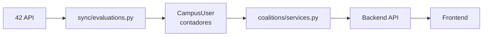
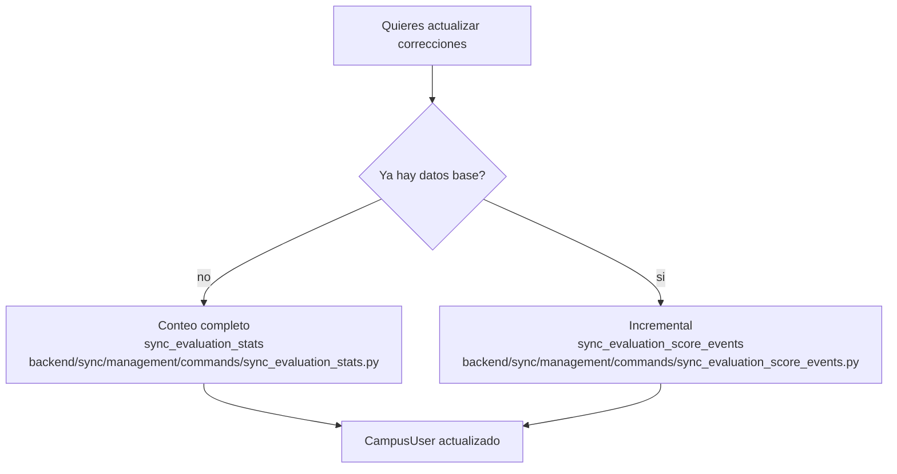
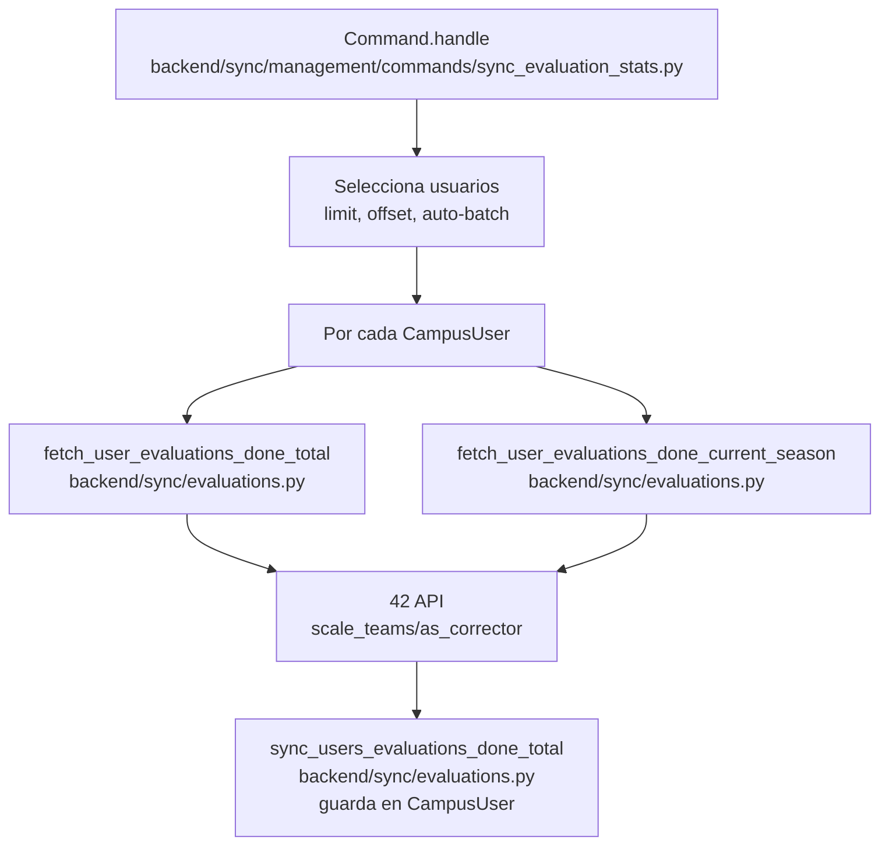
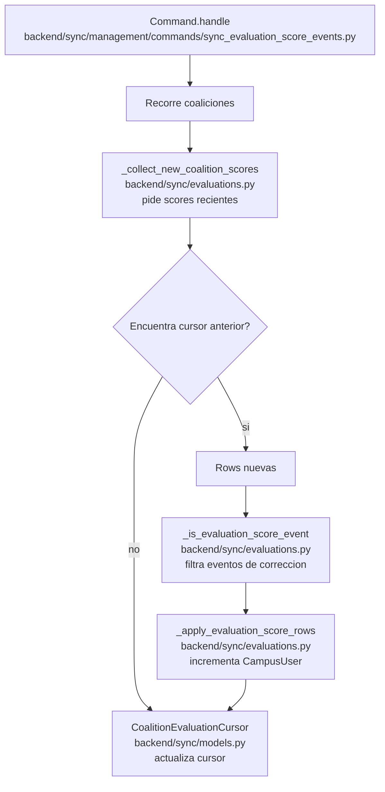
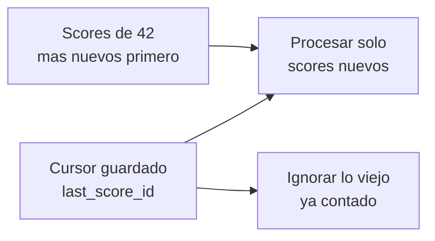
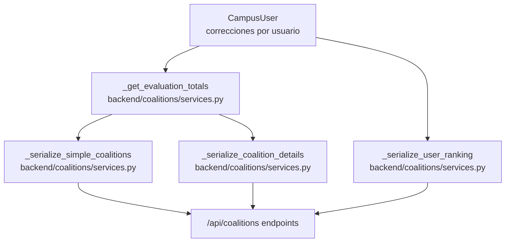
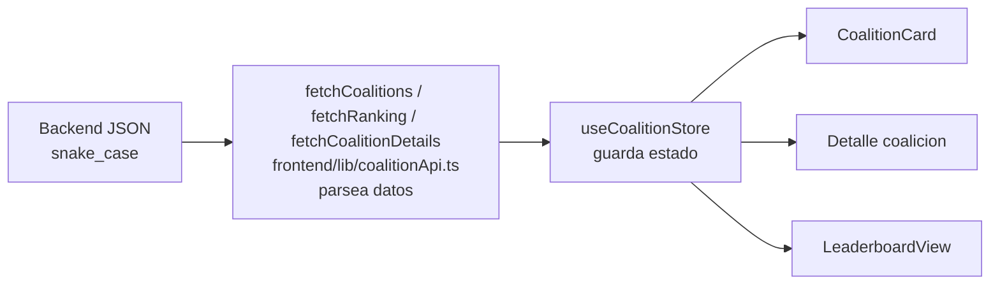

# Corrections explained

Este documento explica como funciona el numero de correcciones en el proyecto.

En el codigo, "correcciones" se guarda como:

- `evaluations_done_total`: correcciones historicas del usuario.
- `evaluations_done_current_season`: correcciones dentro de la temporada actual.
- `evaluations_synced_at`: fecha en la que se sincronizaron esos valores.

Esos campos viven en `CampusUser`, dentro de `backend/sync/models.py`.

## Idea general

El dato nace en la API de 42, se guarda en PostgreSQL y luego el backend de coalitions lo usa para mostrarlo en el frontend.



```text
42 API
-> sync/evaluations.py
-> CampusUser
-> coalitions/services.py
-> /api/coalitions/
-> frontend/lib/coalitionApi.ts
-> cards, detalle y leaderboard
```

Hay dos formas de actualizar las correcciones:

1. **Conteo completo por usuario**
   - Recuenta las correcciones de cada usuario consultando 42.
   - Es mas caro porque hace peticiones por usuario.
   - Lo ejecuta `sync_evaluation_stats`.

2. **Sync incremental por eventos**
   - Lee eventos nuevos de score por coalicion.
   - Solo incrementa contadores con correcciones nuevas.
   - Es mas barato despues de tener datos base.
   - Lo ejecuta `sync_evaluation_score_events`.



## Flujo 1: conteo completo por usuario

Este flujo sirve para llenar o refrescar los contadores desde cero.



```text
sync_evaluation_stats
-> sync_users_evaluations_done_total
-> fetch_user_evaluations_done_total
-> fetch_user_evaluations_done_current_season
-> 42 API /scale_teams/as_corrector
-> CampusUser
```

Paso a paso:

1. El comando `sync_evaluation_stats` elige que usuarios procesar.
2. Puede procesar un bloque con `limit` y `offset`.
3. Tambien puede usar `--auto-batch` para procesar muchos usuarios por bloques.
4. Para cada usuario llama a la API de 42 dos veces:
   - una vez para el total historico;
   - otra vez para la temporada actual.
5. La API de 42 devuelve el total en el header `x-total`, si esta disponible.
6. Si no hay `x-total`, el codigo cuenta las filas devueltas.
7. Se actualiza el usuario en `CampusUser`.

Campos actualizados:

```text
CampusUser.evaluations_done_total
CampusUser.evaluations_done_current_season
CampusUser.evaluations_synced_at
```

## Flujo 2: incremental por eventos de score

Este flujo sirve para no recontar todos los usuarios cada vez.



```text
sync_evaluation_score_events
-> sync_evaluations_from_coalition_scores
-> _collect_new_coalition_scores
-> _apply_evaluation_score_rows
-> CampusUser
-> CoalitionEvaluationCursor
```

Paso a paso:

1. El comando `sync_evaluation_score_events` recorre las coaliciones.
2. Para cada coalicion consulta `/v2/coalitions/{id}/scores`.
3. Los scores vienen ordenados desde los mas nuevos.
4. El codigo compara contra el cursor guardado en `CoalitionEvaluationCursor`.
5. Solo procesa rows nuevas.
6. Una row cuenta como correccion si cumple:

```text
reason == "You evaluated someone. Well done!"
coalitions_user_id existe
```

7. Agrupa los incrementos por `coalitions_user_id`.
8. Busca el `CampusUser` correspondiente.
9. Incrementa:

```text
evaluations_done_total
evaluations_done_current_season
evaluations_synced_at
```

10. Actualiza el cursor con el score mas nuevo visto.

## Por que existen los cursores

El modelo `CoalitionEvaluationCursor` evita procesar los mismos eventos varias veces.



Guarda:

```text
coalition
last_score_id
last_score_created_at
last_synced_at
```

La idea es:

```text
"Ya llegue hasta este score_id.
La proxima vez solo miro lo que sea mas nuevo."
```

Si no hay cursor todavia, el primer sync hace bootstrap:

```text
guarda el score mas nuevo
no incrementa contadores todavia
```

Eso evita duplicar correcciones antiguas cuando ya existe un snapshot importado o un conteo base.

## Archivos principales

### `backend/sync/management/commands/sync_evaluation_stats.py`

Comando para hacer conteo completo por usuario.

Funciones importantes:

| Funcion | Que hace |
|---|---|
| `Command.add_arguments` | Define opciones como `--limit`, `--offset`, `--auto-batch`, `--stale-hours` y `--only-unsynced`. |
| `Command.handle` | Elige usuarios, decide si va por bloques o por slice, llama al sync y muestra resumen. |

Cuando usarlo:

```text
Cuando quieres recalcular o rellenar datos base de correcciones.
```

### `backend/sync/management/commands/sync_evaluation_score_events.py`

Comando para sincronizacion incremental.

Funciones importantes:

| Funcion | Que hace |
|---|---|
| `Command.add_arguments` | Define opciones como `--coalition`, `--bootstrap-cursors-from-snapshot` y `--bootstrap-cursors-from-datetime`. |
| `Command.handle` | Decide si reconstruye cursores o si procesa eventos nuevos de score. |

Cuando usarlo:

```text
Cuando ya tienes contadores base y quieres sumar solo correcciones nuevas.
```

### `backend/sync/evaluations.py`

Este es el archivo principal de logica.

Funciones de conteo completo:

| Funcion | Que hace |
|---|---|
| `_request_evaluations_page` | Pide a 42 una pagina de `scale_teams/as_corrector` para un login. |
| `_fetch_evaluations_count` | Obtiene el total usando `x-total` o contando rows. |
| `fetch_user_evaluations_done_total` | Cuenta todas las correcciones historicas de un usuario. |
| `fetch_user_evaluations_done_current_season` | Cuenta correcciones del usuario dentro de la temporada actual. |
| `sync_users_evaluations_done_total` | Recorre usuarios y guarda total, temporada y fecha de sync. |
| `sync_users_evaluations_done_total_in_batches` | Helper para procesar usuarios por bloques. |

Funciones de incremental:

| Funcion | Que hace |
|---|---|
| `_request_coalition_scores_page` | Pide una pagina de scores de una coalicion. |
| `_is_evaluation_score_event` | Decide si un score row representa una correccion. |
| `_collect_new_coalition_scores` | Recoge score rows nuevas hasta encontrar el cursor anterior. |
| `_apply_evaluation_score_rows` | Incrementa contadores en `CampusUser` usando `coalitions_user_id`. |
| `sync_evaluations_from_coalition_scores` | Orquesta el incremental para todas las coaliciones. |
| `_find_evaluation_score_cursor_at_or_before` | Busca un score anterior o igual a una fecha de corte. |
| `bootstrap_evaluation_score_cursors_from_datetime` | Posiciona cursores desde un snapshot o fecha. |

Constantes importantes:

| Constante | Que significa |
|---|---|
| `CURRENT_SEASON_START` | Inicio de la temporada actual. |
| `CURRENT_SEASON_END` | Fin de la temporada actual. |
| `EVALUATION_SCORE_REASON` | Texto exacto que identifica una correccion en score events. |

## Modelos usados

### `CampusUser`

Archivo:

```text
backend/sync/models.py
```

Campos importantes:

| Campo | Que guarda |
|---|---|
| `login` | Login de 42 usado para consultar correcciones por usuario. |
| `coalitions_user_id` | ID usado para unir score events con usuarios locales. |
| `evaluations_done_total` | Total historico de correcciones. |
| `evaluations_done_current_season` | Correcciones de la temporada actual. |
| `evaluations_synced_at` | Ultima vez que se actualizo este contador. |

### `CoalitionEvaluationCursor`

Archivo:

```text
backend/sync/models.py
```

Campos importantes:

| Campo | Que guarda |
|---|---|
| `coalition` | Coalicion a la que pertenece el cursor. |
| `last_score_id` | Ultimo score procesado o marcado como frontera. |
| `last_score_created_at` | Fecha del ultimo score usado como cursor. |
| `last_synced_at` | Fecha de ultima actualizacion del cursor. |

## Como lo usa `coalitions`

Archivo:

```text
backend/coalitions/services.py
```



Funciones importantes:

| Funcion | Que hace con correcciones |
|---|---|
| `_get_evaluation_totals` | Suma `evaluations_done_total` y `evaluations_done_current_season` por coalicion. |
| `_serialize_simple_coalitions` | Mete esos totales en la respuesta de cards/lista. |
| `_serialize_coalition_details` | Mete esos totales en el detalle de una coalicion. |
| `_serialize_user_ranking` | Devuelve correcciones por usuario en el ranking. |

Endpoints:

| Endpoint | Donde aparecen correcciones |
|---|---|
| `GET /api/coalitions/` | Totales por coalicion para cards/lista. |
| `GET /api/coalitions/details/?coalition=slug` | Totales en detalle de coalicion. |
| `GET /api/coalitions/users-ranking/` | Correcciones por usuario en leaderboard. |

## Como lo usa el frontend

Archivo:

```text
frontend/lib/coalitionApi.ts
```



Funciones importantes:

| Funcion | Que hace |
|---|---|
| `fetchCoalitions` | Convierte `evaluations_done_total` a `evaluationsDoneTotal`. |
| `fetchCoalitionDetails` | Convierte las correcciones del detalle para React. |
| `fetchRanking` | Convierte las correcciones por usuario para el leaderboard. |

Pantallas/componentes:

| UI | Que muestra |
|---|---|
| `CoalitionCard` | Correcciones de temporada y total por coalicion. |
| `/coalitions/[name]` | Estadisticas de correcciones en el detalle. |
| `LeaderboardView` | Correcciones por usuario y vista de corrections. |

## Que flujo conviene mirar primero

Para entenderlo desde cero:

1. Mira `sync_evaluation_stats`.
2. Sigue `sync_users_evaluations_done_total`.
3. Mira los campos de `CampusUser`.
4. Mira `_get_evaluation_totals`.
5. Mira `fetchCoalitions`.
6. Mira `CoalitionCard`.

Despues mira el incremental:

1. `sync_evaluation_score_events`.
2. `sync_evaluations_from_coalition_scores`.
3. `_collect_new_coalition_scores`.
4. `_apply_evaluation_score_rows`.
5. `CoalitionEvaluationCursor`.

## Resumen corto

```text
Conteo completo:
42 API por login -> CampusUser

Incremental:
42 score events por coalicion -> cursor -> CampusUser

Consumo:
CampusUser -> coalitions/services.py -> API -> frontend
```
