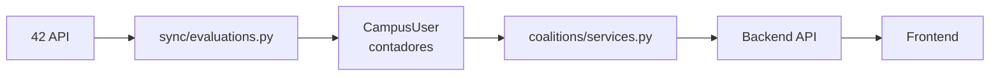
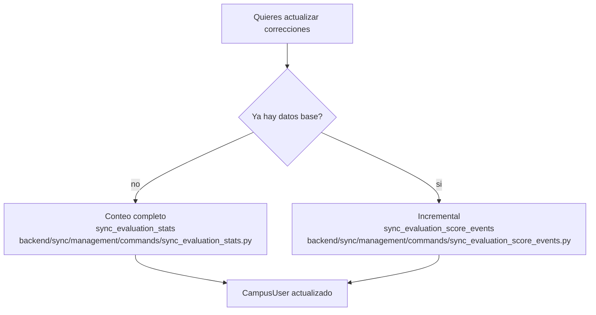
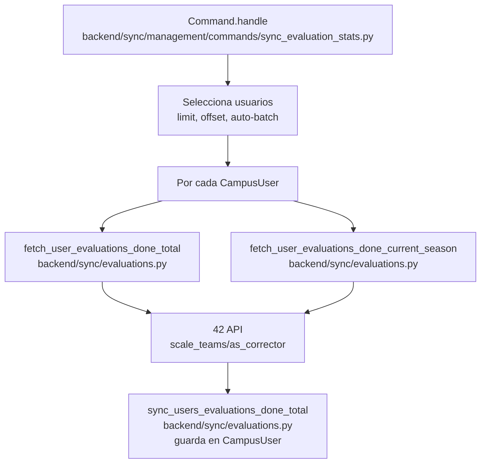
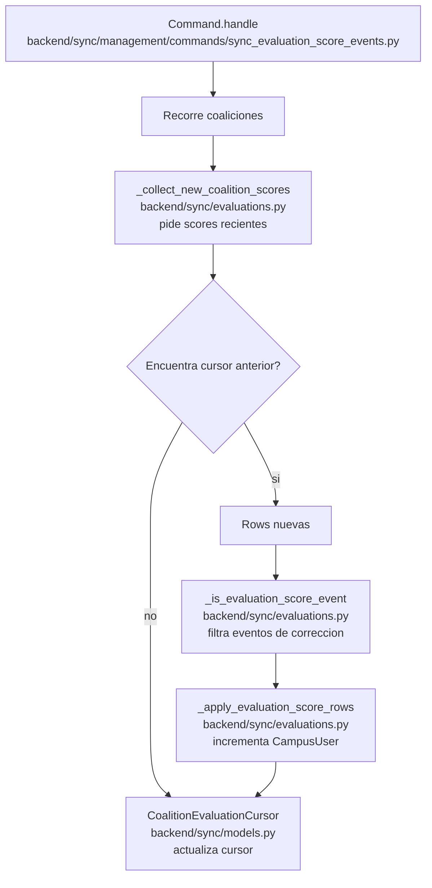
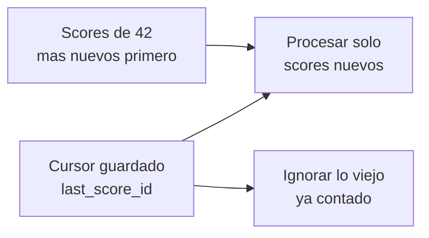
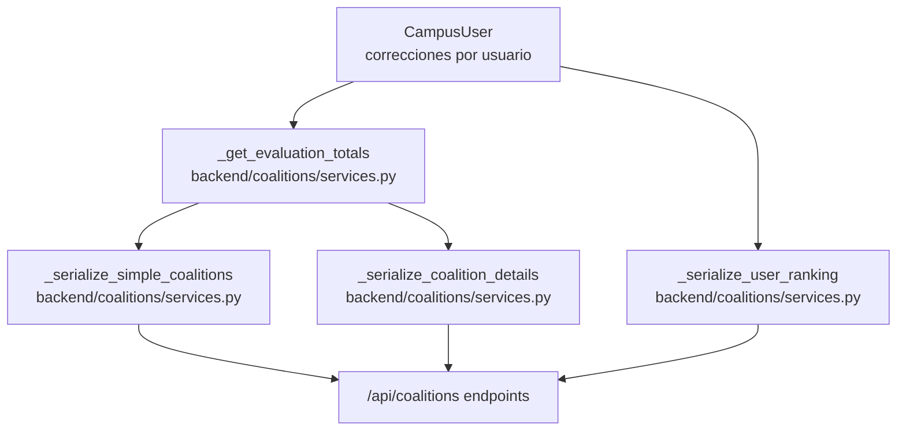
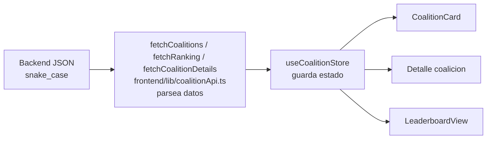

# Correcciones explicadas

Este documento explica cómo funciona el número de correcciones en el proyecto.

## Resumen general

En este repo, "correcciones" significa cuántas evaluaciones ha realizado un usuario como corrector dentro del ecosistema 42 y cómo ese dato acaba llegando al frontend.

Problema que resuelve:

- calcular y persistir una métrica que no nace en el frontend;
- exponerla en coaliciones, detalle y leaderboard;
- evitar tener que recontar todo siempre desde cero.

Archivos principales implicados:

- [backend/sync/evaluations.py](/home/aurodrig/Desktop/arepa/backend/sync/evaluations.py:15)
- [backend/sync/management/commands/sync_evaluation_stats.py](/home/aurodrig/Desktop/arepa/backend/sync/management/commands/sync_evaluation_stats.py:20)
- [backend/sync/management/commands/sync_evaluation_score_events.py](/home/aurodrig/Desktop/arepa/backend/sync/management/commands/sync_evaluation_score_events.py:18)
- [backend/sync/models.py](/home/aurodrig/Desktop/arepa/backend/sync/models.py:1)
- [backend/coalitions/services.py](/home/aurodrig/Desktop/arepa/backend/coalitions/services.py:167)
- [frontend/lib/coalitionApi.ts](/home/aurodrig/Desktop/arepa/frontend/lib/coalitionApi.ts:29)

Referencias base útiles:

- [doc/sync-42-api-explained.md](/home/aurodrig/Desktop/arepa/doc/sync-42-api-explained.md:1)
- [doc/coalitions-feature-explained.md](/home/aurodrig/Desktop/arepa/doc/coalitions-feature-explained.md:1)
- [doc/database-models-explained.md](/home/aurodrig/Desktop/arepa/doc/database-models-explained.md:603)

En el codigo, "correcciones" se guarda como:

- `evaluations_done_total`: correcciones historicas del usuario.
- `evaluations_done_current_season`: correcciones dentro de la temporada actual.
- `evaluations_synced_at`: fecha en la que se sincronizaron esos valores.

Esos campos viven en `CampusUser`, dentro de `backend/sync/models.py`.

## Idea general

El dato nace en la API de 42, se guarda en PostgreSQL y luego el backend de coalitions lo usa para mostrarlo en el frontend.



```text
42 API
-> sync/evaluations.py
-> CampusUser
-> coalitions/services.py
-> /api/coalitions/
-> frontend/lib/coalitionApi.ts
-> cards, detalle y leaderboard
```

Hay dos formas de actualizar las correcciones:

1. **Conteo completo por usuario**
   - Recuenta las correcciones de cada usuario consultando 42.
   - Es mas caro porque hace peticiones por usuario.
   - Lo ejecuta `sync_evaluation_stats`.

2. **Sync incremental por eventos**
   - Lee eventos nuevos de score por coalicion.
   - Solo incrementa contadores con correcciones nuevas.
   - Es mas barato despues de tener datos base.
   - Lo ejecuta `sync_evaluation_score_events`.

Tabla comparativa:

| Estrategia | Archivo/command | Qué consulta | Coste | Cuándo conviene |
|---|---|---|---|---|
| Conteo completo | `sync_evaluation_stats` | `/v2/users/{login}/scale_teams/as_corrector` | Alto | Bootstrap inicial, reparación o recalculo |
| Incremental | `sync_evaluation_score_events` | `/v2/coalitions/{id}/scores` | Menor tras bootstrap | Mantenimiento periódico |

Pseudocódigo local:

```text
FUNCIÓN entender_correcciones():

    SI no hay base local fiable:
        usar conteo completo por usuario

    SI ya hay base local:
        usar incremental por score events

    guardar resultados en CampusUser
    exponer esos totales mediante coalitions/services.py
```



## Flujo 1: conteo completo por usuario

Este flujo sirve para llenar o refrescar los contadores desde cero.



```text
sync_evaluation_stats
-> sync_users_evaluations_done_total
-> fetch_user_evaluations_done_total
-> fetch_user_evaluations_done_current_season
-> 42 API /scale_teams/as_corrector
-> CampusUser
```

Paso a paso:

1. El comando `sync_evaluation_stats` elige que usuarios procesar.
2. Puede procesar un bloque con `limit` y `offset`.
3. Tambien puede usar `--auto-batch` para procesar muchos usuarios por bloques.
4. Para cada usuario llama a la API de 42 dos veces:
   - una vez para el total historico;
   - otra vez para la temporada actual.
5. La API de 42 devuelve el total en el header `x-total`, si esta disponible.
6. Si no hay `x-total`, el codigo cuenta las filas devueltas.
7. Se actualiza el usuario en `CampusUser`.

Campos actualizados:

```text
CampusUser.evaluations_done_total
CampusUser.evaluations_done_current_season
CampusUser.evaluations_synced_at
```

Fragmento real corto:

Archivo:
- [backend/sync/evaluations.py](/home/aurodrig/Desktop/arepa/backend/sync/evaluations.py:166)

```python
for user in users:
    total = fetch_user_evaluations_done_total(user.login, ctx=ctx, request_interval=request_interval)
    current_season = fetch_user_evaluations_done_current_season(
        user.login,
        ctx=ctx,
        request_interval=request_interval,
    )
    user.evaluations_synced_at = synced_at
```

Qué significa:

- el conteo completo es por usuario, no por coalición;
- necesita el `login` de 42;
- actualiza histórico total y temporada actual.

Cómo se traduce al pseudocódigo:

- "recorrer usuarios";
- "preguntar a 42 por total";
- "preguntar a 42 por temporada";
- "persistir en CampusUser".

Pseudocódigo local:

```text
FUNCIÓN sync_evaluation_stats():

    seleccionar un conjunto de CampusUser con login

    PARA cada usuario:
        pedir total histórico a 42
        pedir total de temporada actual a 42
        actualizar evaluations_done_total
        actualizar evaluations_done_current_season
        actualizar evaluations_synced_at
```

## Flujo 2: incremental por eventos de score

Este flujo sirve para no recontar todos los usuarios cada vez.



```text
sync_evaluation_score_events
-> sync_evaluations_from_coalition_scores
-> _collect_new_coalition_scores
-> _apply_evaluation_score_rows
-> CampusUser
-> CoalitionEvaluationCursor
```

Paso a paso:

1. El comando `sync_evaluation_score_events` recorre las coaliciones.
2. Para cada coalicion consulta `/v2/coalitions/{id}/scores`.
3. Los scores vienen ordenados desde los mas nuevos.
4. El codigo compara contra el cursor guardado en `CoalitionEvaluationCursor`.
5. Solo procesa rows nuevas.
6. Una row cuenta como correccion si cumple:

```text
reason == "You evaluated someone. Well done!"
coalitions_user_id existe
```

7. Agrupa los incrementos por `coalitions_user_id`.
8. Busca el `CampusUser` correspondiente.
9. Incrementa:

```text
evaluations_done_total
evaluations_done_current_season
evaluations_synced_at
```

10. Actualiza el cursor con el score mas nuevo visto.

Fragmento real corto:

Archivo:
- [backend/sync/evaluations.py](/home/aurodrig/Desktop/arepa/backend/sync/evaluations.py:385)

```python
for row in score_rows:
    if not _is_evaluation_score_event(row):
        continue

    coalitions_user_id = row.get('coalitions_user_id')
    created_at = parse_datetime(row.get('created_at'))
    events_by_coalitions_user_id.setdefault(coalitions_user_id, []).append(created_at)
```

Qué significa:

- el incremental no suma cualquier score event;
- primero filtra por `reason` y por `coalitions_user_id`;
- luego agrupa eventos por usuario de coalición.

Cómo se traduce al pseudocódigo:

- "leer rows nuevas";
- "quedarse solo con las que significan corrección";
- "agruparlas por usuario";
- "sumar incrementos".

Pseudocódigo local:

```text
FUNCIÓN sync_evaluation_score_events():

    recorrer coaliciones
    cargar cursor de cada coalición
    recoger score rows nuevas desde 42

    SI es primera vez:
        bootstrapear cursor y no sumar todavía

    SI ya había cursor:
        filtrar solo rows de corrección
        agrupar por coalitions_user_id
        incrementar CampusUser
        mover cursor al score más nuevo
```

## Por que existen los cursores

El modelo `CoalitionEvaluationCursor` evita procesar los mismos eventos varias veces.



Guarda:

```text
coalition
last_score_id
last_score_created_at
last_synced_at
```

La idea es:

```text
"Ya llegue hasta este score_id.
La proxima vez solo miro lo que sea mas nuevo."
```

Si no hay cursor todavia, el primer sync hace bootstrap:

```text
guarda el score mas nuevo
no incrementa contadores todavia
```

Eso evita duplicar correcciones antiguas cuando ya existe un snapshot importado o un conteo base.

Fragmento real corto:

Archivo:
- [backend/sync/evaluations.py](/home/aurodrig/Desktop/arepa/backend/sync/evaluations.py:338)

```python
if cursor.last_score_id is None:
    return {
        'bootstrapped': True,
        'new_rows': [],
        'newest_score_id': newest_score_id,
        'newest_created_at': newest_created_at,
    }
```

Qué significa:

- cuando no hay cursor todavía, el sistema no intenta reconstruir todo el pasado;
- marca una frontera inicial y deja el incremental listo para la siguiente ejecución.

Pseudocódigo local:

```text
FUNCIÓN bootstrap_cursor_si_falta(cursor, newest_score):

    SI cursor.last_score_id es None:
        guardar newest_score como frontera
        no incrementar contadores todavía
        devolver bootstrapped = true
```

## Archivos principales

### `backend/sync/management/commands/sync_evaluation_stats.py`

Comando para hacer conteo completo por usuario.

Funciones importantes:

| Funcion | Que hace |
|---|---|
| `Command.add_arguments` | Define opciones como `--limit`, `--offset`, `--auto-batch`, `--stale-hours` y `--only-unsynced`. |
| `Command.handle` | Elige usuarios, decide si va por bloques o por slice, llama al sync y muestra resumen. |

Cuando usarlo:

```text
Cuando quieres recalcular o rellenar datos base de correcciones.
```

### `backend/sync/management/commands/sync_evaluation_score_events.py`

Comando para sincronizacion incremental.

Funciones importantes:

| Funcion | Que hace |
|---|---|
| `Command.add_arguments` | Define opciones como `--coalition`, `--bootstrap-cursors-from-snapshot` y `--bootstrap-cursors-from-datetime`. |
| `Command.handle` | Decide si reconstruye cursores o si procesa eventos nuevos de score. |

Cuando usarlo:

```text
Cuando ya tienes contadores base y quieres sumar solo correcciones nuevas.
```

### `backend/sync/evaluations.py`

Este es el archivo principal de logica.

Funciones de conteo completo:

| Funcion | Que hace |
|---|---|
| `_request_evaluations_page` | Pide a 42 una pagina de `scale_teams/as_corrector` para un login. |
| `_fetch_evaluations_count` | Obtiene el total usando `x-total` o contando rows. |
| `fetch_user_evaluations_done_total` | Cuenta todas las correcciones historicas de un usuario. |
| `fetch_user_evaluations_done_current_season` | Cuenta correcciones del usuario dentro de la temporada actual. |
| `sync_users_evaluations_done_total` | Recorre usuarios y guarda total, temporada y fecha de sync. |
| `sync_users_evaluations_done_total_in_batches` | Helper para procesar usuarios por bloques. |

Funciones de incremental:

| Funcion | Que hace |
|---|---|
| `_request_coalition_scores_page` | Pide una pagina de scores de una coalicion. |
| `_is_evaluation_score_event` | Decide si un score row representa una correccion. |
| `_collect_new_coalition_scores` | Recoge score rows nuevas hasta encontrar el cursor anterior. |
| `_apply_evaluation_score_rows` | Incrementa contadores en `CampusUser` usando `coalitions_user_id`. |
| `sync_evaluations_from_coalition_scores` | Orquesta el incremental para todas las coaliciones. |
| `_find_evaluation_score_cursor_at_or_before` | Busca un score anterior o igual a una fecha de corte. |
| `bootstrap_evaluation_score_cursors_from_datetime` | Posiciona cursores desde un snapshot o fecha. |

Constantes importantes:

| Constante | Que significa |
|---|---|
| `CURRENT_SEASON_START` | Inicio de la temporada actual. |
| `CURRENT_SEASON_END` | Fin de la temporada actual. |
| `EVALUATION_SCORE_REASON` | Texto exacto que identifica una correccion en score events. |

## Modelos usados

### `CampusUser`

Archivo:

```text
backend/sync/models.py
```

Campos importantes:

| Campo | Que guarda |
|---|---|
| `login` | Login de 42 usado para consultar correcciones por usuario. |
| `coalitions_user_id` | ID usado para unir score events con usuarios locales. |
| `evaluations_done_total` | Total historico de correcciones. |
| `evaluations_done_current_season` | Correcciones de la temporada actual. |
| `evaluations_synced_at` | Ultima vez que se actualizo este contador. |

### `CoalitionEvaluationCursor`

Archivo:

```text
backend/sync/models.py
```

Campos importantes:

| Campo | Que guarda |
|---|---|
| `coalition` | Coalicion a la que pertenece el cursor. |
| `last_score_id` | Ultimo score procesado o marcado como frontera. |
| `last_score_created_at` | Fecha del ultimo score usado como cursor. |
| `last_synced_at` | Fecha de ultima actualizacion del cursor. |

## Como lo usa `coalitions`

Archivo:

```text
backend/coalitions/services.py
```



Funciones importantes:

| Funcion | Que hace con correcciones |
|---|---|
| `_get_evaluation_totals` | Suma `evaluations_done_total` y `evaluations_done_current_season` por coalicion. |
| `_serialize_simple_coalitions` | Mete esos totales en la respuesta de cards/lista. |
| `_serialize_coalition_details` | Mete esos totales en el detalle de una coalicion. |
| `_serialize_user_ranking` | Devuelve correcciones por usuario en el ranking. |

Endpoints:

| Endpoint | Donde aparecen correcciones |
|---|---|
| `GET /api/coalitions/` | Totales por coalicion para cards/lista. |
| `GET /api/coalitions/details/?coalition=slug` | Totales en detalle de coalicion. |
| `GET /api/coalitions/users-ranking/` | Correcciones por usuario en leaderboard. |

Fragmento real corto:

Archivo:
- [backend/coalitions/services.py](/home/aurodrig/Desktop/arepa/backend/coalitions/services.py:167)

```python
totals = CampusUser.objects.filter(coalition_slug=coalition_slug).aggregate(
    evaluations_done_total=Sum('evaluations_done_total'),
    evaluations_done_current_season=Sum('evaluations_done_current_season'),
)
return {
    'evaluations_done_total': totals['evaluations_done_total'] or 0,
    'evaluations_done_current_season': totals['evaluations_done_current_season'] or 0,
}
```

Qué significa:

- `coalitions` no recalcula correcciones consultando 42;
- suma lo que ya está persistido en `CampusUser`;
- por eso la frescura del frontend depende del sync previo.

## Como lo usa el frontend

Archivo:

```text
frontend/lib/coalitionApi.ts
```



Funciones importantes:

| Funcion | Que hace |
|---|---|
| `fetchCoalitions` | Convierte `evaluations_done_total` a `evaluationsDoneTotal`. |
| `fetchCoalitionDetails` | Convierte las correcciones del detalle para React. |
| `fetchRanking` | Convierte las correcciones por usuario para el leaderboard. |

Pantallas/componentes:

| UI | Que muestra |
|---|---|
| `CoalitionCard` | Correcciones de temporada y total por coalicion. |
| `/coalitions/[name]` | Estadisticas de correcciones en el detalle. |
| `LeaderboardView` | Correcciones por usuario y vista de corrections. |

## Que flujo conviene mirar primero

Para entenderlo desde cero:

1. Mira `sync_evaluation_stats`.
2. Sigue `sync_users_evaluations_done_total`.
3. Mira los campos de `CampusUser`.
4. Mira `_get_evaluation_totals`.
5. Mira `fetchCoalitions`.
6. Mira `CoalitionCard`.

Despues mira el incremental:

1. `sync_evaluation_score_events`.
2. `sync_evaluations_from_coalition_scores`.
3. `_collect_new_coalition_scores`.
4. `_apply_evaluation_score_rows`.
5. `CoalitionEvaluationCursor`.

## Resumen corto

```text
Conteo completo:
42 API por login -> CampusUser

Incremental:
42 score events por coalicion -> cursor -> CampusUser

Consumo:
CampusUser -> coalitions/services.py -> API -> frontend
```

## Sintaxis importante

### `aggregate(Sum(...))`

Archivo de referencia:
- [backend/coalitions/services.py](/home/aurodrig/Desktop/arepa/backend/coalitions/services.py:167)

Qué significa:

- sumar un campo sobre varios `CampusUser` para obtener totales por coalición.

Error común:

- creer que el total de correcciones vive guardado en `Coalition`. No: se recalcula agregando usuarios.

### `bulk_update(...)`

Archivo de referencia:
- [backend/sync/evaluations.py](/home/aurodrig/Desktop/arepa/backend/sync/evaluations.py:436)

Qué significa:

- actualizar varios `CampusUser` de una vez tras agrupar incrementos.

Error común:

- hacer `save()` individual en bucles grandes cuando ya tienes una colección de usuarios mutados.

### `get_or_create(...)`

Archivo de referencia:
- [backend/sync/evaluations.py](/home/aurodrig/Desktop/arepa/backend/sync/evaluations.py:465)

Qué significa:

- asegurar que cada coalición tenga su `CoalitionEvaluationCursor`.

Error común:

- asumir que todos los cursores existen antes del primer sync incremental.

### `Q(...)`

Archivo de referencia:
- [backend/coalitions/services.py](/home/aurodrig/Desktop/arepa/backend/coalitions/services.py:262)

Qué significa:

- construir filtros compuestos, por ejemplo por `slug`, nombre o ID numérico.

### `BaseCommand.add_arguments`

Archivo de referencia:
- [backend/sync/management/commands/sync_evaluation_stats.py](/home/aurodrig/Desktop/arepa/backend/sync/management/commands/sync_evaluation_stats.py:29)

Qué significa:

- declarar flags CLI como `--limit`, `--offset`, `--auto-batch` o `--coalition`.

## Debugging paso a paso

### 1. Revisar si el conteo base existe

Comprobar:

- si `CampusUser.evaluations_done_total` está casi todo a cero;
- si `evaluations_synced_at` nunca se ha rellenado.

Si ocurre eso:

- el incremental por eventos no te salvará por sí solo;
- primero necesitas un conteo base o un bootstrap coherente.

### 2. Revisar `coalitions_user_id`

El incremental depende de este campo.

Si está vacío o mal sincronizado:

- el evento de score puede existir;
- pero no habrá forma de enlazarlo con el `CampusUser` correcto.

Referencia:
- [backend/sync/evaluations.py](/home/aurodrig/Desktop/arepa/backend/sync/evaluations.py:403)

### 3. Revisar el texto exacto del evento

El filtro actual exige:

```text
reason == "You evaluated someone. Well done!"
```

Si 42 cambia ese texto:

- el incremental dejaría de contar correcciones nuevas aunque sí descargue rows.

Referencia:
- [backend/sync/evaluations.py](/home/aurodrig/Desktop/arepa/backend/sync/evaluations.py:19)
- [backend/sync/evaluations.py](/home/aurodrig/Desktop/arepa/backend/sync/evaluations.py:302)

### 4. Revisar cursores

Comprobar para cada coalición:

- `last_score_id`
- `last_score_created_at`
- `last_synced_at`

Si el cursor quedó demasiado adelantado:

- perderás eventos;

si quedó demasiado retrasado:

- podrás duplicar o revisar demasiadas rows.

### 5. Revisar bootstrap

Si el comando hizo bootstrap:

- puede haber movido el cursor;
- pero no habrá incrementado contadores aún.

Eso es correcto, no un bug.

### 6. Probar el consumo backend

Aunque el sync haya ido bien, revisa:

- `/api/coalitions/`
- `/api/coalitions/details/?coalition=<slug>`
- `/api/coalitions/users-ranking/`

Si ahí no aparecen correcciones:

- el problema ya no está en React;
- probablemente está en agregación backend o en datos base.

### 7. Probar el consumo frontend

Revisar:

- [frontend/lib/coalitionApi.ts](/home/aurodrig/Desktop/arepa/frontend/lib/coalitionApi.ts:133)
- [frontend/app/leaderboard/page.tsx](/home/aurodrig/Desktop/arepa/frontend/app/leaderboard/page.tsx:12)
- [frontend/app/coalitions/page.tsx](/home/aurodrig/Desktop/arepa/frontend/app/coalitions/page.tsx:6)

Qué puede fallar:

- parsing `snake_case -> camelCase`;
- filtros de leaderboard;
- rendering que espera datos no nulos.

## Comandos útiles

### Conteo completo

```bash
docker compose -f docker-compose.dev.yml exec backend python manage.py sync_evaluation_stats --limit 20
```

### Conteo completo por bloques

```bash
docker compose -f docker-compose.dev.yml exec backend python manage.py sync_evaluation_stats --auto-batch --limit 50
```

### Solo usuarios stale

```bash
docker compose -f docker-compose.dev.yml exec backend python manage.py sync_evaluation_stats --stale-hours 24
```

### Incremental de correcciones

```bash
docker compose -f docker-compose.dev.yml exec backend python manage.py sync_evaluation_score_events
```

### Bootstrap de cursores desde snapshot

```bash
docker compose -f docker-compose.dev.yml exec backend python manage.py sync_evaluation_score_events --bootstrap-cursors-from-snapshot
```

### Bootstrap de cursores desde fecha manual

```bash
docker compose -f docker-compose.dev.yml exec backend python manage.py sync_evaluation_score_events --bootstrap-cursors-from-datetime 2026-05-01T00:00:00Z
```

## Qué puedo decir en evaluación

> Las correcciones no se calculan en frontend. Se sincronizan desde 42 y se guardan en `CampusUser`.

> Hay dos estrategias: conteo completo por usuario e incremental por score events de coalición.

> El incremental necesita `CoalitionEvaluationCursor` para no reprocesar el pasado y `coalitions_user_id` para enlazar eventos con usuarios.

> Las pantallas de coaliciones y leaderboard solo agregan o muestran esos datos ya persistidos.

## Checklist de comprensión

- [ ] Entiendo la diferencia entre conteo completo e incremental
- [ ] Entiendo qué campos de `CampusUser` almacenan correcciones
- [ ] Entiendo el papel de `CoalitionEvaluationCursor`
- [ ] Entiendo por qué el bootstrap de cursor no incrementa todavía
- [ ] Entiendo cómo `coalitions/services.py` suma correcciones
- [ ] Entiendo qué parte del frontend solo consume datos ya preparados

## Pseudocódigo global del flujo de correcciones

```text
FUNCIÓN correcciones_end_to_end():

    obtener datos base de correcciones desde 42
    guardar totals y current_season en CampusUser

    después:
        leer score events nuevos por coalición
        filtrar solo eventos de corrección
        enlazar con CampusUser mediante coalitions_user_id
        incrementar contadores
        mover CoalitionEvaluationCursor

    más tarde:
        coalitions/services.py agrega esos valores
        backend expone JSON
        frontend renderiza cards, detalle y leaderboard
```

## Quiz final tipo test (25 preguntas)

### 1. ¿Dónde se guardan localmente los contadores de correcciones por usuario?
- A. En `Coalition`
- B. En `UserPreferences`
- C. En `CampusUser`
- D. En `SyncMetadata`
- Respuesta correcta: C
- Explicación: los campos de correcciones viven en `CampusUser`.

### 2. ¿Qué campo guarda el total histórico de correcciones?
- A. `evaluations_done_total`
- B. `coalition_user_score`
- C. `projects_delivered_total`
- D. `coalition_rank`
- Respuesta correcta: A
- Explicación: ese es el contador global acumulado.

### 3. ¿Qué campo guarda las correcciones de la temporada actual?
- A. `last_synced_at`
- B. `evaluations_done_current_season`
- C. `correction_points`
- D. `general_rank`
- Respuesta correcta: B
- Explicación: separa histórico total y temporada vigente.

### 4. ¿Qué comando hace el conteo completo por usuario?
- A. `sync_project_stats`
- B. `sync_campus_users`
- C. `sync_evaluation_stats`
- D. `import_evaluations_snapshot`
- Respuesta correcta: C
- Explicación: ese command recorre usuarios y recalcula.

### 5. ¿Qué comando hace el incremental por score events?
- A. `sync_evaluation_score_events`
- B. `sync_users`
- C. `status_check`
- D. `createsuperuser`
- Respuesta correcta: A
- Explicación: ese command usa cursores por coalición.

### 6. ¿Qué endpoint de 42 usa el conteo completo por usuario?
- A. `/v2/me`
- B. `/v2/users/{login}/scale_teams/as_corrector`
- C. `/v2/coalitions/{id}/users`
- D. `/oauth/token`
- Respuesta correcta: B
- Explicación: ahí cuenta evaluaciones hechas como corrector.

### 7. ¿Qué endpoint de 42 usa el incremental?
- A. `/v2/coalitions/{id}/scores`
- B. `/v2/me`
- C. `/v2/users/{id}`
- D. `/oauth/authorize`
- Respuesta correcta: A
- Explicación: el incremental lee score events de coalición.

### 8. ¿Qué problema resuelve `CoalitionEvaluationCursor`?
- A. Renderizar CSS
- B. Evitar reprocesar eventos antiguos
- C. Guardar refresh token
- D. Crear snapshots de score
- Respuesta correcta: B
- Explicación: marca hasta qué score ya se ha sincronizado.

### 9. ¿Qué ocurre si no existe cursor todavía?
- A. Siempre se duplican correcciones
- B. El sistema bootstrapea la frontera y no suma todavía
- C. El backend se cae
- D. El frontend deja de funcionar
- Respuesta correcta: B
- Explicación: así evita contar pasado desconocido dos veces.

### 10. ¿Qué condición identifica hoy un score event de corrección?
- A. Que tenga `type=project`
- B. Que `reason` coincida con el texto esperado y exista `coalitions_user_id`
- C. Que el usuario tenga avatar
- D. Que el score sea negativo
- Respuesta correcta: B
- Explicación: el filtro actual depende de esas dos condiciones.

### 11. ¿Qué campo enlaza el incremental con el usuario local correcto?
- A. `login`
- B. `email`
- C. `coalitions_user_id`
- D. `username`
- Respuesta correcta: C
- Explicación: ese ID une eventos de score y `CampusUser`.

### 12. ¿Qué hace `_apply_evaluation_score_rows`?
- A. Crea coaliciones nuevas
- B. Incrementa contadores locales a partir de rows nuevas
- C. Borra cursores
- D. Sirve el endpoint `/status`
- Respuesta correcta: B
- Explicación: es la pieza que convierte eventos en contadores persistidos.

### 13. ¿Qué función agrega correcciones por coalición para las APIs de coalitions?
- A. `_get_project_totals`
- B. `_get_evaluation_totals`
- C. `_get_last_time_update`
- D. `_serialize_simple_users`
- Respuesta correcta: B
- Explicación: suma `evaluations_done_total` y `current_season` sobre `CampusUser`.

### 14. ¿Qué vista del frontend puede mostrar correcciones por usuario?
- A. `/status`
- B. `/leaderboard?view=corrections`
- C. `/offline`
- D. `/login`
- Respuesta correcta: B
- Explicación: el leaderboard tiene una pestaña específica de correcciones.

### 15. ¿Qué riesgo existe si cambia el texto exacto de `reason` en 42?
- A. Ninguno
- B. El incremental puede dejar de detectar correcciones nuevas
- C. Se borran snapshots
- D. El login falla
- Respuesta correcta: B
- Explicación: el filtro actual compara contra un string exacto.

### 16. ¿Qué comando conviene antes del incremental si la base está vacía?
- A. `make front-up`
- B. `sync_evaluation_stats`
- C. `make shell`
- D. `db-backup`
- Respuesta correcta: B
- Explicación: primero necesitas datos base fiables.

### 17. ¿Qué indica `evaluations_synced_at`?
- A. El momento del login OAuth
- B. La última vez que se sincronizó el contador de ese usuario
- C. La fecha del último backup
- D. El último render de React
- Respuesta correcta: B
- Explicación: sirve como marca temporal por usuario.

### 18. ¿Qué técnica usa el incremental para actualizar varios usuarios a la vez?
- A. `bulk_update`
- B. `prefetch_related`
- C. `select_for_update`
- D. `delete`
- Respuesta correcta: A
- Explicación: agrupa cambios y reduce escrituras repetidas.

### 19. ¿Qué lectura es correcta sobre el frontend?
- A. Calcula correcciones desde cero
- B. Solo consume el JSON ya preparado por backend
- C. Consulta la API 42 directamente
- D. Guarda cursores
- Respuesta correcta: B
- Explicación: la lógica pesada está en backend y sync.

### 20. ¿Qué pasa si `coalitions_user_id` no está sincronizado?
- A. Todo sigue bien
- B. El incremental no podrá asignar eventos al usuario correcto
- C. Solo falla CSS
- D. Solo falla `/status`
- Respuesta correcta: B
- Explicación: perderías el enlace entre evento y `CampusUser`.

### 21. ¿Qué modo es más caro en número de peticiones?
- A. Incremental por score events
- B. Conteo completo por usuario
- C. Ninguno, cuestan igual
- D. El frontend
- Respuesta correcta: B
- Explicación: consulta 42 por usuario y por rango.

### 22. ¿Qué hace el flag `--auto-batch`?
- A. Activa service worker
- B. Procesa usuarios por bloques sin cargar todo de golpe
- C. Fuerza logout
- D. Crea snapshots
- Respuesta correcta: B
- Explicación: trocea el recálculo completo.

### 23. ¿Qué endpoint backend termina sirviendo correcciones agregadas por coalición?
- A. `/api/status/`
- B. `/api/coalitions/`
- C. `/api/auth/logout/`
- D. `/api/auth/token/refresh/`
- Respuesta correcta: B
- Explicación: la lista de coaliciones ya incluye esos totales.

### 24. ¿Qué significa que el bootstrap de cursor “no es un bug”?
- A. Que no hay que revisar nada nunca
- B. Que puede mover el cursor sin incrementar todavía y eso es el comportamiento previsto
- C. Que no hace falta base de datos
- D. Que el comando no usa 42
- Respuesta correcta: B
- Explicación: el objetivo es fijar la frontera inicial de forma segura.

### 25. ¿Cuál es el flujo conceptual correcto?
- A. Frontend -> 42 -> cursor -> Makefile
- B. 42 -> sync/evaluations.py -> CampusUser -> coalitions/services.py -> API -> frontend
- C. Status -> OAuth -> snapshots
- D. Docker -> CSS -> JWT
- Respuesta correcta: B
- Explicación: ese es el recorrido real del dato de correcciones.
