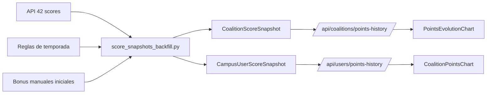
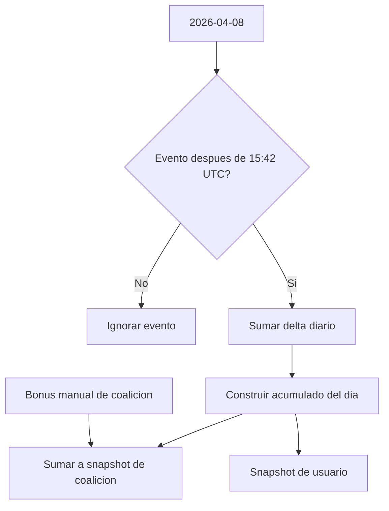
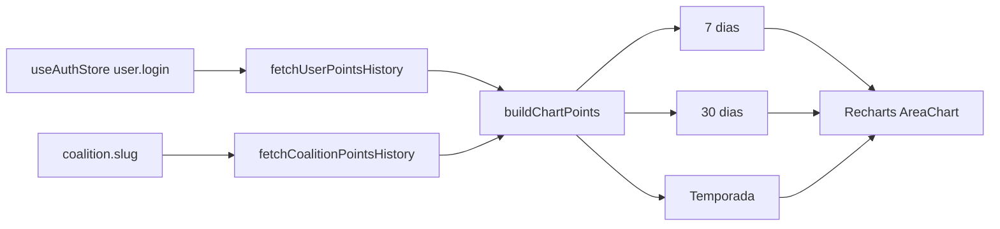

# Historial diario de puntos y backfill de snapshots

## 1. Resumen general

Este documento explica el trabajo hecho para:

- reconstruir snapshots diarios de puntos desde el inicio de temporada;
- corregir el primer día de temporada con su corte horario real;
- añadir los bonus manuales iniciales de coalición;
- exponer el histórico por API para usuario y coalición;
- pintar ese histórico real en la UI.

La idea central es esta:

- la API de 42 no ofrece un endpoint directo tipo "dame los puntos diarios ya cerrados";
- sí expone eventos de score históricos;
- por eso el proyecto necesita reconstruir una serie diaria local y persistirla en PostgreSQL.

## 2. Qué problema resolvía este cambio

Antes de este trabajo:

- los gráficos de puntos del frontend usaban datos mock;
- existían snapshots en el modelo, pero no había un backfill completo desde el inicio de temporada;
- el `2026-04-08` tenía una condición especial: la temporada no arrancó a medianoche;
- además, las coaliciones recibieron puntos manuales el primer día que no salen de los eventos normales de `scores`.

Por tanto, había dos huecos distintos:

1. faltaba histórico diario real;
2. el histórico del primer día no podía salir solo de los eventos automáticos.

## 3. Fecha de inicio y lógica temporal

La temporada actual se fijó en:

- inicio: `2026-04-08T15:42:00Z`
- fin: `2026-10-08T10:00:00Z`

Eso equivale a:

- inicio local Madrid: `2026-04-08 17:42`

Archivo:

- [backend/sync/season.py](/home/aurodrig/Desktop/arepa/backend/sync/season.py:1)

### Regla importante del primer día

El `2026-04-08` no se toma como "día entero".  
Solo cuentan eventos con:

```text
created_at >= 2026-04-08T15:42:00Z
```

Desde `2026-04-09` en adelante, el backfill trabaja por día natural completo.

## 4. Modelos implicados

Los modelos relevantes viven en:

- [backend/sync/models.py](/home/aurodrig/Desktop/arepa/backend/sync/models.py:5)

### `CoalitionScoreSnapshot`

Representa el estado diario de una coalición:

- `snapshot_date`
- `total_score`
- `campus_rank`

Hay un registro por:

- coalición
- día

### `CampusUserScoreSnapshot`

Representa el estado diario de un usuario:

- `snapshot_date`
- `coalition_user_score`
- `coalition_user_rank`
- `campus_user_rank`

Hay un registro por:

- usuario
- día

## 5. Diagrama general del flujo



### Cómo leer este diagrama

- `API 42 scores` aporta eventos históricos, no snapshots cerrados.
- `Reglas de temporada` decide desde cuándo cuentan los eventos.
- `Bonus manuales iniciales` corrige el arranque real de las coaliciones.
- El resultado persistido vive en snapshots locales.
- La UI consume esos snapshots, no la API de 42.

## 6. Lógica del backfill

Archivo principal:

- [backend/sync/score_snapshots_backfill.py](/home/aurodrig/Desktop/arepa/backend/sync/score_snapshots_backfill.py:1)

Comando:

- [backend/sync/management/commands/backfill_daily_score_snapshots.py](/home/aurodrig/Desktop/arepa/backend/sync/management/commands/backfill_daily_score_snapshots.py:1)

### Qué hace el backfill

1. carga coaliciones locales;
2. identifica usuarios locales con `coalitions_user_id`;
3. descarga eventos de score históricos por coalición desde 42;
4. filtra los eventos para que respeten la ventana temporal de la temporada;
5. acumula deltas por día;
6. convierte esos deltas en totales acumulados diarios;
7. aplica bonus manuales de coalición desde el primer día;
8. calcula rankings diarios;
9. hace `bulk_create(..., update_conflicts=True)` sobre snapshots.

### Por qué se reconstruye por acumulado

Cada evento de `scores` trae un `value` y una fecha.  
Eso permite hacer esta transformación:

```text
eventos del día -> suma diaria -> acumulado hasta ese día -> snapshot diario
```

No se está preguntando a 42 "cuánto tenía el usuario ese día".  
Se está recomponiendo el total usando el historial de eventos accesible.

## 7. Bonus manuales del primer día

Los bonus manuales iniciales quedaron fijados así:

- `tiamant`: `3000`
- `zefiria`: `3500`
- `marventis`: `9500`
- `ignisaria`: `4000`

Se definieron en:

- [backend/sync/season.py](/home/aurodrig/Desktop/arepa/backend/sync/season.py:1)

### Regla de negocio

Esos puntos:

- se dieron el primer día;
- se asignan directamente a la coalición;
- no se reparten entre usuarios;
- no salen del stream normal de `scores` que usa el backfill.

### Consecuencia técnica

El backfill los inyecta solo en el acumulado de coalición, nunca en el de usuario.

## 8. Diagrama de la lógica del primer día



### Qué significa

- el filtro horario afecta a los eventos;
- el bonus manual no depende del stream de eventos;
- por eso coalición y usuario no arrancan necesariamente con el mismo total lógico.

## 9. Endpoints agregados

Se añadieron dos endpoints autenticados.

### Coalición

Ruta:

- `/api/coalitions/points-history/?coalition=<slug>`

Archivos:

- [backend/coalitions/views.py](/home/aurodrig/Desktop/arepa/backend/coalitions/views.py:77)
- [backend/coalitions/services.py](/home/aurodrig/Desktop/arepa/backend/coalitions/services.py:243)
- [backend/coalitions/urls.py](/home/aurodrig/Desktop/arepa/backend/coalitions/urls.py:1)

Qué devuelve:

- identidad básica de la coalición;
- serie ordenada por `snapshot_date`;
- puntos diarios acumulados;
- `campus_rank` diario.

Ejemplo conceptual:

```json
{
  "coalition": {
    "id": 1,
    "name": "Marventis",
    "slug": "marventis",
    "color": "#00ffaa"
  },
  "history": [
    { "date": "2026-04-08", "points": 12748, "campus_rank": 1 },
    { "date": "2026-04-09", "points": 13420, "campus_rank": 1 }
  ]
}
```

### Usuario

Ruta:

- `/api/users/points-history/?login=<login>`

Archivos:

- [backend/users/views.py](/home/aurodrig/Desktop/arepa/backend/users/views.py:40)
- [backend/users/services.py](/home/aurodrig/Desktop/arepa/backend/users/services.py:62)
- [backend/users/urls.py](/home/aurodrig/Desktop/arepa/backend/users/urls.py:1)

Qué devuelve:

- identidad básica del usuario;
- serie diaria ordenada;
- puntos del usuario en coalición;
- rank en coalición;
- rank global del campus.

## 10. Integración del frontend

Archivos principales:

- [frontend/lib/userApi.ts](/home/aurodrig/Desktop/arepa/frontend/lib/userApi.ts:263)
- [frontend/lib/coalitionApi.ts](/home/aurodrig/Desktop/arepa/frontend/lib/coalitionApi.ts:237)
- [frontend/lib/pointsHistory.ts](/home/aurodrig/Desktop/arepa/frontend/lib/pointsHistory.ts:1)
- [frontend/components/CoalitionPointsChart.tsx](/home/aurodrig/Desktop/arepa/frontend/components/CoalitionPointsChart.tsx:1)
- [frontend/app/coalitions/_components/PointsEvolutionChart.tsx](/home/aurodrig/Desktop/arepa/frontend/app/coalitions/_components/PointsEvolutionChart.tsx:1)

### Qué se cambió en la UI

Se reemplazaron los arrays mock por fetch real autenticado:

- el home pide el histórico del usuario autenticado;
- el detalle de coalición pide el histórico de la coalición actual;
- ambos gráficos muestran series diarias ya persistidas;
- se añadieron estados de carga, error y vacío.

### Por qué existe `frontend/lib/pointsHistory.ts`

Ese helper separa la lógica de presentación del fetch:

- parsea fechas `YYYY-MM-DD` sin desplazamiento por timezone del navegador;
- transforma la serie cruda en puntos aptos para Recharts;
- recorta la serie según la pestaña seleccionada.

## 11. Lógica de pintado del gráfico

Las pestañas significan:

- `7 Días`: últimos 7 snapshots diarios;
- `30 Días`: últimos 30 snapshots diarios;
- `Temporada`: toda la serie disponible desde temporada.

Importante:

- no hay agregación semanal o mensual nueva;
- el gráfico sigue siendo diario en todos los casos;
- lo que cambia es la ventana visible.

### Diagrama de UI



## 12. Validaciones realizadas

Se validó lo siguiente:

- el backfill real se ejecutó contra 42;
- se verificó el `2026-04-08` con bonus manuales incluidos en coaliciones;
- se confirmó que los bonus no contaminan snapshots de usuario;
- se añadieron tests para los endpoints de historial;
- se mantuvo test focalizado del backfill.

Tests relevantes:

- [backend/sync/tests.py](/home/aurodrig/Desktop/arepa/backend/sync/tests.py:1)
- [backend/coalitions/tests.py](/home/aurodrig/Desktop/arepa/backend/coalitions/tests.py:1)
- [backend/users/tests.py](/home/aurodrig/Desktop/arepa/backend/users/tests.py:1)

## 13. Decisiones de diseño importantes

### 1. No consultar 42 en tiempo real desde la UI

Razón:

- el frontend necesita velocidad, consistencia y auth local;
- además la serie diaria es un dato derivado, no un recurso listo en 42.

### 2. Persistir snapshots en base

Razón:

- simplifica comparativas;
- evita recomputar toda la historia en cada request;
- deja el frontend leyendo una API estable.

### 3. Tratar el primer día como caso especial

Razón:

- el arranque real de temporada no fue a medianoche;
- además hubo bonus manuales que no salen del stream normal.

### 4. No repartir bonus manuales entre usuarios

Razón:

- eran puntos dados a la coalición, no a miembros concretos;
- repartirlos artificialmente habría falseado el ranking de usuarios.

## 14. Archivos añadidos o modificados

### Backend

- [backend/sync/season.py](/home/aurodrig/Desktop/arepa/backend/sync/season.py:1)
- [backend/sync/score_snapshots_backfill.py](/home/aurodrig/Desktop/arepa/backend/sync/score_snapshots_backfill.py:1)
- [backend/sync/management/commands/backfill_daily_score_snapshots.py](/home/aurodrig/Desktop/arepa/backend/sync/management/commands/backfill_daily_score_snapshots.py:1)
- [backend/coalitions/services.py](/home/aurodrig/Desktop/arepa/backend/coalitions/services.py:243)
- [backend/coalitions/views.py](/home/aurodrig/Desktop/arepa/backend/coalitions/views.py:77)
- [backend/coalitions/urls.py](/home/aurodrig/Desktop/arepa/backend/coalitions/urls.py:1)
- [backend/users/services.py](/home/aurodrig/Desktop/arepa/backend/users/services.py:62)
- [backend/users/views.py](/home/aurodrig/Desktop/arepa/backend/users/views.py:40)
- [backend/users/urls.py](/home/aurodrig/Desktop/arepa/backend/users/urls.py:1)

### Frontend

- [frontend/lib/userApi.ts](/home/aurodrig/Desktop/arepa/frontend/lib/userApi.ts:263)
- [frontend/lib/coalitionApi.ts](/home/aurodrig/Desktop/arepa/frontend/lib/coalitionApi.ts:237)
- [frontend/lib/pointsHistory.ts](/home/aurodrig/Desktop/arepa/frontend/lib/pointsHistory.ts:1)
- [frontend/components/CoalitionPointsChart.tsx](/home/aurodrig/Desktop/arepa/frontend/components/CoalitionPointsChart.tsx:1)
- [frontend/app/page.tsx](/home/aurodrig/Desktop/arepa/frontend/app/page.tsx:1)
- [frontend/app/coalitions/_components/PointsEvolutionChart.tsx](/home/aurodrig/Desktop/arepa/frontend/app/coalitions/_components/PointsEvolutionChart.tsx:1)
- [frontend/app/coalitions/[name]/page.tsx](/home/aurodrig/Desktop/arepa/frontend/app/coalitions/[name]/page.tsx:198)

## 15. Resultado final

Después de este cambio, el proyecto ya tiene:

- snapshots diarios reconstruidos desde el inicio de temporada;
- corrección del primer día con su hora real de arranque;
- bonus manuales iniciales correctos a nivel de coalición;
- endpoints de histórico reutilizables;
- gráficos del frontend conectados a datos reales.

En resumen:

- el backend genera y persiste historia diaria;
- el frontend solo la consulta y la representa.
