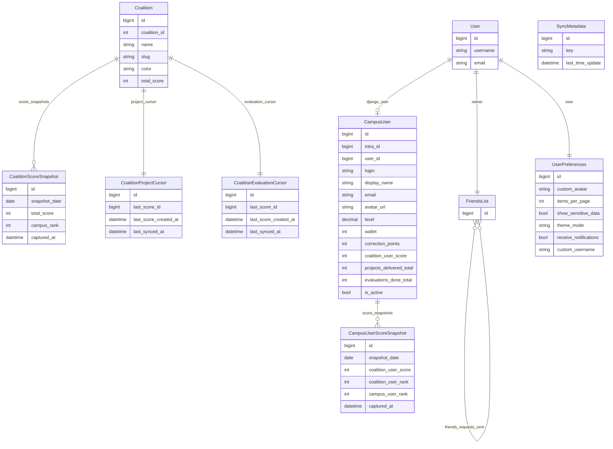
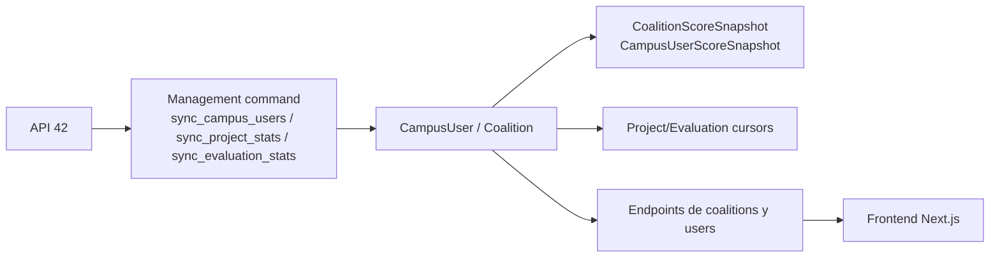

# Modelos de base de datos explicados

## 1. Resumen general del modelo de datos

La base de datos del proyecto está pensada para guardar una **fuente de verdad local** a partir de datos traídos desde la API de 42 y combinarlos con datos propios de la aplicación.

La idea central es esta:

- Django usa su `User` interno para autenticación y sesión.
- El proyecto usa `CampusUser` como representación rica del usuario sincronizado desde 42.
- Las coaliciones, scores y snapshots viven en la app `sync`.
- Las preferencias y relaciones sociales viven en la app `users`.

## Fuente de verdad local

La fuente de verdad local no es un único modelo, sino un conjunto:

- `auth_user` de Django para identidad interna;
- `sync_campususer` para perfil sincronizado desde 42;
- `sync_coalition` para coaliciones;
- snapshots y cursores en `sync`;
- `users_friendslist` y `users_userpreferences` para datos propios de la app.

## Diferencia entre las piezas principales

### `User` de Django

Es el usuario interno del framework Django.

Sirve para:

- login lógico en la app;
- permisos y sesión;
- cookies JWT y auth.

No guarda por sí solo todos los datos del campus 42.

### `CampusUser`

Es el perfil sincronizado desde 42.

Guarda:

- `intra_id`
- `login`
- `display_name`
- `avatar_url`
- `wallet`
- `correction_points`
- puntuación de coalición
- métricas de proyectos y correcciones

Es el modelo más importante del dominio.

### `Coalition`

Representa una coalición del campus:

- nombre
- slug
- color
- imagen
- score total
- líder

### Snapshots

Son fotos históricas guardadas en PostgreSQL para comparar evolución:

- `CoalitionScoreSnapshot`
- `CampusUserScoreSnapshot`

### Preferencias y amigos

Viven en `backend/users/models.py`:

- `FriendsList`
- `UserPreferences`

Representan datos propios del producto, no de la API de 42.

## 2. Diagrama Mermaid ERD



### Cómo leer este ERD

- `User` y `CampusUser` están enlazados por `OneToOne`.
- `Coalition` es entidad base para snapshots y cursores.
- `CampusUserScoreSnapshot` depende de `CampusUser`.
- `CoalitionScoreSnapshot` depende de `Coalition`.
- `FriendsList` se relaciona consigo mismo con varias relaciones `ManyToMany`.
- `SyncMetadata` es una tabla pequeña de apoyo, sin relaciones directas.

## 3. Tabla resumen de modelos

| Modelo | Archivo | Qué representa | Campos clave | Relaciones | Quién lo usa |
|---|---|---|---|---|---|
| `User` | Django builtin | Usuario interno autenticado | `username`, `email` | OneToOne con `CampusUser`, `FriendsList`, `UserPreferences` | `authentication`, `users`, auth de Django |
| `Coalition` | `backend/sync/models.py` | Coalición del campus | `coalition_id`, `name`, `slug`, `total_score` | snapshots y cursores | `sync`, `coalitions` |
| `CoalitionScoreSnapshot` | `backend/sync/models.py` | Histórico diario de score de coalición | `snapshot_date`, `total_score`, `campus_rank` | FK a `Coalition` | `sync.services`, `coalitions.services` |
| `CoalitionProjectCursor` | `backend/sync/models.py` | Cursor incremental de projects score events | `last_score_id`, `last_score_created_at` | OneToOne con `Coalition` | `sync.projects` |
| `CampusUser` | `backend/sync/models.py` | Perfil de campus sincronizado desde 42 | `intra_id`, `login`, `level`, `coalition_user_score` | OneToOne con `User`, FK lógica a coalición por ids/campos denormalizados | `authentication`, `sync`, `coalitions`, `users` |
| `CoalitionEvaluationCursor` | `backend/sync/models.py` | Cursor incremental de evaluation score events | `last_score_id`, `last_score_created_at` | OneToOne con `Coalition` | `sync.evaluations` |
| `CampusUserScoreSnapshot` | `backend/sync/models.py` | Histórico diario de score de usuario | `snapshot_date`, `coalition_user_score`, `campus_user_rank` | FK a `CampusUser` | `sync.services`, `coalitions.services` |
| `SyncMetadata` | `backend/sync/models.py` | Metadatos operativos del sync | `key`, `last_time_update` | sin FK | `sync.services`, `config.views`, `coalitions.services` |
| `FriendsList` | `backend/users/models.py` | Red social básica de amistades y solicitudes | `owner` | OneToOne con `User`, M2M consigo mismo | `users.services`, `users.views` |
| `UserPreferences` | `backend/users/models.py` | Preferencias del usuario y avatar custom | `theme_mode`, `items_per_page`, `custom_avatar` | OneToOne con `User` | `users.views`, `frontend` |

## 4. Explicación modelo por modelo

## 4.1 `User` de Django

### Archivo

No está definido en una app propia del repo, sino en:

- `django.contrib.auth.models.User`

Se importa explícitamente en:
- [backend/sync/models.py](/home/aurodrig/Desktop/arepa/backend/sync/models.py:2)

### Tabla aproximada en PostgreSQL

- `auth_user`

### Qué representa en el dominio

Es el usuario interno de Django. Sirve para:

- autenticar;
- asociar sesión;
- tener owner de amigos y preferencias;
- enlazar un usuario real de la app con un perfil sincronizado de campus.

### Campos principales

Aunque no están definidos aquí, los típicos son:

- `id`
- `username`
- `email`
- `password`
- `is_active`

### Relaciones con otros modelos

- OneToOne opcional con `CampusUser`
- OneToOne con `FriendsList`
- OneToOne con `UserPreferences`

### Para qué se usa en la app

- `authentication/views.py` crea o reutiliza `User` tras OAuth 42
- `users/models.py` lo usa como owner
- `sync/models.py` lo enlaza a `CampusUser`

### Ejemplo de datos

- `username = "aurodrig"`
- `email = "usuario@42madrid.com"`

### Riesgos o detalles importantes

- puede existir `User` sin `CampusUser` asociado si el flujo quedó incompleto;
- no es el modelo rico del dominio, solo la identidad interna.

---

## 4.2 `Coalition`

### Archivo

- [backend/sync/models.py](/home/aurodrig/Desktop/arepa/backend/sync/models.py:5)

### Tabla aproximada en PostgreSQL

- `sync_coalition`

### Qué representa en el dominio

Una coalición del campus con identidad y score total actual.

### Qué problema resuelve

Separa la entidad coalición del usuario y permite:

- ranking por coaliciones;
- snapshots diarios;
- cursores incrementales por coalición.

### Campos principales

- `coalition_id`: `PositiveIntegerField`
- `name`: `CharField`
- `slug`: `CharField`
- `image_url`: `URLField`
- `cover_url`: `URLField`
- `color`: `CharField`
- `total_score`: `IntegerField`
- `leader_user_id`: `PositiveBigIntegerField`
- `updated_at`: `DateTimeField(auto_now=True)`

### Relaciones

- `CoalitionScoreSnapshot` -> FK a `Coalition`
- `CoalitionProjectCursor` -> OneToOne con `Coalition`
- `CoalitionEvaluationCursor` -> OneToOne con `Coalition`

### Quién lo usa

- [backend/sync/services.py](/home/aurodrig/Desktop/arepa/backend/sync/services.py:149) guarda coaliciones
- [backend/coalitions/services.py](/home/aurodrig/Desktop/arepa/backend/coalitions/services.py:1) construye payloads
- [backend/sync/projects.py](/home/aurodrig/Desktop/arepa/backend/sync/projects.py:8)
- [backend/sync/evaluations.py](/home/aurodrig/Desktop/arepa/backend/sync/evaluations.py:8)

### `__str__`

```python
return f'{self.name} ({self.coalition_id})'
```

Útil para admin, shell y logs.

### `Meta`

No define `Meta` propia.

### Ejemplo de datos

- `coalition_id = 401`
- `name = "Zefiria"`
- `slug = "zefiria"`
- `total_score = 241000`

### Riesgos o detalles importantes

- el score total es estado actual, no histórico;
- el histórico se delega a `CoalitionScoreSnapshot`.

---

## 4.3 `CoalitionScoreSnapshot`

### Archivo

- [backend/sync/models.py](/home/aurodrig/Desktop/arepa/backend/sync/models.py:20)

### Tabla aproximada en PostgreSQL

- `sync_coalitionscoresnapshot`

### Qué representa en el dominio

Una foto diaria del score total de una coalición y su rango de campus.

### Qué problema resuelve

Permite saber:

- cuánto tenía una coalición ayer;
- cambio semanal/mensual;
- evolución histórica.

### Campos principales

- `coalition`: `ForeignKey`
- `snapshot_date`: `DateField`
- `total_score`: `IntegerField`
- `campus_rank`: `PositiveIntegerField`
- `captured_at`: `DateTimeField(auto_now=True)`

### Relaciones

- muchos snapshots pertenecen a una `Coalition`

### Quién lo usa

- [backend/sync/services.py](/home/aurodrig/Desktop/arepa/backend/sync/services.py:183) `save_coalition_score_snapshots`
- [backend/coalitions/services.py](/home/aurodrig/Desktop/arepa/backend/coalitions/services.py:84) para cambios de score y rank

### `__str__`

```python
return f'{self.coalition.name} - {self.snapshot_date}: {self.total_score}'
```

### `Meta`

- `unique_together = ('coalition', 'snapshot_date')`
- índice en `['coalition', 'snapshot_date']`

### Qué significa esa `Meta`

- solo puede haber **un snapshot por coalición y por día**;
- las búsquedas históricas por coalición+fecha son más rápidas.

### Ejemplo de datos

- `coalition = Zefiria`
- `snapshot_date = 2026-05-03`
- `total_score = 241000`
- `campus_rank = 3`

### Riesgos o detalles importantes

- hoy el histórico es diario, no intradía;
- si quieres curvas “cada hora”, este modelo no basta tal como está.

---

## 4.4 `CoalitionProjectCursor`

### Archivo

- [backend/sync/models.py](/home/aurodrig/Desktop/arepa/backend/sync/models.py:37)

### Tabla aproximada en PostgreSQL

- `sync_coalitionprojectcursor`

### Qué representa en el dominio

El punto hasta el que ya se procesaron score events de proyectos por coalición.

### Qué problema resuelve

Evita recontar todos los eventos cada vez. Sirve para sync incremental.

### Campos principales

- `coalition`: `OneToOneField`
- `last_score_id`: `PositiveBigIntegerField`
- `last_score_created_at`: `DateTimeField`
- `last_synced_at`: `DateTimeField(auto_now=True)`

### Relaciones

- uno a uno con `Coalition`

### Quién lo usa

- [backend/sync/projects.py](/home/aurodrig/Desktop/arepa/backend/sync/projects.py:8)

### `__str__`

```python
return f'{self.coalition.name}: {self.last_score_id or "sin cursor"}'
```

### `Meta`

No define `Meta` propia.

### Ejemplo de datos

- `coalition = Zefiria`
- `last_score_id = 123456789`
- `last_score_created_at = 2026-05-03T12:01:00Z`

### Riesgos o detalles importantes

- si el cursor está mal posicionado, puedes:
  - duplicar incrementos;
  - perder eventos;
- depende mucho del bootstrap correcto.

---

## 4.5 `CampusUser`

### Archivo

- [backend/sync/models.py](/home/aurodrig/Desktop/arepa/backend/sync/models.py:47)

### Tabla aproximada en PostgreSQL

- `sync_campususer`

### Qué representa en el dominio

Es el modelo principal del proyecto. Representa al usuario del campus 42 ya normalizado y persistido localmente.

### Qué problema resuelve

Evita depender en tiempo real de la API de 42 para cada pantalla. Centraliza:

- identidad de campus;
- métricas;
- estado de coalición;
- puntuación;
- estadísticas de proyectos;
- estadísticas de correcciones.

### Campos principales por bloques

#### Relación con usuario interno

- `django_user`: `OneToOneField(User, on_delete=SET_NULL, null=True, blank=True)`

#### Identidad principal

- `intra_id`: `PositiveBigIntegerField(unique=True)`
- `user_id`: `PositiveBigIntegerField()`

#### Progreso académico

- `grade`: `CharField`
- `level`: `DecimalField(max_digits=8, decimal_places=2, default=0)`

#### Datos básicos de usuario

- `login`: `CharField`
- `email`: `EmailField`
- `display_name`: `CharField`
- `avatar_url`: `URLField`
- `wallet`: `IntegerField`
- `correction_points`: `IntegerField`

#### Proyectos

- `projects_delivered_total`: `PositiveIntegerField`
- `projects_delivered_current_season`: `PositiveIntegerField`
- `projects_delivered_synced_at`: `DateTimeField`

#### Cohorte / actividad

- `pool_month`: `CharField`
- `pool_year`: `PositiveIntegerField`
- `is_active`: `BooleanField`

#### Información de coalición denormalizada

- `coalition_id`: `PositiveIntegerField`
- `coalitions_user_id`: `PositiveBigIntegerField(db_index=True)`
- `coalition_name`: `CharField`
- `coalition_slug`: `CharField`
- `coalition_user_score`: `IntegerField`
- `coalition_rank`: `PositiveIntegerField`
- `general_rank`: `PositiveIntegerField`

#### Correcciones

- `evaluations_done_total`: `PositiveIntegerField`
- `evaluations_done_current_season`: `PositiveIntegerField`
- `evaluations_synced_at`: `DateTimeField`

#### Timestamps de origen

- `created_at`: `DateTimeField`
- `updated_at`: `DateTimeField`

### Relaciones

- OneToOne opcional con `User`
- uno a muchos con `CampusUserScoreSnapshot`

### Quién lo usa

Muy ampliamente:

- [backend/authentication/views.py](/home/aurodrig/Desktop/arepa/backend/authentication/views.py:18) lo crea/actualiza al loguear
- [backend/sync/services.py](/home/aurodrig/Desktop/arepa/backend/sync/services.py:217) lo rellena en sync
- [backend/sync/projects.py](/home/aurodrig/Desktop/arepa/backend/sync/projects.py:8)
- [backend/sync/evaluations.py](/home/aurodrig/Desktop/arepa/backend/sync/evaluations.py:8)
- [backend/coalitions/services.py](/home/aurodrig/Desktop/arepa/backend/coalitions/services.py:1)
- [backend/users/services.py](/home/aurodrig/Desktop/arepa/backend/users/services.py:1)

### `__str__`

```python
return f'{self.login} - {self.coalition_name or "Sin coalición"}'
```

### `Meta`

- `unique_together = ('intra_id', 'user_id')`

### Detalle importante

Aquí hay una tensión técnica:

- `intra_id` es `unique=True`;
- además existe `unique_together` con `user_id`.

En la práctica, `intra_id` ya fuerza unicidad fuerte. El `unique_together` parece una huella histórica del modelo.

### Ejemplo de datos

- `intra_id = 217446`
- `login = "rodde-fr"`
- `display_name = "Rodrigo De Freitas Da Cruz"`
- `coalition_slug = "tiamant"`
- `coalition_user_score = 28`
- `projects_delivered_total = 12`
- `evaluations_done_total = 65`

### Riesgos o detalles importantes

- mezcla datos de identidad, métricas y coalición en una sola fila;
- eso simplifica lectura, pero aumenta acoplamiento;
- si el sync queda desactualizado, muchas pantallas se degradan a la vez.

---

## 4.6 `CoalitionEvaluationCursor`

### Archivo

- [backend/sync/models.py](/home/aurodrig/Desktop/arepa/backend/sync/models.py:95)

### Tabla aproximada en PostgreSQL

- `sync_coalitionevaluationcursor`

### Qué representa en el dominio

Cursor incremental para score events de correcciones.

### Qué problema resuelve

Permite actualizar correcciones sin recalcular toda la historia de cada usuario.

### Campos principales

- `coalition`: `OneToOneField`
- `last_score_id`: `PositiveBigIntegerField`
- `last_score_created_at`: `DateTimeField`
- `last_synced_at`: `DateTimeField(auto_now=True)`

### Relaciones

- uno a uno con `Coalition`

### Quién lo usa

- [backend/sync/evaluations.py](/home/aurodrig/Desktop/arepa/backend/sync/evaluations.py:8)

### `__str__`

```python
return f'{self.coalition.name}: {self.last_score_id or "empty"}'
```

### Riesgos o detalles importantes

- igual que el cursor de proyectos, un mal bootstrap puede romper la coherencia del incremental;
- no existe “un event id global”, sino un cursor por coalición.

---

## 4.7 `CampusUserScoreSnapshot`

### Archivo

- [backend/sync/models.py](/home/aurodrig/Desktop/arepa/backend/sync/models.py:105)

### Tabla aproximada en PostgreSQL

- `sync_campususerscoresnapshot`

### Qué representa en el dominio

Foto diaria del score y rango de un usuario.

### Qué problema resuelve

Permite calcular variaciones de ranking y score sin depender de datos en vivo históricos que la API externa no expone directamente al frontend.

### Campos principales

- `campus_user`: `ForeignKey`
- `snapshot_date`: `DateField`
- `coalition_user_score`: `IntegerField`
- `coalition_user_rank`: `PositiveIntegerField`
- `campus_user_rank`: `PositiveIntegerField`
- `captured_at`: `DateTimeField(auto_now=True)`

### Relaciones

- muchos snapshots pertenecen a un `CampusUser`

### Quién lo usa

- [backend/sync/services.py](/home/aurodrig/Desktop/arepa/backend/sync/services.py:203) `save_user_score_snapshots`
- [backend/coalitions/services.py](/home/aurodrig/Desktop/arepa/backend/coalitions/services.py:242) para ranking comparado

### `__str__`

```python
return f'{self.campus_user.login} - {self.snapshot_date}: {self.coalition_user_score}'
```

### `Meta`

- `unique_together = ('campus_user', 'snapshot_date')`
- índice compuesto en `['campus_user', 'snapshot_date']`

### Ejemplo de datos

- `campus_user = aurodrig`
- `snapshot_date = 2026-05-03`
- `coalition_user_score = 260`
- `campus_user_rank = 94`

### Riesgos o detalles importantes

- si no se generan snapshots, algunas comparativas quedan vacías;
- las gráficas históricas dependen de este modelo.

---

## 4.8 `SyncMetadata`

### Archivo

- [backend/sync/models.py](/home/aurodrig/Desktop/arepa/backend/sync/models.py:123)

### Tabla aproximada en PostgreSQL

- `sync_syncmetadata`

### Qué representa en el dominio

Pequeña tabla de metadatos operativos del proceso de sync.

### Qué problema resuelve

Da una forma sencilla de guardar el “último sync” sin inventar lógica compleja.

### Campos principales

- `key`: `CharField(unique=True)`
- `last_time_update`: `DateTimeField`

### Relaciones

- no tiene claves foráneas

### Quién lo usa

- [backend/sync/services.py](/home/aurodrig/Desktop/arepa/backend/sync/services.py:32) `_touch_last_sync_timestamp`
- [backend/config/views.py](/home/aurodrig/Desktop/arepa/backend/config/views.py:22) `_get_last_sync_time`
- [backend/coalitions/services.py](/home/aurodrig/Desktop/arepa/backend/coalitions/services.py:13) `_get_last_time_update`

### `__str__`

```python
return f'{self.key}: {self.last_time_update}'
```

### Ejemplo de datos

- `key = "campus_sync"`
- `last_time_update = 2026-05-03T17:22:51+00:00`

### Riesgos o detalles importantes

- si no se actualiza, `/api/status/` o la UI pueden parecer desactualizados;
- es un modelo pequeño, pero muy visible operativamente.

---

## 4.9 `FriendsList`

### Archivo

- [backend/users/models.py](/home/aurodrig/Desktop/arepa/backend/users/models.py:4)

### Tabla aproximada en PostgreSQL

- `users_friendslist`

Y además Django crea tablas intermedias `ManyToMany` automáticas para las relaciones de amistad y solicitudes.

### Qué representa en el dominio

La red social mínima del proyecto:

- lista de amigos;
- solicitudes enviadas;
- solicitudes recibidas.

### Qué problema resuelve

Permite construir:

- amistades simétricas;
- solicitudes pendientes;
- aceptación/rechazo/retirada.

### Campos principales

- `owner`: `OneToOneField(User)`
- `friends`: `ManyToManyField('self', symmetrical=True, blank=True)`
- `friends_requests_received`: `ManyToManyField('self', symmetrical=False, ...)`
- `friends_requests_sent`: `ManyToManyField('self', symmetrical=False, ...)`

### Relaciones

- uno a uno con `User`
- muchas a muchas consigo mismo

### Quién lo usa

- [backend/users/services.py](/home/aurodrig/Desktop/arepa/backend/users/services.py:1)
- [backend/users/views.py](/home/aurodrig/Desktop/arepa/backend/users/views.py:1)

### `__str__`

Usa preferentemente el login del `CampusUser` enlazado al owner:

```python
identifier = login or self.owner.username
return f'[{identifier}]'
```

### `Meta`

No define `Meta` propia.

### Ejemplo de datos

- owner = `User(username="aurodrig")`
- friends = `[fvizcaya, fmorenil]`
- pending_sent = `[otro_login]`

### Riesgos o detalles importantes

- al ser autorreferencial, es más fácil cometer inconsistencias si la lógica de servicio no está bien cerrada;
- los `ManyToMany` no se ven todos directamente en una sola tabla física.

---

## 4.10 `UserPreferences`

### Archivo

- [backend/users/models.py](/home/aurodrig/Desktop/arepa/backend/users/models.py:15)

### Tabla aproximada en PostgreSQL

- `users_userpreferences`

### Qué representa en el dominio

Preferencias del usuario dentro de la app.

### Qué problema resuelve

Evita mezclar datos de personalización del producto con el perfil sincronizado desde 42.

### Campos principales

- `user`: `OneToOneField(User)`
- `custom_avatar`: `ImageField(upload_to='avatars/', null=True, blank=True)`
- `items_per_page`: `PositiveIntegerField(default=10)`
- `show_sensitive_data`: `BooleanField(default=True)`
- `theme_mode`: `CharField(max_length=20, default='dark')`
- `receive_notifications`: `BooleanField(default=True)`
- `custom_username`: `CharField(max_length=150, blank=True, null=True)`

### Relaciones

- uno a uno con `User`

### Quién lo usa

- [backend/users/views.py](/home/aurodrig/Desktop/arepa/backend/users/views.py:87)
- [frontend/lib/userApi.ts](/home/aurodrig/Desktop/arepa/frontend/lib/userApi.ts:183)
- [frontend/components/AuthLayout.tsx](/home/aurodrig/Desktop/arepa/frontend/components/AuthLayout.tsx:76) para theme y per-page

### `__str__`

También intenta mostrar el login del `CampusUser` asociado:

```python
identifier = login or self.user.username
return f'Preferences for [{identifier}]'
```

### `Meta`

No define `Meta` propia.

### Ejemplo de datos

- `theme_mode = "dark"`
- `items_per_page = 25`
- `show_sensitive_data = True`
- `custom_avatar = avatars/mi_avatar.png`

### Riesgos o detalles importantes

- depende de `MEDIA_URL` y `MEDIA_ROOT` para servir avatares;
- si el archivo físico se pierde, el registro puede quedar apuntando a un fichero inexistente.

## 4.11 `backend/authentication/models.py`

Archivo:
- [backend/authentication/models.py](/home/aurodrig/Desktop/arepa/backend/authentication/models.py:1)

### Estado real

No define modelos activos.

Solo contiene este comentario:

```python
"""Authentication app uses Django's built-in User model as source of truth."""
```

### Qué significa

- hoy la app `authentication` usa el `User` de Django;
- no mantiene un modelo propio activo.

### Pista histórica

Las migraciones muestran que antes existía `FortyTwoProfile`, pero fue eliminado en:

- [backend/authentication/migrations/0011_delete_fortytwoprofile.py](/home/aurodrig/Desktop/arepa/backend/authentication/migrations/0011_delete_fortytwoprofile.py:10)

## 4.12 `backend/coalitions/models.py`

Archivo:
- [backend/coalitions/models.py](/home/aurodrig/Desktop/arepa/backend/coalitions/models.py:1)

### Estado real

No define modelos activos.

Solo contiene:

```python
"""Coalitions app exposes API/services; data is sourced from sync models."""
```

### Qué significa

- la app `coalitions` expone vistas y servicios;
- pero los datos persistidos de coaliciones viven en `sync.models.Coalition`.

### Pista histórica

Las migraciones muestran que hubo un `Coalition` en esta app, pero se eliminó en:

- [backend/coalitions/migrations/0003_delete_coalition.py](/home/aurodrig/Desktop/arepa/backend/coalitions/migrations/0003_delete_coalition.py:11)

## 5. Explicación de sintaxis Django ORM

Aquí explico cada pieza con ejemplos reales del repo.

### `models.Model`

Es la clase base de todos los modelos Django.

Ejemplo:

```python
class CampusUser(models.Model):
```

Archivo:
- [backend/sync/models.py](/home/aurodrig/Desktop/arepa/backend/sync/models.py:47)

### `CharField`

Guarda texto corto o medio.

Ejemplo:

```python
name = models.CharField(max_length=255)
```

Archivo:
- [backend/sync/models.py](/home/aurodrig/Desktop/arepa/backend/sync/models.py:7)

### `IntegerField`

Guarda enteros con signo.

Ejemplo:

```python
total_score = models.IntegerField(default=0)
```

Archivo:
- [backend/sync/models.py](/home/aurodrig/Desktop/arepa/backend/sync/models.py:12)

### `FloatField`

En este repo **no veo uso activo de `FloatField`** en los modelos revisados.

En su lugar, para el nivel del usuario se usa:

```python
level = models.DecimalField(max_digits=8, decimal_places=2, default=0)
```

Archivo:
- [backend/sync/models.py](/home/aurodrig/Desktop/arepa/backend/sync/models.py:56)

### `BooleanField`

Guarda `True/False`.

Ejemplo:

```python
is_active = models.BooleanField(default=True)
```

Archivo:
- [backend/sync/models.py](/home/aurodrig/Desktop/arepa/backend/sync/models.py:70)

### `DateTimeField`

Guarda fecha y hora.

Ejemplos:

```python
updated_at = models.DateTimeField(auto_now=True)
last_time_update = models.DateTimeField(null=True, blank=True)
```

Archivos:
- [backend/sync/models.py](/home/aurodrig/Desktop/arepa/backend/sync/models.py:14)
- [backend/sync/models.py](/home/aurodrig/Desktop/arepa/backend/sync/models.py:125)

### `ForeignKey`

Relación muchos-a-uno.

Ejemplo:

```python
coalition = models.ForeignKey(Coalition, on_delete=models.CASCADE, related_name='score_snapshots')
```

Archivo:
- [backend/sync/models.py](/home/aurodrig/Desktop/arepa/backend/sync/models.py:21)

Significa:

- muchos snapshots pertenecen a una coalición.

### `OneToOneField`

Relación uno-a-uno.

Ejemplos:

```python
django_user = models.OneToOneField(User, ...)
user = models.OneToOneField(settings.AUTH_USER_MODEL, ...)
```

Archivos:
- [backend/sync/models.py](/home/aurodrig/Desktop/arepa/backend/sync/models.py:48)
- [backend/users/models.py](/home/aurodrig/Desktop/arepa/backend/users/models.py:16)

### `ManyToManyField`

Relación muchos-a-muchos.

Ejemplo:

```python
friends = models.ManyToManyField('self', symmetrical=True, blank=True)
```

Archivo:
- [backend/users/models.py](/home/aurodrig/Desktop/arepa/backend/users/models.py:6)

### `related_name`

Es el nombre para acceder a la relación desde el otro lado.

Ejemplo:

```python
related_name='score_snapshots'
```

Permite hacer algo como:

```python
coalition.score_snapshots.all()
```

### `on_delete`

Define qué pasa si borras el objeto padre.

Ejemplos:

- `CASCADE`
  - si borras la coalición, se borran sus snapshots
- `SET_NULL`
  - si borras el `User`, `CampusUser.django_user` se pone a `NULL`

Ejemplo real:

```python
django_user = models.OneToOneField(User, on_delete=models.SET_NULL, ...)
```

Archivo:
- [backend/sync/models.py](/home/aurodrig/Desktop/arepa/backend/sync/models.py:48)

### `null=True`

Permite `NULL` en base de datos.

Ejemplo:

```python
leader_user_id = models.PositiveBigIntegerField(null=True, blank=True)
```

### `blank=True`

Permite dejar vacío ese campo a nivel formularios/validación.

En este repo se usa mucho junto con `null=True`.

### `default`

Valor por defecto si no se pasa otro.

Ejemplo:

```python
total_score = models.IntegerField(default=0)
```

### `unique`

Exige unicidad en base de datos.

Ejemplo:

```python
coalition_id = models.PositiveIntegerField(unique=True)
```

### `indexes`

Define índices SQL para acelerar consultas.

Ejemplo:

```python
indexes = [
    models.Index(fields=['coalition', 'snapshot_date']),
]
```

Archivo:
- [backend/sync/models.py](/home/aurodrig/Desktop/arepa/backend/sync/models.py:29)

### `Meta`

Sirve para configuración extra del modelo.

Ejemplo real:

```python
class Meta:
    unique_together = ('coalition', 'snapshot_date')
    indexes = [...]
```

### `ordering`

En los modelos revisados **no veo `ordering` definido en `Meta`**.

Eso significa:

- el orden por defecto no está fijado en el modelo;
- las vistas y servicios suelen ordenar en queries explícitas.

### `__str__`

Define representación legible del objeto.

Ejemplo:

```python
def __str__(self):
    return f'{self.name} ({self.coalition_id})'
```

Ayuda en:

- admin
- shell
- logs

## 6. Cómo se crean estas tablas

### Qué son migraciones

Las migraciones son archivos Python que describen cambios en el esquema SQL.

Sirven para:

- crear tablas;
- añadir campos;
- borrar modelos;
- crear índices;
- fusionar ramas de evolución del esquema.

### Dónde están

- `backend/sync/migrations/`
- `backend/users/migrations/`
- `backend/authentication/migrations/`
- `backend/coalitions/migrations/`

### Migraciones relevantes para entender la evolución

#### Nacimiento de `Coalition` en `sync`

- [backend/sync/migrations/0005_coalition.py](/home/aurodrig/Desktop/arepa/backend/sync/migrations/0005_coalition.py:12)

#### Nacimiento de snapshots

- [backend/sync/migrations/0010_coalitionscoresnapshot_campususerscoresnapshot.py](/home/aurodrig/Desktop/arepa/backend/sync/migrations/0010_coalitionscoresnapshot_campususerscoresnapshot.py:13)

#### Nacimiento de `SyncMetadata`

- [backend/sync/migrations/0012_syncmetadata.py](/home/aurodrig/Desktop/arepa/backend/sync/migrations/0012_syncmetadata.py:12)

#### Nacimiento de cursor de proyectos

- [backend/sync/migrations/0014_coalitionprojectcursor.py](/home/aurodrig/Desktop/arepa/backend/sync/migrations/0014_coalitionprojectcursor.py:11)

#### Nacimiento de `coalitions_user_id` y cursor de evaluaciones

- [backend/sync/migrations/0015_campususer_coalitions_user_id_and_cursor.py](/home/aurodrig/Desktop/arepa/backend/sync/migrations/0015_campususer_coalitions_user_id_and_cursor.py:11)

#### Eliminación del perfil viejo de auth

- [backend/authentication/migrations/0011_delete_fortytwoprofile.py](/home/aurodrig/Desktop/arepa/backend/authentication/migrations/0011_delete_fortytwoprofile.py:10)

#### Eliminación del `Coalition` antiguo en app `coalitions`

- [backend/coalitions/migrations/0003_delete_coalition.py](/home/aurodrig/Desktop/arepa/backend/coalitions/migrations/0003_delete_coalition.py:11)

#### Nacimiento de `FriendsList`

- [backend/users/migrations/0001_initial.py](/home/aurodrig/Desktop/arepa/backend/users/migrations/0001_initial.py:16)

#### Nacimiento de `UserPreferences`

- [backend/users/migrations/0002_userpreferences.py](/home/aurodrig/Desktop/arepa/backend/users/migrations/0002_userpreferences.py:15)

### Cómo se aplican

```bash
make back-migrate
```

Eso termina ejecutando:

```bash
python manage.py migrate
```

### Cómo ver su estado

```bash
make back-showmigrations
```

## 7. Flujo de datos con Mermaid



### Cómo leer este flujo

- la API de 42 no alimenta el frontend directamente;
- primero pasa por comandos de sync;
- esos comandos escriben tablas locales;
- los endpoints Django leen esas tablas;
- el frontend consume solo el backend local.

### Pseudocódigo

```text
FUNCIÓN flujo_datos_local():

    pedir datos a API 42
    transformar payload externo
    guardar CampusUser y Coalition
    crear snapshots si toca
    exponer datos con endpoints Django
    renderizar frontend con datos persistidos
```

## 8. Comandos útiles

### Aplicar migraciones

```bash
make back-migrate
```

### Ver migraciones

```bash
make back-showmigrations
```

### Abrir shell Django

```bash
make back-shell
```

### Consultas simples en shell Django

#### Contar usuarios sincronizados

```python
from sync.models import CampusUser
CampusUser.objects.count()
```

#### Ver coaliciones

```python
from sync.models import Coalition
Coalition.objects.all()
```

#### Ver último sync

```python
from sync.models import SyncMetadata
SyncMetadata.objects.filter(key="campus_sync").first()
```

#### Ver preferencias de un usuario

```python
from django.contrib.auth.models import User
u = User.objects.first()
u.preferences
```

#### Ver snapshots de una coalición

```python
from sync.models import Coalition
c = Coalition.objects.first()
c.score_snapshots.all()
```

## 9. Errores comunes

### Migraciones pendientes

Síntomas:

- tabla o columna no existe;
- el backend arranca pero una vista falla al consultar modelos nuevos.

### Columna inexistente

Suele pasar si:

- el código espera un campo nuevo;
- pero la base no tiene aplicada la migración correspondiente.

### Relación `ForeignKey` rota

En sentido estricto, PostgreSQL y Django suelen proteger bastante esto.

Pero puede haber problemas lógicos si:

- el objeto padre no existe;
- el código espera relaciones cargadas que nunca se sincronizaron.

### Datos duplicados

Riesgo especialmente en:

- imports de snapshots;
- syncs mal diseñados;
- bootstraps incrementales con cursores mal colocados.

Mitigaciones en el modelo:

- `unique=True`
- `unique_together`
- `update_or_create`

### Snapshots vacíos

Síntomas:

- no hay evolución histórica;
- cambios semanales o mensuales aparecen como `None`.

Causa:

- nunca se ejecutó la generación de snapshots o el histórico es muy corto.

### `User` sin `CampusUser` asociado

Síntomas:

- auth interna existe;
- pero el perfil de campus no aparece o se rompe una vista de perfil.

Causa:

- el login creó `User`, pero no se completó el enlace o el sync correspondiente.

## 10. Qué puedo decir en evaluación

Estas frases te sirven para explicarlo de forma simple:

### Sobre `User`

> `User` es el usuario interno de Django y lo usamos para autenticación y sesión.

### Sobre `CampusUser`

> `CampusUser` es el modelo central del dominio: guarda la identidad y métricas sincronizadas desde la API de 42.

### Sobre `Coalition`

> `Coalition` representa cada coalición localmente con su score total actual y metadatos visuales.

### Sobre snapshots

> Los snapshots guardan fotos diarias de scores para poder calcular evolución histórica sin depender de la API externa en tiempo real.

### Sobre preferencias y amigos

> `FriendsList` y `UserPreferences` son datos propios de la app, no vienen de 42.

### Sobre migraciones

> Las migraciones son el mecanismo con el que Django crea y evoluciona el esquema SQL de forma versionada.

## 11. Checklist de comprensión

- [ ] Entiendo qué es `User`
- [ ] Entiendo qué es `CampusUser`
- [ ] Entiendo qué es `Coalition`
- [ ] Entiendo qué es un snapshot
- [ ] Entiendo qué son `FriendsList` y `UserPreferences`
- [ ] Entiendo qué son migraciones
- [ ] Entiendo relaciones `ForeignKey` / `OneToOne` / `ManyToMany`
- [ ] Entiendo cómo probar modelos desde shell Django

## 12. Pseudocódigo global del modelo de datos

```text
FUNCIÓN modelo_de_datos():

    User = identidad interna Django
    CampusUser = usuario sincronizado desde 42
    Coalition = estado actual de cada coalición

    SI el sync trae datos nuevos:
        actualizar CampusUser
        actualizar Coalition

    SI se necesita histórico:
        crear snapshots diarios

    SI se necesita incremental:
        guardar cursores por coalición

    SI se necesitan preferencias o amigos:
        usar UserPreferences y FriendsList

    devolver "modelo local listo para consultas"
```

## 13. Quiz final tipo test (20 preguntas)

### 1. ¿Qué modelo resuelve la auth interna de Django?
- A. `CampusUser`
- B. `User`
- C. `Coalition`
- D. `SyncMetadata`
- Respuesta correcta: B
- Explicación: `User` es la identidad interna del framework.

### 2. ¿Qué modelo es el centro del dominio de negocio sincronizado desde 42?
- A. `FriendsList`
- B. `CampusUser`
- C. `UserPreferences`
- D. `CoalitionScoreSnapshot`
- Respuesta correcta: B
- Explicación: guarda identidad y métricas principales.

### 3. ¿Qué modelo representa el estado actual de una coalición?
- A. `Coalition`
- B. `CoalitionScoreSnapshot`
- C. `CoalitionProjectCursor`
- D. `CampusUserScoreSnapshot`
- Respuesta correcta: A
- Explicación: `Coalition` es la foto actual agregada.

### 4. ¿Qué modelo guarda histórico diario de score por coalición?
- A. `SyncMetadata`
- B. `Coalition`
- C. `CoalitionScoreSnapshot`
- D. `FriendsList`
- Respuesta correcta: C
- Explicación: el snapshot conserva la evolución temporal.

### 5. ¿Qué modelo guarda histórico diario individual?
- A. `CampusUserScoreSnapshot`
- B. `User`
- C. `CoalitionEvaluationCursor`
- D. `UserPreferences`
- Respuesta correcta: A
- Explicación: es el equivalente individual del snapshot de coalición.

### 6. ¿Qué modelo evita reprocesar eventos de proyectos?
- A. `CoalitionEvaluationCursor`
- B. `CoalitionProjectCursor`
- C. `SyncMetadata`
- D. `CampusUser`
- Respuesta correcta: B
- Explicación: guarda la frontera incremental de proyectos.

### 7. ¿Qué modelo evita reprocesar eventos de correcciones?
- A. `CoalitionEvaluationCursor`
- B. `CampusUserScoreSnapshot`
- C. `Coalition`
- D. `FriendsList`
- Respuesta correcta: A
- Explicación: hace el papel incremental para evaluaciones.

### 8. ¿Qué modelo guarda metadatos como `last_time_update`?
- A. `UserPreferences`
- B. `SyncMetadata`
- C. `Coalition`
- D. `User`
- Respuesta correcta: B
- Explicación: se usa para `last_sync` y observabilidad.

### 9. ¿Qué modelo guarda amigos y solicitudes?
- A. `FriendsList`
- B. `SyncMetadata`
- C. `CampusUser`
- D. `CoalitionScoreSnapshot`
- Respuesta correcta: A
- Explicación: es la capa social propia de la app.

### 10. ¿Qué modelo guarda avatar custom, tema y privacidad?
- A. `UserPreferences`
- B. `CampusUser`
- C. `User`
- D. `CoalitionEvaluationCursor`
- Respuesta correcta: A
- Explicación: persiste configuración propia del producto.

### 11. ¿Qué relación existe entre `User` y `CampusUser`?
- A. `ManyToMany`
- B. Ninguna
- C. `OneToOne` opcional
- D. `ForeignKey` múltiple
- Respuesta correcta: C
- Explicación: `CampusUser` enlaza opcionalmente con `User`.

### 12. ¿Qué lectura es correcta sobre snapshots?
- A. Sustituyen el estado actual
- B. Guardan histórico y sirven para tendencias
- C. Solo sirven para login
- D. Solo están en frontend
- Respuesta correcta: B
- Explicación: complementan al estado actual, no lo reemplazan.

### 13. ¿Qué significa `ForeignKey`?
- A. Relación muchos-a-uno
- B. Una cookie segura
- C. Un comando Docker
- D. Un hook React
- Respuesta correcta: A
- Explicación: varios registros pueden apuntar a uno.

### 14. ¿Qué significa `OneToOneField`?
- A. Relación N a N
- B. Relación uno-a-uno
- C. Un índice SQL
- D. Un endpoint REST
- Respuesta correcta: B
- Explicación: cada lado apunta a un único registro del otro.

### 15. ¿Qué significa `ManyToManyField` en `FriendsList`?
- A. Que el modelo no se guarda
- B. Que puede haber amistades y solicitudes entre muchas filas del mismo modelo
- C. Que solo se usa en CSS
- D. Que el backend no valida nada
- Respuesta correcta: B
- Explicación: modela relaciones sociales autorreferenciales.

### 16. ¿Qué hace `unique_together` en snapshots?
- A. Obliga a un snapshot por entidad y fecha
- B. Borra duplicados automáticamente
- C. Crea JWT
- D. Sirve `/api/status/`
- Respuesta correcta: A
- Explicación: evita más de una foto diaria por combinación lógica.

### 17. ¿Qué lectura es correcta sobre `backend/authentication/models.py`?
- A. Define el modelo principal de auth del proyecto
- B. No contiene modelos activos; se apoya en `User` de Django
- C. Reemplaza a `CampusUser`
- D. Define snapshots
- Respuesta correcta: B
- Explicación: el comentario lo deja explícito.

### 18. ¿Qué lectura es correcta sobre `backend/coalitions/models.py`?
- A. Sigue siendo la fuente de verdad actual
- B. Tiene valor histórico, pero la fuente actual está en `sync`
- C. Sustituye a `sync/models.py`
- D. Solo vive en frontend
- Respuesta correcta: B
- Explicación: la coalición real actual está modelada en la app `sync`.

### 19. ¿Qué crea o cambia el esquema SQL de estos modelos?
- A. `useEffect`
- B. Migraciones Django
- C. `AuthLayout`
- D. `manifest.ts`
- Respuesta correcta: B
- Explicación: las migraciones materializan el ORM en la base.

### 20. ¿Cuál es la idea global correcta del modelo de datos?
- A. El frontend consulta 42 en vivo y no usa DB local
- B. PostgreSQL local guarda usuarios, coaliciones, histórico, cursores y datos propios de la app
- C. Solo existe `User`
- D. Todo vive en `localStorage`
- Respuesta correcta: B
- Explicación: ese es el diseño real del proyecto.
