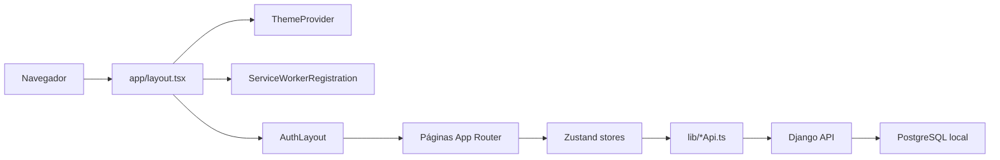
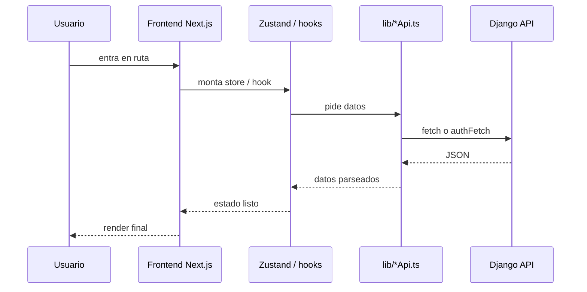

# Arquitectura del frontend explicada

## 1. Resumen general

El frontend del proyecto está construido con **Next.js App Router** y funciona como una capa cliente que:

- renderiza páginas públicas y privadas;
- consume APIs internas del backend Django;
- usa cookies `HttpOnly` para autenticación;
- mantiene estado de interfaz con **Zustand**;
- delega la fuente de verdad de negocio al backend y a PostgreSQL.

Problema que resuelve:

- presentar coaliciones, leaderboard, perfil, estado del sistema y configuración del usuario sin hablar directamente con la API de 42;
- encapsular la lógica de sesión y de fetch en una arquitectura repetible.

Archivos de entrada más importantes:

- [frontend/app/layout.tsx](/home/aurodrig/Desktop/arepa/frontend/app/layout.tsx:1)
- [frontend/components/AuthLayout.tsx](/home/aurodrig/Desktop/arepa/frontend/components/AuthLayout.tsx:1)
- [frontend/hooks/useAuth.ts](/home/aurodrig/Desktop/arepa/frontend/hooks/useAuth.ts:1)
- [frontend/hooks/useCoalition.ts](/home/aurodrig/Desktop/arepa/frontend/hooks/useCoalition.ts:1)
- [frontend/hooks/useUser.ts](/home/aurodrig/Desktop/arepa/frontend/hooks/useUser.ts:1)
- [frontend/lib/authApi.ts](/home/aurodrig/Desktop/arepa/frontend/lib/authApi.ts:1)
- [frontend/lib/coalitionApi.ts](/home/aurodrig/Desktop/arepa/frontend/lib/coalitionApi.ts:1)
- [frontend/lib/statusApi.ts](/home/aurodrig/Desktop/arepa/frontend/lib/statusApi.ts:1)

## 2. Diagrama general



Cómo leerlo:

- `layout.tsx` monta la estructura global;
- `AuthLayout` decide si puedes entrar y qué bootstrap hacer;
- las páginas usan hooks/stores;
- los stores llaman a la capa `lib/*Api.ts`;
- la capa API habla con Django, no con 42;
- Django a su vez consulta su base local.

## 3. Estructura general del frontend

Mapa de carpetas útiles:

| Carpeta | Papel |
|---|---|
| `frontend/app/` | Rutas App Router y páginas |
| `frontend/components/` | Componentes compartidos globales |
| `frontend/hooks/` | Stores Zustand y hooks de dominio |
| `frontend/lib/` | Capa de acceso a backend (`fetch`, parsing, auth) |
| `frontend/types/` | Tipos compartidos |
| `frontend/public/` | Assets estáticos e iconos |

Rutas principales reales:

| Ruta | Archivo | Tipo |
|---|---|---|
| `/` | [frontend/app/page.tsx](/home/aurodrig/Desktop/arepa/frontend/app/page.tsx:1) | Privada |
| `/login` | [frontend/app/login/page.tsx](/home/aurodrig/Desktop/arepa/frontend/app/login/page.tsx:1) | Pública |
| `/status` | [frontend/app/status/page.tsx](/home/aurodrig/Desktop/arepa/frontend/app/status/page.tsx:1) | Pública |
| `/offline` | [frontend/app/offline/page.tsx](/home/aurodrig/Desktop/arepa/frontend/app/offline/page.tsx:1) | Pública |
| `/coalitions` | [frontend/app/coalitions/page.tsx](/home/aurodrig/Desktop/arepa/frontend/app/coalitions/page.tsx:1) | Privada |
| `/coalitions/[name]` | [frontend/app/coalitions/[name]/page.tsx](/home/aurodrig/Desktop/arepa/frontend/app/coalitions/[name]/page.tsx:1) | Privada |
| `/leaderboard` | [frontend/app/leaderboard/page.tsx](/home/aurodrig/Desktop/arepa/frontend/app/leaderboard/page.tsx:1) | Privada |
| `/users/[login]` | [frontend/app/users/[login]/page.tsx](/home/aurodrig/Desktop/arepa/frontend/app/users/[login]/page.tsx:16) | Privada |

## 4. `app/layout.tsx`

Archivo:
- [frontend/app/layout.tsx](/home/aurodrig/Desktop/arepa/frontend/app/layout.tsx:1)

Qué hace:

- define `metadata` y `viewport`;
- aplica `ThemeProvider`;
- registra el service worker;
- envuelve todo con `AuthLayout`.

Fragmento corto:

```tsx
<ThemeProvider>
  <ServiceWorkerRegistration />
  <Suspense fallback={<main className="aedlph-container flex-1">{children}</main>}>
    <AuthLayout>{children}</AuthLayout>
  </Suspense>
</ThemeProvider>
```

Qué significa:

- el layout no es solo estético;
- orquesta tema, PWA y guardia de auth desde la raíz.

Pseudocódigo local:

```text
FUNCIÓN RootLayout(children):

    montar html y body globales
    activar ThemeProvider
    registrar service worker si aplica
    envolver children en AuthLayout
    devolver árbol raíz del frontend
```

## 5. `AuthLayout` y rutas públicas/privadas

Archivo:
- [frontend/components/AuthLayout.tsx](/home/aurodrig/Desktop/arepa/frontend/components/AuthLayout.tsx:1)

Rutas públicas reales:

- `/login`
- `/status`
- `/offline`

Referencia:
- [frontend/components/AuthLayout.tsx](/home/aurodrig/Desktop/arepa/frontend/components/AuthLayout.tsx:11)

Responsabilidades:

- decidir si una ruta es pública o privada;
- ejecutar `initializeAuth()` cuando toca reconciliar estado;
- redirigir con `router.replace(...)`;
- cargar coaliciones y preferencias tras autenticación;
- hacer comprobación periódica de sesión.

Fragmento corto:

```tsx
if (isAuthenticated && pathname === "/login") {
  router.replace("/");
  return;
}
if (!isAuthenticated && !isPublicRoute(pathname)) {
  router.replace("/login");
}
```

Qué significa:

- un usuario autenticado no debe quedarse en `/login`;
- una ruta privada sin sesión válida no se renderiza.

Pseudocódigo local:

```text
FUNCIÓN AuthLayout(pathname):

    distinguir ruta pública o privada
    esperar hydration del store
    bootstrapear auth si hace falta

    SI hay sesión válida:
        permitir children
        cargar datos secundarios

    SI no hay sesión y la ruta es privada:
        redirigir a /login
```

## 6. Capa API del frontend

### 6.1 `authApi.ts`

Archivo:
- [frontend/lib/authApi.ts](/home/aurodrig/Desktop/arepa/frontend/lib/authApi.ts:1)

Qué hace:

- encapsula login redirect, refresh, `authFetch`, profile y logout.

Piezas clave:

| Función | Papel |
|---|---|
| `getLoginUrl` | Devuelve `/api/auth/42/login/` |
| `refreshAccessToken` | Pide nuevo access token desde cookie refresh |
| `authFetch` | Hace request, refresca si recibe `401`, reintenta una vez |
| `authFetchJson` | Igual que `authFetch`, pero parseando JSON |
| `getProfile` | Consulta `/api/auth/profile/` |
| `postLogout` | Llama a `/api/auth/logout/` |

Fragmento corto:

```ts
let response = await fetch(url, { ...init, credentials: "include" })
if (response.status === 401) {
  await refreshAccessToken()
  response = await fetch(url, { ...init, credentials: "include" })
}
```

Qué significa:

- el frontend trabaja con cookies `HttpOnly`, no con tokens guardados en localStorage.

### 6.2 `coalitionApi.ts`

Archivo:
- [frontend/lib/coalitionApi.ts](/home/aurodrig/Desktop/arepa/frontend/lib/coalitionApi.ts:1)

Qué hace:

- llama al backend de coaliciones;
- transforma `snake_case` del backend en `camelCase` del frontend;
- compone el ranking descargando varias páginas cuando hace falta.

Fragmento corto:

```ts
const payload = await authFetchJson<CoalitionApiResponse>(COALITION_BASE_URL, {
  method: "GET",
}, "Failed to fetch coalitions")
const parsedCoalitions = coalitions.map((coalition) => ({
  id: coalition.id,
  name: coalition.name,
  slug: coalition.slug,
  score: coalition.score ?? 0,
}))
```

Qué significa:

- el contrato backend y el contrato UI no son idénticos;
- esta capa hace la traducción.

### 6.3 `statusApi.ts`

Archivo:
- [frontend/lib/statusApi.ts](/home/aurodrig/Desktop/arepa/frontend/lib/statusApi.ts:1)

Qué hace:

- consulta `/api/status/`;
- no usa `authFetch` porque la ruta es pública.

Fragmento corto:

```ts
const response = await fetch(STATUS_ENDPOINT, {
  method: "GET",
  cache: "no-store",
})
```

Qué significa:

- `/status` no depende de sesión;
- fuerza datos frescos sin cache del navegador.

## 7. Stores y hooks de dominio

### `useAuthStore`

Archivo:
- [frontend/hooks/useAuth.ts](/home/aurodrig/Desktop/arepa/frontend/hooks/useAuth.ts:1)

Guarda:

- `user`
- `status`
- `error`
- `hasHydrated`

Acciones importantes:

- `initializeAuth`
- `logout`
- `setSession`
- `clearSession`

### `useCoalitionStore`

Archivo:
- [frontend/hooks/useCoalition.ts](/home/aurodrig/Desktop/arepa/frontend/hooks/useCoalition.ts:1)

Guarda:

- `coalitions`
- `ranking`
- `rankingMeta`
- `isCoalitionsLoading`
- `isRankingLoading`
- `lastUpdate`

Acciones:

- `getCoalitions`
- `getRanking`
- `getCoalitionDetails`

Referencia útil:
- [frontend/hooks/useCoalition.ts](/home/aurodrig/Desktop/arepa/frontend/hooks/useCoalition.ts:57)

### `useLeaderboard`

Archivo:
- [frontend/hooks/useLeaderboard.ts](/home/aurodrig/Desktop/arepa/frontend/hooks/useLeaderboard.ts:106)

Qué hace:

- añade lógica de filtros, paginación cliente, presets y ordenación para el leaderboard.

Detalle honesto:

- el store base trae ranking desde backend;
- este hook añade comportamiento de UX, no persistencia principal de negocio.

### `useUserStore`

Archivo:
- [frontend/hooks/useUser.ts](/home/aurodrig/Desktop/arepa/frontend/hooks/useUser.ts:49)

Qué hace:

- carga detalle de usuario;
- gestiona amigos;
- gestiona preferencias;
- sube o elimina avatar custom.

## 8. Páginas y componentes clave

| Vista | Archivo | Hooks/APIs principales | Qué muestra |
|---|---|---|---|
| Login | [frontend/app/login/page.tsx](/home/aurodrig/Desktop/arepa/frontend/app/login/page.tsx:10) | `getLoginUrl` | Botón de acceso OAuth 42 |
| Status | [frontend/app/status/page.tsx](/home/aurodrig/Desktop/arepa/frontend/app/status/page.tsx:17) | `fetchSystemStatus` | Estado de backend, DB y último sync |
| Coalitions | [frontend/app/coalitions/page.tsx](/home/aurodrig/Desktop/arepa/frontend/app/coalitions/page.tsx:6) | `useCoalitionStore` | Cards de coaliciones |
| Leaderboard | [frontend/app/leaderboard/page.tsx](/home/aurodrig/Desktop/arepa/frontend/app/leaderboard/page.tsx:12) | `useLeaderboard`, `useCoalitionStore` | Ranking por puntos o correcciones |
| User detail | [frontend/app/users/[login]/page.tsx](/home/aurodrig/Desktop/arepa/frontend/app/users/[login]/page.tsx:16) | `useAuthStore`, `useUserStore`, `useCoalitionStore` | Perfil, amigos, preferencias propias |

Componentes relevantes:

- [frontend/components/Header.tsx](/home/aurodrig/Desktop/arepa/frontend/components/Header.tsx:1)
- [frontend/components/Footer.tsx](/home/aurodrig/Desktop/arepa/frontend/components/Footer.tsx:1)
- [frontend/components/NavProfile.tsx](/home/aurodrig/Desktop/arepa/frontend/components/NavProfile.tsx:1)
- [frontend/components/ServiceWorkerRegistration.tsx](/home/aurodrig/Desktop/arepa/frontend/components/ServiceWorkerRegistration.tsx:1)
- [frontend/app/coalitions/_components/PointsEvolutionChart.tsx](/home/aurodrig/Desktop/arepa/frontend/app/coalitions/_components/PointsEvolutionChart.tsx:1)

## 9. Loading, error y estado vacío

Patrones observables:

- páginas con `loading.tsx` para skeleton o fallback;
- stores con flags `isLoading`;
- componentes que muestran error si falla el fetch;
- `AuthLayout` devuelve `null` mientras aún no puede decidir navegación.

Ejemplos:

- [frontend/app/login/loading.tsx](/home/aurodrig/Desktop/arepa/frontend/app/login/loading.tsx:1)
- [frontend/app/coalitions/loading.tsx](/home/aurodrig/Desktop/arepa/frontend/app/coalitions/loading.tsx:1)
- [frontend/app/leaderboard/loading.tsx](/home/aurodrig/Desktop/arepa/frontend/app/leaderboard/loading.tsx:1)

Riesgo común:

- confundir un `null render` temporal de `AuthLayout` con un bug visual, cuando en realidad está evitando parpadeos o redirects prematuros.

## 10. Relación frontend ↔ backend



Lectura rápida:

- React no habla “en bruto” con Django en cada componente;
- el acceso se concentra en `lib/*Api.ts`;
- los stores reducen duplicación de requests y centralizan loading/error.

## 11. Sintaxis importante

### `"use client"`

Qué significa:

- ese archivo se ejecuta como componente cliente y puede usar hooks, eventos y APIs del navegador.

Ejemplo:
- [frontend/app/status/page.tsx](/home/aurodrig/Desktop/arepa/frontend/app/status/page.tsx:1)

### `useEffect`

Se usa para:

- bootstrap auth;
- cargar datos al montar;
- registrar service worker;
- sincronizar `localStorage`.

### `useMemo`

Se usa para:

- derivar datos visuales sin recalcular innecesariamente en cada render;
- por ejemplo, decidir si un perfil es propio o no.

Referencia:
- [frontend/app/users/[login]/page.tsx](/home/aurodrig/Desktop/arepa/frontend/app/users/[login]/page.tsx:59)

### Zustand `create(...)`

Qué significa:

- crear un store global cliente con estado y acciones compartidas.

Referencia:
- [frontend/hooks/useCoalition.ts](/home/aurodrig/Desktop/arepa/frontend/hooks/useCoalition.ts:41)

### `Suspense`

Qué significa:

- permite envolver el árbol en un fallback mientras ciertas partes asíncronas terminan de resolverse.

Referencia:
- [frontend/app/layout.tsx](/home/aurodrig/Desktop/arepa/frontend/app/layout.tsx:36)

## 12. Errores comunes

### La UI se queda vacía al arrancar

Posibles causas:

- `AuthLayout` sigue en fase de bootstrap;
- fallo en `initializeAuth`;
- error de cookies o `401` repetidos.

### `/status` funciona pero el resto no

Lectura correcta:

- `/status` es público;
- que esa página cargue no prueba que la auth privada esté sana.

### El leaderboard tarda más de lo esperado

Posibles causas:

- `fetchRanking` descarga varias páginas del backend;
- luego `useLeaderboard` aplica filtros y ordenación en cliente.

### El perfil propio y el ajeno muestran datos distintos

Es esperado:

- el modo propio usa parte del estado de sesión local;
- el perfil ajeno se carga desde `fetchUserDetails(login)`.

## 13. Cómo probar

Comandos útiles:

```bash
make front-up
make front-logs
```

Pruebas manuales recomendadas:

1. Abrir `/login` y comprobar redirect a 42.
2. Abrir `/status` sin sesión y verificar que carga.
3. Tras login, abrir `/coalitions` y `/leaderboard`.
4. Ver en DevTools Network que `authFetch` manda cookies.
5. Abrir `/users/<login>` propio y ajeno.
6. Activar/desactivar PWA según `NEXT_PUBLIC_ENABLE_PWA`.

## 14. Qué puedo decir en evaluación

> El frontend usa Next.js App Router y concentra la lógica de sesión en `AuthLayout` y `useAuthStore`.

> La UI no consulta la API de 42; consume el backend Django, que ya trabaja contra una base local sincronizada.

> La capa `lib/*Api.ts` traduce el contrato backend y los stores Zustand reparten esos datos a las pantallas.

## 15. Checklist de comprensión

- [ ] Entiendo qué monta `app/layout.tsx`
- [ ] Entiendo por qué `AuthLayout` protege rutas
- [ ] Entiendo qué hace `authFetch`
- [ ] Entiendo la diferencia entre `lib/*Api.ts` y `hooks/*`
- [ ] Entiendo cómo se cargan coaliciones y ranking
- [ ] Entiendo cómo se resuelve el perfil propio frente al ajeno
- [ ] Entiendo cuándo entra en juego el service worker

## 16. Pseudocódigo global del frontend

```text
FUNCIÓN frontend_aedlph():

    cargar RootLayout
    aplicar tema y service worker
    dejar que AuthLayout decida acceso

    SI la ruta es pública:
        renderizar página pública

    SI la ruta es privada:
        bootstrapear auth
        cargar stores de dominio
        llamar a backend mediante lib/*Api.ts
        renderizar datos transformados para UI

    mantener estado local de sesión, filtros y preferencias
```

## 17. Quiz final tipo test (20 preguntas)

### 1. ¿Qué archivo envuelve globalmente la aplicación con `ThemeProvider`, `ServiceWorkerRegistration` y `AuthLayout`?
- A. `frontend/hooks/useAuth.ts`
- B. `frontend/app/layout.tsx`
- C. `frontend/lib/authApi.ts`
- D. `frontend/app/login/page.tsx`
- Respuesta correcta: B
- Explicación: `layout.tsx` es la raíz del árbol App Router.

### 2. ¿Qué componente decide si una ruta es pública o privada?
- A. `Header`
- B. `NavProfile`
- C. `AuthLayout`
- D. `ThemeProvider`
- Respuesta correcta: C
- Explicación: `AuthLayout` hace la guardia de sesión y navegación.

### 3. ¿Cuál de estas rutas es pública según el código actual?
- A. `/leaderboard`
- B. `/coalitions`
- C. `/users/student01`
- D. `/status`
- Respuesta correcta: D
- Explicación: `/status` está incluida en `PUBLIC_ROUTES`.

### 4. ¿Qué capa del frontend habla directamente con el backend?
- A. `frontend/types/`
- B. `frontend/lib/*Api.ts`
- C. `frontend/public/`
- D. `frontend/app/loading.tsx`
- Respuesta correcta: B
- Explicación: la capa API concentra `fetch` y parsing.

### 5. ¿Qué store mantiene la sesión del usuario?
- A. `useCoalitionStore`
- B. `useUserStore`
- C. `useAuthStore`
- D. `useLeaderboard`
- Respuesta correcta: C
- Explicación: `useAuthStore` guarda `user`, `status`, `error` e hidratación.

### 6. ¿Qué función del frontend reintenta una request tras refrescar tokens?
- A. `getCoalitions`
- B. `authFetch`
- C. `fetchSystemStatus`
- D. `setTheme`
- Respuesta correcta: B
- Explicación: `authFetch` encapsula el patrón request -> refresh -> retry.

### 7. ¿Por qué `statusApi.ts` no usa `authFetch`?
- A. Porque no devuelve JSON
- B. Porque `/status` es público
- C. Porque usa websockets
- D. Porque el backend no existe
- Respuesta correcta: B
- Explicación: `/status` no requiere sesión autenticada.

### 8. ¿Qué hook añade filtros y paginación al leaderboard?
- A. `useUserStore`
- B. `useLeaderboard`
- C. `useTheme`
- D. `useMemo`
- Respuesta correcta: B
- Explicación: ese hook encapsula la UX compleja del ranking.

### 9. ¿Qué store carga detalle de coaliciones y ranking?
- A. `useCoalitionStore`
- B. `useAuthStore`
- C. `useRouter`
- D. `useSearchParams`
- Respuesta correcta: A
- Explicación: `useCoalitionStore` expone `getCoalitions`, `getRanking` y `getCoalitionDetails`.

### 10. ¿Qué archivo gestiona amigos, avatar y preferencias?
- A. `frontend/lib/coalitionApi.ts`
- B. `frontend/hooks/useUser.ts`
- C. `frontend/app/status/page.tsx`
- D. `frontend/components/Footer.tsx`
- Respuesta correcta: B
- Explicación: `useUserStore` centraliza esa capa de perfil y relaciones.

### 11. ¿Qué significa `"use client"`?
- A. Que el archivo puede usar hooks y APIs del navegador
- B. Que solo funciona en backend
- C. Que está cacheado por Docker
- D. Que no puede usar TypeScript
- Respuesta correcta: A
- Explicación: marca componentes cliente en App Router.

### 12. ¿Qué ventaja aporta `router.replace(...)` en guards de auth?
- A. Reescribe cookies del backend
- B. Evita ensuciar el historial con redirects técnicos
- C. Hace SSR completo
- D. Desactiva Suspense
- Respuesta correcta: B
- Explicación: el usuario no acumula pasos inútiles en el botón atrás.

### 13. ¿Dónde se registra el service worker?
- A. `frontend/components/ServiceWorkerRegistration.tsx`
- B. `frontend/hooks/useCoalition.ts`
- C. `frontend/app/page.tsx`
- D. `frontend/types/index.ts`
- Respuesta correcta: A
- Explicación: ese componente usa `useEffect` para registrar o desregistrar el SW.

### 14. ¿Qué patrón usa `coalitionApi.ts` al recibir `snake_case` del backend?
- A. Lo deja igual siempre
- B. Lo transforma a `camelCase`
- C. Lo guarda en cookies
- D. Lo manda a 42
- Respuesta correcta: B
- Explicación: la capa API adapta el contrato para la UI React.

### 15. ¿Qué combina `UserDetailPage` para renderizar el perfil propio?
- A. Solo `fetchSystemStatus`
- B. `useAuthStore`, `useUserStore` y `useCoalitionStore`
- C. Solo `useTheme`
- D. Solo `useSearchParams`
- Respuesta correcta: B
- Explicación: necesita sesión, relaciones y color/estado de coalición.

### 16. ¿Qué problema resuelve `Suspense` en el layout raíz?
- A. Crear migraciones
- B. Proveer un fallback mientras partes del árbol resuelven estado
- C. Reemplazar Zustand
- D. Desactivar offline
- Respuesta correcta: B
- Explicación: permite un fallback controlado alrededor de `AuthLayout`.

### 17. ¿Qué componente muestra el estado operativo del sistema?
- A. `LeaderboardCorrections`
- B. `StatusPage`
- C. `UserAllies`
- D. `CoalitionCard`
- Respuesta correcta: B
- Explicación: `/status` consume `fetchSystemStatus` y pinta cards de salud.

### 18. ¿Qué lectura es correcta sobre la fuente de verdad del frontend?
- A. Está en Zustand
- B. Está en la API de 42
- C. Está en el backend Django y su base local; el frontend la consume
- D. Está en el service worker
- Respuesta correcta: C
- Explicación: Zustand solo mantiene estado de interfaz y sesión cliente.

### 19. ¿Qué riesgo existe si olvidas `credentials: "include"`?
- A. El CSS deja de cargar
- B. El navegador no manda cookies y fallan endpoints protegidos
- C. `router.replace` entra en bucle siempre
- D. `useMemo` deja de funcionar
- Respuesta correcta: B
- Explicación: sin cookies, profile/refresh/logout se rompen.

### 20. ¿Cuál es el orden conceptual correcto?
- A. Página -> Docker -> 42 -> CSS
- B. Componente -> Store/Hook -> `lib/*Api.ts` -> Django API
- C. Next.js -> PostgreSQL directo
- D. Service worker -> OAuth -> migraciones
- Respuesta correcta: B
- Explicación: ese es el encadenamiento principal de datos en el frontend.
