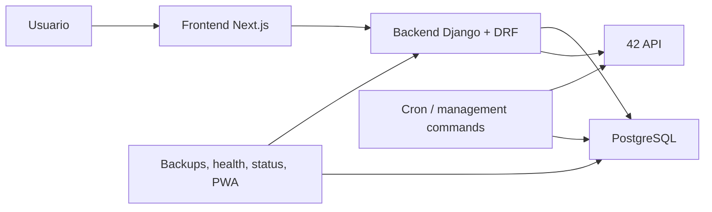

# Manual técnico completo del proyecto

## 1. Propósito del manual

Este documento une la arquitectura completa del proyecto en una sola guía de estudio. No sustituye a los documentos especializados de `doc/`, pero sí los organiza y los conecta para que sirvan como manual maestro antes de generar HTML visuales o presentaciones.

Problema que resuelve:

- tener una visión global del sistema sin saltar entre once documentos desde el minuto uno;
- disponer de un orden de lectura y de defensa técnica;
- resumir cómo se relacionan infraestructura, backend, base de datos, auth, sync, coalitions, corrections, frontend y GGC-83.

Documentos base que amplía o conecta:

- [doc/project-codebase-map.md](/home/aurodrig/Desktop/arepa/doc/project-codebase-map.md:1)
- [doc/infra-explained.md](/home/aurodrig/Desktop/arepa/doc/infra-explained.md:1)
- [doc/backend-config-explained.md](/home/aurodrig/Desktop/arepa/doc/backend-config-explained.md:1)
- [doc/database-models-explained.md](/home/aurodrig/Desktop/arepa/doc/database-models-explained.md:1)
- [doc/auth-flow-explained.md](/home/aurodrig/Desktop/arepa/doc/auth-flow-explained.md:1)
- [doc/sync-42-api-explained.md](/home/aurodrig/Desktop/arepa/doc/sync-42-api-explained.md:1)
- [doc/coalitions-feature-explained.md](/home/aurodrig/Desktop/arepa/doc/coalitions-feature-explained.md:1)
- [doc/corrections_explained.md](/home/aurodrig/Desktop/arepa/doc/corrections_explained.md:1)
- [doc/ggc-83-technical-explanation.md](/home/aurodrig/Desktop/arepa/doc/ggc-83-technical-explanation.md:1)
- [doc/frontend-architecture-explained.md](/home/aurodrig/Desktop/arepa/doc/frontend-architecture-explained.md:1)

## 2. Arquitectura general



Lectura correcta:

- el frontend habla con Django;
- Django sirve APIs internas y usa la DB local como fuente de verdad;
- la API de 42 alimenta principalmente procesos de sync, no la UI directamente;
- GGC-83 añade salud operativa, backups, restore y PWA básica.

## 3. Infraestructura y arranque

Archivos clave:

- [docker-compose.dev.yml](/home/aurodrig/Desktop/arepa/docker-compose.dev.yml:1)
- [Makefile](/home/aurodrig/Desktop/arepa/Makefile:1)
- [backend/Dockerfile.dev](/home/aurodrig/Desktop/arepa/backend/Dockerfile.dev:1)
- [frontend/Dockerfile.dev](/home/aurodrig/Desktop/arepa/frontend/Dockerfile.dev:1)
- [backend/entrypoint.sh](/home/aurodrig/Desktop/arepa/backend/entrypoint.sh:1)
- [backend/.env.example](/home/aurodrig/Desktop/arepa/backend/.env.example:1)

Servicios:

| Servicio | Puerto | Papel |
|---|---|---|
| Frontend | `3000` | UI Next.js |
| Backend | `8000` | APIs Django/DRF |
| DB | `5432` interno | PostgreSQL local |

Comandos base:

```bash
make full-up
make back-migrate
make front-logs
make back-logs
```

Pseudocódigo local:

```text
FUNCIÓN levantar_proyecto():

    construir frontend, backend y db
    esperar health de la base
    arrancar backend
    arrancar frontend
    aplicar migraciones si hace falta
    abrir UI y APIs locales
```

## 4. Backend y flujo de request

Archivos de entrada:

- [backend/manage.py](/home/aurodrig/Desktop/arepa/backend/manage.py:1)
- [backend/config/settings/settings.py](/home/aurodrig/Desktop/arepa/backend/config/settings/settings.py:160)
- [backend/config/urls.py](/home/aurodrig/Desktop/arepa/backend/config/urls.py:1)
- [backend/config/views.py](/home/aurodrig/Desktop/arepa/backend/config/views.py:1)

Qué hace el backend:

- enruta `/api/auth/`, `/api/coalitions/`, `/api/users/`, `/api/status/`, `/api/health/`;
- autentica usando cookies JWT;
- sirve datos desde la base local;
- orquesta el callback OAuth;
- expone observabilidad básica.

Flujo corto de una request:

1. El navegador golpea un endpoint interno.
2. Django resuelve `urls.py`.
3. DRF aplica auth y permisos.
4. La view llama servicios o consulta modelos.
5. PostgreSQL responde.
6. Django serializa JSON y responde al frontend.

## 5. Modelos y base de datos

Modelos más importantes:

| Modelo | Papel |
|---|---|
| `User` | Auth interna Django |
| `CampusUser` | Perfil sincronizado desde 42 |
| `Coalition` | Estado actual de cada coalición |
| `CoalitionScoreSnapshot` | Histórico de score por coalición |
| `CampusUserScoreSnapshot` | Histórico individual |
| `CoalitionProjectCursor` | Incremental de proyectos |
| `CoalitionEvaluationCursor` | Incremental de correcciones |
| `SyncMetadata` | Metadatos del sync |
| `FriendsList` | Relaciones sociales de la app |
| `UserPreferences` | Configuración y avatar custom |

Idea clave:

- la fuente de verdad funcional para la app no es la API de 42 en vivo, sino PostgreSQL local.

## 6. Auth y sesión

Archivos clave:

- [backend/authentication/views.py](/home/aurodrig/Desktop/arepa/backend/authentication/views.py:24)
- [backend/authentication/authentication.py](/home/aurodrig/Desktop/arepa/backend/authentication/authentication.py:7)
- [frontend/lib/authApi.ts](/home/aurodrig/Desktop/arepa/frontend/lib/authApi.ts:29)
- [frontend/hooks/useAuth.ts](/home/aurodrig/Desktop/arepa/frontend/hooks/useAuth.ts:59)
- [frontend/components/AuthLayout.tsx](/home/aurodrig/Desktop/arepa/frontend/components/AuthLayout.tsx:35)

Resumen:

- login por OAuth 42;
- callback backend valida `state`, intercambia `code`, consulta `/v2/me`;
- crea o actualiza `User` y `CampusUser`;
- emite cookies `HttpOnly`;
- el frontend usa `authFetch` y `initializeAuth`.

## 7. Sync, snapshots y cursores

Archivos clave:

- [backend/sync/services.py](/home/aurodrig/Desktop/arepa/backend/sync/services.py:1)
- [backend/sync/projects.py](/home/aurodrig/Desktop/arepa/backend/sync/projects.py:1)
- [backend/sync/evaluations.py](/home/aurodrig/Desktop/arepa/backend/sync/evaluations.py:1)
- [backend/sync/management/commands/sync_campus_users.py](/home/aurodrig/Desktop/arepa/backend/sync/management/commands/sync_campus_users.py:1)
- [backend/sync/management/commands/sync_project_stats.py](/home/aurodrig/Desktop/arepa/backend/sync/management/commands/sync_project_stats.py:1)
- [backend/sync/management/commands/sync_evaluation_score_events.py](/home/aurodrig/Desktop/arepa/backend/sync/management/commands/sync_evaluation_score_events.py:1)

Qué sincroniza:

- usuarios;
- coaliciones;
- puntos;
- proyectos;
- correcciones;
- snapshots;
- metadatos del último sync.

Lectura clave:

- hay sync “caro” de base y sync incremental posterior;
- snapshots sirven para histórico;
- cursores sirven para no recalcular eventos ya vistos.

## 8. Coalitions, leaderboard y corrections

Rutas funcionales principales:

- `/coalitions`
- `/coalitions/[name]`
- `/leaderboard`

Backend:

- [backend/coalitions/services.py](/home/aurodrig/Desktop/arepa/backend/coalitions/services.py:167)
- [backend/coalitions/views.py](/home/aurodrig/Desktop/arepa/backend/coalitions/views.py:1)

Frontend:

- [frontend/lib/coalitionApi.ts](/home/aurodrig/Desktop/arepa/frontend/lib/coalitionApi.ts:79)
- [frontend/hooks/useCoalition.ts](/home/aurodrig/Desktop/arepa/frontend/hooks/useCoalition.ts:57)
- [frontend/hooks/useLeaderboard.ts](/home/aurodrig/Desktop/arepa/frontend/hooks/useLeaderboard.ts:106)

Qué muestran:

- score actual por coalición;
- evoluciones históricas cuando hay snapshots;
- ranking de usuarios por puntos o por correcciones;
- totales agregados de proyectos y evaluaciones.

## 9. Frontend y App Router

Piezas más importantes:

- [frontend/app/layout.tsx](/home/aurodrig/Desktop/arepa/frontend/app/layout.tsx:24)
- [frontend/components/AuthLayout.tsx](/home/aurodrig/Desktop/arepa/frontend/components/AuthLayout.tsx:11)
- [frontend/app/status/page.tsx](/home/aurodrig/Desktop/arepa/frontend/app/status/page.tsx:17)
- [frontend/app/users/[login]/page.tsx](/home/aurodrig/Desktop/arepa/frontend/app/users/[login]/page.tsx:16)
- [frontend/components/ServiceWorkerRegistration.tsx](/home/aurodrig/Desktop/arepa/frontend/components/ServiceWorkerRegistration.tsx:9)

Idea central:

- App Router organiza páginas;
- `AuthLayout` protege rutas;
- `lib/*Api.ts` habla con Django;
- hooks/stores Zustand sostienen estado cliente;
- PWA y offline existen, pero con alcance deliberadamente limitado.

## 10. GGC-83 y operativa

Cubre:

- `/api/health/`
- `/api/status/`
- `/status`
- backup DB
- restore DB
- runbook de disaster recovery
- PWA/offline básico

Archivos clave:

- [scripts/backup_db.sh](/home/aurodrig/Desktop/arepa/scripts/backup_db.sh:1)
- [scripts/restore_db.sh](/home/aurodrig/Desktop/arepa/scripts/restore_db.sh:1)
- [frontend/app/manifest.ts](/home/aurodrig/Desktop/arepa/frontend/app/manifest.ts:1)
- [frontend/components/ServiceWorkerRegistration.tsx](/home/aurodrig/Desktop/arepa/frontend/components/ServiceWorkerRegistration.tsx:1)

## 11. Tabla global modelo → endpoint → frontend

| Dominio | Modelo o fuente | Endpoint backend | Consumo frontend |
|---|---|---|---|
| Auth | `User`, `CampusUser` | `/api/auth/profile/` | `useAuthStore`, `AuthLayout` |
| Status | `SyncMetadata` + checks DB | `/api/status/` | `statusApi.ts`, `/status` |
| Coalitions | `Coalition`, `CampusUser`, snapshots | `/api/coalitions/`, `/api/coalitions/details/` | `coalitionApi.ts`, `useCoalitionStore` |
| Leaderboard | `CampusUser` | `/api/coalitions/users-ranking/` | `useLeaderboard`, `LeaderboardView` |
| Perfil usuario | `CampusUser`, `FriendsList`, `UserPreferences` | `/api/users/details/`, endpoints friends/preferences | `useUserStore`, `/users/[login]` |
| Correcciones | `CampusUser`, `CoalitionEvaluationCursor` | endpoints de coalitions ranking/listado | leaderboard y cards de coalición |

## 12. Cómo levantar y probar

Secuencia recomendada:

```bash
make full-up
make back-migrate
curl http://localhost:8000/api/health/
curl http://localhost:8000/api/status/
```

Pruebas mínimas:

1. Abrir `/status`.
2. Hacer login con 42.
3. Abrir `/coalitions`.
4. Abrir `/leaderboard`.
5. Abrir `/users/<login>`.
6. Lanzar al menos un comando de sync.
7. Verificar `last_sync`.

## 13. Riesgos y limitaciones reales

- OAuth depende de `.env` y de 42.
- Si el sync está viejo, la app enseña datos viejos aunque la UI funcione.
- Los históricos dependen de snapshots existentes.
- Los incrementales dependen de cursores bien posicionados.
- El frontend persiste una “huella” de usuario, pero la sesión real la confirma el backend.
- El offline es parcial, no una versión completa desconectada de la app.

## 14. Qué puedo decir en evaluación

> El proyecto está dividido en frontend Next.js, backend Django/DRF y PostgreSQL, todo orquestado con Docker Compose y Make.

> La app no consulta la API de 42 directamente desde el navegador; sincroniza datos a una base local y luego sirve la UI desde ahí.

> `CampusUser` es el centro del dominio, `User` resuelve auth, y `Coalition` representa el estado actual de cada coalición.

> Health, status, backups, restore y PWA básica forman la parte operativa añadida en GGC-83.

## 15. Orden recomendado de lectura

1. `project-codebase-map.md`
2. `infra-explained.md`
3. `backend-config-explained.md`
4. `database-models-explained.md`
5. `auth-flow-explained.md`
6. `sync-42-api-explained.md`
7. `coalitions-feature-explained.md`
8. `corrections_explained.md`
9. `frontend-architecture-explained.md`
10. `ggc-83-technical-explanation.md`
11. este manual global, para repaso final

## 16. Checklist final

- [ ] Entiendo cómo se levanta el stack
- [ ] Entiendo el rol del backend y de la DB local
- [ ] Entiendo la diferencia entre `User` y `CampusUser`
- [ ] Entiendo snapshots y cursores
- [ ] Entiendo OAuth 42 y cookies JWT
- [ ] Entiendo cómo la UI carga coaliciones, rankings y perfiles
- [ ] Entiendo qué cubre GGC-83
- [ ] Tengo claro qué comandos usar para diagnosticar

## 17. Pseudocódigo global del proyecto

```text
FUNCIÓN proyecto_aedlph():

    levantar frontend, backend y db
    configurar Django y auth por cookies

    SI el usuario inicia sesión:
        ejecutar OAuth 42
        crear o actualizar User y CampusUser
        bootstrapear sesión en frontend

    periódicamente:
        sincronizar datos desde 42 a PostgreSQL
        crear snapshots
        avanzar cursores incrementales
        tocar last_sync

    para cada pantalla:
        frontend llama al backend
        backend consulta base local
        frontend renderiza coaliciones, leaderboard, perfil o status

    operativamente:
        exponer health/status
        permitir backups, restore y modo offline básico
```

## 18. Quiz final tipo test (25 preguntas)

### 1. ¿Cuál es la arquitectura base del proyecto?
- A. React + Firebase + MongoDB
- B. Next.js + Django/DRF + PostgreSQL
- C. Vue + Flask + Redis
- D. Astro + FastAPI + SQLite
- Respuesta correcta: B
- Explicación: ese es el stack real del repo.

### 2. ¿Qué servicio sirve la UI al usuario final?
- A. PostgreSQL
- B. Backend Django
- C. Frontend Next.js
- D. Cron
- Respuesta correcta: C
- Explicación: la interfaz visible sale del contenedor frontend.

### 3. ¿Dónde está la fuente de verdad funcional de la app?
- A. En la API de 42 en tiempo real
- B. En `localStorage`
- C. En PostgreSQL local alimentado por sync
- D. En el service worker
- Respuesta correcta: C
- Explicación: la UI consulta el backend local, no 42 directamente.

### 4. ¿Qué modelo resuelve la auth interna?
- A. `CampusUser`
- B. `User`
- C. `Coalition`
- D. `SyncMetadata`
- Respuesta correcta: B
- Explicación: la app usa el `User` builtin de Django.

### 5. ¿Qué modelo es el centro del dominio funcional?
- A. `FriendsList`
- B. `SyncMetadata`
- C. `CampusUser`
- D. `UserPreferences`
- Respuesta correcta: C
- Explicación: concentra identidad y métricas sincronizadas desde 42.

### 6. ¿Qué capa protege rutas privadas en frontend?
- A. `StatusPage`
- B. `AuthLayout`
- C. `ThemeProvider`
- D. `Footer`
- Respuesta correcta: B
- Explicación: `AuthLayout` decide acceso y redirects.

### 7. ¿Qué componente del backend expone el estado operativo extendido?
- A. `/api/auth/profile/`
- B. `/api/status/`
- C. `/api/users/details/`
- D. `/api/auth/42/login/`
- Respuesta correcta: B
- Explicación: ese endpoint resume backend, DB y último sync.

### 8. ¿Qué objetivo tienen los snapshots?
- A. Sustituir a `CampusUser`
- B. Guardar histórico para comparaciones temporales
- C. Guardar cookies
- D. Registrar logs de Docker
- Respuesta correcta: B
- Explicación: capturan fotos históricas de scores.

### 9. ¿Qué objetivo tienen los cursores?
- A. Mejorar CSS
- B. Evitar reprocesar eventos antiguos en sync incremental
- C. Crear usuarios admin
- D. Hacer login manual
- Respuesta correcta: B
- Explicación: marcan la frontera ya sincronizada.

### 10. ¿Qué comando aplica migraciones?
- A. `make front-up`
- B. `make db-backup`
- C. `make back-migrate`
- D. `make full-stop`
- Respuesta correcta: C
- Explicación: ese target ejecuta `python manage.py migrate`.

### 11. ¿Qué documento explica en detalle OAuth 42 y cookies JWT?
- A. `infra-explained.md`
- B. `auth-flow-explained.md`
- C. `README_CUSTOM_MAJOR.md`
- D. `DESIGN_SYSTEM.md`
- Respuesta correcta: B
- Explicación: es el documento especializado de auth.

### 12. ¿Qué documento explica snapshots, cursores y modelos?
- A. `database-models-explained.md`
- B. `frontend-architecture-explained.md`
- C. `disaster-recovery.md`
- D. `Functional_Requirements.md`
- Respuesta correcta: A
- Explicación: ahí vive el mapa del modelo de datos.

### 13. ¿Qué comando crea un backup de base de datos?
- A. `make back-shell`
- B. `make db-backup`
- C. `make front-logs`
- D. `make dev-re`
- Respuesta correcta: B
- Explicación: llama a `scripts/backup_db.sh`.

### 14. ¿Qué parte de GGC-83 cubre PWA y offline básico?
- A. Solo auth
- B. Observabilidad de sync
- C. La parte operativa del frontend
- D. Las migraciones
- Respuesta correcta: C
- Explicación: añade manifest, SW y página offline.

### 15. ¿Qué vista frontend muestra salud real del sistema?
- A. `/users/[login]`
- B. `/status`
- C. `/leaderboard`
- D. `/coalitions/[name]`
- Respuesta correcta: B
- Explicación: consume `/api/status/`.

### 16. ¿Cuál es la relación correcta entre frontend y 42?
- A. El frontend consulta a 42 directamente
- B. El frontend consulta el backend local, que usa datos sincronizados
- C. El frontend escribe en la API de 42
- D. El frontend sustituye al sync
- Respuesta correcta: B
- Explicación: la UI no depende de llamadas directas a 42.

### 17. ¿Qué ocurre si el sync está muy desactualizado?
- A. La app no arranca nunca
- B. La UI puede funcionar pero con datos viejos
- C. Docker se borra
- D. El login deja de existir automáticamente
- Respuesta correcta: B
- Explicación: la capa funcional depende de la frescura de la base local.

### 18. ¿Qué capa convierte `snake_case` del backend en `camelCase` de UI?
- A. PostgreSQL
- B. `frontend/lib/*Api.ts`
- C. `AuthLayout`
- D. `Makefile`
- Respuesta correcta: B
- Explicación: la traducción del contrato se hace en la capa API cliente.

### 19. ¿Qué archivo raíz del backend define auth y permisos por defecto en DRF?
- A. `backend/config/settings/settings.py`
- B. `backend/manage.py`
- C. `backend/entrypoint.sh`
- D. `backend/config/wsgi.py`
- Respuesta correcta: A
- Explicación: ahí vive `REST_FRAMEWORK`.

### 20. ¿Qué relación es correcta entre `Coalition` y `CampusUser`?
- A. No tienen ninguna relación funcional
- B. `CampusUser` guarda datos denormalizados de coalición y `Coalition` guarda el estado actual agregado
- C. `Coalition` reemplaza al usuario
- D. `CampusUser` solo se usa para auth
- Respuesta correcta: B
- Explicación: ambos participan en el dominio, pero con papeles distintos.

### 21. ¿Qué documento es el más adecuado para estudiar correcciones incrementales?
- A. `corrections_explained.md`
- B. `infra-explained.md`
- C. `Design_Requirements.md`
- D. `README_CUSTOM_MAJOR.md`
- Respuesta correcta: A
- Explicación: está centrado en conteo completo e incremental de evaluaciones.

### 22. ¿Qué comando abre shell Django dentro del entorno?
- A. `make stop`
- B. `make shell`
- C. `make db-backup-ls`
- D. `make front-up`
- Respuesta correcta: B
- Explicación: `shell` es alias de `back-shell`.

### 23. ¿Qué riesgo existe en restore de base?
- A. Ninguno, es reversible automáticamente
- B. Es destructivo sobre el estado actual si se usa mal
- C. Solo cambia CSS
- D. Solo afecta a frontend
- Respuesta correcta: B
- Explicación: el restore pisa el contenido lógico de la base.

### 24. ¿Cuál es el mejor orden de estudio técnico?
- A. Empezar por CSS y luego por migraciones
- B. Infra -> backend -> modelos -> auth -> sync -> features -> operativa
- C. Solo leer el service worker
- D. Empezar por tests E2E inexistentes
- Respuesta correcta: B
- Explicación: sigue la dependencia natural del sistema.

### 25. ¿Qué hace este manual global?
- A. Sustituye al código
- B. Reúne y conecta todos los documentos técnicos para repaso y defensa
- C. Ejecuta migraciones
- D. Genera automáticamente el HTML visual
- Respuesta correcta: B
- Explicación: su propósito es servir como guía maestra de estudio.
