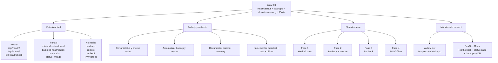

# GGC-83 - Health/status + backups + disaster recovery + PWA

## Resumen ejecutivo

La tarea **GGC-83** está **parcialmente iniciada** pero lejos de poder darse por cerrada. La estimación conservadora del estado real del repositorio es de **aproximadamente un 25% completado** si se cuenta el working tree actual, y algo menos si se considera solo lo ya consolidado en git.

La parte más madura es el bloque de **health/status en backend**:

- existe un endpoint `/api/health/` con comprobación real de base de datos;
- existe un endpoint `/api/status/` con `service`, `status`, `database`, `last_sync` y `timestamp`;
- Docker ya tiene `healthcheck` funcional para PostgreSQL.

El resto del alcance sigue incompleto o solo preparado a medias:

- la página frontend `/status` existe localmente, pero no está cerrada como funcionalidad entregable;
- el estado expuesto hoy no cubre todas las dependencias relevantes;
- no existen backups automáticos de PostgreSQL;
- no existe script de restore;
- no existe runbook de disaster recovery;
- no hay manifest PWA, service worker, installability ni soporte offline.

## Estado actual

### Hecho

- Backend `/api/health/`.
- Backend `/api/status/`.
- `healthcheck` real de PostgreSQL en Docker.

### Parcial

- Página frontend `/status` existente en el working tree.
- Cliente frontend para consultar `/api/status/`.
- Enlace de navegación a `/status` preparado localmente.
- `healthcheck` del backend previsto, pero comentado en `docker-compose.dev.yml`.
- Status actual limitado a `backend + database + last_sync`.
- Scheduler de sincronización existente, pero no integrado como señal explícita de salud en `/api/status/`.

### No hecho

- PWA manifest.
- Service Worker.
- App installable.
- Offline básico para vistas clave.
- Backups automáticos de PostgreSQL.
- Script de restore.
- Runbook de disaster recovery.

## Archivos relacionados

### Backend health/status

- `backend/config/views.py`
- `backend/config/urls.py`
- `backend/sync/models.py`
- `backend/sync/services.py`
- `backend/config/settings/settings.py`

### Docker y entorno operativo

- `docker-compose.dev.yml`
- `backend/Dockerfile.dev`
- `backend/entrypoint.sh`
- `backend/cron_scheduler/apps.py`
- `Makefile`

### Frontend status

- `frontend/app/status/page.tsx`
- `frontend/lib/statusApi.ts`
- `frontend/components/AuthLayout.tsx`
- `frontend/components/NavLink.tsx`
- `frontend/app/layout.tsx`

### Pendientes por crear

- `scripts/backup_db.sh`
- `scripts/restore_db.sh`
- `doc/disaster-recovery.md`
- `frontend/app/manifest.ts` o `frontend/public/site.webmanifest`
- `frontend/public/sw.js`
- iconos PWA `192x192` y `512x512`

## Diagrama Mermaid

## Plan por fases

### Fase 1 - Health/status

Objetivo: convertir el bloque actual de observabilidad básica en una funcionalidad demostrable.

- trackear `frontend/app/status/page.tsx`;
- trackear `frontend/lib/statusApi.ts`;
- decidir si `/status` debe ser pública o protegida;
- si debe ser pública, permitir `/status` en `AuthLayout`;
- activar el `healthcheck` del backend en `docker-compose.dev.yml`;
- ampliar `/api/status/` para reflejar dependencias reales cuando aplique: base de datos, API externa, frescura del último sync y señal útil del scheduler;
- añadir tests del backend para `/api/health/` y `/api/status/`.

### Fase 2 - Backups + restore

Objetivo: disponer de una recuperación operativa mínima y demostrable.

- crear `scripts/backup_db.sh`;
- crear `scripts/restore_db.sh`;
- añadir targets en `Makefile`, por ejemplo `db-backup` y `db-restore`;
- definir directorio de backups y convención de nombres;
- definir una política mínima de retención;
- probar el restore sobre una base de datos limpia o reinicializada.

### Fase 3 - Runbook

Objetivo: documentar el procedimiento de recuperación para que no dependa de memoria implícita del equipo.

- crear `doc/disaster-recovery.md`;
- documentar síntomas de caída o corrupción;
- documentar backup manual;
- documentar restore paso a paso;
- documentar smoke checks post-restore;
- documentar rollback o pasos de contención si algo falla.

### Fase 4 - PWA/offline

Objetivo: cerrar el módulo PWA con una implementación simple pero demostrable.

- crear manifest PWA;
- añadir iconos adecuados;
- registrar un service worker;
- definir qué vistas clave deben tener caché;
- añadir fallback offline básico;
- asegurar que el service worker no rompa el entorno de desarrollo;
- probar installability y experiencia offline en navegador compatible.

## Relación con los módulos del subject

### Web Minor: Progressive Web App

Este módulo exige evidencia real de:

- manifest;
- service worker;
- installability;
- comportamiento offline razonable.

**Estado actual:** **no reclamable**.

Motivo:

- no existe manifest en el repo;
- no existe service worker;
- no existe flujo instalable demostrable;
- no existe fallback offline ni caché de vistas clave.

### DevOps Minor: Health check and status page system with automated backups and disaster recovery procedures

Este módulo exige evidencia real de:

- health checks;
- status page;
- backups automáticos;
- restore;
- procedimiento de disaster recovery.

**Estado actual:** **no reclamable**.

Motivo:

- el backend tiene base de health/status, pero la solución no está cerrada end-to-end;
- la status page frontend sigue parcial y local;
- el backend healthcheck de Docker no está activo;
- no existen backups automáticos;
- no existe restore probado;
- no existe runbook de recuperación.

### Conclusión sobre el subject

La tarea GGC-83 puede cubrir dos módulos relevantes del subject, pero **todavía no permite reclamarlos** con seguridad en evaluación. Para poder hacerlo, primero hay que cerrar health/status, disponer de backup y restore probados, documentar disaster recovery e implementar la parte PWA/offline de forma demostrable.

## Definition of Done

La tarea **GGC-83** se considerará terminada cuando se cumplan todos estos puntos:

- un evaluador puede abrir `/status` y ver estado real del sistema;
- Docker usa `healthchecks` reales al menos para base de datos y backend;
- `/api/status/` refleja dependencias útiles y no solo señales internas decorativas;
- existe un comando reproducible para generar backup;
- existe un comando reproducible para restaurar la base de datos;
- el restore ha sido probado y verificado;
- existe un runbook claro de disaster recovery;
- la app expone manifest válido;
- la app registra un service worker funcional;
- la app es instalable en navegador compatible;
- la app ofrece una experiencia offline básica para vistas seleccionadas.

## Checklist final

- [x] Existe `/api/health/`.
- [x] Existe `/api/status/`.
- [x] PostgreSQL tiene `healthcheck` en Docker.
- [ ] `/status` frontend está trackeada e integrada.
- [ ] `/status` es accesible según la política final del equipo.
- [ ] `healthcheck` del backend está activo en Docker.
- [ ] `/api/status/` refleja estado real de dependencias clave.
- [ ] Existe backup automático o automatizable mediante comando estándar.
- [ ] Existe script de restore.
- [ ] El restore está probado.
- [ ] Existe runbook de disaster recovery.
- [ ] Existe manifest PWA.
- [ ] Existe service worker.
- [ ] La app es instalable.
- [ ] Existe offline básico para vistas clave.
- [ ] El módulo DevOps es demostrable en evaluación.
- [ ] El módulo PWA es demostrable en evaluación.

## Riesgos de evaluación

- **Status page con datos insuficientes**: si `/api/status/` solo valida DB y muestra `last_sync`, puede parecer más completo de lo que realmente es.
- **`/status` bloqueado por autenticación**: si el evaluador espera una página pública y el layout actual la redirige al login, el entregable queda discutible.
- **Diferencia entre working tree y git**: parte del frontend de `/status` existe localmente, pero no está consolidado en el historial del repo.
- **Backups no probados**: escribir un script no equivale a demostrar recuperación.
- **Restore no validado**: sin prueba real, no hay garantía operativa.
- **Runbook ausente**: sin procedimiento documentado, el módulo de disaster recovery queda incompleto.
- **Service Worker mal configurado**: puede cachear assets defectuosos y complicar desarrollo o demo.
- **PWA no instalable**: sin HTTPS, manifest, iconos y service worker válidos, el navegador no ofrecerá instalación.
- **Dependencia externa no monitorizada**: la API de 42 puede fallar y el sistema seguir mostrando `ok` si no se añade un check específico.
- **Falsa sensación de salud del scheduler**: un `last_sync` antiguo puede pasar desapercibido si no se evalúa su frescura.
