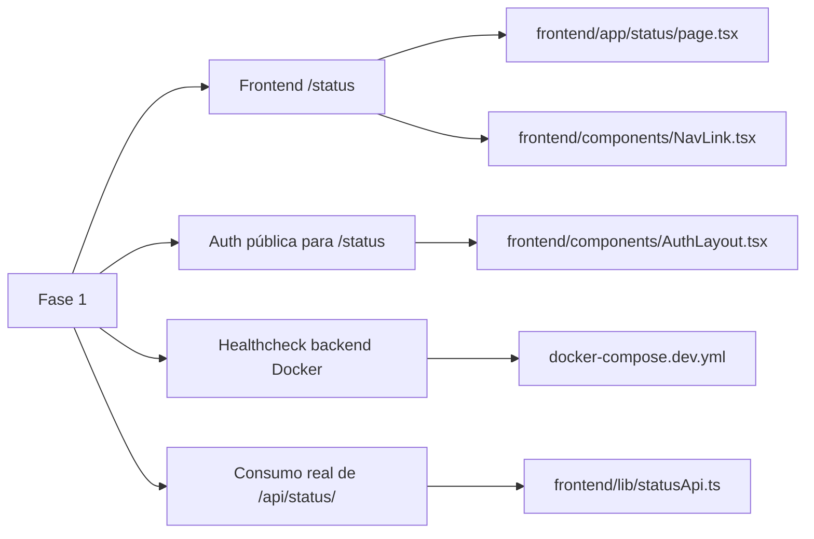
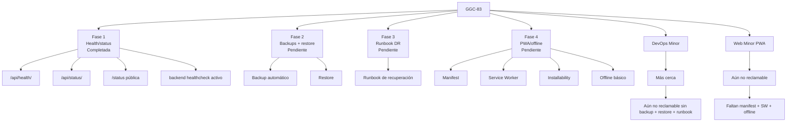
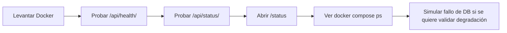

# GGC-83 - Progreso tras Fase 1: Health/status

## Resumen ejecutivo

La **Fase 1 de GGC-83** se ha centrado exclusivamente en **cerrar el bloque de health/status** para que sea demostrable en evaluación desde backend, Docker y frontend.

### Panel de progreso

| Indicador | Estado |
|---|---|
| Alcance cerrado en esta fase | `Health/status` |
| Avance estimado total de GGC-83 | `~40%` |
| Estado del bloque health/status | `Mayormente completado` |
| Estado de backups/restore/runbook | `Pendiente` |
| Estado de PWA/offline | `Pendiente` |

### Barra de avance

```text
GGC-83 total        [████████░░░░░░░░░░] ~40%
Fase 1 health/status[██████████████████] Completada
Fase 2 backups      [░░░░░░░░░░░░░░░░░░] Pendiente
Fase 3 runbook      [░░░░░░░░░░░░░░░░░░] Pendiente
Fase 4 PWA/offline  [░░░░░░░░░░░░░░░░░░] Pendiente
```

### Qué queda fuera de esta fase

Siguen pendientes y no se han tocado en esta fase:

- backups automáticos;
- script de restore;
- runbook de disaster recovery;
- manifest PWA;
- service worker;
- installability;
- soporte offline básico.

## Estado antes de la Fase 1

### Resumen visual

| Elemento | Situación antes de Fase 1 |
|---|---|
| `/api/health/` | Ya existía |
| `/api/status/` | Ya existía |
| Healthcheck PostgreSQL | Activo |
| `/status` frontend | Existía localmente, no consolidada |
| Acceso a `/status` | Protegido por auth |
| Healthcheck backend | Comentado |
| Estado real mostrado | Limitado a backend + DB + `last_sync` |

### Detalle breve

- `/api/health/` ya comprobaba la base de datos.
- `/api/status/` ya devolvía `service`, `status`, `database`, `last_sync` y `timestamp`.
- PostgreSQL ya tenía `healthcheck` en `docker-compose.dev.yml`.
- La página `/status` existía en el working tree, pero no estaba cerrada como funcionalidad consolidada.
- `AuthLayout` impedía ver `/status` sin autenticación.
- Docker no supervisaba realmente la salud del backend porque el `healthcheck` seguía comentado.
- El status real era útil, pero todavía limitado y no estaba bien expuesto de cara a evaluación.

## Cambios realizados en la Fase 1

### Matriz de cambios

| Archivo | Acción | Qué se cambió | Por qué era necesario | Cómo ayuda a GGC-83 |
|---|---|---|---|---|
| `frontend/app/status/page.tsx` | Creado / integrado | Se consolidó la página `/status` y su carga de estado vía `fetchSystemStatus()` | La status page existía de forma local, pero no estaba cerrada | Aporta la pieza visible del sistema de status |
| `frontend/lib/statusApi.ts` | Creado / integrado | Se definió el cliente frontend que consulta `GET /api/status/` | Había que garantizar consumo de datos reales y no mock | Conecta la UI con el backend real |
| `frontend/components/AuthLayout.tsx` | Modificado | Se añadió `"/status"` a `PUBLIC_ROUTES` | `/status` no servía para evaluación si exigía login | Hace accesible la status page sin autenticación |
| `frontend/components/NavLink.tsx` | Revisado | Se mantiene el enlace a `/status` en navegación | La ruta debía quedar integrada y visible | Mejora la trazabilidad funcional del entregable |
| `docker-compose.dev.yml` | Modificado | Se activó el `healthcheck` del backend contra `/api/health/` | El check existía solo como comentario | Convierte la salud del backend en señal operativa real |
| `backend/config/views.py` | Sin cambios | Mantiene `/api/health/` y `/api/status/` | Sigue siendo la base backend del bloque | Proporciona los datos reales del status |
| `backend/config/urls.py` | Sin cambios | Mantiene expuestas las rutas `/api/health/` y `/api/status/` | El frontend depende de estas rutas | Deja estable la entrada HTTP del sistema |
| Tests específicos | No añadidos | No se incorporaron tests automáticos nuevos | Se priorizó cierre funcional y validación operativa | Sigue siendo una deuda técnica |
| `doc/ggc-83-health-status-backups-pwa.md` | Referencia | Sigue siendo el documento madre de auditoría y planificación | Da contexto completo de la tarea | Complementa el progreso de fase |

### Vista por impacto



## Tabla comparativa Antes vs Después

| Elemento | Antes | Después | Estado actual |
|---|---|---|---|
| Backend `/api/health/` | Existía y comprobaba DB | Sigue operativo y validado | `Hecho` |
| Backend `/api/status/` | Existía y devolvía estado básico | Sigue operativo y alimenta el frontend | `Hecho` |
| Página frontend `/status` | Existía localmente pero no consolidada | Integrada como página funcional | `Hecho` |
| Acceso a `/status` | Protegido por auth | Accesible sin login | `Hecho` |
| Healthcheck PostgreSQL | Activo en Docker | Sigue activo | `Hecho` |
| Healthcheck backend Docker | Comentado | Activado | `Hecho` |
| Estado real de servicios | Limitado a backend + DB + `last_sync` | Igual base funcional, ahora visible y demostrable en frontend | `Parcial` |
| Tests health/status | Sin tests específicos | Siguen sin tests específicos | `Parcial` |
| Documentación GGC-83 | Existía auditoría general | Hay auditoría + progreso de fase | `Parcial` |
| Backups | No implementados | Sin cambios | `No hecho` |
| Restore | No implementado | Sin cambios | `No hecho` |
| Runbook | No implementado | Sin cambios | `No hecho` |
| PWA/offline | No implementado | Sin cambios | `No hecho` |

## Checklist actualizado

### Health/status

- [x] `/api/health/` responde correctamente.
- [x] `/api/status/` responde correctamente.
- [x] `/status` frontend integrada.
- [x] `/status` consume datos reales de `/api/status/`.
- [x] `/status` accesible según la decisión del equipo.
- [x] Healthcheck backend activo en Docker.

### Pendiente

- [ ] Backup automático.
- [ ] Script restore.
- [ ] Runbook disaster recovery.
- [ ] Manifest PWA.
- [ ] Service Worker.
- [ ] App instalable.
- [ ] Offline básico.

## Diagrama Mermaid actualizado



## Estado actual frente al subject

### Lectura rápida

| Módulo del subject | Estado | Motivo |
|---|---|---|
| DevOps Minor | `Más cerca, pero no reclamable` | Faltan backups, restore y runbook |
| Web Minor: PWA | `No reclamable` | No hay manifest, service worker ni offline |

### Qué sí se puede enseñar ya

- `GET /api/health/` funcionando.
- `GET /api/status/` funcionando.
- `healthcheck` de PostgreSQL.
- `healthcheck` del backend.
- `/status` accesible sin login.
- `/status` consumiendo estado real.
- degradación real de los endpoints cuando falla la base de datos.

### Qué sigue bloqueando la reclamación

**DevOps minor**

- no hay backup automático;
- no hay restore probado;
- no hay runbook operativo.

**PWA minor**

- no hay manifest;
- no hay service worker;
- no hay installability;
- no hay offline básico.

## Cómo probar lo implementado en Fase 1

### Secuencia recomendada



### Comandos

#### 1. Levantar Docker

```bash
docker compose -f docker-compose.dev.yml up -d --build
```

O:

```bash
make full-up
```

#### 2. Probar `/api/health/`

```bash
curl -i http://localhost:8000/api/health/
```

#### 3. Probar `/api/status/`

```bash
curl -i http://localhost:8000/api/status/
```

#### 4. Abrir `/status`

Abrir en navegador:

```text
http://localhost:3000/status
```

Comprobar:

- que no redirige a `/login`;
- que carga la página;
- que refleja estado del sistema;
- que la request de red va contra `/api/status/`.

#### 5. Comprobar healthchecks

```bash
docker compose -f docker-compose.dev.yml ps
```

Inspección opcional del backend:

```bash
docker inspect $(docker compose -f docker-compose.dev.yml ps -q backend) --format='{{json .State.Health}}'
```

## Pendiente recomendado

### Roadmap recomendado

| Orden | Fase | Motivo |
|---|---|---|
| 1 | Fase 2: backups + restore | Es el siguiente hueco crítico del DevOps minor |
| 2 | Fase 3: runbook | Hace evaluable y repetible la recuperación |
| 3 | Fase 4: PWA/offline | Conviene atacarla después de estabilizar la parte operativa |

### Vista rápida

```text
Siguiente bloque recomendado:
1. Backups + restore
2. Runbook
3. PWA/offline
```

## Riesgos restantes

### Riesgos operativos

- **Backups no implementados**: el sistema sigue sin respaldo automático.
- **Restore no probado**: no hay garantía real de recuperación.
- **Runbook ausente**: la operativa sigue dependiendo de conocimiento implícito.

### Riesgos de la futura fase PWA

- **PWA ausente**: el bloque Progressive Web App sigue totalmente pendiente.
- **Service Worker mal implementado**: puede dejar caché obsoleta y complicar desarrollo o demo.

### Riesgos del bloque status

- **Status todavía insuficiente**: aunque ya es demostrable, sigue sin comprobar dependencias externas como la API de 42.
- **Frescura del scheduler todavía débil**: `last_sync` existe, pero la semántica de salud del planificador sigue siendo limitada.

## Snapshot final de la fase

| Área | Estado |
|---|---|
| Backend health endpoint | `Hecho` |
| Backend status endpoint | `Hecho` |
| Frontend `/status` | `Hecho` |
| `/status` pública | `Hecho` |
| Backend healthcheck Docker | `Hecho` |
| Cobertura automática con tests | `Parcial` |
| Backups / restore / runbook | `Pendiente` |
| PWA / offline | `Pendiente` |
