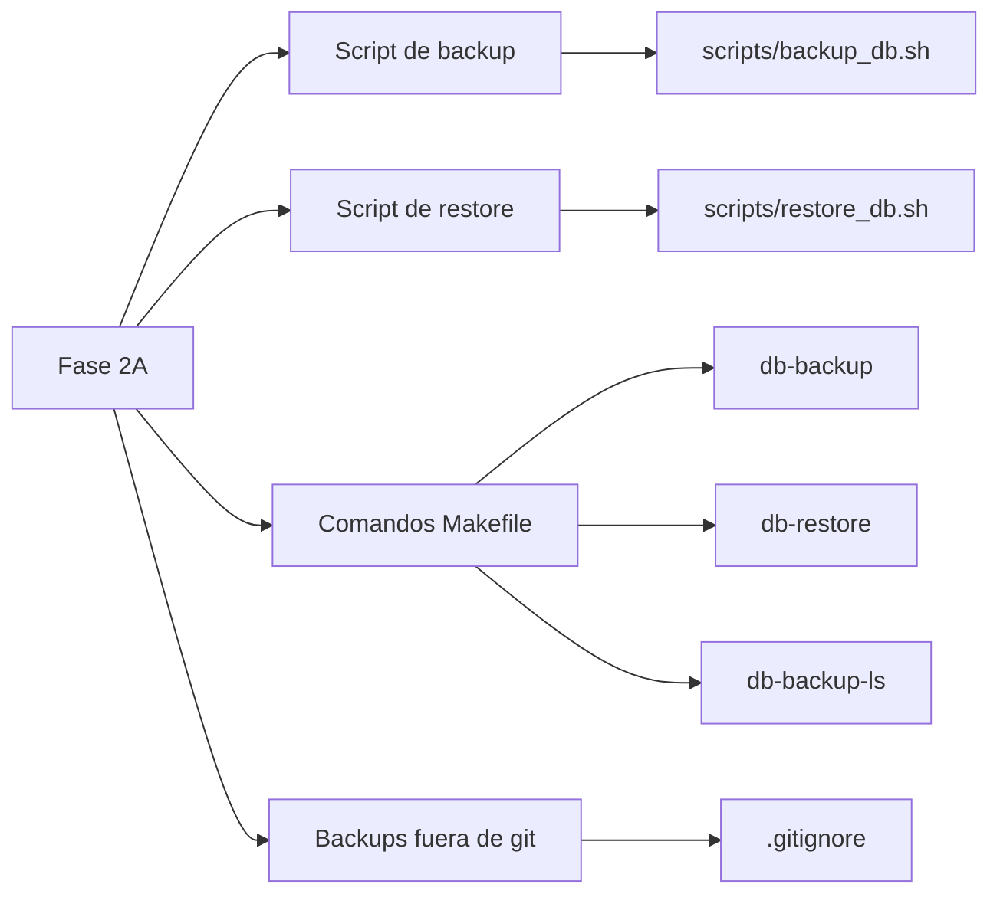
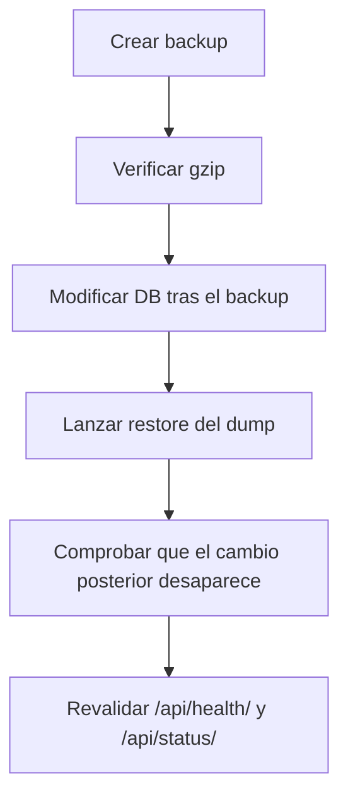
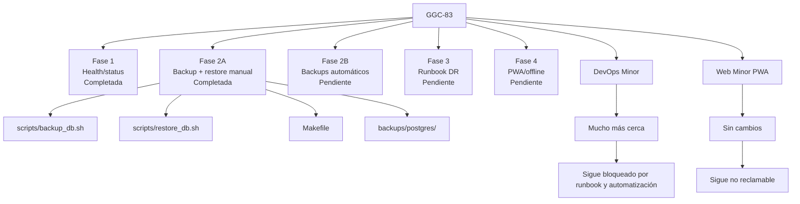
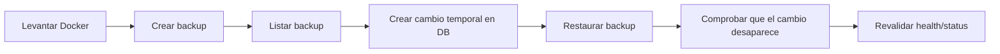

# GGC-83 - Progreso tras Fase 2A: Backup + restore manual

## Resumen ejecutivo

La **Fase 2A de GGC-83** se ha centrado en cerrar una primera versión **manual, demostrable y segura** del bloque de **backup + restore de PostgreSQL**.

El objetivo de esta fase no ha sido automatizar backups todavía, sino dejar una base operativa mínima que permita:

- generar un backup real de la base;
- validar que el artefacto resultante es correcto;
- restaurar un dump concreto de forma explícita;
- demostrar recuperación real del estado de la base.

### Panel de progreso

| Indicador | Estado |
|---|---|
| Alcance cerrado en esta fase | `Backup + restore manual` |
| Avance estimado total de GGC-83 | `~55%` |
| Estado del bloque health/status | `Completado` |
| Estado del bloque backup/restore | `Parcialmente completado` |
| Estado del runbook DR | `Pendiente` |
| Estado de PWA/offline | `Pendiente` |

### Barra de avance

```text
GGC-83 total              [███████████░░░░░░░] ~55%
Fase 1 health/status      [██████████████████] Completada
Fase 2A backup+restore    [██████████████░░░░] Cerrada manualmente
Fase 2B backups autom.    [░░░░░░░░░░░░░░░░░░] Pendiente
Fase 3 runbook DR         [░░░░░░░░░░░░░░░░░░] Pendiente
Fase 4 PWA/offline        [░░░░░░░░░░░░░░░░░░] Pendiente
```

### Qué queda fuera de esta fase

Siguen pendientes y no se han abordado en Fase 2A:

- automatización periódica de backups;
- política de retención;
- runbook de disaster recovery;
- manifest PWA;
- service worker;
- installability;
- soporte offline básico.

## Estado antes de la Fase 2A

### Resumen visual

| Elemento | Situación antes de Fase 2A |
|---|---|
| Backup PostgreSQL | No existía |
| Restore PostgreSQL | No existía |
| Comandos en `Makefile` | No existían |
| Validación gzip | No existía |
| Ruta de backups local | No existía |
| Ignorado en git | No configurado |

### Detalle breve

- el proyecto no tenía scripts dedicados para volcar PostgreSQL;
- no existía un flujo reproducible de restore desde línea de comandos;
- no había comandos cortos en `Makefile` para demo o evaluación;
- no había validación del artefacto `.sql.gz`;
- no había una carpeta estándar para almacenar dumps locales;
- la tarea seguía sin cubrir la parte operativa mínima del `DevOps minor`.

## Cambios realizados en la Fase 2A

### Matriz de cambios

| Archivo | Acción | Qué se cambió | Por qué era necesario | Cómo ayuda a GGC-83 |
|---|---|---|---|---|
| `scripts/backup_db.sh` | Creado | Script para ejecutar `pg_dump` dentro del contenedor `db`, comprimir el resultado y validarlo con `gzip -t` | Hacía falta un backup real y repetible de PostgreSQL | Cubre la mitad operativa del bloque backup/restore |
| `scripts/restore_db.sh` | Creado | Script para restaurar un `.sql.gz` concreto, exigir `BACKUP_FILE`, advertir que el proceso es destructivo y reiniciar backend si se detuvo | Hacía falta una recuperación demostrable y controlada | Cubre el restore real exigible en evaluación |
| `Makefile` | Modificado | Se añadieron `db-backup`, `db-restore BACKUP_FILE=...` y `db-backup-ls` | Los comandos tenían que ser fáciles de ejecutar y enseñar | Mejora la demo y la operativa local |
| `.gitignore` | Modificado | Se ignoró `backups/postgres/` | Los dumps no deben entrar en git | Reduce riesgo de subir artefactos innecesarios o sensibles |
| Backend de aplicación | Sin cambios | No se tocó Django de negocio | No hacía falta cambiar la app para esta fase | Mantiene el alcance acotado |
| Frontend | Sin cambios | No se tocó ningún componente | Esta fase era puramente operativa | Evita mezclar concerns |

### Vista por impacto



## Qué hace cada pieza

### `scripts/backup_db.sh`

Responsabilidad:

- comprobar dependencias locales;
- verificar que Docker y el servicio `db` están operativos;
- lanzar `pg_dump` dentro del contenedor;
- comprimir el SQL como `.sql.gz`;
- validar que el gzip no está corrupto;
- guardar el dump en `backups/postgres/`.

### `scripts/restore_db.sh`

Responsabilidad:

- exigir `BACKUP_FILE` explícito;
- comprobar que el backup existe y que el gzip es válido;
- advertir que el restore es destructivo;
- detener temporalmente `backend` si estaba corriendo;
- restaurar el SQL dentro del contenedor `db`;
- volver a arrancar `backend` al final.

### `Makefile`

Responsabilidad:

- exponer una interfaz corta y homogénea:
  - `make db-backup`
  - `make db-restore BACKUP_FILE=...`
  - `make db-backup-ls`

### `.gitignore`

Responsabilidad:

- dejar `backups/postgres/` fuera del control de versiones.

## Tabla comparativa Antes vs Después

| Elemento | Antes | Después | Estado actual |
|---|---|---|---|
| Backup PostgreSQL | No existía | Script manual funcional | `Hecho` |
| Restore PostgreSQL | No existía | Script manual funcional | `Hecho` |
| Validación gzip | No existía | `gzip -t` al final del backup y antes del restore | `Hecho` |
| Comando `db-backup` | No existía | Disponible en `Makefile` | `Hecho` |
| Comando `db-restore` | No existía | Disponible en `Makefile` con `BACKUP_FILE` obligatorio | `Hecho` |
| Listado de backups | No existía | `db-backup-ls` | `Hecho` |
| Carpeta estándar de backups | No existía | `backups/postgres/` | `Hecho` |
| Exclusión en git | No configurada | `backups/postgres/` ignorado | `Hecho` |
| Restore probado | No aplicaba | Probado de forma real con tabla marcador | `Hecho` |
| Backup automático | No existía | Sigue sin existir | `No hecho` |
| Política de retención | No existía | Sigue sin existir | `No hecho` |
| Runbook DR | No existía | Sigue sin existir | `No hecho` |
| PWA/offline | No existía | Sin cambios | `No hecho` |

## Validación realizada en Fase 2A

### Resumen

Esta fase no se quedó solo en scripts escritos: se validó operativamente.

### Pruebas ejecutadas

- creación real de backup con `make db-backup`;
- validación de integridad del `.sql.gz`;
- error controlado si falta `BACKUP_FILE`;
- error controlado si el backup no existe;
- restore real desde un dump válido;
- comprobación de recuperación con tabla marcador creada después del backup;
- revalidación de `/api/health/` y `/api/status/` tras restore;
- comprobación de `backend` y `db` en estado `healthy`.

### Evidencia funcional



## Checklist actualizado

### Health/status

- [x] `/api/health/` responde correctamente.
- [x] `/api/status/` responde correctamente.
- [x] `/status` frontend integrada.
- [x] `/status` consume datos reales de `/api/status/`.
- [x] `/status` accesible según la decisión del equipo.
- [x] Healthcheck backend activo en Docker.

### Backup + restore

- [x] Existe script de backup manual.
- [x] Existe script de restore manual.
- [x] El backup se guarda en `backups/postgres/`.
- [x] El backup se comprime como `.sql.gz`.
- [x] El backup valida gzip al terminar.
- [x] El restore exige `BACKUP_FILE`.
- [x] El restore avisa que es destructivo.
- [x] El restore real ha sido validado.

### Pendiente

- [ ] Backup automático.
- [ ] Política de retención.
- [ ] Runbook disaster recovery.
- [ ] Manifest PWA.
- [ ] Service Worker.
- [ ] App instalable.
- [ ] Offline básico.

## Diagrama Mermaid actualizado



## Estado actual frente al subject

### Lectura rápida

| Módulo del subject | Estado | Motivo |
|---|---|---|
| DevOps Minor | `Más cerca, pero no reclamable aún` | Ya hay health/status y backup/restore manual, pero faltan automatización y runbook |
| Web Minor: PWA | `No reclamable` | No se ha tocado manifest, service worker ni offline |

### Qué sí se puede enseñar ya

- `GET /api/health/` funcionando;
- `GET /api/status/` funcionando;
- `healthcheck` de PostgreSQL;
- `healthcheck` del backend;
- `/status` accesible sin login;
- `make db-backup`;
- `make db-backup-ls`;
- `make db-restore BACKUP_FILE=...`;
- restore real del estado de la base.

### Qué sigue bloqueando la reclamación

**DevOps minor**

- no hay automatización periódica de backups;
- no hay retención;
- no hay runbook operativo.

**PWA minor**

- no hay manifest;
- no hay service worker;
- no hay installability;
- no hay offline básico.

## Cómo probar lo implementado en Fase 2A

### Secuencia recomendada



### Comandos

#### 1. Levantar Docker

```bash
docker compose -f docker-compose.dev.yml up -d --build
```

O:

```bash
make full-up
```

#### 2. Crear backup

```bash
make db-backup
```

#### 3. Listar backups

```bash
make db-backup-ls
```

#### 4. Verificar integridad del dump

```bash
gzip -t backups/postgres/*.sql.gz && echo OK
```

#### 5. Restore real

```bash
make db-restore BACKUP_FILE=backups/postgres/trascendence_YYYY-MM-DD_HH-MM-SS.sql.gz
```

#### 6. Revalidar backend

```bash
curl -i http://localhost:8000/api/health/
curl -i http://localhost:8000/api/status/
docker compose -f docker-compose.dev.yml ps
```

## Pendiente recomendado

### Orden sugerido

1. **Fase 3: runbook de disaster recovery**
2. **Fase 2B: automatización y retención de backups**
3. **Fase 4: PWA/offline**

### Motivo

- el restore manual ya existe y ya está probado;
- el siguiente cuello de botella del `DevOps minor` es la documentación operativa;
- automatizar sin documentar antes puede dejar una solución menos evaluable;
- PWA sigue siendo un bloque completamente separado.

## Riesgos restantes

- **No hay automatización todavía**: los backups siguen dependiendo de ejecución manual.
- **No hay retención**: la carpeta puede crecer indefinidamente.
- **No hay cifrado de backups**: suficiente para local/demo, débil para un entorno más serio.
- **No hay runbook aún**: el conocimiento sigue parcialmente implícito.
- **El restore es destructivo**: si se lanza por error, se pierde el estado posterior al dump.
- **No hay tests automáticos de shell**: la validación actual es operativa, no automatizada.
- **PWA sigue ausente**: la mitad web del subject no ha avanzado.

## Snapshot final de estado

| Bloque GGC-83 | Estado | Nota |
|---|---|---|
| Fase 1 - Health/status | `Completada` | Entregable funcional y validado |
| Fase 2A - Backup + restore manual | `Completada` | Scripts y restore real validados |
| Fase 2B - Backups automáticos | `Pendiente` | Sin scheduler ni retención |
| Fase 3 - Runbook DR | `Pendiente` | Siguiente paso recomendado |
| Fase 4 - PWA/offline | `Pendiente` | Sin empezar |
