# GGC-83 - Explicación técnica completa

## 1. Resumen general

La tarea **GGC-83** agrupa cinco bloques técnicos distintos pero relacionados:

- **health/status**: comprobar si el backend y la base de datos están vivos y exponer ese estado por HTTP;
- **backups**: poder generar copias recuperables de PostgreSQL;
- **restore**: poder volver a un estado anterior de la base de datos;
- **disaster recovery**: documentar cómo diagnosticar y recuperar el sistema;
- **PWA/offline**: hacer que la app sea instalable y tenga un modo offline básico.

### Estado actual

Actualmente están implementados:

- `GET /api/health/` en backend con comprobación real de base de datos;
- `GET /api/status/` en backend con estado de backend, base de datos, `last_sync` y `timestamp`;
- página frontend `/status` conectada a `/api/status/`;
- ruta `/status` pública para evaluación;
- `healthcheck` real de PostgreSQL en Docker;
- `healthcheck` real del backend en Docker;
- backup manual demostrable de PostgreSQL;
- restore manual demostrable de PostgreSQL;
- runbook de disaster recovery;
- manifest PWA;
- service worker manual;
- página `/offline`;
- installability y offline básico validados manualmente en modo PWA.

### Mejoras opcionales

La descripción original está cubierta. Como mejoras futuras se puede:

- copiar los backups automáticos a almacenamiento externo y cifrado;
- mejorar `/api/status/` para incluir checks más ambiciosos, por ejemplo API externa de 42 o frescura explícita del scheduler.

### Lectura honesta del estado

GGC-83 está **implementada**: health/status, backup manual y automático, restore, runbook y PWA tienen evidencia ejecutable en el repositorio.

### Panel visual rápido

| Bloque | Estado | Idea clave |
|---|---|---|
| Health/status | `Hecho` | Backend y frontend muestran salud real |
| Backup manual | `Hecho` | `pg_dump` comprimido y validado |
| Restore manual | `Hecho` | Recuperación explícita con `BACKUP_FILE` |
| Runbook DR | `Hecho` | Procedimiento de recuperación documentado |
| PWA mínima | `Hecho` | Manifest + SW + `/offline` + installability |
| Backup automático | `Hecho` | Servicio `db-backup` cada 6 horas con retención de 7 días |

```text
GGC-83 total                  [██████████████████] Hecha
Fase 1 health/status          [██████████████████] Hecha
Fase 2A backup/restore        [██████████████████] Hecha
Fase 3 runbook                [██████████████████] Hecha
Fase 4 PWA/offline            [██████████████████] Hecha
Fase 2B backup automático     [██████████████████] Hecha
```

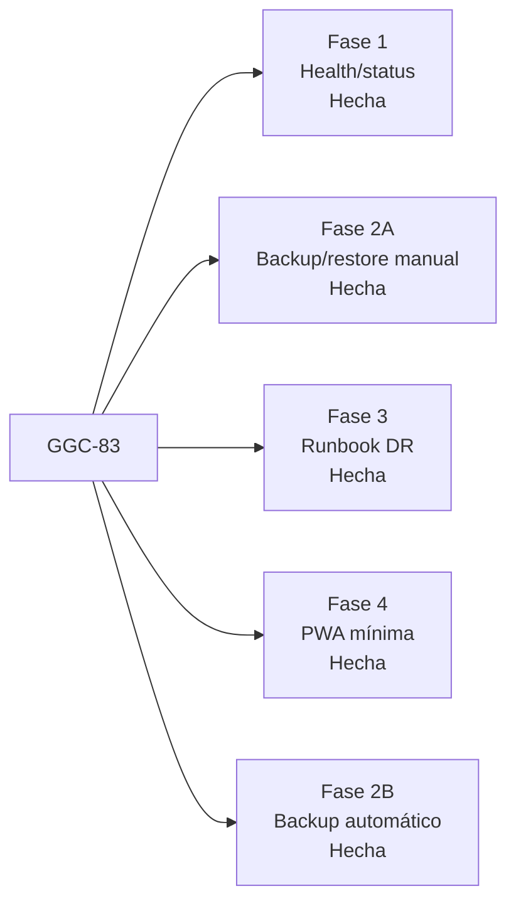

Lectura bloque por bloque:
- `GGC-83` es el nodo raíz y representa la tarea completa.
- `Fase 1` sale de ese nodo porque fue el primer bloque funcional cerrado: health/status.
- `Fase 2A` representa backup y restore manual, ya resueltos.
- `Fase 3` representa el runbook de disaster recovery, también cerrado.
- `Fase 4` representa la PWA mínima con manifest, SW y offline básico, ya implementada.
- `Fase 2B` usa un servicio Docker dedicado para ejecutar backups cada 6 horas y aplicar retención solo a copias automáticas.

## 2. Mapa general de la tarea

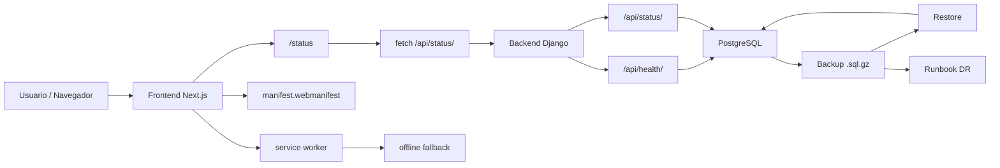

Lectura bloque por bloque:
- `Usuario / Navegador` es el origen de la interacción real.
- `Frontend Next.js` es la capa visual que recibe la navegación.
- `/status` es la página concreta usada para exponer salud del sistema.
- `fetch /api/status/` representa la llamada HTTP real desde frontend al backend.
- `Backend Django` procesa esa petición y a partir de ahí se bifurca en `/api/health/` y `/api/status/`.
- `PostgreSQL` es la dependencia crítica que ambos endpoints necesitan para comprobar estado.
- `Backup .sql.gz` representa la salida persistente del dump lógico.
- `Restore` usa ese dump para volver a cargar el estado en PostgreSQL.
- `Runbook DR` aparece conectado al backup porque documenta cómo usarlo en recuperación.
- `manifest.webmanifest`, `service worker` y `offline fallback` representan el bloque PWA/offline añadido sobre el frontend.

### Vista global por capas

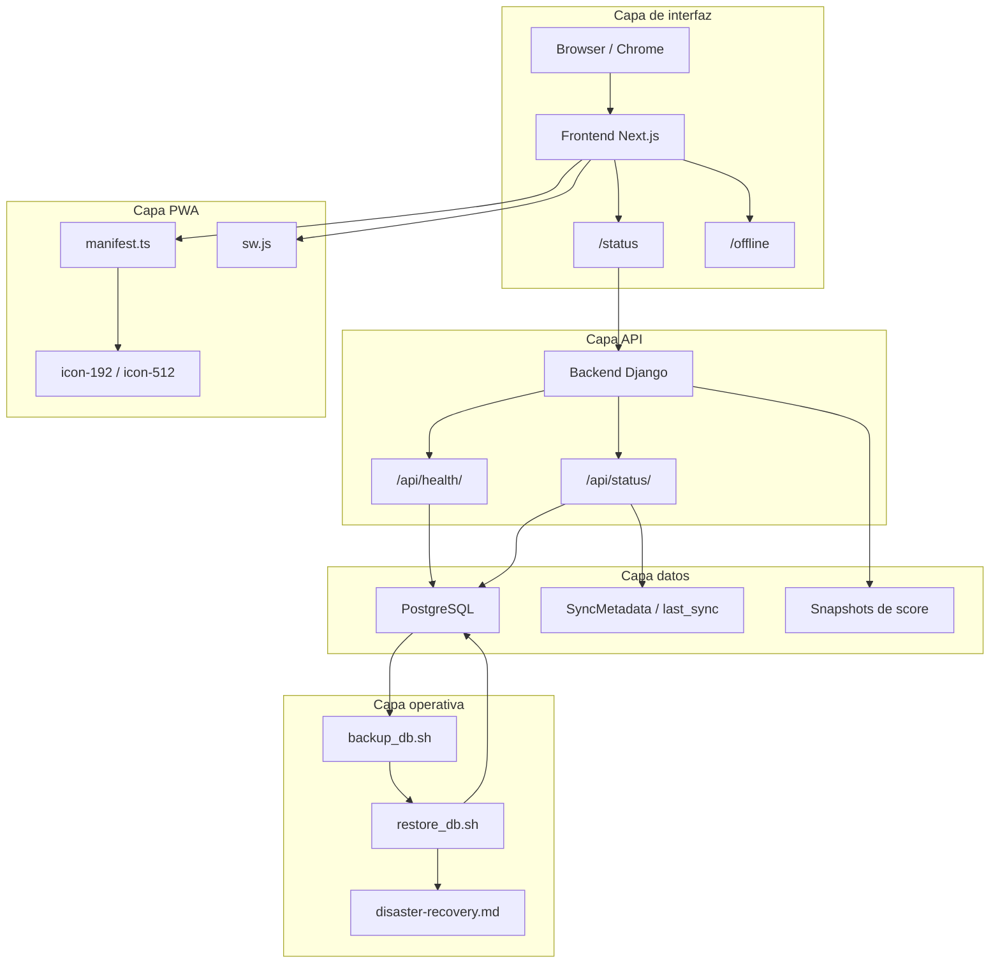

Lectura bloque por bloque:
- La subgráfica `Capa de interfaz` agrupa todo lo visible en navegador: `Browser / Chrome`, `Frontend Next.js`, `/status` y `/offline`.
- La subgráfica `Capa API` separa el backend Django y sus dos endpoints de salud.
- La subgráfica `Capa datos` recoge `PostgreSQL`, `SyncMetadata / last_sync` y `Snapshots de score`, es decir, el estado persistido.
- La subgráfica `Capa operativa` agrupa `backup_db.sh`, `restore_db.sh` y `disaster-recovery.md`, que no son UI ni negocio sino operación.
- La subgráfica `Capa PWA` agrupa `manifest.ts`, `sw.js` e iconos, que son piezas específicas de installability/offline.
- Las flechas entre capas muestran dependencia: la UI depende de la API, la API depende de datos y la PWA se monta sobre el frontend.

## 3. Archivos modificados o creados

| Archivo | Estado | Parte de la tarea | Qué hace | Por qué es necesario |
|---|---|---|---|---|
| `backend/config/views.py` | modificado | Health/status | Expone `api_root`, `health_check` y `status_check` | Centraliza la salud real del backend |
| `backend/config/urls.py` | modificado | Health/status | Publica `/api/health/` y `/api/status/` | Sin rutas no hay endpoints comprobables |
| `docker-compose.dev.yml` | modificado | Health/status | Define `healthcheck` para `db` y `backend` | Permite observabilidad a nivel de contenedor |
| `frontend/app/status/page.tsx` | creado | Health/status | Renderiza la status page pública | Hace visible el estado del sistema |
| `frontend/lib/statusApi.ts` | creado | Health/status | Cliente frontend para consultar `/api/status/` | Evita mocks y conecta UI con backend real |
| `frontend/components/AuthLayout.tsx` | modificado | Health/status / PWA | Permite `/status` y `/offline` como públicas y controla bootstrap/auth | Hace evaluable la status page y el fallback offline |
| `frontend/components/NavLink.tsx` | modificado | Health/status | Añade navegación hacia `/status` | Integra la ruta en la UI principal |
| `frontend/app/layout.tsx` | modificado | PWA/offline | Integra `ServiceWorkerRegistration`, `manifest` y `Suspense` | Conecta la PWA al árbol global de Next.js |
| `scripts/backup_db.sh` | creado | Backup | Genera `pg_dump`, lo comprime y valida el `.sql.gz` | Da un backup reproducible y verificable |
| `scripts/restore_db.sh` | creado | Restore | Restaura un dump explícito y reinicia `backend` si hace falta | Permite recuperación real de la base |
| `scripts/run_frontend_pwa.sh` | creado | PWA/offline | Levanta frontend temporal en modo PWA para pruebas | Facilita validar installability y offline sin romper el entorno dev |
| `Makefile` | modificado | Backup / restore / PWA | Añade `db-backup`, `db-restore`, `db-backup-ls` y `front-pwa` | Da comandos cortos y demostrables |
| `.gitignore` | modificado | Backup | Ignora `backups/postgres/` | Evita subir dumps locales al repo |
| `doc/disaster-recovery.md` | creado | Runbook | Documenta diagnóstico, backup, restore y smoke checks | Cierra la parte documental de DR |
| `doc/ggc-83-health-status-backups-pwa.md` | creado | Auditoría / planificación | Documento original de auditoría y plan de cierre | Explica el punto de partida y los riesgos iniciales |
| `frontend/app/manifest.ts` | creado | PWA/offline | Genera el manifest con `id`, `start_url` e iconos | Habilita installability |
| `frontend/public/sw.js` | creado | PWA/offline | Implementa caché y fallback offline básico | Es la pieza principal del comportamiento offline |
| `frontend/components/ServiceWorkerRegistration.tsx` | creado | PWA/offline | Registra o desregistra el SW según entorno | Evita que el SW rompa desarrollo |
| `frontend/app/offline/page.tsx` | creado | PWA/offline | Pantalla de fallback offline | Da una salida clara cuando no hay red |
| `frontend/public/icon-192.png` | creado | PWA/offline | Icono PWA 192x192 | Requisito típico de installability |
| `frontend/public/icon-512.png` | creado | PWA/offline | Icono PWA 512x512 | Requisito típico de installability |

### Nota sobre el estado de los documentos

`doc/ggc-83-health-status-backups-pwa.md` es importante porque refleja la **auditoría inicial** y el **plan por fases**, pero su contenido describe un estado anterior del proyecto. Esta explicación técnica lo complementa y lo deja contextualizado.

## 4. Explicación por fases

### Fase 1 - Health/status

#### Vista visual de la fase

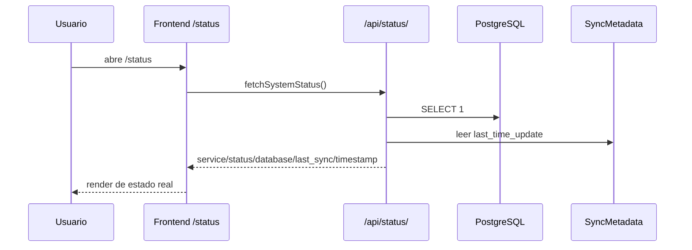

Lectura bloque por bloque:
- `Usuario` inicia el flujo abriendo `/status` en el navegador.
- `Frontend /status` representa el componente `StatusPage`, que es quien monta la UI.
- `fetchSystemStatus()` es la llamada del cliente frontend a la API real.
- `/api/status/` representa el endpoint Django que construye el payload.
- `PostgreSQL` aparece porque `_check_database()` hace un `SELECT 1` real.
- `SyncMetadata` aparece porque `_get_last_sync_time()` lee `last_time_update`.
- La flecha de vuelta desde API a frontend representa el JSON final con `service`, `status`, `database`, `last_sync` y `timestamp`.
- La última flecha a `Usuario` representa el render final de la página ya con datos.

#### Qué endpoints existen

Existen dos endpoints relevantes:

- `GET /api/health/`
- `GET /api/status/`

Se publican en `backend/config/urls.py`:

```python
path('api/health/', health_check, name='health-check')
path('api/status/', status_check, name='status-check')
```

#### Qué hace `/api/health/`

Archivo: `backend/config/views.py`, línea aproximada **44**.

Su función es responder si el backend puede hablar con PostgreSQL en ese momento.

Fragmento relevante:

```python
def health_check(request):
    database_status, error = _check_database()
    status = 'ok' if database_status == 'ok' else 'error'
```

Devuelve un JSON mínimo con:

- `service`
- `status`
- `database`
- `error` si la conexión falla

Si todo va bien responde `200`; si no, `503`.

#### Qué hace `/api/status/`

Archivo: `backend/config/views.py`, línea aproximada **58**.

`/api/status/` amplía `/api/health/` con dos datos más:

- `last_sync`
- `timestamp`

Fragmento relevante:

```python
def status_check(request):
    database_status, error = _check_database()
    payload = {
        'service': SERVICE_NAME,
        'status': status,
        'database': database_status,
        'last_sync': _get_last_sync_time() if database_status == 'ok' else None,
        'timestamp': timezone.now().isoformat(),
    }
```

En otras palabras:

- usa la misma comprobación real de DB;
- si la base está viva, añade la última sincronización registrada;
- siempre añade un timestamp de cuándo se hizo la comprobación.

### Pseudocódigo

```text
FUNCIÓN status_check():

    database_status, error = comprobar_base_de_datos()
    now = hora_actual()

    SI database_status == "ok":
        last_sync = leer_ultimo_sync()
        status = "ok"
    SI NO:
        last_sync = null
        status = "error"

    devolver JSON {
        service: "pollo-backend",
        status: status,
        database: database_status,
        last_sync: last_sync,
        timestamp: now,
        error: error
    }
```

#### Cómo se comprueba la base de datos

##### `_check_database`

- **Archivo**: `backend/config/views.py`
- **Línea aproximada**: `11`
- **Recibe**: nada
- **Devuelve**: tupla `(estado, error)` como `('ok', None)` o `('error', 'mensaje')`
- **Para qué sirve**: hacer una prueba mínima de conectividad SQL

Fragmento:

```python
with connection.cursor() as cursor:
    cursor.execute('SELECT 1')
    cursor.fetchone()
```

Explicación por bloques:

1. abre un cursor Django sobre la conexión actual;
2. ejecuta `SELECT 1`, que es la prueba más simple posible;
3. si falla, captura `DatabaseError`;
4. si funciona, devuelve `ok`.

##### `_get_last_sync_time`

- **Archivo**: `backend/config/views.py`
- **Línea aproximada**: `22`
- **Recibe**: nada
- **Devuelve**: un `isoformat()` o `None`
- **Para qué sirve**: recuperar la última fecha en la que el sync guardó su timestamp

Fragmento:

```python
metadata = SyncMetadata.objects.filter(key='campus_sync').only('last_time_update').first()
```

Explicación sencilla:

1. busca la fila de `SyncMetadata` con clave `campus_sync`;
2. si no existe o no tiene fecha, devuelve `None`;
3. si existe, devuelve la fecha serializada en ISO 8601.

#### Funciones principales del backend

##### `health_check`

- **Archivo**: `backend/config/views.py`
- **Línea aproximada**: `44`
- **Recibe**: `request`
- **Devuelve**: `JsonResponse`
- **Para qué sirve**: exponer un health endpoint simple y apto para Docker

Bloques:

1. llama a `_check_database()`;
2. calcula `status = ok/error`;
3. construye el payload;
4. devuelve `200` o `503`.

##### `status_check`

- **Archivo**: `backend/config/views.py`
- **Línea aproximada**: `58`
- **Recibe**: `request`
- **Devuelve**: `JsonResponse`
- **Para qué sirve**: exponer una status page consumible por frontend

Bloques:

1. llama a `_check_database()`;
2. si la DB está viva, llama a `_get_last_sync_time()`;
3. añade `timestamp` actual;
4. devuelve `200` o `503`.

#### Cómo funciona la página `/status`

Archivo: `frontend/app/status/page.tsx`, componente `StatusPage`, línea aproximada **17**.

##### `StatusPage`

- **Archivo**: `frontend/app/status/page.tsx`
- **Línea aproximada**: `17`
- **Recibe**: no recibe props
- **Devuelve**: JSX
- **Para qué sirve**: mostrar una UI legible con el estado real del sistema

Fragmento:

```tsx
useEffect(() => {
  const loadStatus = async () => {
    const payload = await fetchSystemStatus()
    setStatus(payload)
  }
}, [])
```

Bloques:

1. crea estado local con `useState`;
2. al montar, ejecuta `fetchSystemStatus()`;
3. muestra `loading`, `error` o datos;
4. colorea la UI según `ok/error`.

#### Cómo se conecta el frontend con el backend

##### `fetchSystemStatus`

- **Archivo**: `frontend/lib/statusApi.ts`
- **Línea aproximada**: `13`
- **Recibe**: nada
- **Devuelve**: `Promise<SystemStatus>`
- **Para qué sirve**: encapsular la llamada HTTP a `/api/status/`

Fragmento:

```ts
const STATUS_ENDPOINT = `${API_URL}/api/status/`

export const fetchSystemStatus = async (): Promise<SystemStatus> => {
  const response = await fetch(STATUS_ENDPOINT, {
    method: "GET",
    cache: "no-store",
  })
}
```

Bloques:

1. calcula `API_URL` desde `NEXT_PUBLIC_API_URL` o `http://localhost:8000`;
2. construye `STATUS_ENDPOINT`;
3. hace `fetch` con `cache: "no-store"` para evitar datos stale;
4. parsea JSON;
5. lanza error si la respuesta no es válida.

#### Cómo funciona la lógica de rutas públicas

##### `AuthLayout`

- **Archivo**: `frontend/components/AuthLayout.tsx`
- **Línea aproximada**: `13`
- **Recibe**: `children`
- **Devuelve**: JSX
- **Para qué sirve**: controlar qué rutas exigen sesión y cuándo bootstrapear auth

Clave importante:

```ts
const PUBLIC_ROUTES = ["/login", "/status", "/offline"]
```

Eso hizo dos cosas:

- `/status` dejó de requerir login;
- `/offline` pudo usarse como fallback PWA.

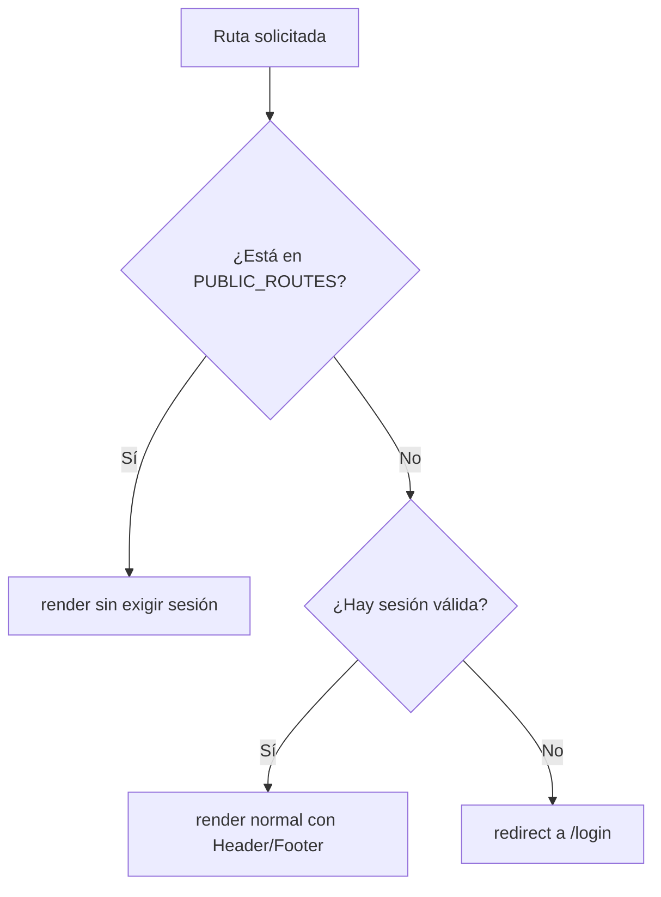

Lectura bloque por bloque:
- `Ruta solicitada` es cualquier URL que entra al layout.
- La decisión `¿Está en PUBLIC_ROUTES?` comprueba si la ruta es `/login`, `/status` o `/offline`.
- Si la respuesta es `Sí`, se permite `render sin exigir sesión`, que es el caso de evaluación pública.
- Si la respuesta es `No`, el layout pasa a la siguiente decisión: `¿Hay sesión válida?`.
- Si hay sesión, se hace `render normal con Header/Footer`, que es el flujo de usuario autenticado.
- Si no hay sesión, se hace `redirect a /login`, que es la protección normal del resto de la app.

Bloques:

1. detecta `pathname`, `searchParams` y stores de auth;
2. decide si la ruta es pública;
3. en rutas privadas sin sesión, redirige a `/login`;
4. en rutas públicas sin sesión, deja renderizar;
5. si el usuario está autenticado, monta `Header` y `Footer`.

#### Cómo funciona el healthcheck de Docker

En `docker-compose.dev.yml`:

```yaml
db:
  healthcheck:
    test: ["CMD-SHELL", "pg_isready -U postgres -d trascendence"]

backend:
  healthcheck:
    test: ["CMD-SHELL", "curl -fsS http://localhost:8000/api/health/ || exit 1"]
```

Interpretación:

- `db` se considera sana si PostgreSQL responde a `pg_isready`;
- `backend` se considera sano si `curl` recibe respuesta correcta de `/api/health/`.

### Pseudocódigo

```text
FUNCIÓN docker_healthcheck_backend():

    respuesta = curl("http://localhost:8000/api/health/")

    SI respuesta es 200:
        marcar backend como healthy

    SI respuesta falla repetidamente:
        marcar backend como unhealthy
```

#### Mapa corto del bloque health/status

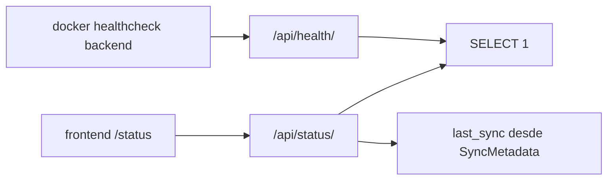

Lectura bloque por bloque:
- `docker healthcheck backend` representa la comprobación automática del contenedor `backend`.
- Esa comprobación cae sobre `/api/health/`, porque Docker necesita una señal simple de salud.
- `frontend /status` representa la navegación humana a la página de estado.
- Esa navegación depende de `/api/status/`, no de `/api/health/`, porque necesita más contexto.
- `SELECT 1` simboliza `_check_database()`, compartido por ambos endpoints.
- `last_sync desde SyncMetadata` solo cuelga de `/api/status/`, lo que demuestra que ese endpoint es más rico y orientado a UI.

#### Qué no cubre todavía `status`

La solución actual de `status` es real, pero acotada:

- comprueba **backend + DB**;
- muestra `last_sync`;
- **no comprueba directamente** API externa de 42;
- **no valida explícitamente** que el scheduler siga funcionando, más allá del `last_sync`.

### Fase 2 - Backups + restore

#### Vista visual de la fase

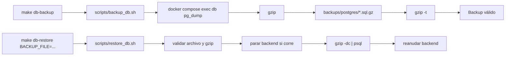

Lectura bloque por bloque:
- `make db-backup` es el punto de entrada humano para lanzar el backup.
- `scripts/backup_db.sh` encapsula toda la lógica operativa del dump.
- `docker compose exec db pg_dump` representa la extracción lógica de datos desde PostgreSQL.
- `gzip` convierte ese SQL en un artefacto comprimido y fácil de conservar.
- `backups/postgres/*.sql.gz` representa el destino persistente del backup.
- `gzip -t` valida que el archivo comprimido no quedó corrupto.
- `Backup válido` representa el momento en que el dump ya puede considerarse utilizable.
- `make db-restore BACKUP_FILE=...` es el punto de entrada explícito para recuperar.
- `scripts/restore_db.sh` encapsula la lógica destructiva y de seguridad.
- `validar archivo y gzip` asegura que el dump existe y es legible antes de tocar la DB.
- `parar backend si corre` evita conexiones activas durante la restauración.
- `gzip -dc | psql` representa la restauración real del SQL dentro de PostgreSQL.
- `reanudar backend` cierra el flujo operativo dejando el stack otra vez arriba.

#### Qué es un backup

Un **backup** es una copia recuperable del estado de la base de datos en un momento dado.

En este proyecto, el backup es:

- lógico, no físico;
- generado con `pg_dump`;
- comprimido como `.sql.gz`.

#### Qué es un restore

Un **restore** es el proceso inverso:

- tomar un dump anterior;
- reinyectar su SQL en PostgreSQL;
- volver a dejar la base en el estado representado por ese dump.

#### Qué hace `scripts/backup_db.sh`

Archivo: `scripts/backup_db.sh`.

Responsabilidad:

- validar prerrequisitos;
- localizar `docker-compose.dev.yml`;
- localizar el servicio `db`;
- crear `backups/postgres/`;
- ejecutar `pg_dump`;
- comprimir la salida;
- validar el gzip;
- devolver la ruta del backup generado.

Fragmento relevante:

```bash
docker compose -f "$COMPOSE_FILE" exec -T "$DB_SERVICE" sh -lc '
  export PGPASSWORD="$POSTGRES_PASSWORD"
  exec pg_dump \
    --username "$POSTGRES_USER" \
    --dbname "$POSTGRES_DB" \
    --clean \
    --if-exists \
    --create
' | gzip > "$tmp_file"
```

#### Qué hace `scripts/restore_db.sh`

Archivo: `scripts/restore_db.sh`.

Responsabilidad:

- exigir `BACKUP_FILE`;
- validar que el archivo existe y es legible;
- validar el gzip;
- comprobar que `db` está arriba;
- detectar si `backend` está corriendo;
- parar temporalmente `backend` si hace falta;
- hacer `psql` del dump descomprimido;
- volver a arrancar `backend` al salir.

Fragmento relevante:

```bash
gzip -dc "$backup_file" | docker compose -f "$COMPOSE_FILE" exec -T "$DB_SERVICE" sh -lc '
  export PGPASSWORD="$POSTGRES_PASSWORD"
  exec psql \
    --username "$POSTGRES_USER" \
    --dbname postgres \
    --set ON_ERROR_STOP=1
'
```

#### Qué comandos se añadieron al `Makefile`

Bloques relevantes:

```make
db-backup:
	./scripts/backup_db.sh

db-restore:
	@if [ -z "$(BACKUP_FILE)" ]; then echo "Uso: make db-restore BACKUP_FILE=backups/postgres/archivo.sql.gz"; exit 1; fi
	BACKUP_FILE="$(BACKUP_FILE)" ./scripts/restore_db.sh

db-backup-ls:
	@if ls -1 backups/postgres/*.sql.gz >/dev/null 2>&1; then ls -lh backups/postgres/*.sql.gz; else echo "No hay backups en backups/postgres/"; fi
```

Además, para validar la PWA se añadió:

```make
front-pwa:
	./scripts/run_frontend_pwa.sh
```

#### Dónde se guardan los backups

En:

```text
backups/postgres/
```

Se eligió esa carpeta porque:

- es local al repo;
- no depende de rutas del sistema;
- es fácil de enseñar en evaluación;
- no obliga a tocar la arquitectura Docker.

#### Por qué `backups/postgres/` está en `.gitignore`

Porque los dumps:

- ocupan espacio;
- son artefactos generados, no código fuente;
- pueden contener datos sensibles o al menos internos;
- no deben entrar en commits normales.

#### Por qué el restore es destructivo

Porque el dump se genera con:

- `--clean`
- `--if-exists`
- `--create`

Eso implica que, al restaurar:

- se borran objetos existentes si están presentes;
- se reconstruye el esquema y los datos del dump;
- el estado actual se reemplaza por el estado del backup.

#### Cómo se valida un `.sql.gz`

Con:

```bash
gzip -t archivo.sql.gz
```

En el script de backup:

```bash
gzip -t "$tmp_file" || fail "El backup se generó, pero no pasó la validación gzip."
```

En el restore:

```bash
gzip -t "$backup_file" || fail "El archivo no es un gzip válido: $backup_input"
```

### Pseudocódigo

```text
FUNCIÓN backup_db():

    validar dependencias docker, compose y gzip
    crear carpeta backups/postgres si hace falta
    construir nombre timestamp.sql.gz

    ejecutar pg_dump dentro del contenedor db
    comprimir salida con gzip
    guardar archivo

    SI gzip -t falla:
        devolver error

    devolver ruta_del_backup
```

```text
FUNCIÓN restore_db(backup_file):

    SI backup_file no existe:
        devolver error

    validar backup_file con gzip -t
    detener backend temporalmente
    descomprimir SQL
    ejecutar psql dentro del contenedor db
    volver a levantar backend

    devolver "restore completado"
```

### Explicación de sintaxis Bash usada

#### `#!/usr/bin/env bash`

Shebang. Le dice al sistema que ejecute el script con `bash`.

#### `set -euo pipefail`

- `-e`: aborta si un comando falla;
- `-u`: aborta si usas una variable no definida;
- `pipefail`: hace que falle toda la tubería si falla uno de sus comandos.

Esto es especialmente importante en scripts destructivos o de backup.

#### Variables

Ejemplos:

```bash
COMPOSE_FILE="$REPO_ROOT/docker-compose.dev.yml"
DB_SERVICE="${DB_SERVICE:-db}"
```

Se usan para:

- no repetir rutas;
- permitir configuración por entorno;
- hacer el script reutilizable.

#### `if`

Ejemplo:

```bash
if [[ "$backup_input" = /* ]]; then
  backup_file="$backup_input"
else
  backup_file="$REPO_ROOT/$backup_input"
fi
```

Sirve para decidir entre ruta absoluta o relativa.

#### `test -f`

Ejemplo:

```bash
[ -f "$backup_file" ] || fail "No existe el archivo..."
```

Comprueba si un fichero existe.

#### `mkdir -p`

```bash
mkdir -p "$BACKUP_DIR"
```

Crea la carpeta si no existe, sin fallar si ya está creada.

#### `docker compose exec`

Ejecuta un comando dentro de un contenedor ya levantado.

#### `pg_dump`

Genera el SQL del backup lógico de PostgreSQL.

#### `psql`

Reproduce SQL contra la base de datos.

#### `gzip`

- comprime con `gzip > archivo.gz`
- valida con `gzip -t`
- descomprime a stdout con `gzip -dc`

#### Pipes `|`

Ejemplo:

```bash
pg_dump ... | gzip > "$tmp_file"
```

Conecta la salida de un comando con la entrada del siguiente.

#### Redirecciones

Ejemplo:

```bash
echo "Error" >&2
```

`>&2` manda el mensaje a stderr.

#### Exit codes

Un script bien hecho devuelve `0` si todo fue bien y un valor distinto de `0` si falló. Los `fail()` de estos scripts fuerzan salida con `1`.

### Backup script, bloque por bloque

1. **Funciones `fail()` e `info()`**
   - centralizan errores y mensajes.
2. **Resolución de rutas**
   - calcula repo root y compose file.
3. **Validación de dependencias**
   - Docker, `docker compose`, `gzip`, daemon y compose file.
4. **Comprobación del contenedor `db`**
   - asegura que existe y está `running`.
5. **Preparación del destino**
   - crea carpeta, nombre final y temporal.
6. **`trap cleanup EXIT`**
   - borra el temporal si algo falla.
7. **`pg_dump | gzip`**
   - crea el artefacto real.
8. **`gzip -t`**
   - valida el backup.
9. **`mv` final**
   - publica el dump solo si la validación pasó.

### Restore script, bloque por bloque

1. **Funciones `fail()`, `info()`, `warn()`**
   - errores, progreso y advertencias.
2. **Resolución de rutas y `BACKUP_FILE`**
   - exige un input explícito.
3. **Validación del backup**
   - existencia, lectura y gzip válido.
4. **Comprobación del contenedor `db`**
   - exige DB operativa para restaurar.
5. **Detección del estado del backend**
   - decide si hay que pararlo y relanzarlo.
6. **`trap restore_backend EXIT`**
   - asegura re-arranque best effort.
7. **Advertencia destructiva**
   - deja claro el riesgo.
8. **Parada temporal del backend**
   - evita conexiones activas.
9. **`gzip -dc | psql`**
   - restaura el dump en PostgreSQL.
10. **Finalización**
   - informa de restore correcto.

#### Secuencia del restore

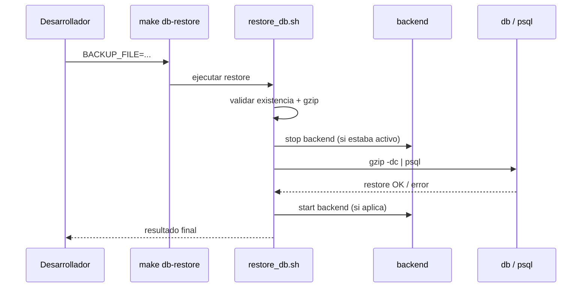

Lectura bloque por bloque:
- `Desarrollador` es quien invoca la recuperación manual.
- `make db-restore` actúa como envoltorio simple para no recordar el script completo.
- `restore_db.sh` centraliza validaciones, advertencias y recuperación.
- El paso `validar existencia + gzip` ocurre antes de tocar ningún servicio.
- `stop backend (si estaba activo)` explica la decisión de reducir riesgo de conexiones concurrentes.
- `gzip -dc | psql` es la ejecución destructiva principal del restore.
- `restore OK / error` representa el resultado de `psql` con `ON_ERROR_STOP=1`.
- `start backend (si aplica)` muestra que el backend solo se reanuda si estaba corriendo antes.
- `resultado final` es la salida visible para el operador.

### Fase 3 - Runbook disaster recovery

#### Vista visual de la fase

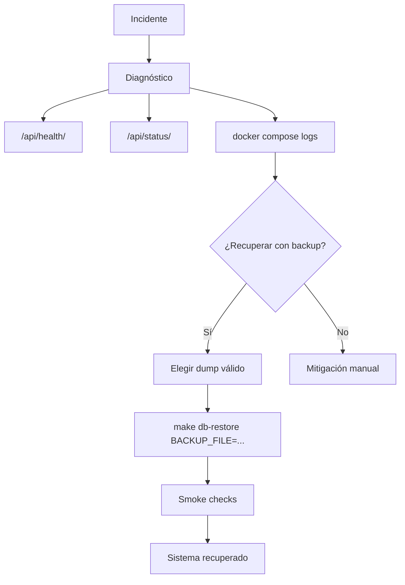

Lectura bloque por bloque:
- `Incidente` es cualquier fallo operativo relevante.
- `Diagnóstico` representa el paso previo obligatorio antes de tomar medidas.
- `/api/health/`, `/api/status/` y `docker compose logs` son las tres señales principales que se consultan.
- La decisión `¿Recuperar con backup?` separa mitigación manual de restauración completa.
- `Elegir dump válido` obliga a identificar correctamente el backup a usar.
- `make db-restore BACKUP_FILE=...` representa la ejecución de la recuperación.
- `Smoke checks` representa la validación posterior.
- `Sistema recuperado` es el estado final esperado si todo salió bien.
- `Mitigación manual` deja claro que no todos los incidentes requieren restore.

#### Qué es un runbook

Un **runbook** es un documento operativo que explica:

- qué hacer cuando hay una incidencia;
- en qué orden hacerlo;
- qué comandos ejecutar;
- cómo comprobar si la recuperación fue correcta.

#### Qué problema resuelve

Sin runbook:

- el conocimiento queda en la cabeza del equipo;
- la recuperación depende de memoria informal;
- en evaluación cuesta demostrar procedimiento.

Con runbook:

- el proceso queda replicable;
- se reduce la improvisación;
- se puede enseñar como evidencia del módulo DevOps.

#### Cuándo se usa

Cuando ocurre algo como:

- DB caída;
- backend que no arranca;
- errores `500`;
- sync o migración que deja datos inconsistentes;
- necesidad de volver a un dump conocido.

#### Cómo se relaciona con backup y restore

El runbook no reemplaza el backup ni el restore. Los **orquesta**.

Relación:

- `backup_db.sh` crea el dump;
- `restore_db.sh` recupera el dump;
- `disaster-recovery.md` explica cuándo y cómo usarlos.

#### Smoke checks post-recovery

Después de recuperar el sistema hay que comprobar:

- `docker compose ps`
- `GET /api/health/`
- `GET /api/status/`
- acceso a frontend
- coherencia visible de los datos restaurados

### Pseudocódigo

```text
FUNCIÓN disaster_recovery(backup_file):

    revisar estado de contenedores
    revisar logs de backend y db

    SI el problema parece de datos:
        restore_db(backup_file)

    comprobar /api/health/
    comprobar /api/status/
    comprobar frontend

    SI todo responde:
        declarar sistema recuperado

    SI algo sigue fallando:
        volver a logs y conservar backups antiguos
```

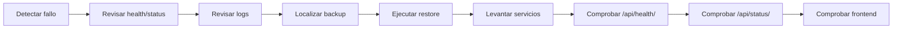

Lectura bloque por bloque:
- `Detectar fallo` es el disparador del proceso.
- `Revisar health/status` usa las señales HTTP para ver si el problema es global o parcial.
- `Revisar logs` baja un nivel más a detalle técnico.
- `Localizar backup` obliga a elegir un punto de restauración concreto.
- `Ejecutar restore` es la fase destructiva central.
- `Levantar servicios` representa devolver el stack a estado operativo.
- `Comprobar /api/health/`, `Comprobar /api/status/` y `Comprobar frontend` son validaciones en capas: contenedor, API y UI.

#### Checklist visual post-restore

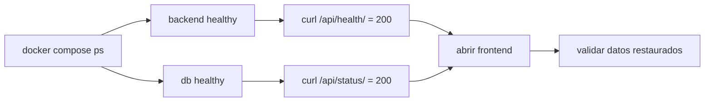

Lectura bloque por bloque:
- `docker compose ps` es la primera comprobación porque valida el estado general del stack.
- `backend healthy` y `db healthy` desglosan ese estado por servicio crítico.
- `curl /api/health/ = 200` valida conectividad backend-DB.
- `curl /api/status/ = 200` valida además el payload de estado extendido.
- `abrir frontend` mueve la comprobación al plano visible para el usuario.
- `validar datos restaurados` cierra el circuito comprobando no solo que el sistema responde, sino que responde con datos coherentes.

### Fase 4 - PWA/offline

#### Vista visual de la fase

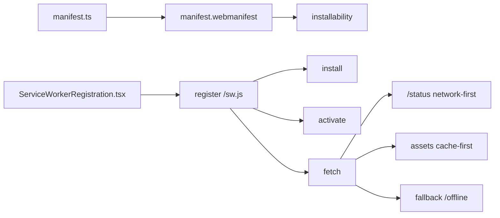

Lectura bloque por bloque:
- `manifest.ts` es la fuente de verdad del manifest PWA en Next.js.
- `manifest.webmanifest` es el artefacto que Chrome consume realmente.
- `installability` depende de que ese manifest exista y sea válido.
- `ServiceWorkerRegistration.tsx` es la pieza React que decide si registra o no el SW.
- `register /sw.js` representa el momento en que el navegador activa la lógica offline.
- `install`, `activate` y `fetch` son los tres eventos clave del service worker.
- `/status network-first` representa el tratamiento especial de la página pública de estado.
- `assets cache-first` representa el caché de recursos estáticos.
- `fallback /offline` representa la salida segura cuando no hay red ni contenido suficiente cacheado.

#### Qué es una PWA

Una **Progressive Web App** es una web que se comporta de forma más parecida a una app instalada:

- tiene manifest;
- puede instalarse;
- usa service worker;
- soporta cierto nivel de offline.

#### Qué es un manifest

El manifest es un JSON que define identidad y comportamiento de instalación:

- nombre;
- iconos;
- `start_url`;
- `display`;
- colores.

En este proyecto se genera con `frontend/app/manifest.ts`:

```ts
export default function manifest(): MetadataRoute.Manifest {
  return {
    name: "AEDLPH",
    id: "/status",
    start_url: "/status",
    display: "standalone",
  }
}
```

#### Qué es un service worker

Es un script del navegador que se ejecuta separado de la página y puede:

- interceptar peticiones;
- guardar respuestas en caché;
- servir fallbacks offline.

Aquí vive en `frontend/public/sw.js`.

#### Qué significa installability

Que Chrome puede considerar la app “instalable” porque detecta:

- manifest válido;
- iconos válidos;
- service worker registrado;
- contexto seguro o `localhost`.

#### Qué significa offline básico

No significa “toda la app funciona sin internet”.

En este proyecto significa:

- `/status` puede seguir respondiendo si ya fue visitada y/o si hay respuesta cacheada;
- `/offline` siempre existe como fallback;
- assets estáticos pueden servirse desde caché;
- no se promete login offline;
- no se promete navegación privada completa offline.

#### Qué rutas están pensadas para funcionar offline

Garantizadas:

- `/status`
- `/offline`
- iconos PWA
- assets estáticos cacheados

Best effort si ya se visitaron antes:

- `/`
- `/coalitions`
- `/leaderboard`

### Pseudocódigo

```text
FUNCIÓN service_worker_fetch(request):

    SI request es navegación HTML:
        intentar red
        SI red responde:
            cachear página
            devolver respuesta
        SI red falla:
            devolver página cacheada
            SI no existe:
                devolver /offline

    SI request es /api/status/:
        intentar red
        SI red responde:
            cachear JSON
            devolver respuesta
        SI red falla:
            devolver último JSON cacheado

    SI request es asset estático:
        intentar caché
        SI no existe:
            pedir a red y cachear
```

#### Qué NO se promete offline

- login offline;
- datos privados frescos sin backend;
- sincronización offline;
- caché agresiva de endpoints autenticados.

#### Explicación de archivos PWA

##### `manifest.ts`

- **Archivo**: `frontend/app/manifest.ts`
- **Línea clave**: `3`
- **Responsabilidad**: generar el manifest nativo de Next

Campos importantes:

- `id: "/status"`
- `start_url: "/status"`
- `display: "standalone"`
- `icons`

##### `sw.js`

- **Archivo**: `frontend/public/sw.js`
- **Líneas clave**: `1-155`
- **Responsabilidad**: implementar la estrategia de caché y fallback offline

Piezas:

- `CACHE_VERSION`
- caches separadas para páginas, assets y datos
- `install`
- `activate`
- `fetch`

##### `ServiceWorkerRegistration.tsx`

- **Archivo**: `frontend/components/ServiceWorkerRegistration.tsx`
- **Líneas clave**: `5-27`
- **Responsabilidad**: registrar o desregistrar el SW según entorno

Regla importante:

```ts
const shouldEnablePwa =
  process.env.NODE_ENV === "production" ||
  process.env.NEXT_PUBLIC_ENABLE_PWA === "true";
```

Eso evita que el SW rompa el desarrollo normal.

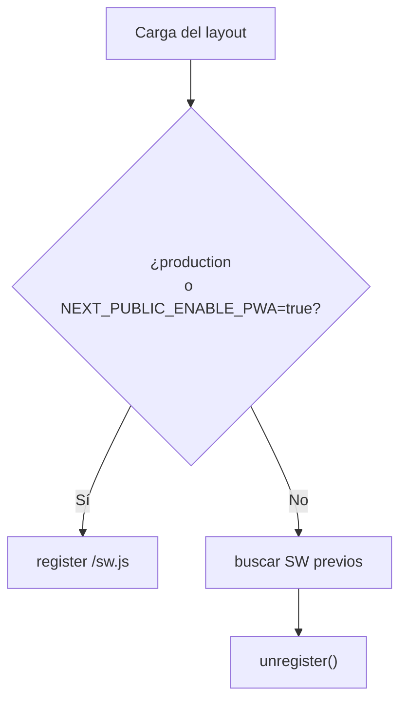

Lectura bloque por bloque:
- `Carga del layout` es el momento en que se monta `ServiceWorkerRegistration`.
- La decisión `¿production o NEXT_PUBLIC_ENABLE_PWA=true?` separa modo PWA real y desarrollo normal.
- `register /sw.js` representa el camino en el que sí se activa la PWA.
- `buscar SW previos` representa el camino defensivo en desarrollo.
- `unregister()` explica que, en desarrollo normal, se limpian SW antiguos para evitar caches engañosas.

##### `offline/page.tsx`

- **Archivo**: `frontend/app/offline/page.tsx`
- **Responsabilidad**: página pública de fallback

Mensaje importante:

- explica que solo se garantiza offline básico para status y assets ya cacheados.

##### Iconos PWA

- `frontend/public/icon-192.png`
- `frontend/public/icon-512.png`

Sirven para:

- manifest;
- instalación;
- icono de la app instalada.

#### Sintaxis React/TypeScript/JS relevante

##### `"use client"`

Marca componentes que deben ejecutarse en cliente, por ejemplo:

- `StatusPage`
- `AuthLayout`
- `ServiceWorkerRegistration`

##### `useEffect`

Se usa para ejecutar efectos secundarios al montar:

- cargar `/api/status/`;
- registrar el service worker.

##### `navigator.serviceWorker.register`

Registra el SW:

```ts
navigator.serviceWorker.register("/sw.js")
```

##### `process.env.NODE_ENV`

Permite distinguir `development` y `production`.

##### `NEXT_PUBLIC_ENABLE_PWA`

Flag pública para habilitar PWA en pruebas controladas aunque no estés en producción.

##### `async/await`

Hace más legible el flujo asíncrono en:

- fetch frontend;
- handlers del SW;
- registro del SW.

##### `try/catch`

Controla fallos de red o de registro.

#### Eventos del service worker

##### `install`

Fragmento:

```js
self.addEventListener("install", (event) => {
  event.waitUntil(
    caches.open(PAGE_CACHE).then((cache) => cache.addAll(PRECACHE_URLS))
  );
});
```

Sirve para:

- precachear `/status`, `/offline` e iconos;
- preparar la primera versión offline.

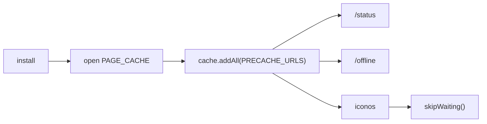

Lectura bloque por bloque:
- `install` es el evento inicial del service worker.
- `open PAGE_CACHE` crea o abre la caché destinada a páginas.
- `cache.addAll(PRECACHE_URLS)` representa la precarga explícita de rutas y assets mínimos.
- `/status` y `/offline` aparecen como páginas clave precacheadas.
- `iconos` refleja que también se guardan assets necesarios para la PWA.
- `skipWaiting()` fuerza a que la nueva versión del SW pueda activarse antes.

##### `activate`

Fragmento:

```js
self.addEventListener("activate", (event) => {
  event.waitUntil(
    caches.keys().then((keys) =>
      Promise.all(keys.filter((key) => !key.startsWith(CACHE_VERSION)).map((key) => caches.delete(key)))
    )
  );
});
```

Sirve para:

- limpiar caches viejas;
- evitar assets stale cuando cambia la versión.

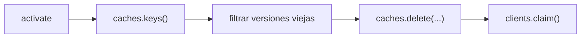

Lectura bloque por bloque:
- `activate` es el evento que ocurre cuando el SW pasa a estar operativo.
- `caches.keys()` obtiene todas las caches existentes en el navegador.
- `filtrar versiones viejas` representa el uso de `CACHE_VERSION` como criterio de limpieza.
- `caches.delete(...)` elimina caches obsoletas.
- `clients.claim()` hace que el SW nuevo empiece a controlar clientes cuanto antes.

##### `fetch`

Fragmento:

```js
self.addEventListener("fetch", (event) => {
  if (request.mode === "navigate") {
    event.respondWith(handleNavigation(request));
  }
})
```

Sirve para interceptar peticiones y decidir:

- red primero;
- caché después;
- fallback offline cuando haga falta.

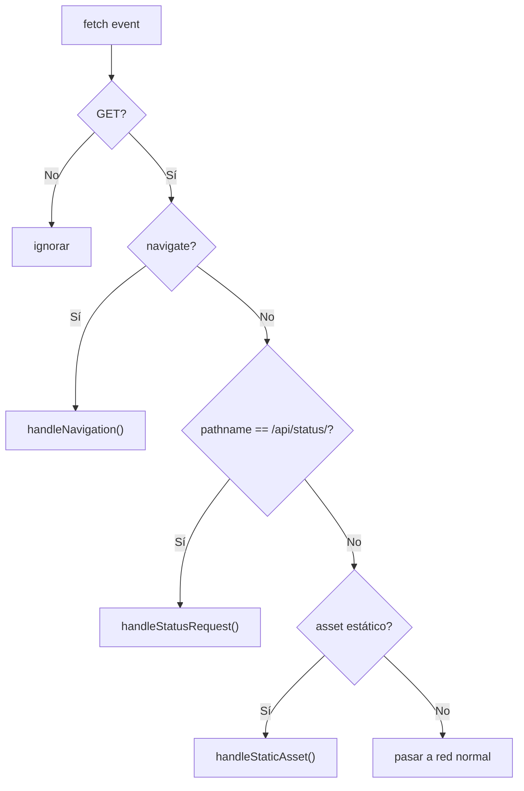

Lectura bloque por bloque:
- `fetch event` es cualquier petición interceptada por el service worker.
- `GET?` descarta métodos que no deben tocarse, como `POST`.
- `navigate?` separa navegación HTML del resto de recursos.
- `handleNavigation()` aplica el flujo `network-first` para páginas.
- `pathname == /api/status/?` detecta el único endpoint de datos cacheado de forma explícita.
- `handleStatusRequest()` aplica el fallback cacheado o un JSON de error controlado.
- `asset estático?` separa recursos como `_next/static`, iconos o imágenes.
- `handleStaticAsset()` aplica caché orientado a rendimiento.
- `pasar a red normal` deja intacto lo que no entra en ninguna de las categorías anteriores.

#### Por qué el SW no debe romper desarrollo

Si activas siempre el SW en `next dev`, puedes tener:

- assets viejos en caché;
- HTML cacheado cuando el código cambió;
- resultados confusos durante desarrollo.

Por eso `ServiceWorkerRegistration.tsx`:

- **registra** el SW solo en producción o con `NEXT_PUBLIC_ENABLE_PWA=true`;
- incluso **desregistra** SW existentes si no debe estar activo.

## 5. Paso a paso del desarrollo realizado

### 5.1 Estado inicial

Antes de empezar:

- `/api/health/` ya existía;
- `/api/status/` ya existía;
- `db` ya tenía `healthcheck`;
- `/status` frontend existía localmente pero no estaba cerrada ni consolidada;
- `/status` estaba detrás del layout de auth;
- el `healthcheck` del backend estaba comentado;
- no había backups manuales;
- no había restore manual;
- no había runbook;
- no había manifest, SW ni offline.

Riesgos iniciales:

- falsa sensación de completitud en status;
- imposibilidad de recuperar DB si algo salía mal;
- módulo PWA totalmente no reclamable;
- ausencia de procedimiento DR.

### 5.2 Fase 1 - Health/status

#### 1. Revisar endpoints existentes

- **Archivo**: `backend/config/views.py`
- **Cambio**: auditoría y reutilización de `_check_database`, `_get_last_sync_time`, `health_check`, `status_check`
- **Motivo**: ya existía una base sólida y había que aprovecharla
- **Verificación**: lectura de código + `curl`

#### 2. Revisar rutas backend

- **Archivo**: `backend/config/urls.py`
- **Cambio**: confirmar exposición de `/api/health/` y `/api/status/`
- **Motivo**: el frontend dependía de esas rutas
- **Verificación**: lectura de código + `curl`

#### 3. Revisar página frontend `/status`

- **Archivo**: `frontend/app/status/page.tsx`
- **Cambio**: consolidar la página en el repo y conectarla a cliente real
- **Motivo**: existía como trabajo local, no como entregable defendible
- **Verificación**: navegación a `/status`

#### 4. Integrar o consolidar `/status`

- **Archivo**: `frontend/lib/statusApi.ts`
- **Cambio**: crear `fetchSystemStatus()`
- **Motivo**: dejar claro que la UI consume `/api/status/`, no mocks
- **Comando relacionado**: `curl -i http://localhost:8000/api/status/`
- **Verificación**: UI y request real en navegador

#### 5. Permitir `/status` como ruta pública

- **Archivo**: `frontend/components/AuthLayout.tsx`
- **Cambio**: añadir `"/status"` a `PUBLIC_ROUTES`
- **Motivo**: la status page tenía que ser evaluable sin login
- **Verificación**: abrir `/status` sin sesión

#### 6. Activar healthcheck del backend en Docker

- **Archivo**: `docker-compose.dev.yml`
- **Cambio**: activar `curl -fsS http://localhost:8000/api/health/`
- **Motivo**: health real del contenedor `backend`
- **Verificación**: `docker compose ps`

#### 7. Probar `/api/health/`

- **Comando**:

```bash
curl -i http://localhost:8000/api/health/
```

- **Verificación**: `200 OK` y transición a `503` si la DB cae

#### 8. Probar `/api/status/`

- **Comando**:

```bash
curl -i http://localhost:8000/api/status/
```

- **Verificación**: `200 OK`, `last_sync`, `timestamp`, y degradación real cuando la DB cae

#### 9. Probar `/status`

- **Cambio**: validación manual de la página
- **Verificación**: navegador, consumo real del endpoint y accesibilidad pública

### 5.3 Fase 2 - Backups + restore

#### 1. Diseñar estrategia de backup

- **Decisión**: backup lógico con `pg_dump`
- **Motivo**: simple, demostrable y sin cambiar arquitectura

#### 2. Elegir carpeta de backups

- **Archivo**: `.gitignore`
- **Cambio**: usar `backups/postgres/`
- **Motivo**: ruta local estándar
- **Verificación**: archivos generados en esa ruta

#### 3. Crear script de backup

- **Archivo**: `scripts/backup_db.sh`
- **Motivo**: hacer `pg_dump`, comprimir y validar
- **Comando relacionado**: `make db-backup`
- **Verificación**: dump generado + `gzip -t`

#### 4. Crear script de restore

- **Archivo**: `scripts/restore_db.sh`
- **Motivo**: recuperar un dump concreto sin ambigüedad
- **Comando relacionado**: `make db-restore BACKUP_FILE=...`
- **Verificación**: restore real con tabla marcador durante la validación manual

#### 5. Añadir comandos al `Makefile`

- **Archivo**: `Makefile`
- **Cambio**: `db-backup`, `db-restore`, `db-backup-ls`
- **Motivo**: operativa simple y defendible
- **Verificación**: ejecución real de los targets

#### 6. Ignorar backups en `.gitignore`

- **Archivo**: `.gitignore`
- **Motivo**: no subir artefactos
- **Verificación**: `git status` limpio frente a dumps

#### 7. Probar creación de backup

- **Comando**:

```bash
make db-backup
```

- **Verificación**: aparición de `.sql.gz`

#### 8. Probar integridad del `.sql.gz`

- **Comando**:

```bash
gzip -t backups/postgres/archivo.sql.gz
```

- **Verificación**: retorno correcto

#### 9. Probar restore

- **Comando**:

```bash
make db-restore BACKUP_FILE=backups/postgres/archivo.sql.gz
```

- **Verificación**:
  - backend parado temporalmente;
  - restore correcto;
  - health/status volvieron a `200`.

#### 10. Documentar riesgos del restore destructivo

- **Archivo**: `scripts/restore_db.sh` + `doc/disaster-recovery.md`
- **Motivo**: dejar claro que se sustituye el estado actual
- **Cómo ayuda en evaluación**: demuestra criterio operativo

### 5.4 Fase 3 - Runbook disaster recovery

#### 1. Crear documento de runbook

- **Archivo**: `doc/disaster-recovery.md`
- **Motivo**: capturar procedimiento DR
- **Cómo ayuda**: evidencia directa del bloque DevOps

#### 2. Identificar escenarios de fallo

- DB caída
- backend caído
- errores 500
- datos borrados o inconsistentes
- restore necesario

#### 3. Añadir comandos de diagnóstico

- `docker compose ps`
- `logs`
- `curl /api/health/`
- `curl /api/status/`

#### 4. Añadir procedimiento de backup

- **Comando**: `make db-backup`
- **Motivo**: poder congelar el estado antes de tocar nada

#### 5. Añadir procedimiento de restore

- **Comando**: `make db-restore BACKUP_FILE=...`
- **Motivo**: recuperación explícita y controlada

#### 6. Añadir smoke checks

- `docker compose ps`
- `/api/health/`
- `/api/status/`
- frontend

#### 7. Añadir riesgos y limitaciones

- backup local no cifrado
- restore destructivo
- backup manual no equivale a automático
- incompatibilidad potencial con migraciones nuevas

### 5.5 Fase 4 - PWA/offline

#### 1. Crear manifest

- **Archivo**: `frontend/app/manifest.ts`
- **Cambio**: manifest con `id`, `start_url`, iconos y colores
- **Motivo**: installability
- **Verificación**: `Application > Manifest`

#### 2. Añadir iconos

- **Archivos**:
  - `frontend/public/icon-192.png`
  - `frontend/public/icon-512.png`
- **Motivo**: manifest válido
- **Verificación**: Chrome y acceso directo a las rutas

#### 3. Crear service worker

- **Archivo**: `frontend/public/sw.js`
- **Cambio**: precache mínimo, estrategia `network-first`, fallback `/offline`
- **Motivo**: offline básico real
- **Verificación**: service worker registrado + prueba offline

#### 4. Registrar service worker

- **Archivo**: `frontend/components/ServiceWorkerRegistration.tsx`
- **Cambio**: registro controlado por entorno
- **Motivo**: no contaminar `next dev`
- **Verificación**: `navigator.serviceWorker`

#### 5. Crear página offline

- **Archivo**: `frontend/app/offline/page.tsx`
- **Motivo**: fallback claro
- **Verificación**: abrir `/offline`

#### 6. Permitir `/offline` como ruta pública

- **Archivo**: `frontend/components/AuthLayout.tsx`
- **Cambio**: añadir `"/offline"` a `PUBLIC_ROUTES`
- **Motivo**: el fallback no puede requerir sesión
- **Verificación**: abrir `/offline` sin login

#### 7. Definir estrategia de caché

- **Archivo**: `frontend/public/sw.js`
- **Cambio**:
  - páginas: `network-first`
  - `/api/status/`: `network-first` con caché
  - assets: `cache-first`
- **Motivo**: offline básico sin sobrecachear privado
- **Verificación**: prueba manual

#### 8. Probar installability

- **Archivo/ayuda**: `Makefile` + `scripts/run_frontend_pwa.sh`
- **Cambio**: target `front-pwa`
- **Motivo**: `next dev` no era suficiente para validar PWA real
- **Verificación**: `make front-pwa`, `next build`, `next start`, Chrome DevTools

#### 9. Probar offline básico

- **Flujo**:
  - visitar `/status`
  - poner `Offline` en DevTools
  - recargar
  - comprobar `/status` y `/offline`
- **Verificación**: confirmación manual en navegador

#### Incidencia importante resuelta en esta fase

Durante la validación de build de producción apareció este problema:

- `useSearchParams() should be wrapped in a suspense boundary at page "/404"`

Se resolvió modificando `frontend/app/layout.tsx` para envolver `AuthLayout` en `Suspense`.

Sin ese ajuste:

- `next build` fallaba;
- la PWA no podía validarse en modo producción.

### 5.6 Línea temporal resumida

| Orden | Fase | Cambio | Archivo(s) | Resultado |
|---|---|---|---|---|
| 1 | Auditoría | Revisión del estado real de GGC-83 | `doc/ggc-83-health-status-backups-pwa.md` | Se identificó el gap real |
| 2 | Fase 1 | Consolidación de `/status` | `frontend/app/status/page.tsx`, `frontend/lib/statusApi.ts` | Status page funcional |
| 3 | Fase 1 | Ruta pública para evaluación | `frontend/components/AuthLayout.tsx`, `frontend/components/NavLink.tsx` | `/status` accesible sin login |
| 4 | Fase 1 | Healthcheck backend Docker | `docker-compose.dev.yml` | `backend` saludable por Docker |
| 5 | Fase 2A | Backup manual | `scripts/backup_db.sh`, `Makefile` | Dump reproducible `.sql.gz` |
| 6 | Fase 2A | Restore manual | `scripts/restore_db.sh`, `Makefile` | Recuperación real de DB |
| 7 | Fase 2A | Exclusión de dumps de git | `.gitignore` | Sin artefactos en commits |
| 8 | Fase 3 | Runbook DR | `doc/disaster-recovery.md` | Procedimiento operativo documentado |
| 9 | Fase 4 | Manifest + iconos | `frontend/app/manifest.ts`, `frontend/public/icon-*.png` | App instalable |
| 10 | Fase 4 | Service worker + offline | `frontend/public/sw.js`, `frontend/app/offline/page.tsx` | Offline básico |
| 11 | Fase 4 | Registro controlado del SW | `frontend/components/ServiceWorkerRegistration.tsx`, `frontend/app/layout.tsx` | PWA sin romper desarrollo |
| 12 | Validación | Frontend temporal PWA | `Makefile`, `scripts/run_frontend_pwa.sh` | Build y prueba real en Chrome |

### 5.7 Diagrama Mermaid del proceso de desarrollo

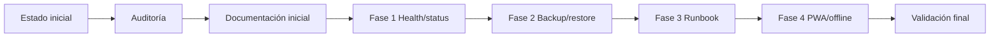

Lectura bloque por bloque:
- `Estado inicial` representa el punto de partida incompleto del repo.
- `Auditoría` es el momento en que se revisó qué había realmente implementado.
- `Documentación inicial` representa la creación de la base documental para ordenar el trabajo.
- `Fase 1 Health/status` representa el cierre de la observabilidad mínima.
- `Fase 2 Backup/restore` representa la base operativa de recuperación de DB.
- `Fase 3 Runbook` representa el paso de conocimiento implícito a procedimiento explícito.
- `Fase 4 PWA/offline` representa el cierre del bloque Web Minor.
- `Validación final` representa las pruebas reales de endpoints, restore y PWA.

### 5.7.1 Línea temporal visual

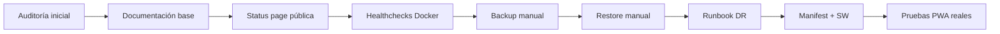

Lectura bloque por bloque:
- `Auditoría inicial` fue el paso de entender el estado real antes de tocar nada.
- `Documentación base` fijó el plan y dejó trazabilidad del trabajo.
- `Status page pública` representa la consolidación visible del bloque health/status.
- `Healthchecks Docker` representa la parte de observabilidad a nivel de contenedor.
- `Backup manual` y `Restore manual` representan la Fase 2A operativa.
- `Runbook DR` representa el cierre documental del bloque DevOps.
- `Manifest + SW` representa la parte estructural de la PWA.
- `Pruebas PWA reales` representa la validación en modo producción-like.

### 5.8 Decisiones tomadas durante el desarrollo

#### Por qué `/status` debía ser pública

Porque una status page pensada para evaluación pierde valor si requiere autenticación. Se decidió hacerla pública mediante `PUBLIC_ROUTES`.

#### Por qué los backups se guardan en `backups/postgres/`

Porque es una carpeta local, simple, visible y no obliga a rediseñar contenedores.

#### Por qué el restore exige `BACKUP_FILE` explícito

Porque el restore es destructivo y no debe haber ambigüedad sobre qué dump se va a aplicar.

#### Por qué el service worker no se activa siempre en desarrollo

Porque un SW activo en `next dev` puede servir assets viejos y volver engañosas las pruebas.

#### Por qué el offline es básico y no total

Porque la app tiene auth y datos privados. Prometer offline total sería técnicamente engañoso con la arquitectura actual.

#### Por qué no se cachean endpoints privados agresivamente

Porque eso complica coherencia, seguridad y debugging. La decisión fue cachear solo lo que tiene sentido para demo y evaluación: `/status`, assets y fallback.

### 5.9 Qué aprendimos de la tarea

Esta tarea cubre conceptos muy defendibles en evaluación:

- **observabilidad básica**;
- **healthchecks** HTTP y de contenedor;
- **backup** lógico de PostgreSQL;
- **restore** reproducible y destructivo controlado;
- **disaster recovery** documentado;
- **PWA** con manifest e instalación;
- **service worker**;
- **caché offline** limitada pero real;
- **documentación operativa** y criterio de alcance.

## 6. Diagramas Mermaid específicos

### 1. Arquitectura general GGC-83

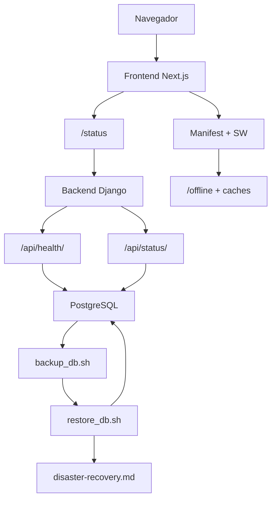

Lectura bloque por bloque:
- `Navegador` es quien consume la aplicación y dispara toda la interacción.
- `Frontend Next.js` es la capa web principal que renderiza páginas y registra la PWA.
- `/status` es la ruta pública usada para exponer observabilidad real.
- `Manifest + SW` representa el bloque PWA instalado sobre el frontend.
- `Backend Django` es la capa API central.
- `/api/health/` y `/api/status/` son los dos endpoints de salud que salen del backend.
- `PostgreSQL` es la dependencia que ambos endpoints necesitan para ser útiles.
- `backup_db.sh` y `restore_db.sh` cuelgan de PostgreSQL porque trabajan sobre su estado.
- `disaster-recovery.md` cuelga del restore porque documenta cómo usar esa recuperación.
- `/offline + caches` representa la parte de experiencia offline gestionada por la PWA.

### 2. Backup / restore

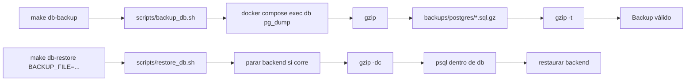

Lectura bloque por bloque:
- `make db-backup` es el comando humano de entrada.
- `scripts/backup_db.sh` encapsula la lógica operativa del backup.
- `docker compose exec db pg_dump` representa el volcado lógico de PostgreSQL.
- `gzip` transforma ese volcado en un archivo comprimido.
- `backups/postgres/*.sql.gz` es el destino persistente del dump.
- `gzip -t` separa un archivo creado de un archivo realmente validado.
- `Backup válido` es el estado final deseado del flujo de backup.
- `make db-restore BACKUP_FILE=...` inicia el flujo inverso de recuperación.
- `scripts/restore_db.sh` orquesta la validación y restauración.
- `parar backend si corre` protege la DB de conexiones activas durante el restore.
- `gzip -dc` y `psql dentro de db` representan la aplicación real del dump.
- `restaurar backend` cierra el proceso y devuelve el stack a un estado usable.

### 3. Disaster recovery

```mermaid
flowchart LR
    A["Detectar fallo"] --> B["docker compose ps"]
    B --> C["logs backend/db"]
    C --> D["curl /api/health/"]
    D --> E["curl /api/status/"]
    E --> F["localizar backup"]
    F --> G["make db-restore BACKUP_FILE=..."]
    G --> H["levantar servicios"]
    H --> I["smoke checks"]
```

Lectura bloque por bloque:
- `Detectar fallo` es el disparador del incidente.
- `docker compose ps` revisa el estado general de servicios.
- `logs backend/db` baja al detalle técnico de backend y PostgreSQL.
- `curl /api/health/` valida salud mínima del backend y la DB.
- `curl /api/status/` valida además el payload extendido de estado.
- `localizar backup` obliga a elegir un dump concreto antes de actuar.
- `make db-restore BACKUP_FILE=...` representa la ejecución del restore.
- `levantar servicios` devuelve los procesos al estado operativo.
- `smoke checks` comprueba que la recuperación no solo terminó, sino que sirve.

### 4. PWA / offline

```mermaid
flowchart LR
    A["Chrome / navegador"] --> B["manifest.webmanifest"]
    A --> C["ServiceWorkerRegistration"]
    C --> D["register /sw.js"]
    D --> E["install"]
    D --> F["activate"]
    D --> G["fetch"]
    G --> H["/status network-first"]
    G --> I["assets cache-first"]
    G --> J["fallback /offline"]
```

Lectura bloque por bloque:
- `Chrome / navegador` es el actor que evalúa installability y ejecuta el SW.
- `manifest.webmanifest` es el archivo consumido por Chrome para la identidad PWA.
- `ServiceWorkerRegistration` es el componente que decide si registra el SW.
- `register /sw.js` es el paso en que el navegador activa la lógica offline.
- `install` representa el precache inicial.
- `activate` representa la limpieza de caches antiguas y toma de control.
- `fetch` representa la interceptación de peticiones posteriores.
- `/status network-first` explica la política aplicada a la status page.
- `assets cache-first` explica la política aplicada a recursos estáticos.
- `fallback /offline` explica qué se ofrece cuando no hay red suficiente.

### 5. Health/status end-to-end

```mermaid
flowchart LR
    A["Navegador"] --> B["/status"]
    B --> C["fetchSystemStatus()"]
    C --> D["GET /api/status/"]
    D --> E["_check_database()"]
    D --> F["_get_last_sync_time()"]
    E --> G["PostgreSQL"]
    F --> H["SyncMetadata"]
    D --> I["payload JSON"]
    I --> B
```

Lectura bloque por bloque:
- `Navegador` inicia la visita de la status page.
- `/status` representa la página frontend ya consolidada.
- `fetchSystemStatus()` representa la llamada del cliente React al backend.
- `GET /api/status/` representa el endpoint Django que agrega la información.
- `_check_database()` es la parte que hace el `SELECT 1`.
- `_get_last_sync_time()` es la parte que consulta `SyncMetadata`.
- `PostgreSQL` es la fuente de verdad de la conectividad.
- `SyncMetadata` es la fuente de `last_sync`.
- `payload JSON` es la respuesta final que vuelve al frontend.
- La flecha de vuelta a `/status` representa el render visible con datos reales.

### 6. Validación PWA

```mermaid
flowchart LR
    A["make front-pwa"] --> B["npm run build"]
    B --> C["npm run start"]
    C --> D["Chrome /status"]
    D --> E["Application > Manifest"]
    D --> F["Application > Service Workers"]
    D --> G["Network > Offline"]
    G --> H["/status o /offline"]
```

Lectura bloque por bloque:
- `make front-pwa` es el helper añadido para levantar el frontend en modo PWA.
- `npm run build` valida que la app compile en modo producción.
- `npm run start` levanta el frontend en modo apropiado para service worker.
- `Chrome /status` es la entrada visual a la prueba.
- `Application > Manifest` valida installability y manifest.
- `Application > Service Workers` valida que el SW esté realmente registrado.
- `Network > Offline` fuerza el escenario sin red.
- `/status o /offline` representa el comportamiento final esperado en la prueba offline.
- Refleja por qué se añadió `make front-pwa` para poder probar installability y offline básico.

## 7. Pseudocódigo global del flujo GGC-83

```text
FUNCIÓN ggc83():

    implementar /api/health/ y /api/status/
    exponer /status como página pública
    activar healthcheck del backend en Docker

    crear script de backup PostgreSQL
    crear script de restore PostgreSQL
    añadir comandos make para operar ambos

    escribir runbook de disaster recovery
    definir smoke checks post-restore

    crear manifest PWA
    crear service worker mínimo
    crear página /offline
    registrar PWA solo en producción o con flag

    validar:
        health/status
        backup
        restore
        runbook
        installability
        offline básico

    devolver "GGC-83 implementada"
```

## Conclusión

GGC-83 no fue una sola feature, sino una **cadena de entregables complementarios**:

- observabilidad mínima real;
- recuperación operativa de PostgreSQL;
- documentación de disaster recovery;
- PWA mínima, instalable y con offline básico.

La automatización periódica de backups queda cubierta por el servicio `db-backup`, con ejecución cada 6 horas, validación gzip y retención de 7 días para copias automáticas.

## Quiz final tipo test (20 preguntas)

### 1. ¿Qué endpoint expone la salud básica del backend?
- A. `/api/status/`
- B. `/api/health/`
- C. `/api/auth/profile/`
- D. `/api/coalitions/`
- Respuesta correcta: B
- Explicación: `/api/health/` es el check mínimo de salud.

### 2. ¿Qué endpoint añade información de último sync?
- A. `/api/status/`
- B. `/api/auth/logout/`
- C. `/api/users/details/`
- D. `/offline`
- Respuesta correcta: A
- Explicación: `/api/status/` amplía la observabilidad.

### 3. ¿Qué ruta frontend muestra ese estado operativo?
- A. `/leaderboard`
- B. `/status`
- C. `/login`
- D. `/users/[login]`
- Respuesta correcta: B
- Explicación: es la página pública de salud y sync.

### 4. ¿Qué script crea backups de PostgreSQL?
- A. `scripts/restore_db.sh`
- B. `scripts/backup_db.sh`
- C. `frontend/sw.js`
- D. `backend/entrypoint.sh`
- Respuesta correcta: B
- Explicación: genera dumps comprimidos de la DB.

### 5. ¿Qué script restaura una copia?
- A. `scripts/restore_db.sh`
- B. `scripts/run_frontend_pwa.sh`
- C. `scripts/backup_db.sh`
- D. `docker-compose.dev.yml`
- Respuesta correcta: A
- Explicación: repone un backup seleccionado sobre la base.

### 6. ¿Qué riesgo importante tiene el restore?
- A. Solo cambia CSS
- B. Es destructivo sobre el estado actual si se usa mal
- C. Solo afecta a frontend
- D. Rompe OAuth siempre
- Respuesta correcta: B
- Explicación: pisa el contenido lógico actual de la base.

### 7. ¿Qué comando del Makefile crea backup?
- A. `make full-up`
- B. `make db-backup`
- C. `make shell`
- D. `make front-up`
- Respuesta correcta: B
- Explicación: llama al script de backup.

### 8. ¿Qué comando del Makefile restaura backup?
- A. `make db-restore BACKUP_FILE=...`
- B. `make restore`
- C. `make migrate`
- D. `make fclean`
- Respuesta correcta: A
- Explicación: exige indicar explícitamente qué copia usar.

### 9. ¿Qué documento complementario describe el runbook de recuperación?
- A. `disaster-recovery.md`
- B. `Design_Requirements.md`
- C. `auth-flow-explained.md`
- D. `database-models-explained.md`
- Respuesta correcta: A
- Explicación: ahí está el procedimiento de DR real.

### 10. ¿Qué archivo define el manifest PWA?
- A. `frontend/app/manifest.ts`
- B. `frontend/lib/statusApi.ts`
- C. `backend/manage.py`
- D. `scripts/backup_db.sh`
- Respuesta correcta: A
- Explicación: genera el manifest web de la app.

### 11. ¿Qué archivo registra el service worker?
- A. `frontend/components/ServiceWorkerRegistration.tsx`
- B. `frontend/app/login/page.tsx`
- C. `backend/config/views.py`
- D. `backend/authentication/views.py`
- Respuesta correcta: A
- Explicación: usa `useEffect` para registrar o desregistrar.

### 12. ¿Qué ruta pública sirve como fallback offline básico?
- A. `/leaderboard`
- B. `/offline`
- C. `/coalitions`
- D. `/users/[login]`
- Respuesta correcta: B
- Explicación: es la página pensada para situación offline controlada.

### 13. ¿Qué lectura es correcta sobre la PWA actual?
- A. Implementa modo offline total de toda la app
- B. Es una PWA mínima con installability y offline básico
- C. Sustituye al backend
- D. No existe en el repo
- Respuesta correcta: B
- Explicación: la documentación deja claro que el alcance es deliberadamente limitado.

### 14. ¿Qué archivo del frontend contiene la lógica visual de `/status`?
- A. `frontend/app/status/page.tsx`
- B. `frontend/app/page.tsx`
- C. `frontend/hooks/useUser.ts`
- D. `frontend/app/users/[login]/page.tsx`
- Respuesta correcta: A
- Explicación: consume `fetchSystemStatus` y renderiza cards.

### 15. ¿Qué función backend apoya `/api/status/` para obtener `last_sync`?
- A. `_build_sync_context`
- B. `_get_last_sync_time`
- C. `_apply_evaluation_score_rows`
- D. `logout`
- Respuesta correcta: B
- Explicación: lee el metadato desde `SyncMetadata`.

### 16. ¿Qué problema resuelve GGC-83 más allá de una feature visible?
- A. Solo cambiar colores
- B. Añadir observabilidad, recuperación operativa y PWA mínima
- C. Eliminar PostgreSQL
- D. Reescribir toda la auth
- Respuesta correcta: B
- Explicación: es una capa transversal operativa y de resiliencia.

### 17. ¿Qué lectura es correcta sobre backups periódicos?
- A. Ya están completamente automatizados
- B. Es la parte pendiente más clara según la documentación
- C. No existen scripts
- D. Solo funcionan sin Docker
- Respuesta correcta: A
- Explicación: el servicio `db-backup` crea y valida copias cada 6 horas y aplica una retención de 7 días.

### 18. ¿Qué significa installability en esta tarea?
- A. Que la app puede instalarse como PWA compatible
- B. Que Docker instala PostgreSQL
- C. Que el backend instala usuarios
- D. Que el Makefile genera HTML
- Respuesta correcta: A
- Explicación: forma parte del bloque PWA.

### 19. ¿Qué secuencia describe mejor GGC-83?
- A. Health/status -> backups/restore -> disaster recovery -> PWA/offline
- B. CSS -> SEO -> pagos -> chat
- C. Auth -> ORM -> migraciones -> tests
- D. 42 API -> cron -> JWT -> avatars
- Respuesta correcta: A
- Explicación: ese fue el orden real de las fases técnicas.

### 20. ¿Cuál es la idea final correcta sobre GGC-83?
- A. Fue una única pantalla
- B. Fue un conjunto de entregables operativos complementarios y defendibles
- C. Solo fue documentación sin código
- D. Solo fue una mejora de rendimiento del frontend
- Respuesta correcta: B
- Explicación: abarca health, status, backups, restore, DR y PWA básica.
