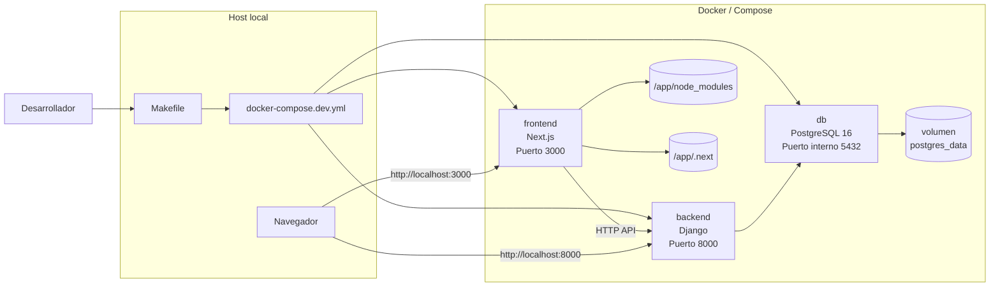

# Infraestructura del proyecto explicada

## 1. Visión general

La infraestructura de este proyecto está pensada para desarrollo local con Docker Compose. La idea es levantar tres servicios principales:

- `frontend`: aplicación Next.js en `localhost:3000`
- `backend`: aplicación Django en `localhost:8000`
- `db`: PostgreSQL dentro de Docker

El flujo normal es:

1. Docker Compose construye las imágenes de `frontend` y `backend`.
2. Docker Compose arranca `db`.
3. Cuando `db` está sana, arranca `backend`.
4. `frontend` se conecta al backend usando `NEXT_PUBLIC_API_URL=http://localhost:8000`.
5. El desarrollador usa `Makefile` como interfaz corta para arrancar, parar, reconstruir, migrar y mantener el stack.

## 2. Diagrama general de servicios Docker



### Cómo leer el diagrama

- `Desarrollador` es quien lanza comandos como `make full-up`.
- `Makefile` es una capa de comodidad encima de Docker Compose.
- `docker-compose.dev.yml` define qué servicios existen y cómo se conectan.
- `frontend` expone `3000:3000`, así que se abre desde el navegador.
- `backend` expone `8000:8000`, así que responde tanto al frontend como a pruebas manuales con `curl`.
- `db` no publica `5432` al host en este archivo; solo la usa el backend dentro de la red de Docker.
- `postgres_data` es el volumen persistente de PostgreSQL.
- `/app/node_modules` y `/app/.next` son volúmenes internos del contenedor frontend para aislar dependencias y build cache del bind mount del código.

## 3. Cómo se levanta el proyecto

El comando principal es:

```bash
make full-up
```

Eso ejecuta internamente:

```bash
docker compose -f docker-compose.dev.yml up -d --build
```

Secuencia real:

1. Se construye la imagen del backend desde `backend/Dockerfile.dev`.
2. Se construye la imagen del frontend desde `frontend/Dockerfile.dev`.
3. Se arranca `db`.
4. PostgreSQL ejecuta su `healthcheck`.
5. Cuando `db` está `healthy`, se arranca `backend`.
6. `frontend` queda escuchando en `3000`.

### Pseudocódigo

```text
FUNCIÓN levantar_stack_dev():

    leer docker-compose.dev.yml
    construir imagen backend
    construir imagen frontend
    arrancar db

    SI db está healthy:
        arrancar backend

    arrancar frontend
    exponer backend en localhost:8000
    exponer frontend en localhost:3000

    devolver "stack listo"
```

## 4. Archivos de infraestructura

### 4.1 `docker-compose.dev.yml`

#### Qué hace

Define los servicios Docker de desarrollo:

- `frontend`
- `backend`
- `db`
- volumen `postgres_data`

#### Por qué existe

Centraliza cómo se levantan los contenedores, qué puertos usan, qué carpetas se montan y qué dependencias hay entre servicios.

#### Comandos y secciones importantes

- `build.context` y `dockerfile`
  - indican de dónde se construye cada imagen.
- `ports`
  - `frontend`: `3000:3000`
  - `backend`: `8000:8000`
- `volumes`
  - `./frontend:/app`
  - `./backend:/app`
  - `postgres_data:/var/lib/postgresql/data`
- `environment`
  - `NEXT_PUBLIC_API_URL=http://localhost:8000`
- `env_file`
  - el backend carga `./backend/.env`
- `depends_on`
  - `backend` espera a que `db` esté sana
- `healthcheck`
  - `db` usa `pg_isready`
  - `backend` usa `curl /api/health/`

#### Relación con Docker

Es el punto de entrada de Compose. Sin este archivo no existiría una definición compartida del stack.

#### Puertos

- `3000` para frontend
- `8000` para backend
- `5432` se usa dentro de Docker para PostgreSQL, pero no está publicado al host

#### Variables de entorno importantes

- `NEXT_PUBLIC_API_URL`
- `POSTGRES_DB`
- `POSTGRES_USER`
- `POSTGRES_PASSWORD`
- variables cargadas desde `backend/.env`

#### Errores comunes

- `port is already allocated`
  - otro proceso ya usa `3000` u `8000`.
- `backend` no arranca porque falta `backend/.env`
  - `env_file` apunta a `./backend/.env`, no a `.env.example`.
- `backend` queda unhealthy
  - el endpoint `/api/health/` falla o Django no ha arrancado bien.
- `db` queda unhealthy
  - PostgreSQL no está listo o el volumen tiene un estado roto.

---

### 4.2 `Makefile`

#### Qué hace

Sirve como capa de comandos cortos encima de Docker Compose y los scripts auxiliares del repo.

#### Por qué existe

Evita recordar comandos largos de Docker Compose y normaliza tareas frecuentes:

- levantar o parar servicios
- ver logs
- migrar Django
- abrir shell Django
- lanzar syncs
- hacer backup y restore
- arrancar frontend en modo PWA

#### Variables importantes

- `DOCKER_COMPOSE = docker compose -f docker-compose.dev.yml`
- `MODE ?= full`
- `CSV_PATH ?= /app/evaluations_snapshot_round_apr_oct_2026.csv`
- `DRY_RUN ?=`
- `BACKUP_FILE ?=`

#### Helpers importantes

- `stop_if_running`
  - detiene servicios concretos solo si están corriendo.
- `stop_all_if_running`
  - detiene `frontend`, `backend` y `db` solo si alguno está activo.

#### Relación con Docker

Casi todos los targets llaman a `docker compose ...` o a scripts que a su vez llaman a Docker.

#### Errores comunes

- `make db-restore` sin `BACKUP_FILE`
  - falla a propósito con mensaje de uso.
- `make back-import-evaluations` con `CSV_PATH` incorrecto
  - el comando de Django no encuentra el CSV.
- `make test`
  - actualmente apunta a `back-test`, pero ese target no está implementado en este archivo.

#### Tabla de comandos Make

| Comando | Qué hace | Cuándo usarlo | Riesgo |
|---|---|---|---|
| `make full-up` | Levanta todo el stack y reconstruye imágenes | Inicio normal del proyecto | Bajo |
| `make full-stop` | Para `frontend`, `backend` y `db` si están corriendo | Pausa rápida del entorno | Bajo |
| `make full-down` | Hace `docker compose down --remove-orphans` | Reinicio más limpio del stack | Medio |
| `make full-re` | Baja y vuelve a levantar todo | Cuando quieres refrescar el entorno | Medio |
| `make full-logs` | Sigue logs de todos los servicios | Diagnóstico general | Bajo |
| `make front-up` | Levanta solo el frontend | Trabajo de UI o navegación | Bajo |
| `make front-stop` | Para solo el frontend | Reiniciar UI o liberar puerto 3000 | Bajo |
| `make front-down` | Elimina el servicio frontend | Reset más fuerte del frontend | Medio |
| `make front-re` | Recrea el frontend | Problemas de cache o arranque | Medio |
| `make front-logs` | Muestra logs del frontend | Diagnóstico de Next.js | Bajo |
| `make back-up` | Levanta backend y db | Trabajo centrado en API y datos | Bajo |
| `make back-stop` | Para backend y db | Pausar backend/DB | Bajo |
| `make back-down` | Elimina backend y db | Reinicio limpio de backend y base | Medio |
| `make back-re` | Recrea backend y db | Problemas de estado o configuración | Medio |
| `make back-logs` | Muestra logs de backend y db | Diagnóstico de API/DB | Bajo |
| `make back-migrate` | Ejecuta `python manage.py migrate` | Aplicar migraciones | Medio |
| `make back-makemigrations` | Genera migraciones de Django | Después de cambiar modelos | Medio |
| `make back-makemigrations-app APP=...` | Genera migraciones de una app concreta | Trabajo acotado por app | Medio |
| `make back-showmigrations` | Lista migraciones | Comprobar estado de esquema | Bajo |
| `make back-showmigrations-app APP=...` | Lista migraciones de una app | Diagnóstico por app | Bajo |
| `make back-syncdb` | Encadena makemigrations + migrate | Cuando quieres sincronizar esquema rápido | Medio |
| `make back-superuser` | Crea superusuario Django | Preparar panel admin | Bajo |
| `make back-shell` | Abre shell de Django | Inspección manual de modelos o DB | Bajo |
| `make back-syncapi MODE=...` | Lanza `sync_campus_users` | Sync manual con la API de 42 | Medio |
| `make back-import-evaluations` | Importa snapshot CSV de evaluaciones | Cargar snapshot de correcciones | Medio |
| `make front-pwa` | Arranca frontend temporal en modo validación PWA | Pruebas de manifest/service worker | Bajo |
| `make db-backup` | Genera backup PostgreSQL `.sql.gz` | Antes de cambios sensibles o para DR | Bajo |
| `make db-restore BACKUP_FILE=...` | Restaura un backup de DB | Recuperación o rollback | Alto |
| `make db-backup-ls` | Lista backups disponibles | Elegir backup a restaurar | Bajo |
| `make fclean` | Baja todo, borra volúmenes e imágenes | Reset total del entorno | Alto |
| `make up` | Alias de `full-up` | Comodidad | Bajo |
| `make stop` | Alias de `full-stop` | Comodidad | Bajo |
| `make down` | Alias de `full-down` | Comodidad | Medio |
| `make logs` | Alias de `full-logs` | Comodidad | Bajo |
| `make migrate` | Alias de `back-migrate` | Comodidad | Medio |
| `make makemigrations` | Alias de `back-makemigrations` | Comodidad | Medio |
| `make superuser` | Alias de `back-superuser` | Comodidad | Bajo |
| `make shell` | Alias de `back-shell` | Comodidad | Bajo |
| `make test` | Alias de `back-test` | Teóricamente para tests | Alto: hoy fallará porque `back-test` no existe |
| `make dev-up` | Alias de `front-up` | Comodidad | Bajo |
| `make dev-stop` | Alias de `front-stop` | Comodidad | Bajo |
| `make dev-down` | Alias de `front-down` | Comodidad | Medio |
| `make dev-logs` | Alias de `front-logs` | Comodidad | Bajo |
| `make dev-re` | Alias de `front-re` | Comodidad | Medio |

---

### 4.3 `backend/Dockerfile.dev`

#### Qué hace

Construye la imagen de desarrollo del backend Django.

#### Por qué existe

Permite tener un backend reproducible con Python, dependencias y utilidades necesarias sin depender del Python del host.

#### Bloques importantes

```dockerfile
FROM python:3.12-slim
```

- parte de una imagen oficial ligera de Python 3.12.

```dockerfile
ENV PYTHONDONTWRITEBYTECODE=1 \
    PYTHONUNBUFFERED=1
```

- evita `.pyc` innecesarios
- hace que los logs salgan sin buffering, útil en Docker

```dockerfile
RUN apt-get update \
    && apt-get install -y --no-install-recommends curl cron \
    && rm -rf /var/lib/apt/lists/*
```

- instala `curl` para healthchecks y pruebas
- instala `cron` porque el entrypoint lo arranca

```dockerfile
COPY requirements.txt ./requirements.txt
RUN pip install --no-cache-dir --upgrade pip \
    && pip install --no-cache-dir -r requirements.txt
```

- instala dependencias Python

```dockerfile
COPY . /app
RUN chmod +x /app/entrypoint.sh
ENTRYPOINT ["/app/entrypoint.sh"]
```

- copia el backend y usa `entrypoint.sh` como punto de arranque

#### Relación con Docker

Es la receta con la que Compose construye el servicio `backend`.

#### Errores comunes

- fallo al instalar dependencias de `requirements.txt`
- `entrypoint.sh` sin permisos si no se hubiese hecho `chmod +x`
- build desactualizada si no se reconstruye tras cambios de dependencias

---

### 4.4 `frontend/Dockerfile.dev`

#### Qué hace

Construye la imagen de desarrollo del frontend Next.js.

#### Por qué existe

Da un entorno Node estable dentro de Docker y deja que el código real entre por volumen.

#### Bloques importantes

```dockerfile
FROM node:20-alpine
WORKDIR /app
COPY package.json package-lock.json ./
RUN npm ci
EXPOSE 3000
CMD ["npm", "run", "dev"]
```

#### Explicación

- `node:20-alpine`
  - imagen ligera de Node.js 20
- `npm ci`
  - instala dependencias exactas del lockfile
- `npm run dev`
  - arranca Next.js en modo desarrollo

#### Relación con Docker

Compose usa esta imagen para el servicio `frontend`.

#### Errores comunes

- `npm ci` falla si `package-lock.json` no coincide con `package.json`
- puertos ocupados en `3000`
- problemas de cache de `.next`

---

### 4.5 `backend/entrypoint.sh`

#### Qué hace

Es el script que arranca el contenedor backend.

#### Por qué existe

Permite centralizar el comportamiento de arranque en vez de incrustarlo todo en Dockerfile o Compose.

#### Contenido importante

```bash
#!/bin/bash
set -e
```

- usa Bash
- aborta si un comando falla

```bash
if [ "$#" -gt 0 ]; then
	exec "$@"
fi
```

- si el contenedor recibe un comando explícito, lo ejecuta y sale
- esto permite usar el contenedor también para tareas como `python manage.py ...`

```bash
cron
exec python manage.py runserver 0.0.0.0:8000
```

- arranca `cron`
- luego arranca el servidor de desarrollo de Django escuchando en todas las interfaces

#### Relación con Docker

Es el `ENTRYPOINT` del backend.

#### Variables de entorno importantes

Las carga Django desde `backend/.env` a través de Compose.

#### Errores comunes

- `backend/.env` incompleto y Django no puede arrancar
- migraciones pendientes: el servidor arranca, pero ciertas rutas pueden fallar
- `cron` instalado pero no necesariamente configurado con tareas útiles si no se han definido jobs

---

### 4.6 `backend/.env.example`

#### Qué hace

Es una plantilla de variables de entorno para el backend.

#### Por qué existe

Sirve de referencia para crear el archivo real `backend/.env`, que es el que Compose carga.

#### Variables importantes

##### Integración con 42

- `FT_CLIENT_ID`
- `FT_CLIENT_SECRET`
- `FT_REDIRECT_URI`
- `FT_API_BASE_URL`

##### Frontend y cookies

- `FRONTEND_URL`
- `JWT_COOKIE_SECURE`
- `JWT_COOKIE_SAMESITE`

##### Django

- `ALLOWED_HOSTS`

##### Base de datos

- `DB_NAME`
- `DB_USER`
- `DB_PASSWORD`
- `DB_HOST`
- `DB_PORT`

#### Relación con Docker

`docker-compose.dev.yml` no carga `.env.example`; carga `backend/.env`. Este archivo solo documenta qué debes rellenar.

#### Errores comunes

- creer que `.env.example` se usa automáticamente
- dejar `DB_HOST` mal configurado
  - en Docker suele ser `db`
- `FT_CLIENT_ID` o `FT_CLIENT_SECRET` vacíos si vas a usar OAuth 42

---

### 4.7 `backend/requirements.txt`

#### Qué hace

Lista las dependencias Python del backend.

#### Por qué existe

Permite construir el backend de forma reproducible.

#### Dependencias importantes

- `Django`
  - framework principal
- `dj-database-url`
  - parseo de configuración de base de datos
- `django-cors-headers`
  - CORS entre frontend y backend
- `psycopg[binary]`
  - cliente PostgreSQL para Python
- `gunicorn`
  - servidor WSGI, útil aunque aquí el entrypoint usa `runserver`
- `djangorestframework`
  - API REST
- `djangorestframework-simplejwt`
  - JWT para auth
- `django-crontab`
  - soporte para cron jobs desde Django
- `requests`
  - llamadas HTTP, por ejemplo a la API de 42
- `Pillow`
  - imágenes

#### Relación con Docker

El Dockerfile del backend lo usa en build time para instalar todo con `pip install -r requirements.txt`.

#### Errores comunes

- cambiar dependencias y no reconstruir la imagen
- conflicto entre lock implícito del contenedor y dependencias nuevas no instaladas

---

### 4.8 `frontend/package.json`

#### Qué hace

Define scripts y dependencias del frontend.

#### Por qué existe

Es la base de ejecución del contenedor frontend.

#### Scripts importantes

- `npm run dev`
  - arranca Next.js en desarrollo
- `npm run build`
  - build de producción
- `npm run start`
  - sirve build de producción
- `npm run lint`
  - lint del frontend

#### Dependencias importantes

- `next`
- `react`
- `react-dom`
- `zustand`
- `recharts`
- `lucide-react`
- `next-themes`

#### Dev dependencies importantes

- `typescript`
- `eslint`
- `eslint-config-next`
- `tailwindcss`

#### Relación con Docker

`frontend/Dockerfile.dev` copia `package.json` y `package-lock.json` y luego ejecuta `npm ci`.

#### Errores comunes

- `npm ci` falla por desajuste entre lockfile y package.json
- build de producción falla aunque `npm run dev` funcione
  - por ejemplo, errores de render estático o Suspense

## 5. Puertos del proyecto

| Servicio | Puerto dentro del contenedor | Puerto en host | Uso |
|---|---:|---:|---|
| `frontend` | `3000` | `3000` | Navegación web |
| `backend` | `8000` | `8000` | API Django y pruebas manuales |
| `db` | `5432` | no expuesto | PostgreSQL interno para backend |

## 6. Variables de entorno más importantes

| Variable | Dónde se usa | Para qué sirve |
|---|---|---|
| `NEXT_PUBLIC_API_URL` | `frontend` | URL pública del backend desde el navegador |
| `FT_CLIENT_ID` | `backend` | OAuth/API de 42 |
| `FT_CLIENT_SECRET` | `backend` | OAuth/API de 42 |
| `FT_REDIRECT_URI` | `backend` | callback de autenticación 42 |
| `FT_API_BASE_URL` | `backend` | base URL de la API de 42 |
| `FRONTEND_URL` | `backend` | URL del frontend usada por backend |
| `ALLOWED_HOSTS` | `backend` | hosts permitidos en Django |
| `DB_NAME` | `backend` | nombre de base de datos |
| `DB_USER` | `backend` | usuario de base de datos |
| `DB_PASSWORD` | `backend` | password de base de datos |
| `DB_HOST` | `backend` | host de base de datos, normalmente `db` |
| `DB_PORT` | `backend` | puerto de base de datos, normalmente `5432` |
| `POSTGRES_DB` | `db` | nombre interno de PostgreSQL |
| `POSTGRES_USER` | `db` | usuario interno de PostgreSQL |
| `POSTGRES_PASSWORD` | `db` | password interno de PostgreSQL |

## 7. Errores comunes de infraestructura

### 7.1 El frontend no abre en `localhost:3000`

Posibles causas:

- el contenedor `frontend` no arrancó
- el puerto `3000` ya está ocupado
- `npm ci` falló en build

Comandos útiles:

```bash
docker compose -f docker-compose.dev.yml ps
docker compose -f docker-compose.dev.yml logs -f frontend
```

### 7.2 El backend no responde en `localhost:8000`

Posibles causas:

- falta `backend/.env`
- Django no puede conectar a la base de datos
- migraciones pendientes
- el healthcheck está fallando

Comandos útiles:

```bash
docker compose -f docker-compose.dev.yml logs -f backend
curl -i http://localhost:8000/api/health/
```

### 7.3 La base de datos no está sana

Posibles causas:

- volumen `postgres_data` con estado inconsistente
- configuración de PostgreSQL rota
- arranque incompleto

Comandos útiles:

```bash
docker compose -f docker-compose.dev.yml ps
docker compose -f docker-compose.dev.yml logs -f db
```

### 7.4 OAuth 42 no funciona

Posibles causas:

- `FT_CLIENT_ID` o `FT_CLIENT_SECRET` incorrectos
- `FT_REDIRECT_URI` no coincide con la configuración esperada
- problemas de red hacia la API de 42

### 7.5 `make test` falla

Motivo:

- `Makefile` declara `test: back-test`, pero no existe una receta `back-test`.

Interpretación:

- no es un problema de Docker en sí, sino una inconsistencia actual del archivo.

## 8. Flujo recomendado de trabajo

### Arranque inicial

```bash
make full-up
```

### Ver logs

```bash
make full-logs
```

### Aplicar migraciones

```bash
make back-migrate
```

### Abrir shell Django

```bash
make back-shell
```

### Probar health del backend

```bash
curl -i http://localhost:8000/api/health/
```

### Reinicio limpio completo

```bash
make full-re
```

### Reset total destructivo

```bash
make fclean
```

Úsalo solo cuando de verdad quieras borrar:

- contenedores
- volúmenes
- imágenes asociadas

## 9. Resumen corto

La infraestructura está pensada para desarrollo local con una separación clara:

- `frontend` sirve la UI
- `backend` expone la API y la lógica Django
- `db` persiste los datos
- `Makefile` simplifica la operativa
- Docker Compose coordina servicios, puertos, volúmenes y healthchecks

El punto más importante para que todo funcione bien es este:

1. tener un `backend/.env` real y correcto
2. levantar con `make full-up`
3. aplicar migraciones cuando haga falta
4. revisar `ps` y `logs` cuando algo falle

## 10. Pseudocódigo global del flujo de infraestructura

```text
FUNCIÓN infraestructura_del_proyecto():

    cargar variables de entorno
    leer docker-compose.dev.yml
    crear servicio db con volumen persistente
    crear servicio backend con Django
    crear servicio frontend con Next.js

    SI el desarrollador usa Makefile:
        simplificar arranque, logs, migraciones y shell

    SI backend falla:
        revisar .env, logs y conexión PostgreSQL

    SI frontend falla:
        revisar build, puertos y dependencias Node

    devolver "infraestructura local operativa"
```
