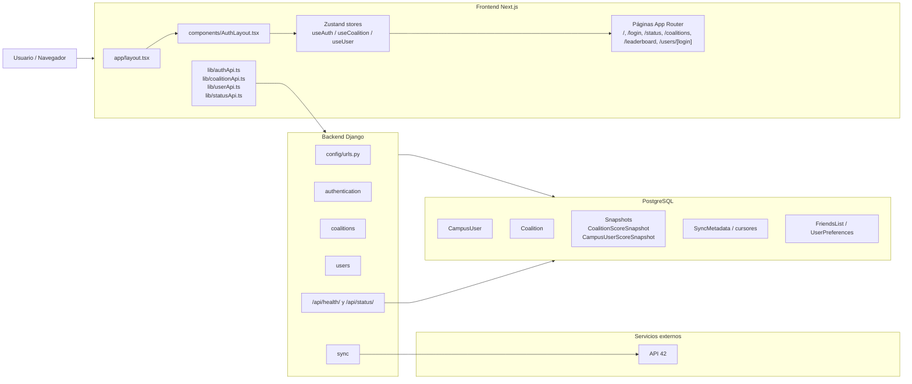
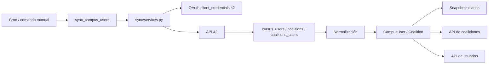

# Mapa completo del codebase

## 1. Qué es este proyecto

Este repositorio implementa una plataforma web alrededor de datos del campus 42. La app mezcla varias piezas:

- autenticación con OAuth de 42;
- persistencia local de usuarios y coaliciones;
- ranking y vistas de coaliciones;
- sincronización periódica con la API de 42;
- métricas históricas por snapshots;
- operativa de infraestructura con Docker;
- health/status, backups, restore, disaster recovery y PWA en el bloque GGC-83.

La idea base no es solo “mostrar datos de 42”, sino:

1. traerlos a una base local;
2. normalizarlos;
3. enriquecerlos con relaciones internas del proyecto;
4. exponerlos al frontend como una experiencia navegable.

## 2. Glosario inicial

| Término | Significado en este repo |
|---|---|
| `CampusUser` | Modelo principal de usuario sincronizado desde la API de 42 |
| `Coalition` | Modelo local de coalición con score total y metadatos |
| `Snapshot` | Foto temporal guardada en DB para poder comparar evolución de scores |
| `Sync` | Proceso que trae datos de la API de 42 y actualiza PostgreSQL |
| `Leaderboard` | Ranking de usuarios por puntos de coalición o correcciones |
| `OAuth 42` | Login contra la API de 42, con creación/actualización de usuario local |
| `AuthLayout` | Componente frontend que decide si una ruta es pública o privada |
| `Service Worker` | Script PWA que cachea rutas/recursos para offline básico |
| `Runbook` | Documento operativo con pasos para recuperar el sistema |
| `GGC-83` | Bloque transversal de health/status, backups, DR y PWA |

## 3. Stack real del proyecto

### Infraestructura

- Docker Compose para desarrollo
- PostgreSQL 16
- Makefile como capa de comandos

### Backend

- Django
- Django REST Framework
- SimpleJWT
- `requests` para hablar con la API de 42
- `django-crontab` para programar syncs

### Frontend

- Next.js App Router
- React
- TypeScript
- Zustand para estado cliente
- Recharts para gráficas

## 4. Arquitectura general



### Cómo leer este diagrama

- El usuario entra por el frontend Next.js.
- El frontend no habla directamente con la API de 42: habla con el backend Django.
- El backend es quien centraliza auth, datos de usuarios, coaliciones y sync.
- PostgreSQL es la fuente de verdad local.
- La API de 42 es una dependencia externa usada sobre todo por el módulo `sync`.

## 5. Estructura general de carpetas

| Carpeta / archivo | Qué contiene | Papel en el proyecto |
|---|---|---|
| `backend/` | Código Django | API, modelos, auth, sync y lógica de negocio |
| `backend/authentication/` | Login OAuth 42 y perfil autenticado | Entrada de identidad del usuario |
| `backend/coalitions/` | Endpoints y servicios de coaliciones y ranking | Vistas principales de competición |
| `backend/users/` | Perfil detallado, amigos y preferencias | Capa social y de personalización |
| `backend/sync/` | Modelos sincronizados, snapshots y comandos de import/sync | Núcleo de integración con 42 |
| `backend/config/` | Settings, URLs globales y endpoints base | Arranque del backend |
| `backend/cron_scheduler/` | App casi vacía | Reservada para tareas relacionadas con cron |
| `frontend/` | Código Next.js | Interfaz de usuario |
| `frontend/app/` | Páginas App Router | Navegación principal |
| `frontend/components/` | Componentes reutilizables | Layout, cards, header, footer, etc. |
| `frontend/hooks/` | Stores Zustand y lógica cliente | Estado global de auth, coaliciones y usuario |
| `frontend/lib/` | Clientes de API | Capa fetch hacia Django |
| `frontend/public/` | Assets públicos y service worker | SVG, iconos PWA, `sw.js` |
| `frontend/types/` | Tipos TypeScript compartidos | Contratos frontend |
| `scripts/` | Scripts operativos | backup, restore, arranque PWA |
| `doc/` | Documentación funcional, técnica y diagramas | Memoria del proyecto |
| `backups/` | Backups PostgreSQL generados localmente | Operativa / DR |
| `API_TEST/` | Experimentos aparte sobre API 42 | Área de análisis, no core de la app |
| `docker-compose.dev.yml` | Stack Docker de desarrollo | Infraestructura local |
| `Makefile` | Comandos cortos del proyecto | Interfaz operativa diaria |

## 6. Mapa del backend Django

## 6.1 `backend/config/`

Archivos clave:

- [backend/config/settings/settings.py](/home/aurodrig/Desktop/arepa/backend/config/settings/settings.py:1)
- [backend/config/urls.py](/home/aurodrig/Desktop/arepa/backend/config/urls.py:1)
- [backend/config/views.py](/home/aurodrig/Desktop/arepa/backend/config/views.py:1)

Qué hace:

- define settings, base de datos, apps instaladas y cron;
- enruta el backend;
- expone endpoints globales como `/api/health/` y `/api/status/`.

Apps instaladas reales:

- `authentication`
- `sync`
- `coalitions`
- `users`
- `cron_scheduler`

También define:

- auth por cookies JWT;
- CORS para `localhost:3000`;
- cron cada 20 minutos:
  - `sync_campus_users --mode=full`

## 6.2 `backend/authentication/`

Archivos clave:

- [backend/authentication/views.py](/home/aurodrig/Desktop/arepa/backend/authentication/views.py:1)
- [backend/authentication/urls.py](/home/aurodrig/Desktop/arepa/backend/authentication/urls.py:1)
- [backend/authentication/authentication.py](/home/aurodrig/Desktop/arepa/backend/authentication/authentication.py:1)

Qué hace:

- construye la URL de login con 42;
- recibe el callback OAuth;
- crea o actualiza el `User` local;
- enlaza o crea `CampusUser`;
- emite JWT en cookies HTTP-only;
- devuelve el perfil autenticado al frontend.

Endpoints principales:

- `GET /api/auth/42/login-url/`
- `GET /api/auth/42/login/`
- `GET /api/auth/42/callback/`
- `GET /api/auth/profile/`
- `POST /api/auth/token/refresh/`
- `POST /api/auth/logout/`

Modelo importante:

- no define un modelo de usuario custom;
- usa `django.contrib.auth.models.User` como fuente de verdad interna.

## 6.3 `backend/coalitions/`

Archivos clave:

- [backend/coalitions/views.py](/home/aurodrig/Desktop/arepa/backend/coalitions/views.py:1)
- [backend/coalitions/services.py](/home/aurodrig/Desktop/arepa/backend/coalitions/services.py:1)
- [backend/coalitions/urls.py](/home/aurodrig/Desktop/arepa/backend/coalitions/urls.py:1)

Qué hace:

- lista coaliciones;
- devuelve ranking de usuarios;
- devuelve detalle expandido de una coalición;
- calcula métricas como miembros activos, nivel medio, cambios de score y totales de proyectos/correcciones.

Endpoints principales:

- `GET /api/coalitions/`
- `GET /api/coalitions/users-ranking/`
- `GET /api/coalitions/details/?coalition=<slug>`

Importante:

- esta app no es dueña de los datos base; los lee sobre todo desde `sync.models`.
- por eso `coalitions/services.py` importa:
  - `CampusUser`
  - `Coalition`
  - `CoalitionScoreSnapshot`
  - `CampusUserScoreSnapshot`
  - `SyncMetadata`

## 6.4 `backend/users/`

Archivos clave:

- [backend/users/views.py](/home/aurodrig/Desktop/arepa/backend/users/views.py:1)
- [backend/users/models.py](/home/aurodrig/Desktop/arepa/backend/users/models.py:1)
- [backend/users/services.py](/home/aurodrig/Desktop/arepa/backend/users/services.py:1)

Qué hace:

- expone detalle de usuario;
- gestiona relaciones de amistad;
- gestiona preferencias;
- gestiona avatar custom.

Modelos principales:

- `FriendsList`
- `UserPreferences`

Endpoints principales:

- `GET /api/users/details/?login=...`
- `GET /api/users/friends/me/`
- `GET /api/users/friends/pending/`
- `POST/PATCH/DELETE /api/users/friends/requests/`
- `DELETE /api/users/friends/`
- `GET/PATCH /api/users/preferences/`
- `PUT/DELETE /api/users/preferences/avatar/`

## 6.5 `backend/sync/`

Es probablemente la parte más importante del backend.

Archivos clave:

- [backend/sync/models.py](/home/aurodrig/Desktop/arepa/backend/sync/models.py:1)
- [backend/sync/services.py](/home/aurodrig/Desktop/arepa/backend/sync/services.py:1)
- [backend/sync/projects.py](/home/aurodrig/Desktop/arepa/backend/sync/projects.py:1)
- [backend/sync/evaluations.py](/home/aurodrig/Desktop/arepa/backend/sync/evaluations.py:1)
- [backend/sync/management/commands/sync_campus_users.py](/home/aurodrig/Desktop/arepa/backend/sync/management/commands/sync_campus_users.py:1)

Qué hace:

- obtiene token machine-to-machine contra la API de 42;
- trae usuarios, coaliciones y coalitions_users;
- guarda datos normalizados en PostgreSQL;
- guarda snapshots diarios;
- sincroniza stats de proyectos entregados y correcciones;
- mantiene cursores para sync incremental por score events.

Modelos clave:

- `CampusUser`
- `Coalition`
- `CoalitionScoreSnapshot`
- `CampusUserScoreSnapshot`
- `CoalitionProjectCursor`
- `CoalitionEvaluationCursor`
- `SyncMetadata`

Comandos importantes:

- `sync_campus_users`
- `sync_project_stats`
- `sync_evaluation_stats`
- `sync_evaluation_score_events`
- `import_evaluations_snapshot`
- `import_projects_snapshot`
- `export_projects_snapshot`

## 6.6 `backend/cron_scheduler/`

Estado real:

- existe como app Django instalada;
- pero [backend/cron_scheduler/models.py](/home/aurodrig/Desktop/arepa/backend/cron_scheduler/models.py:1) y [backend/cron_scheduler/views.py](/home/aurodrig/Desktop/arepa/backend/cron_scheduler/views.py:1) están prácticamente vacíos.

Interpretación:

- hoy no es una pieza fuerte de dominio;
- el cron real importante se define en `settings.py` con `django-crontab`.

## 7. Base de datos real

La base de datos es PostgreSQL y el backend la usa como fuente de verdad local.

### Tablas / modelos más importantes

| Modelo | Dónde | Para qué sirve |
|---|---|---|
| `User` | Django auth | Usuario interno autenticado |
| `CampusUser` | `sync.models` | Perfil sincronizado desde 42 |
| `Coalition` | `sync.models` | Coalición y score actual |
| `CoalitionScoreSnapshot` | `sync.models` | Histórico diario de score por coalición |
| `CampusUserScoreSnapshot` | `sync.models` | Histórico diario de score por usuario |
| `CoalitionProjectCursor` | `sync.models` | Cursor incremental de proyectos |
| `CoalitionEvaluationCursor` | `sync.models` | Cursor incremental de correcciones |
| `SyncMetadata` | `sync.models` | Último momento de sync |
| `FriendsList` | `users.models` | Amigos y solicitudes |
| `UserPreferences` | `users.models` | Preferencias y avatar personalizado |

## 8. Mapa del frontend Next.js

## 8.1 `frontend/app/`

Es App Router de Next.js.

Páginas reales principales:

- [frontend/app/page.tsx](/home/aurodrig/Desktop/arepa/frontend/app/page.tsx:1): home
- [frontend/app/login/page.tsx](/home/aurodrig/Desktop/arepa/frontend/app/login/page.tsx:1): login
- [frontend/app/status/page.tsx](/home/aurodrig/Desktop/arepa/frontend/app/status/page.tsx:1): estado del sistema
- [frontend/app/coalitions/page.tsx](/home/aurodrig/Desktop/arepa/frontend/app/coalitions/page.tsx:1): listado de coaliciones
- [frontend/app/coalitions/[name]/page.tsx](/home/aurodrig/Desktop/arepa/frontend/app/coalitions/[name]/page.tsx:1): detalle de coalición
- [frontend/app/leaderboard/page.tsx](/home/aurodrig/Desktop/arepa/frontend/app/leaderboard/page.tsx:1): ranking
- [frontend/app/users/[login]/page.tsx](/home/aurodrig/Desktop/arepa/frontend/app/users/[login]/page.tsx:1): perfil de usuario
- [frontend/app/offline/page.tsx](/home/aurodrig/Desktop/arepa/frontend/app/offline/page.tsx:1): fallback offline

### `layout.tsx`

[frontend/app/layout.tsx](/home/aurodrig/Desktop/arepa/frontend/app/layout.tsx:1) es la raíz del frontend.

Hace tres cosas importantes:

1. monta `ThemeProvider`;
2. monta `ServiceWorkerRegistration`;
3. envuelve todo en `AuthLayout`.

## 8.2 `frontend/components/`

Aquí viven piezas reutilizables de UI:

- `Header`
- `Footer`
- `NavLink`
- `NavProfile`
- `CardContainer`
- `StatCard`
- `CoalitionPointsChart`
- `Chat`
- `ServiceWorkerRegistration`

Dos piezas clave para entender la navegación:

- [frontend/components/AuthLayout.tsx](/home/aurodrig/Desktop/arepa/frontend/components/AuthLayout.tsx:1)
- [frontend/components/Header.tsx](/home/aurodrig/Desktop/arepa/frontend/components/Header.tsx:1)

`AuthLayout` decide:

- qué rutas son públicas;
- cuándo bootstrapear auth;
- cuándo cargar coaliciones;
- cuándo cargar preferencias;
- cuándo redirigir a `/login`.

## 8.3 `frontend/hooks/`

No son hooks pequeños sueltos; son principalmente stores Zustand.

Archivos reales:

- [frontend/hooks/useAuth.ts](/home/aurodrig/Desktop/arepa/frontend/hooks/useAuth.ts:1)
- [frontend/hooks/useCoalition.ts](/home/aurodrig/Desktop/arepa/frontend/hooks/useCoalition.ts:1)
- [frontend/hooks/useUser.ts](/home/aurodrig/Desktop/arepa/frontend/hooks/useUser.ts:1)

Qué guarda cada store:

- `useAuthStore`
  - sesión actual
  - usuario autenticado
  - bootstrap/refresh/logout
- `useCoalitionStore`
  - coaliciones
  - ranking
  - detalle de coalición
  - `lastUpdate`
- `useUserStore`
  - detalle de usuario
  - amigos
  - preferencias
  - avatar

## 8.4 `frontend/lib/`

Es la capa fetch.

Archivos reales:

- [frontend/lib/authApi.ts](/home/aurodrig/Desktop/arepa/frontend/lib/authApi.ts:1)
- [frontend/lib/coalitionApi.ts](/home/aurodrig/Desktop/arepa/frontend/lib/coalitionApi.ts:1)
- [frontend/lib/userApi.ts](/home/aurodrig/Desktop/arepa/frontend/lib/userApi.ts:1)
- [frontend/lib/statusApi.ts](/home/aurodrig/Desktop/arepa/frontend/lib/statusApi.ts:1)

Qué hace cada uno:

- `authApi.ts`
  - login URL
  - refresh token
  - `authFetch` con retry en `401`
  - perfil autenticado
  - logout
- `coalitionApi.ts`
  - coaliciones
  - ranking
  - detalle de coalición
- `userApi.ts`
  - detalle de usuario
  - amigos
  - preferencias
  - avatar
- `statusApi.ts`
  - consume `/api/status/`

## 8.5 `frontend/types/`

[frontend/types/index.ts](/home/aurodrig/Desktop/arepa/frontend/types/index.ts:1) concentra los tipos de:

- `User`
- `UserDetails`
- `FriendsPayload`
- `Coalition`
- `RankingEntry`
- `RankingPage`

## 8.6 `frontend/public/`

Contiene:

- [frontend/public/42_logo.svg](/home/aurodrig/Desktop/arepa/frontend/public/42_logo.svg:1)
- [frontend/public/sw.js](/home/aurodrig/Desktop/arepa/frontend/public/sw.js:1)
- [frontend/public/icon-192.png](/home/aurodrig/Desktop/arepa/frontend/public/icon-192.png)
- [frontend/public/icon-512.png](/home/aurodrig/Desktop/arepa/frontend/public/icon-512.png)

## 9. Auth: cómo funciona

## Flujo real

1. El frontend lleva al usuario a login 42.
2. El backend construye la URL OAuth.
3. 42 redirige al callback.
4. El backend intercambia `code` por token.
5. El backend pide `/v2/me`.
6. Crea o actualiza `User` y `CampusUser`.
7. Emite JWT en cookies.
8. El frontend llama a `/api/auth/profile/`.
9. `useAuthStore` guarda la sesión.

### Detalles importantes

- el backend usa cookies HTTP-only, no tokens guardados manualmente por el frontend;
- el frontend usa `credentials: "include"`;
- si una request da `401`, `authApi.ts` intenta refresh y repite.

### Pseudocódigo

```text
FUNCIÓN auth_en_el_repo():

    usuario abre /login
    frontend pide login-url al backend
    backend construye URL OAuth 42
    usuario autoriza en 42
    backend recibe callback
    backend crea o actualiza User
    backend enlaza o actualiza CampusUser
    backend emite cookies de sesión
    frontend llama a /api/auth/profile/
    store auth guarda sesión

    SI la ruta es privada y no hay sesión:
        redirigir a /login
```

## 10. Usuarios: qué incluye el dominio

El bloque de usuarios no es solo “ver perfil”.

Incluye:

- detalle de perfil público;
- amigos;
- solicitudes pendientes;
- preferencias;
- avatar custom.

Archivos clave:

- [backend/users/views.py](/home/aurodrig/Desktop/arepa/backend/users/views.py:1)
- [frontend/app/users/[login]/page.tsx](/home/aurodrig/Desktop/arepa/frontend/app/users/[login]/page.tsx:1)
- [frontend/lib/userApi.ts](/home/aurodrig/Desktop/arepa/frontend/lib/userApi.ts:1)
- [frontend/hooks/useUser.ts](/home/aurodrig/Desktop/arepa/frontend/hooks/useUser.ts:1)

## 11. Coaliciones: qué incluye el dominio

Coaliciones es uno de los ejes principales del producto.

Incluye:

- listado general;
- score total;
- miembros;
- nivel medio;
- evolución comparada con snapshots;
- top members;
- totales de proyectos y correcciones.

Archivos clave:

- [backend/coalitions/services.py](/home/aurodrig/Desktop/arepa/backend/coalitions/services.py:1)
- [frontend/app/coalitions/page.tsx](/home/aurodrig/Desktop/arepa/frontend/app/coalitions/page.tsx:1)
- [frontend/app/coalitions/[name]/page.tsx](/home/aurodrig/Desktop/arepa/frontend/app/coalitions/[name]/page.tsx:1)

## 12. Leaderboard: cómo está montado

El leaderboard vive en frontend y backend como una capa especializada sobre `CampusUser`.

Backend:

- `GET /api/coalitions/users-ranking/`

Frontend:

- [frontend/app/leaderboard/page.tsx](/home/aurodrig/Desktop/arepa/frontend/app/leaderboard/page.tsx:1)
- [frontend/hooks/useLeaderboard.ts](/home/aurodrig/Desktop/arepa/frontend/hooks/useLeaderboard.ts:1)

Qué hace:

- permite cambiar entre vista de puntos de coalición y correcciones;
- filtra por coalición, nivel y puntos;
- pagina o reconstruye ranking completo en frontend según payload.

## 13. Sync con la API de 42

Este es el motor “silencioso” del proyecto.

### Qué sincroniza

- usuarios del campus;
- coaliciones;
- relaciones `coalitions_users`;
- projects delivered;
- evaluations / corrections;
- snapshots diarios.

### Cómo entra al sistema

- manualmente por management commands;
- automáticamente por cron cada 20 minutos.

### Diagrama del flujo de sync



### Cómo leerlo

- `sync_campus_users` es la puerta de entrada.
- `services.py` hace el trabajo pesado de token, fetch y guardado.
- `projects.py` y `evaluations.py` amplían el modelo con stats de temporada e incrementales.

### Pseudocódigo

```text
FUNCIÓN sync_en_el_repo():

    lanzar comando sync_campus_users
    pedir token machine-to-machine a 42
    descargar usuarios, coaliciones y relaciones
    normalizar payload recibido
    guardar CampusUser y Coalition
    crear snapshots cuando toca
    exponer datos a endpoints de users y coalitions
    consumir esos endpoints desde frontend
```

## 14. GGC-83 dentro del repo

GGC-83 no es un módulo aislado, sino un bloque transversal.

Incluye:

- health/status backend:
  - [backend/config/views.py](/home/aurodrig/Desktop/arepa/backend/config/views.py:1)
- página pública `/status`:
  - [frontend/app/status/page.tsx](/home/aurodrig/Desktop/arepa/frontend/app/status/page.tsx:1)
  - [frontend/lib/statusApi.ts](/home/aurodrig/Desktop/arepa/frontend/lib/statusApi.ts:1)
- backup/restore manual:
  - [scripts/backup_db.sh](/home/aurodrig/Desktop/arepa/scripts/backup_db.sh:1)
  - [scripts/restore_db.sh](/home/aurodrig/Desktop/arepa/scripts/restore_db.sh:1)
- runbook DR:
  - [doc/disaster-recovery.md](/home/aurodrig/Desktop/arepa/doc/disaster-recovery.md:1)
- PWA/offline:
  - [frontend/app/manifest.ts](/home/aurodrig/Desktop/arepa/frontend/app/manifest.ts:1)
  - [frontend/public/sw.js](/home/aurodrig/Desktop/arepa/frontend/public/sw.js:1)
  - [frontend/app/offline/page.tsx](/home/aurodrig/Desktop/arepa/frontend/app/offline/page.tsx:1)

## 15. Scripts del repo

Scripts reales en `scripts/`:

- [scripts/backup_db.sh](/home/aurodrig/Desktop/arepa/scripts/backup_db.sh:1)
  - genera backup PostgreSQL `.sql.gz`
- [scripts/restore_db.sh](/home/aurodrig/Desktop/arepa/scripts/restore_db.sh:1)
  - restaura backup de forma destructiva
- [scripts/run_frontend_pwa.sh](/home/aurodrig/Desktop/arepa/scripts/run_frontend_pwa.sh:1)
  - arranca frontend temporal en modo validación PWA

## 16. Servicios Docker

El stack real es:

- `frontend`
- `backend`
- `db`

Archivo central:

- [docker-compose.dev.yml](/home/aurodrig/Desktop/arepa/docker-compose.dev.yml:1)

Relaciones:

- `frontend` expone `3000`
- `backend` expone `8000`
- `backend` depende de `db`
- `db` persiste en `postgres_data`

## 17. Documentación existente en `doc/`

### Documentos base

- [doc/Functional_Requirements.md](/home/aurodrig/Desktop/arepa/doc/Functional_Requirements.md:1)
- [doc/Design_Requirements.md](/home/aurodrig/Desktop/arepa/doc/Design_Requirements.md:1)
- [doc/DESIGN_SYSTEM.md](/home/aurodrig/Desktop/arepa/doc/DESIGN_SYSTEM.md:1)
- [doc/README_CUSTOM_MAJOR.md](/home/aurodrig/Desktop/arepa/doc/README_CUSTOM_MAJOR.md:1)

### Documentos GGC-83

- [doc/ggc-83-health-status-backups-pwa.md](/home/aurodrig/Desktop/arepa/doc/ggc-83-health-status-backups-pwa.md:1)
- [doc/ggc-83-progress-phase-1.md](/home/aurodrig/Desktop/arepa/doc/ggc-83-progress-phase-1.md:1)
- [doc/ggc-83-progress-phase-2a.md](/home/aurodrig/Desktop/arepa/doc/ggc-83-progress-phase-2a.md:1)
- [doc/disaster-recovery.md](/home/aurodrig/Desktop/arepa/doc/disaster-recovery.md:1)
- [doc/ggc-83-technical-explanation.md](/home/aurodrig/Desktop/arepa/doc/ggc-83-technical-explanation.md:1)
- [doc/infra-explained.md](/home/aurodrig/Desktop/arepa/doc/infra-explained.md:1)

### Documentos y diagramas de sync/correcciones/coaliciones

- [doc/corrections_explained.md](/home/aurodrig/Desktop/arepa/doc/corrections_explained.md:1)
- [doc/diagrams.md](/home/aurodrig/Desktop/arepa/doc/diagrams.md:1)
- `*.mermaid` de arquitectura, coaliciones, correcciones y sync

## 18. Tabla de flujos principales

| Flujo | Entrada | Backend implicado | Datos implicados | Frontend implicado |
|---|---|---|---|---|
| Login 42 | `/login` | `authentication` | `User`, `CampusUser` | `authApi`, `useAuthStore`, `AuthLayout` |
| Home | `/` | `coalitions`, `authentication` | perfil + coaliciones | `app/page.tsx`, `useCoalitionStore` |
| Status | `/status` | `config/views.py` | DB + `SyncMetadata` | `statusApi`, `app/status/page.tsx` |
| Coaliciones | `/coalitions` | `coalitions` | `Coalition`, `CampusUser`, snapshots | `coalitionApi`, `useCoalitionStore` |
| Leaderboard | `/leaderboard` | `coalitions` | ranking sobre `CampusUser` | `useLeaderboard`, `LeaderboardUsers` |
| Perfil de usuario | `/users/[login]` | `users` | `CampusUser`, `FriendsList`, `UserPreferences` | `userApi`, `useUserStore` |
| Sync full | cron / manage.py | `sync` | API 42 -> DB local | no directo, lo consumen otras pantallas |
| Backup | `make db-backup` | scripts + Docker | PostgreSQL | no aplica |
| Restore | `make db-restore` | scripts + Docker | PostgreSQL | no aplica |
| PWA/offline | navegador | frontend | cache + `/status` | `manifest.ts`, `sw.js`, `/offline` |

## 19. Orden recomendado para estudiar el código

Si empiezas desde cero, este es el orden más sensato:

### 1. Infraestructura

1. [docker-compose.dev.yml](/home/aurodrig/Desktop/arepa/docker-compose.dev.yml:1)
2. [Makefile](/home/aurodrig/Desktop/arepa/Makefile:1)
3. [doc/infra-explained.md](/home/aurodrig/Desktop/arepa/doc/infra-explained.md:1)

### 2. Entradas globales del backend y frontend

1. [backend/config/settings/settings.py](/home/aurodrig/Desktop/arepa/backend/config/settings/settings.py:1)
2. [backend/config/urls.py](/home/aurodrig/Desktop/arepa/backend/config/urls.py:1)
3. [frontend/app/layout.tsx](/home/aurodrig/Desktop/arepa/frontend/app/layout.tsx:1)
4. [frontend/components/AuthLayout.tsx](/home/aurodrig/Desktop/arepa/frontend/components/AuthLayout.tsx:1)

### 3. Modelo de datos local

1. [backend/sync/models.py](/home/aurodrig/Desktop/arepa/backend/sync/models.py:1)
2. [backend/users/models.py](/home/aurodrig/Desktop/arepa/backend/users/models.py:1)

### 4. Auth

1. [backend/authentication/views.py](/home/aurodrig/Desktop/arepa/backend/authentication/views.py:1)
2. [frontend/lib/authApi.ts](/home/aurodrig/Desktop/arepa/frontend/lib/authApi.ts:1)
3. [frontend/hooks/useAuth.ts](/home/aurodrig/Desktop/arepa/frontend/hooks/useAuth.ts:1)

### 5. Coaliciones y ranking

1. [backend/coalitions/services.py](/home/aurodrig/Desktop/arepa/backend/coalitions/services.py:1)
2. [backend/coalitions/views.py](/home/aurodrig/Desktop/arepa/backend/coalitions/views.py:1)
3. [frontend/lib/coalitionApi.ts](/home/aurodrig/Desktop/arepa/frontend/lib/coalitionApi.ts:1)
4. [frontend/hooks/useCoalition.ts](/home/aurodrig/Desktop/arepa/frontend/hooks/useCoalition.ts:1)
5. [frontend/app/coalitions/page.tsx](/home/aurodrig/Desktop/arepa/frontend/app/coalitions/page.tsx:1)
6. [frontend/app/leaderboard/page.tsx](/home/aurodrig/Desktop/arepa/frontend/app/leaderboard/page.tsx:1)

### 6. Usuarios

1. [backend/users/views.py](/home/aurodrig/Desktop/arepa/backend/users/views.py:1)
2. [frontend/lib/userApi.ts](/home/aurodrig/Desktop/arepa/frontend/lib/userApi.ts:1)
3. [frontend/hooks/useUser.ts](/home/aurodrig/Desktop/arepa/frontend/hooks/useUser.ts:1)
4. [frontend/app/users/[login]/page.tsx](/home/aurodrig/Desktop/arepa/frontend/app/users/[login]/page.tsx:1)

### 7. Sync

1. [backend/sync/services.py](/home/aurodrig/Desktop/arepa/backend/sync/services.py:1)
2. [backend/sync/management/commands/sync_campus_users.py](/home/aurodrig/Desktop/arepa/backend/sync/management/commands/sync_campus_users.py:1)
3. [backend/sync/projects.py](/home/aurodrig/Desktop/arepa/backend/sync/projects.py:1)
4. [backend/sync/evaluations.py](/home/aurodrig/Desktop/arepa/backend/sync/evaluations.py:1)

### 8. GGC-83 y operativa

1. [backend/config/views.py](/home/aurodrig/Desktop/arepa/backend/config/views.py:1)
2. [frontend/app/status/page.tsx](/home/aurodrig/Desktop/arepa/frontend/app/status/page.tsx:1)
3. [scripts/backup_db.sh](/home/aurodrig/Desktop/arepa/scripts/backup_db.sh:1)
4. [scripts/restore_db.sh](/home/aurodrig/Desktop/arepa/scripts/restore_db.sh:1)
5. [doc/disaster-recovery.md](/home/aurodrig/Desktop/arepa/doc/disaster-recovery.md:1)
6. [frontend/app/manifest.ts](/home/aurodrig/Desktop/arepa/frontend/app/manifest.ts:1)
7. [frontend/public/sw.js](/home/aurodrig/Desktop/arepa/frontend/public/sw.js:1)

## 20. Lo más importante que debes retener

Si tuvieras que resumir el repo en pocas ideas:

1. el backend no es un CRUD trivial, sino un integrador de datos de 42;
2. el modelo central real es `CampusUser`, no el `User` de Django;
3. `coalitions` y `users` exponen vistas de negocio, pero la materia prima la trae `sync`;
4. el frontend vive sobre stores Zustand y clientes `lib/*Api.ts`;
5. GGC-83 es una capa transversal de operativa, observabilidad y PWA;
6. hay bastante documentación interna útil para defensa y evaluación.

## 21. Pseudocódigo global del codebase

```text
FUNCIÓN entender_repo_arepa():

    levantar infraestructura Docker
    arrancar backend Django y frontend Next.js
    conectar backend con PostgreSQL

    autenticar usuarios con OAuth 42
    crear User y CampusUser

    sincronizar datos desde API 42
    guardar coaliciones, snapshots y cursores

    exponer APIs internas:
        auth
        users
        coalitions
        status

    consumir APIs desde stores y páginas frontend
    renderizar login, perfiles, coaliciones, leaderboard y status

    añadir capa operativa:
        healthcheck
        backup
        restore
        disaster recovery
        PWA mínima

    devolver "mapa global del proyecto"
```
