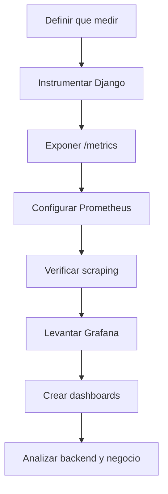

# Prometheus y Grafana en este proyecto

## 1. Objetivo de este documento

Este documento es la base teórica y práctica para la siguiente fase:

- integrar **Prometheus**;
- integrar **Grafana**;
- exponer métricas útiles del backend;
- observar el estado real del sistema sin depender de mirar logs a mano.

La idea no es implementar todavía.  
La idea es entender:

- qué son estas herramientas;
- para qué sirven;
- cómo encajan en este proyecto;
- qué pasos vamos a seguir;
- qué vas a poder mirar cuando esté montado.

Este `.md` está pensado además como base para un futuro HTML más visual.

---

## 2. Qué problema queremos resolver

Ahora mismo, para saber si algo va bien o mal, normalmente dependes de:

- abrir la app y ver si carga;
- llamar a `/api/health/`;
- revisar logs del backend;
- mirar la base o hacer consultas manuales;
- comprobar si el sync o el backfill han producido datos.

Eso funciona, pero tiene límites:

- no te da una visión continua en el tiempo;
- no te enseña tendencias;
- no te deja comparar el estado de hace 5 minutos con el de hace 2 horas;
- no te alerta fácilmente si algo deja de actualizarse;
- obliga a investigación manual.

En otras palabras:

- tienes **estado actual**;
- pero no tienes todavía **observabilidad**.

---

## 3. Qué es observabilidad

Observabilidad significa poder responder preguntas sobre el sistema usando señales que el propio sistema emite.

Las señales típicas son:

- **métricas**: números agregados en el tiempo;
- **logs**: eventos textuales;
- **trazas**: recorrido de una petición entre componentes.

En esta fase nos vamos a centrar en **métricas**.

### Ejemplos de preguntas que una buena observabilidad responde

- ¿El backend está vivo?
- ¿Cuánto tarda una request?
- ¿Cuántos errores `500` hubo hoy?
- ¿Cuándo fue el último sync exitoso?
- ¿Cuántos snapshots de usuario existen ahora?
- ¿Cuántos días de temporada están cubiertos?
- ¿Se quedó parado el proceso de backfill?
- ¿La base está respondiendo, pero el job de negocio lleva horas sin actualizar datos?

---

## 4. Qué es Prometheus

Prometheus es un sistema de métricas y scraping.

Su papel principal es:

1. ir periódicamente a un endpoint `/metrics`;
2. leer números expuestos por la aplicación;
3. guardarlos como series temporales;
4. permitir consultas sobre esos datos.

### Idea mental simple

Prometheus no suele “empujarse” desde la app.  
Prometheus normalmente **tira** de la app.

Es decir:

- la app expone métricas;
- Prometheus las visita cada cierto intervalo;
- Prometheus las almacena.

### Qué guarda Prometheus

Guarda series temporales del tipo:

```text
nombre_metrica{label="valor"} numero timestamp
```

Ejemplo conceptual:

```text
http_requests_total{method="GET", path="/api/coalitions/"} 1842
```

Eso significa:

- métrica: `http_requests_total`
- etiquetas: `method=GET`, `path=/api/coalitions/`
- valor: `1842`

---

## 5. Qué es Grafana

Grafana es la capa visual.

Su papel es:

- conectarse a Prometheus;
- ejecutar consultas;
- mostrarlas en paneles;
- construir dashboards;
- opcionalmente, configurar alertas.

### Idea mental simple

- **Prometheus** = almacén y motor de consulta de métricas
- **Grafana** = interfaz para leerlas y visualizarlas

Si Prometheus fuera la base de series temporales:

- Grafana sería el panel de control.

---

## 6. Diferencia entre logs y métricas

Esto es importante para no mezclar conceptos.

### Logs

Los logs sirven bien para:

- ver errores concretos;
- seguir una ejecución;
- depurar un caso específico.

Ejemplo:

```text
Se llamó al endpoint X
Falló la autenticación
Se recibió respuesta 500 del servicio Y
```

### Métricas

Las métricas sirven bien para:

- contar;
- medir;
- comparar;
- vigilar tendencias.

Ejemplo:

```text
requests por minuto
duración media de request
último snapshot creado
número total de snapshots
```

### Regla mental

- si quieres detalle narrativo: logs
- si quieres evolución numérica: métricas

---

## 7. Cómo encaja esto en este proyecto

Tu proyecto tiene varias piezas:

- frontend Next.js
- backend Django
- PostgreSQL
- sincronización con la API de 42
- snapshots diarios de usuario y coalición

Prometheus y Grafana se van a centrar sobre todo en:

- backend Django
- base de datos
- procesos de sync/backfill
- calidad y frescura de snapshots

---

## 8. Diagrama general de arquitectura

```mermaid
flowchart LR
    A[Frontend Next.js] --> B[Backend Django]
    B --> C[PostgreSQL]
    B --> D[API 42]
    B --> E[/metrics]
    F[Prometheus] --> E
    G[Grafana] --> F
```

### Cómo leer este diagrama

- el frontend consume al backend;
- el backend consume la base y la API de 42;
- el backend expone métricas en `/metrics`;
- Prometheus scrapea ese endpoint;
- Grafana consulta a Prometheus.

---

## 9. Qué queremos observar exactamente

Aquí conviene separar métricas técnicas y métricas de negocio.

### 9.1 Métricas técnicas

Sirven para saber si la infraestructura y la app responden bien.

Ejemplos:

- latencia de requests;
- número de requests;
- número de errores HTTP;
- estado del proceso Django;
- disponibilidad de la base;
- duración de consultas o jobs.

### 9.2 Métricas de negocio o dominio

Sirven para saber si la app está haciendo su trabajo real.

Ejemplos en este proyecto:

- total de `CoalitionScoreSnapshot`;
- total de `CampusUserScoreSnapshot`;
- última fecha de snapshot de coaliciones;
- última fecha de snapshot de usuarios;
- días cubiertos desde `2026-04-08`;
- timestamp del último sync;
- número de coaliciones con snapshots al día;
- número de usuarios con snapshots al día.

### Idea importante

Si solo mides CPU, memoria y uptime:

- puedes saber que el sistema vive;
- pero no sabes si está cumpliendo su objetivo de negocio.

Por eso aquí necesitamos ambas capas.

---

## 10. Qué vamos a poder hacer cuando esté listo

Cuando esto esté montado, podrás:

- ver si el backend está respondiendo;
- ver cuántas requests llegan y cuánto tardan;
- ver si aumentan los errores;
- saber si el sync se ha quedado congelado;
- saber si los snapshots se siguen creando;
- ver si falta cobertura de días de temporada;
- detectar si la app está viva pero el dato de negocio está estancado.

Esto es clave:

- una app puede responder `200 OK`
- y aun así estar funcionalmente rota si no actualiza snapshots.

Prometheus/Grafana te ayuda a detectar justo ese tipo de problemas.

---

## 11. Qué no resuelve Prometheus por sí solo

Prometheus no reemplaza:

- el backup de base;
- los logs;
- los tests;
- la calidad del código;
- la corrección del modelo de negocio.

Prometheus no arregla errores.  
Solo te da visibilidad sobre ellos.

---

## 12. Qué vamos a implementar primero

La implementación buena no empieza por Grafana.  
Empieza por **definir bien qué medir**.

Orden recomendado:

1. decidir métricas útiles;
2. exponer `/metrics` en Django;
3. configurar Prometheus para scrapear el backend;
4. comprobar que Prometheus recibe datos;
5. levantar Grafana;
6. crear dashboards básicos;
7. añadir métricas de negocio específicas.

---

## 13. Plan paso a paso

## Paso 1. Añadir instrumentación al backend

### Qué significa

El backend Django debe exponer métricas en un endpoint, normalmente:

```text
/metrics
```

### Qué hace falta

Normalmente:

- instalar una librería compatible con Prometheus para Django;
- configurarla en `settings.py`;
- añadir la ruta a `urls.py`.

### Qué conseguiremos

Prometheus podrá leer métricas técnicas del backend como:

- número de requests;
- duración;
- códigos de estado;
- métricas de proceso si las añadimos.

---

## Paso 2. Definir métricas de negocio propias

Esto es la parte realmente interesante para este proyecto.

### Qué significa

No basta con exponer métricas HTTP genéricas.  
Queremos también números que hablen del dominio.

### Métricas candidatas

- `coalition_score_snapshots_total`
- `campus_user_score_snapshots_total`
- `coalition_snapshots_last_date`
- `user_snapshots_last_date`
- `campus_sync_last_update_timestamp`
- `season_days_covered_total`
- `season_days_missing_total`
- `active_campus_users_with_coalition_link_total`

### Qué conseguiremos

Podremos medir:

- si el histórico sigue creciendo;
- si el sync está fresco;
- si falta cobertura de snapshots;
- si un cambio rompió el flujo aunque la web siga cargando.

---

## Paso 3. Configurar Prometheus

### Qué significa

Levantar un contenedor de Prometheus y darle un archivo de configuración que diga:

- a qué targets scrapear;
- cada cuánto scrapearlos.

### En este proyecto

Prometheus debería scrapear al menos:

- backend Django

Más adelante podría scrapear también:

- postgres exporter
- node exporter
- cAdvisor

Pero para empezar no hace falta complicarlo tanto.

### Qué conseguiremos

Prometheus empezará a guardar series temporales reales.

---

## Paso 4. Verificar Prometheus sin Grafana

Esto es muy importante.

Antes de montar dashboards bonitos, hay que confirmar:

- que `/metrics` responde;
- que Prometheus llega al target;
- que las series aparecen;
- que las consultas básicas devuelven datos.

### Por qué

Si saltas directamente a Grafana:

- puedes perder tiempo depurando paneles;
- cuando el problema real es que Prometheus ni siquiera recibe métricas.

---

## Paso 5. Integrar Grafana

### Qué significa

Levantar Grafana y configurarlo con Prometheus como data source.

### Qué conseguiremos

Tendrás una interfaz para:

- crear paneles;
- ver curvas temporales;
- comparar ventanas de tiempo;
- filtrar y agrupar métricas.

---

## Paso 6. Crear dashboards mínimos

El primer dashboard no debe ser enorme.  
Debe responder las preguntas más importantes.

### Dashboard técnico inicial

Paneles posibles:

- requests por minuto;
- latencia media o percentiles;
- errores HTTP por código;
- uptime del backend;
- estado del target en Prometheus.

### Dashboard de negocio inicial

Paneles posibles:

- snapshots de coalición totales;
- snapshots de usuario totales;
- última fecha de snapshot;
- días cubiertos desde inicio de temporada;
- último sync registrado;
- usuarios activos con `coalitions_user_id`.

---

## 14. Diagrama del flujo paso a paso



---

## 15. Qué métricas tienen más sentido aquí

## 15.1 Métricas HTTP

Para ver salud general del backend:

- requests totales;
- requests por endpoint;
- duración de requests;
- errores `4xx` y `5xx`.

### Qué te permiten ver

- si un endpoint se usa mucho;
- si un endpoint se ha vuelto lento;
- si un deploy disparó errores.

## 15.2 Métricas de snapshots

Para ver salud del histórico:

- total de snapshots por tipo;
- fecha máxima de snapshot;
- días cubiertos;
- días faltantes.

### Qué te permiten ver

- si el histórico está creciendo;
- si el job dejó de producir datos;
- si falta cobertura desde inicio de temporada.

## 15.3 Métricas de sync

Para ver salud de la ingestión:

- último sync general;
- duración del sync;
- número de usuarios procesados;
- número de coaliciones procesadas;
- errores o fallos del último intento.

### Qué te permiten ver

- si 42 está ralentizando el sistema;
- si el sync se quedó parado;
- si el volumen procesado cae de forma extraña.

---

## 16. Métricas: tipos básicos de Prometheus

Prometheus usa varios tipos. Los más importantes para este caso son:

### Counter

Solo sube.  
Sirve para contar eventos.

Ejemplos:

- requests totales;
- errores totales;
- jobs ejecutados totales.

### Gauge

Puede subir o bajar.  
Sirve para estado actual.

Ejemplos:

- snapshots totales actuales;
- última marca temporal;
- número de usuarios activos enlazados.

### Histogram

Sirve para medir distribución de duraciones o tamaños.

Ejemplos:

- duración de request;
- duración de un sync;
- duración de un backfill.

### Regla práctica aquí

- `Counter` para eventos;
- `Gauge` para estado de negocio;
- `Histogram` para tiempos.

---

## 17. Qué riesgos o errores comunes hay

## Error 1. Medir demasiado pronto demasiadas cosas

Si metes 50 métricas sin priorizar:

- el sistema se vuelve más difícil de entender;
- Grafana se llena de paneles de poco valor.

### Mejor enfoque

Empieza por pocas métricas de alta señal.

## Error 2. Medir solo infraestructura

Si solo mides:

- CPU;
- RAM;
- requests;

te falta el dato importante del proyecto:

- si snapshots y sync están realmente al día.

## Error 3. Hacer dashboards antes de validar el scraping

Si `/metrics` o Prometheus están mal:

- Grafana no tiene nada útil que enseñar.

## Error 4. Diseñar métricas sin pensar en la pregunta

Primero piensa:

- “¿Qué quiero saber?”

Luego:

- “¿Qué número necesito para saberlo?”

---

## 18. Qué preguntas queremos poder responder al final

Estas son las preguntas que deberían guiar toda la implementación:

### Salud técnica

- ¿El backend responde?
- ¿Está lento?
- ¿Está fallando más de lo normal?

### Salud del sync

- ¿Cuándo fue el último sync?
- ¿Procesó datos reales o quedó congelado?
- ¿Está tardando demasiado?

### Salud del histórico

- ¿Hay snapshots de hoy?
- ¿Cuántos días de temporada están cubiertos?
- ¿Falta alguna parte del histórico?

### Salud funcional

- ¿La UI enseña datos viejos porque el backend no actualiza snapshots?
- ¿El sistema está vivo pero el negocio está estancado?

---

## 19. Qué archivos es probable que toquemos luego

Esto es una previsión de implementación, no un cambio hecho todavía.

### Backend

Probablemente:

- `backend/config/settings/settings.py`
- `backend/config/urls.py`
- algún archivo nuevo de métricas en `backend/`
- quizá middleware o integración de librería Prometheus para Django

### Infra

Probablemente:

- `docker-compose.dev.yml`
- un directorio nuevo para configuración de Prometheus
- quizá uno para provisión de Grafana

### Documentación

Probablemente:

- este `.md`
- otro `.md` explicando la implementación real una vez hecha

---

## 20. Diagrama del resultado esperado

```mermaid
flowchart LR
    A[Usuario o navegador] --> B[Frontend]
    B --> C[Backend Django]
    C --> D[PostgreSQL]
    C --> E[API 42]
    C --> F[/metrics]
    G[Prometheus] --> F
    H[Grafana] --> G
    H --> I[Dashboard tecnico]
    H --> J[Dashboard snapshots]
    H --> K[Dashboard sync]
```

---

## 21. Estrategia recomendada para este proyecto

La estrategia más sensata aquí es:

1. Prometheus primero;
2. métricas técnicas básicas;
3. métricas de snapshots y sync;
4. Grafana después;
5. dashboards simples y útiles;
6. alertas más adelante.

### Por qué esta estrategia

Porque evita dos problemas:

- montar una UI bonita sin datos fiables;
- perder tiempo en paneles antes de definir las preguntas correctas.

---

## 22. Resumen final

Lo que queremos construir no es solo “otra herramienta”.

Queremos una capa que te permita ver:

- si la aplicación vive;
- si responde bien;
- si el sync funciona;
- si los snapshots se actualizan;
- y si el dato de negocio está sano.

En términos simples:

- **Prometheus** va a recoger los números;
- **Grafana** los va a enseñar;
- y tú vas a poder entender el estado del sistema sin investigar a ciegas.

---

## 23. Próximo paso después de este documento

Después de este documento, la implementación debería empezar por:

1. decidir la librería de Prometheus para Django;
2. definir el endpoint `/metrics`;
3. elegir las primeras métricas de negocio;
4. configurar el contenedor de Prometheus;
5. comprobar que scrapea bien antes de tocar Grafana.

Ese será el siguiente documento o la siguiente fase práctica.
