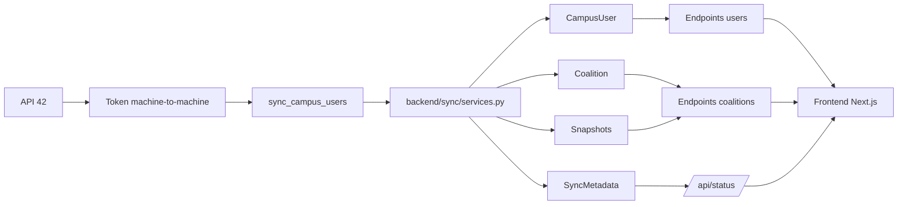

# Sync con API 42 - Explicación técnica

## 1. Resumen general del sistema de sync

El sistema de `sync` es el motor que **trae datos desde la API de 42**, los transforma y los guarda en la base de datos local para que el resto del proyecto trabaje contra PostgreSQL y no contra la API externa en tiempo real.

### Qué problema resuelve

Sin esta capa, el proyecto tendría varios problemas:

- el frontend tendría que hablar directamente con la API de 42;
- habría que exponer secretos o tokens en el navegador;
- cada vista dependería del tiempo de respuesta de 42;
- los rankings, coaliciones, proyectos y correcciones serían mucho más caros de calcular;
- no existiría histórico local para comparativas o snapshots.

### Por qué no se consulta la API 42 directamente desde frontend

La app no usa la API 42 desde el navegador para estas lecturas de dominio porque:

- la API de 42 requiere autenticación y control de rate limit;
- algunos flujos necesitan varias llamadas encadenadas y joins locales;
- el proyecto necesita guardar **estado derivado** como rankings, snapshots y cursores;
- el frontend necesita respuestas rápidas y consistentes, aunque 42 vaya lenta o falle puntualmente.

### Qué datos trae desde 42

El módulo de sync consume, entre otros, estos recursos de 42:

- `POST /oauth/token`
- `GET /v2/cursus_users`
- `GET /v2/blocs/{bloc_id}/coalitions`
- `GET /v2/coalitions_users`
- `GET /v2/users/{login}/projects_users`
- `GET /v2/projects_users/{project_user_id}`
- `GET /v2/users/{login}/scale_teams/as_corrector`
- `GET /v2/coalitions/{coalition_id}/scores`

### Qué datos guarda localmente

La fuente de verdad local del dominio sync está en `backend/sync/models.py`:

- `CampusUser`: réplica local del usuario de campus y sus métricas.
- `Coalition`: estado actual de cada coalición.
- `CoalitionScoreSnapshot`: snapshot diario de score/rank de coalición.
- `CampusUserScoreSnapshot`: snapshot diario de score/rank del usuario.
- `CoalitionProjectCursor`: cursor incremental para proyectos.
- `CoalitionEvaluationCursor`: cursor incremental para correcciones.
- `SyncMetadata`: metadatos del último sync general.

### Qué comandos existen

En `backend/sync/management/commands/` existen comandos para:

- sync general de usuarios y coaliciones;
- sync manual de proyectos;
- sync manual de correcciones;
- sync incremental por score events;
- import/export de snapshots CSV.

### Qué se ejecuta automáticamente por cron

Lo único que está automatizado por cron en el código actual es:

- `sync_campus_users --mode=full`

Configurado en [backend/config/settings/settings.py](/home/aurodrig/Desktop/arepa/backend/config/settings/settings.py:179) cada **20 minutos**.

### Qué no está expuesto por HTTP

Es importante decirlo claramente:

- [backend/sync/views.py](/home/aurodrig/Desktop/arepa/backend/sync/views.py:1) existe, pero está vacío salvo el scaffold de Django.
- `backend/sync/urls.py` **no existe**.

Eso significa que el sync **no se dispara por endpoints REST propios**. Vive en:

- modelos;
- servicios;
- comandos `manage.py`;
- cron.

## 2. Diagrama Mermaid general



### Cómo leer el diagrama

- `API 42` es la fuente externa.
- `Token machine-to-machine` representa el `access_token` de cliente que pide el backend.
- `sync_campus_users` es el comando principal que orquesta el sync base.
- `services.py` contiene la lógica de fetch, filtrado, guardado y snapshots.
- `CampusUser`, `Coalition`, `Snapshots` y `SyncMetadata` son la persistencia local.
- Los endpoints de `users`, `coalitions` y `status` leen esa base local.
- El frontend consume Django, no la API 42 directamente.

## 3. Modelos implicados

Los modelos implicados están en [backend/sync/models.py](/home/aurodrig/Desktop/arepa/backend/sync/models.py:5).

| Modelo | Líneas aprox. | Papel en el sync | Cómo se usa |
| --- | --- | --- | --- |
| `CampusUser` | 47-92 | Usuario local sincronizado desde 42 | Rankings, leaderboard, perfil, proyectos, correcciones, coalición |
| `Coalition` | 5-17 | Estado actual de cada coalición | Página de coaliciones, ranking global |
| `CoalitionScoreSnapshot` | 20-34 | Snapshot diario de score/rank de coalición | Comparativas 24h/7d/30d y cambios de ranking |
| `CampusUserScoreSnapshot` | 105-120 | Snapshot diario de score/rank de usuario | Evolución y comparativas de usuarios |
| `CoalitionProjectCursor` | 37-44 | Cursor incremental de score events de proyectos | Evita releer todo el histórico |
| `CoalitionEvaluationCursor` | 95-102 | Cursor incremental de score events de correcciones | Evita releer todo el histórico |
| `SyncMetadata` | 123-128 | Última marca de sync general | `/api/status/` y `last_time_update` de coalitions |

### Relación conceptual entre ellos

- `CampusUser` es el objeto central.
- `Coalition` agrupa a los usuarios por coalición.
- Los `Snapshot` guardan el estado del día para comparativas.
- Los `Cursor` guardan “hasta dónde ya he procesado”.
- `SyncMetadata` no guarda negocio del usuario, sino **metadatos operativos** del sync.

## 4. Comandos management

Todos están en `backend/sync/management/commands/`.

| Comando | Archivo | Qué hace | Argumentos principales | Cuándo usarlo | Riesgo |
| --- | --- | --- | --- | --- | --- |
| `sync_campus_users` | [sync_campus_users.py](/home/aurodrig/Desktop/arepa/backend/sync/management/commands/sync_campus_users.py:19) | Sync base de usuarios y/o coaliciones desde 42 | `--mode`, `--request-interval`, `--max-pages` | Operación normal y cron | Puede ser costoso y depender del rate limit |
| `sync_project_stats` | [sync_project_stats.py](/home/aurodrig/Desktop/arepa/backend/sync/management/commands/sync_project_stats.py:19) | Recuento completo o incremental de proyectos entregados | `--limit`, `--offset`, `--auto-batch`, `--incremental`, `--bootstrap-cursors-*` | Rellenar o mantener stats de proyectos | Un cursor mal posicionado puede dejar gaps o duplicados |
| `sync_evaluation_stats` | [sync_evaluation_stats.py](/home/aurodrig/Desktop/arepa/backend/sync/management/commands/sync_evaluation_stats.py:20) | Recuento completo de correcciones por usuario | `--limit`, `--offset`, `--auto-batch`, `--stale-hours`, `--only-unsynced` | Recalcular correcciones | Costoso: consulta usuario a usuario |
| `sync_evaluation_score_events` | [sync_evaluation_score_events.py](/home/aurodrig/Desktop/arepa/backend/sync/management/commands/sync_evaluation_score_events.py:18) | Incremental de correcciones por score events | `--coalition`, `--bootstrap-cursors-*`, `--request-interval` | Mantener correcciones sin recomputar todo | Si el snapshot base no está bien marcado, el bootstrap falla o salta eventos |
| `import_evaluations_snapshot` | [import_evaluations_snapshot.py](/home/aurodrig/Desktop/arepa/backend/sync/management/commands/import_evaluations_snapshot.py:10) | Importa correcciones desde CSV | `--path`, `--dry-run`, `--mark-synced` | Cargar una base inicial o recuperar contadores | Si no usas `--mark-synced`, luego el bootstrap incremental queda sin referencia temporal |
| `import_projects_snapshot` | [import_projects_snapshot.py](/home/aurodrig/Desktop/arepa/backend/sync/management/commands/import_projects_snapshot.py:31) | Importa proyectos desde CSV | `--path`, `--dry-run` | Cargar un snapshot previo | Puede dejar desalineado `projects_delivered_synced_at` si el CSV no lo trae |
| `export_projects_snapshot` | [export_projects_snapshot.py](/home/aurodrig/Desktop/arepa/backend/sync/management/commands/export_projects_snapshot.py:14) | Exporta snapshot CSV de proyectos | `--path` | Backup funcional de datos de proyectos | No es backup de PostgreSQL, solo export parcial |
| `sync_campususer_coalition_links` | [sync_campususer_coalition_links.py](/home/aurodrig/Desktop/arepa/backend/sync/management/commands/sync_campususer_coalition_links.py:13) | Backfill de relación `coalitions_user_id` y datos de coalición | `--request-interval` | Reparar/rellenar enlaces de coalición sin re-sincronizar todo | Solo corrige campos de coalición; no rellena todo el usuario |

## 5. Explicación de `services.py`

Archivo: [backend/sync/services.py](/home/aurodrig/Desktop/arepa/backend/sync/services.py:1)

`services.py` es la pieza central del sync general. Aquí vive el flujo base que:

1. pide token a 42;
2. descarga usuarios y coaliciones;
3. filtra y normaliza datos;
4. guarda `CampusUser` y `Coalition`;
5. recalcula ranks;
6. genera snapshots;
7. actualiza `SyncMetadata.last_time_update`.

### Tabla de funciones principales

| Función | Líneas aprox. | Qué recibe | Qué devuelve | Modelo(s) que toca | Endpoint 42 |
| --- | --- | --- | --- | --- | --- |
| `_request_42_token` | 48-78 | nada | `access_token` string | ninguno | `POST /oauth/token` |
| `_get_42_token` | 80-88 | nada | token cacheado o nuevo | ninguno | `POST /oauth/token` |
| `_paged_get` | 94-143 | endpoint, headers, params | lista agregada de páginas | ninguno | varios |
| `_build_coalition_map` | 145-184 | listas de coalitions y coalitions_users | dict por `user_id` | ninguno | ya descargados |
| `save_coalitions_to_database` | 186-215 | lista de coaliciones | `(created, updated)` | `Coalition` | no |
| `save_coalition_score_snapshots` | 218-239 | nada | `(created, updated)` | `CoalitionScoreSnapshot` | no |
| `save_user_score_snapshots` | 242-262 | nada | `(created, updated)` | `CampusUserScoreSnapshot` | no |
| `filter_and_save_to_database` | 264-334 | `cursus_users`, mapa de coalición | `(created, updated, skipped)` | `CampusUser` | no |
| `update_general_ranks` | 336-348 | nada | número de usuarios rankeados | `CampusUser` | no |
| `_build_sync_context` | 350-360 | nada | dict con token, campus, cursus, bloc | ninguno | no |
| `fetch_campus_users_data` | 363-376 | contexto y pacing | lista de `cursus_users` | ninguno | `GET /v2/cursus_users` |
| `fetch_coalitions_data` | 378-417 | contexto y pacing | coalitions, coalitions_users, mapa | `Coalition` | `GET /v2/blocs/.../coalitions`, `GET /v2/coalitions_users` |
| `run_full_sync` | 419-458 | pacing y límite de páginas | resumen de sync | todos los modelos principales | varios |
| `run_users_only_sync` | 460-494 | pacing y límite de páginas | resumen | `CampusUser`, `CampusUserScoreSnapshot`, `SyncMetadata` | `GET /v2/cursus_users` |
| `run_coalitions_only_sync` | 496-520 | pacing | resumen | `Coalition`, `CoalitionScoreSnapshot`, `SyncMetadata` | coalitions + coalitions_users |

### 5.1 Token y contexto

#### `_request_42_token()`  
Archivo: [services.py](/home/aurodrig/Desktop/arepa/backend/sync/services.py:48)

Qué hace:

- lee `FT_API_BASE_URL`, `FT_CLIENT_ID` y `FT_CLIENT_SECRET`;
- pide un token machine-to-machine con `grant_type=client_credentials`;
- guarda el token en una caché de proceso (`_TOKEN_CACHE`) con `expires_at`.

Qué problema resuelve:

- evita que cada llamada a 42 tenga que pedir un token nuevo;
- centraliza la autenticación técnica del sync.

Bloques importantes:

```python
base_url = os.getenv('FT_API_BASE_URL', 'https://api.intra.42.fr').rstrip('/')
client_id = os.getenv('FT_CLIENT_ID')
client_secret = os.getenv('FT_CLIENT_SECRET')
```

- aquí se leen credenciales y base URL;
- si faltan `FT_CLIENT_ID` o `FT_CLIENT_SECRET`, el sync falla con `ValueError`.

```python
response = _http_post(
    f'{base_url}/oauth/token',
    data={
        'grant_type': 'client_credentials',
        'client_id': client_id,
        'client_secret': client_secret,
    },
    timeout=15,
)
```

- aquí se habla con 42;
- usa `_http_post()` para contar peticiones.

#### `_build_sync_context()`  
Archivo: [services.py](/home/aurodrig/Desktop/arepa/backend/sync/services.py:350)

Qué devuelve:

- `token`
- `base_url`
- `campus_id`
- `cursus_id`
- `bloc_id`
- `per_page`
- `headers`

Detalle importante:

```python
campus_id = 22
cursus_id = 21
bloc_id = 110
```

Esos identificadores están **hardcodeados** en el código actual. No vienen de variables de entorno. Eso simplifica el proyecto, pero también lo hace menos configurable.

### 5.2 Descarga paginada

#### `_paged_get()`  
Archivo: [services.py](/home/aurodrig/Desktop/arepa/backend/sync/services.py:94)

Qué hace:

- llama a un endpoint paginado;
- agrega resultados de todas las páginas;
- mete pausas entre peticiones;
- reintenta si recibe `429` o `5xx`.

Qué problema resuelve:

- encapsula el patrón repetido de “trae todas las páginas de 42”.

Bloques relevantes:

- usa `page` y `per_page`;
- corta cuando una página viene vacía;
- si hay `Retry-After`, lo respeta;
- cuenta peticiones con `_http_get()`.

### 5.3 Usuarios y coaliciones

#### `fetch_campus_users_data()`  
Archivo: [services.py](/home/aurodrig/Desktop/arepa/backend/sync/services.py:363)

Endpoint usado:

- `GET /v2/cursus_users`

Filtro importante:

```python
"filter[campus_id]": ctx['campus_id'],
"filter[cursus_id]": ctx['cursus_id'],
"filter[has_coalition]": "true",
```

Eso hace que el sync base trabaje solo con usuarios del campus/cursus objetivo y que ya tengan coalición.

#### `fetch_coalitions_data()`  
Archivo: [services.py](/home/aurodrig/Desktop/arepa/backend/sync/services.py:378)

Endpoints usados:

- `GET /v2/blocs/{bloc_id}/coalitions`
- `GET /v2/coalitions_users`

Qué hace:

1. descarga coaliciones del bloc;
2. las guarda/actualiza en `Coalition`;
3. descarga `coalitions_users` de cada coalición;
4. construye un mapa `user_id -> datos de coalición`.

Ese mapa luego se usa para enriquecer `CampusUser` con:

- `coalition_id`
- `coalition_name`
- `coalition_slug`
- `coalitions_user_id`
- `coalition_user_score`
- `coalition_rank`

### 5.4 Persistencia principal

#### `filter_and_save_to_database()`  
Archivo: [services.py](/home/aurodrig/Desktop/arepa/backend/sync/services.py:264)

Qué hace:

- recorre `cursus_users`;
- filtra registros inválidos o no útiles;
- aplana la respuesta de 42;
- guarda cada usuario en `CampusUser` con `update_or_create`.

Qué toca:

- `CampusUser`

Qué campos rellena:

- IDs (`intra_id`, `user_id`)
- progreso (`grade`, `level`)
- identidad (`login`, `email`, `display_name`, `avatar_url`)
- economía (`wallet`, `correction_points`)
- pool y actividad
- datos de coalición
- timestamps originales (`created_at`, `updated_at`)

Riesgo/limitación:

- como denormaliza mucho campo, depende de que la forma del JSON de 42 siga siendo compatible.

#### `update_general_ranks()`  
Archivo: [services.py](/home/aurodrig/Desktop/arepa/backend/sync/services.py:336)

Qué hace:

- ordena usuarios por `coalition_user_score` descendente;
- asigna `general_rank`.

Problema que resuelve:

- deja un ranking ya calculado en base de datos para no recalcularlo en cada request.

### 5.5 Snapshots y metadatos

#### `save_coalition_score_snapshots()`  
Archivo: [services.py](/home/aurodrig/Desktop/arepa/backend/sync/services.py:218)

Qué hace:

- crea o reutiliza un snapshot de hoy por coalición;
- guarda `total_score` y `campus_rank`.

Detalle importante:

```python
CoalitionScoreSnapshot.objects.get_or_create(
    coalition=coalition,
    snapshot_date=today,
    defaults={...},
)
```

Eso implica **un solo snapshot por día y por coalición**.

#### `save_user_score_snapshots()`  
Archivo: [services.py](/home/aurodrig/Desktop/arepa/backend/sync/services.py:242)

Mismo patrón, pero para `CampusUser`.

#### `_touch_last_sync_timestamp()`  
Archivo: [services.py](/home/aurodrig/Desktop/arepa/backend/sync/services.py:42)

Qué hace:

- crea o actualiza `SyncMetadata(key='campus_sync')`;
- pone `last_time_update = timezone.now()`.

Eso alimenta:

- `/api/status/`
- `last_time_update` devuelto en endpoints de coalitions

### 5.6 Orquestadores

#### `run_full_sync()`  
Archivo: [services.py](/home/aurodrig/Desktop/arepa/backend/sync/services.py:419)

Secuencia:

1. construye contexto;
2. trae `cursus_users`;
3. trae coaliciones y `coalitions_users`;
4. guarda `CampusUser`;
5. recalcula ranks;
6. crea snapshots de coalición;
7. crea snapshots de usuario;
8. actualiza `SyncMetadata`.

Es el flujo más completo y el que usa el cron.

#### Pseudocódigo

```text
FUNCIÓN run_full_sync():

    ctx = construir contexto de sync
    cursus_users = fetch_campus_users_data(ctx)
    coalition_info = fetch_coalitions_data(ctx)

    guardar CampusUser filtrado
    recalcular general_rank
    crear snapshots de coalición
    crear snapshots de usuario
    actualizar SyncMetadata.last_time_update

    devolver resumen de sync
```

#### `run_users_only_sync()`  
Archivo: [services.py](/home/aurodrig/Desktop/arepa/backend/sync/services.py:460)

Hace:

- sync de usuarios;
- ranks;
- snapshots de usuario;
- `last_time_update`

No hace:

- update de coaliciones;
- snapshots de coalición.

#### `run_coalitions_only_sync()`  
Archivo: [services.py](/home/aurodrig/Desktop/arepa/backend/sync/services.py:496)

Hace:

- sync de coaliciones;
- snapshots de coalición;
- `last_time_update`

No hace:

- `CampusUser`
- snapshots de usuario

## 6. Explicación de `projects.py`

Archivo: [backend/sync/projects.py](/home/aurodrig/Desktop/arepa/backend/sync/projects.py:1)

Este archivo cubre el problema de **cuántos proyectos entregados y aprobados** tiene cada `CampusUser`.

Hay dos estrategias en el código:

1. **recuento completo por usuario**
2. **incremental por score events de coalición**

### 6.1 Recuento completo por usuario

Funciones base:

- `_request_projects_page()` ([projects.py](/home/aurodrig/Desktop/arepa/backend/sync/projects.py:36))
- `_fetch_projects_count()` ([projects.py](/home/aurodrig/Desktop/arepa/backend/sync/projects.py:110))
- `fetch_user_projects_delivered_total()` ([projects.py](/home/aurodrig/Desktop/arepa/backend/sync/projects.py:146))
- `fetch_user_projects_delivered_current_season()` ([projects.py](/home/aurodrig/Desktop/arepa/backend/sync/projects.py:162))
- `sync_users_projects_delivered()` ([projects.py](/home/aurodrig/Desktop/arepa/backend/sync/projects.py:180))

Endpoint usado:

- `GET /v2/users/{login}/projects_users`

Filtro funcional:

- solo `status=finished`
- luego `_is_delivered_project()` valida que esté `validated?`
- y que pertenezca al `cursus_id` esperado

Campos que actualiza en `CampusUser`:

- `projects_delivered_total`
- `projects_delivered_current_season`
- `projects_delivered_synced_at`

### 6.2 Incremental por score events

Modelos implicados:

- `CoalitionProjectCursor`
- `CampusUser`
- `Coalition`

Funciones clave:

- `_request_coalition_scores_page()` ([projects.py](/home/aurodrig/Desktop/arepa/backend/sync/projects.py:224))
- `_fetch_project_user()` ([projects.py](/home/aurodrig/Desktop/arepa/backend/sync/projects.py:269))
- `_is_project_score_event()` ([projects.py](/home/aurodrig/Desktop/arepa/backend/sync/projects.py:307))
- `_collect_new_coalition_project_scores()` ([projects.py](/home/aurodrig/Desktop/arepa/backend/sync/projects.py:324))
- `_apply_project_score_rows()` ([projects.py](/home/aurodrig/Desktop/arepa/backend/sync/projects.py:395))
- `sync_projects_from_coalition_scores()` ([projects.py](/home/aurodrig/Desktop/arepa/backend/sync/projects.py:467))
- `bootstrap_project_score_cursors_from_datetime()` ([projects.py](/home/aurodrig/Desktop/arepa/backend/sync/projects.py:557))

### Qué cursor usa

Usa `CoalitionProjectCursor`, con estos campos:

- `last_score_id`
- `last_score_created_at`
- `last_synced_at`

La lógica es:

- por cada coalición, mira `/v2/coalitions/{coalition_id}/scores`;
- si no hay cursor, se “bootstrapea” con el score más nuevo y no procesa histórico;
- si sí hay cursor, lee páginas hasta reencontrar `last_score_id`;
- solo procesa lo nuevo.

### Cómo evita duplicar eventos

Dentro de `_apply_project_score_rows()` hay dos barreras:

1. filtra solo eventos con:
   - `reason == "You validated a project. Congratulations!"`
   - `scoreable_type == "ProjectsUser"`
2. deduplica por `scoreable_id` usando `seen_project_user_ids`

Fragmento clave:

```python
project_user_id = row.get('scoreable_id')
if project_user_id in seen_project_user_ids:
    continue
seen_project_user_ids.add(project_user_id)
```

Luego valida el `ProjectsUser` real con:

- `GET /v2/projects_users/{project_user_id}`

Así evita contar score events que no correspondan a un proyecto válido del cursus.

### Pseudocódigo

```text
FUNCIÓN incremental_proyectos():

    para cada coalición:
        leer CoalitionProjectCursor
        pedir score events recientes

        SI no hay cursor:
            bootstrap con score más nuevo
            continuar

        procesar solo rows nuevas

        para cada row:
            validar que sea evento de proyecto
            deduplicar scoreable_id
            pedir projects_users/{id}

            SI el proyecto es válido:
                incrementar contadores en CampusUser

        actualizar cursor
```

### Qué campos actualiza en `CampusUser`

Cuando el evento es válido, suma en:

- `projects_delivered_total`
- `projects_delivered_current_season`
- `projects_delivered_synced_at`

### Limitaciones y fragilidad

- el incremental de proyectos es relativamente caro porque cada evento obliga a pedir `projects_users/{id}`;
- la ventana de temporada está hardcodeada en:
  - `CURRENT_SEASON_START`
  - `CURRENT_SEASON_END`
- si el primer run incremental arranca sin bootstrap correcto, el comando solo posiciona cursores y **no rellena histórico anterior**;
- si el cursor se coloca demasiado adelante, se saltan eventos;
- si se coloca demasiado atrás, puede haber doble conteo.

## 7. Explicación de `evaluations.py`

Archivo: [backend/sync/evaluations.py](/home/aurodrig/Desktop/arepa/backend/sync/evaluations.py:1)

Este archivo resuelve el número de **correcciones realizadas como corrector**.

Igual que en proyectos, hay dos enfoques:

1. **recuento completo por usuario**
2. **incremental por score events**

### 7.1 Recuento completo por usuario

Funciones principales:

- `_request_evaluations_page()` ([evaluations.py](/home/aurodrig/Desktop/arepa/backend/sync/evaluations.py:33))
- `_fetch_evaluations_count()` ([evaluations.py](/home/aurodrig/Desktop/arepa/backend/sync/evaluations.py:77))
- `fetch_user_evaluations_done_total()` ([evaluations.py](/home/aurodrig/Desktop/arepa/backend/sync/evaluations.py:100))
- `fetch_user_evaluations_done_current_season()` ([evaluations.py](/home/aurodrig/Desktop/arepa/backend/sync/evaluations.py:115))
- `sync_users_evaluations_done_total()` ([evaluations.py](/home/aurodrig/Desktop/arepa/backend/sync/evaluations.py:132))
- `sync_users_evaluations_done_total_in_batches()` ([evaluations.py](/home/aurodrig/Desktop/arepa/backend/sync/evaluations.py:176))

Endpoint usado:

- `GET /v2/users/{login}/scale_teams/as_corrector`

Filtro usado:

- `filter[filled]=true`

Para temporada actual:

- `range[filled_at]=CURRENT_SEASON_START,CURRENT_SEASON_END`

Campos que actualiza en `CampusUser`:

- `evaluations_done_total`
- `evaluations_done_current_season`
- `evaluations_synced_at`

### 7.2 Incremental por score events

Modelos implicados:

- `CoalitionEvaluationCursor`
- `CampusUser`
- `Coalition`

Funciones clave:

- `_request_coalition_scores_page()` ([evaluations.py](/home/aurodrig/Desktop/arepa/backend/sync/evaluations.py:222))
- `_is_evaluation_score_event()` ([evaluations.py](/home/aurodrig/Desktop/arepa/backend/sync/evaluations.py:259))
- `_collect_new_coalition_scores()` ([evaluations.py](/home/aurodrig/Desktop/arepa/backend/sync/evaluations.py:274))
- `_apply_evaluation_score_rows()` ([evaluations.py](/home/aurodrig/Desktop/arepa/backend/sync/evaluations.py:342))
- `sync_evaluations_from_coalition_scores()` ([evaluations.py](/home/aurodrig/Desktop/arepa/backend/sync/evaluations.py:406))
- `bootstrap_evaluation_score_cursors_from_datetime()` ([evaluations.py](/home/aurodrig/Desktop/arepa/backend/sync/evaluations.py:490))

### Qué cursor usa

Usa `CoalitionEvaluationCursor`.

La lógica es análoga a proyectos:

- lee score events por coalición ordenados de nuevo a viejo;
- corta cuando reencuentra `last_score_id`;
- actualiza el cursor al score más reciente visto.

### Cómo evita duplicar eventos

La deduplicación aquí es más simple:

- se queda solo con score rows cuyo `reason` sea:
  - `"You evaluated someone. Well done!"`
- exige que exista `coalitions_user_id`
- acumula incrementos por `coalitions_user_id`

Eso hace que el update se aplique directamente contra los usuarios locales enlazados por `CampusUser.coalitions_user_id`.

### Pseudocódigo

```text
FUNCIÓN incremental_correcciones():

    para cada coalición:
        leer CoalitionEvaluationCursor
        pedir coalition scores

        SI no hay cursor:
            bootstrap con score más nuevo
            continuar

        recoger rows nuevas hasta last_score_id

        para cada row:
            SI reason es evento de corrección y existe coalitions_user_id:
                acumular incrementos

        actualizar CampusUser
        guardar nuevo cursor
```

### Qué campos actualiza en `CampusUser`

- `evaluations_done_total`
- `evaluations_done_current_season`
- `evaluations_synced_at`

### Limitaciones y fragilidad

- este archivo reintenta `429` y `5xx`, pero **no renueva explícitamente el token ante `401`** como sí hace parte de `projects.py`; por tanto es una zona más frágil;
- la ventana de temporada también está hardcodeada;
- si no existe `evaluations_synced_at`, el bootstrap “from snapshot” falla por diseño;
- un cursor mal posicionado puede generar huecos o doble conteo.

## 8. Snapshots

### Qué es un snapshot

Un snapshot es una **foto del estado del día**.

En este proyecto hay dos tipos:

- `CoalitionScoreSnapshot`
- `CampusUserScoreSnapshot`

### Cuándo se crea

Se crean durante el sync general en `services.py`:

- `run_full_sync()` crea snapshots de coalición y de usuario;
- `run_users_only_sync()` crea snapshots de usuario;
- `run_coalitions_only_sync()` crea snapshots de coalición.

### Por qué existe

Sin snapshots solo tendrías el estado actual. Con snapshots puedes responder:

- cuánto subió una coalición respecto a ayer;
- cuánto subió en 7 o 30 días;
- cómo cambió su ranking;
- cuál era el score de un usuario en un día anterior.

### Cómo se usan luego

El consumidor más claro está en [backend/coalitions/services.py](/home/aurodrig/Desktop/arepa/backend/coalitions/services.py:98):

- `_get_score_change()` usa `CoalitionScoreSnapshot` para calcular cambios de 1, 7 y 30 días;
- `_get_last_time_update()` usa `SyncMetadata` para mostrar cuándo se refrescó el dato;
- la serialización de coaliciones usa esos datos para enriquecer la API que lee el frontend.

### Limitación importante

El snapshot diario se crea con `get_or_create`, así que:

- hay **un solo punto por día**;
- no hay histórico intradía;
- si la coalición cambia muchas veces el mismo día, el snapshot no conserva toda esa curva.

### CSVs y snapshots no son lo mismo

Los CSV de `backend/`:

- [backend/evaluations_snapshot_1600.csv](/home/aurodrig/Desktop/arepa/backend/evaluations_snapshot_1600.csv)
- [backend/evaluations_snapshot_round_apr_oct_2026.csv](/home/aurodrig/Desktop/arepa/backend/evaluations_snapshot_round_apr_oct_2026.csv)
- [backend/projects_delivered_snapshot.csv](/home/aurodrig/Desktop/arepa/backend/projects_delivered_snapshot.csv)

son **artefactos de import/export funcional**, no son los snapshots diarios ORM de `CoalitionScoreSnapshot` o `CampusUserScoreSnapshot`.

## 9. `SyncMetadata` y `last_sync`

Modelo: [backend/sync/models.py](/home/aurodrig/Desktop/arepa/backend/sync/models.py:123)

### Qué significa `last_sync`

En este proyecto, `last_sync` significa:

- la fecha/hora guardada en `SyncMetadata(key='campus_sync').last_time_update`

No significa:

- “último proyecto recalculado”
- “última corrección importada”
- “último CSV aplicado”

### Dónde se actualiza

Se actualiza en:

- `_touch_last_sync_timestamp()`  
  archivo [backend/sync/services.py](/home/aurodrig/Desktop/arepa/backend/sync/services.py:42)

Y se llama desde:

- `run_full_sync()`
- `run_users_only_sync()`
- `run_coalitions_only_sync()`

### Cómo lo consume `/api/status/`

En [backend/config/views.py](/home/aurodrig/Desktop/arepa/backend/config/views.py:22):

```python
metadata = SyncMetadata.objects.filter(key='campus_sync').only('last_time_update').first()
```

Luego `status_check()` devuelve:

- `last_sync`
- `timestamp`
- `database`
- `status`

### Limitaciones

La principal limitación es importante para evaluación:

- `last_sync` solo mide el sync general del campus;
- **no refleja** que hayas ejecutado `sync_project_stats`, `sync_evaluation_stats`, `sync_evaluation_score_events` o imports CSV;
- por tanto, puede haber un `last_sync` reciente y, aun así, tener stats de proyectos/correcciones desactualizadas.

## 10. Cron

### Dónde está configurado

Configuración:

- [backend/config/settings/settings.py](/home/aurodrig/Desktop/arepa/backend/config/settings/settings.py:179)

Registro automático:

- [backend/cron_scheduler/apps.py](/home/aurodrig/Desktop/arepa/backend/cron_scheduler/apps.py:12)

### Cada cuánto se ejecuta

El cron configurado en settings es:

```python
CRONJOBS = [
    ('*/20 * * * *', 'django.core.management.call_command', ['sync_campus_users', '--mode=full']),
]
```

Eso significa:

- cada 20 minutos;
- ejecuta `sync_campus_users --mode=full`.

### Qué comando lanza

- `sync_campus_users --mode=full`

### Cómo se registran los jobs

`CronSchedulerConfig.ready()`:

- solo corre si el proceso es `runserver`;
- solo corre en el proceso hijo del autoreloader (`RUN_MAIN == 'true'`);
- intenta `crontab remove` y luego `crontab add`.

Esto implica una limitación clara:

- el auto-registro de cron está pensado sobre todo para el entorno dev con `runserver`;
- no es un scheduler de producción generalista.

### Cómo ver logs

En settings:

```python
CRONTAB_COMMAND_SUFFIX = '>> /proc/1/fd/1 2>> /proc/1/fd/2'
```

Eso redirige salida a stdout/stderr del contenedor, así que puedes verla con:

```bash
docker compose -f docker-compose.dev.yml logs backend
```

o:

```bash
make back-logs
```

### Cómo probar manualmente

```bash
make back-syncapi MODE=full
```

o directamente:

```bash
docker compose -f docker-compose.dev.yml exec -T backend python manage.py sync_campus_users --mode=full
```

## 11. Variables de entorno

Las variables realmente usadas por el módulo de sync son:

### `FT_CLIENT_ID`

Se lee en:

- [backend/sync/services.py](/home/aurodrig/Desktop/arepa/backend/sync/services.py:50)

Uso:

- autenticar el cliente machine-to-machine frente a 42.

### `FT_CLIENT_SECRET`

Se lee en:

- [backend/sync/services.py](/home/aurodrig/Desktop/arepa/backend/sync/services.py:51)

Uso:

- firmar la petición de token OAuth.

### `FT_API_BASE_URL`

Se lee en:

- [backend/sync/services.py](/home/aurodrig/Desktop/arepa/backend/sync/services.py:49)
- [backend/sync/services.py](/home/aurodrig/Desktop/arepa/backend/sync/services.py:352)

Uso:

- cambiar la URL base de la API 42 si hiciera falta.

Valor por defecto:

- `https://api.intra.42.fr`

### Lo que no está parametrizado

Hoy no son variables de entorno:

- `campus_id = 22`
- `cursus_id = 21`
- `bloc_id = 110`

Eso está hardcodeado en `_build_sync_context()`.

## 12. Errores comunes

### Rate limit de 42

Síntomas:

- respuestas `429`;
- sync más lento de lo normal.

Mitigación actual:

- `services.py`, `projects.py` y parte de `evaluations.py` meten backoff y pausas.

### Timeout

Síntomas:

- `requests` lanza excepción;
- el comando falla a mitad.

Mitigación:

- reintentos parciales;
- bajar `request_interval`;
- ejecutar por bloques.

### Token inválido o expirado

Síntomas:

- `401` desde 42.

Observación:

- `projects.py` sí tiene lógica de renovación de token en algunos requests;
- `evaluations.py` no está igual de blindado.

### Datos incompletos

Síntomas:

- usuarios sin coalición;
- users sin ciertos campos esperados;
- snapshots con pocos puntos.

Realidad:

- el código filtra y omite parte de lo que considera inválido;
- por eso `skipped_count` es un dato importante.

### Cursor mal posicionado

Síntomas:

- el incremental no cuenta nada;
- o cuenta de más.

Causa:

- bootstrap con fecha errónea;
- import sin `*_synced_at`;
- cursor demasiado nuevo o demasiado viejo.

### Snapshots vacíos

Síntomas:

- gráficas o comparativas sin histórico;
- cambios de 7/30 días en `null`.

Causa:

- todavía no se ha acumulado histórico suficiente;
- solo existe 1 snapshot por día.

### `last_sync` antiguo

Síntoma:

- `/api/status/` muestra un `last_sync` viejo.

Causa:

- el cron no corrió;
- `sync_campus_users` falló;
- solo se ejecutaron comandos de proyectos/correcciones, que no actualizan `SyncMetadata`.

### Duplicados

Riesgo:

- si el incremental reprocesa score events por un cursor mal puesto;
- si se mezcla mal snapshot base + bootstrap + incremental.

## 13. Cómo probar

### Sync general manual

```bash
make back-syncapi MODE=full
```

Modos alternativos:

```bash
docker compose -f docker-compose.dev.yml exec -T backend python manage.py sync_campus_users --mode=users
docker compose -f docker-compose.dev.yml exec -T backend python manage.py sync_campus_users --mode=coalitions
```

### Proyectos

Recuento completo:

```bash
docker compose -f docker-compose.dev.yml exec -T backend python manage.py sync_project_stats --limit 50 --offset 0
```

Por bloques:

```bash
docker compose -f docker-compose.dev.yml exec -T backend python manage.py sync_project_stats --auto-batch --limit 100
```

Incremental:

```bash
docker compose -f docker-compose.dev.yml exec -T backend python manage.py sync_project_stats --incremental
```

### Correcciones

Recuento completo:

```bash
docker compose -f docker-compose.dev.yml exec -T backend python manage.py sync_evaluation_stats --limit 50 --offset 0
```

Por bloques:

```bash
docker compose -f docker-compose.dev.yml exec -T backend python manage.py sync_evaluation_stats --auto-batch --limit 100
```

Incremental:

```bash
docker compose -f docker-compose.dev.yml exec -T backend python manage.py sync_evaluation_score_events
```

### Shell Django para inspección

```bash
make back-shell
```

Ejemplos útiles:

```python
from sync.models import CampusUser, Coalition, SyncMetadata
CampusUser.objects.count()
Coalition.objects.values('slug', 'total_score')
SyncMetadata.objects.filter(key='campus_sync').first()
```

Comprobar usuarios con métricas:

```python
CampusUser.objects.filter(projects_delivered_total__gt=0).count()
CampusUser.objects.filter(evaluations_done_total__gt=0).count()
```

Ver cursores:

```python
from sync.models import CoalitionProjectCursor, CoalitionEvaluationCursor
CoalitionProjectCursor.objects.select_related('coalition').values('coalition__slug', 'last_score_id')
CoalitionEvaluationCursor.objects.select_related('coalition').values('coalition__slug', 'last_score_id')
```

## 14. Qué puedo decir en evaluación

Puedes explicarlo así, en frases simples:

- “La app no consulta 42 directamente desde el frontend; primero sincroniza y normaliza los datos en PostgreSQL.”
- “`CampusUser` es la réplica local del usuario de campus y concentra ranking, coalición, proyectos y correcciones.”
- “`sync_campus_users` es el sync base que trae usuarios y coaliciones, genera snapshots y actualiza `last_sync`.”
- “Los snapshots guardan una foto diaria para poder calcular cambios respecto a días anteriores.”
- “Los cursores sirven para sync incremental: recuerdan hasta qué `score event` ya procesamos por coalición.”
- “`/api/status/` usa `SyncMetadata` para mostrar la frescura del sync general.”
- “Los proyectos y las correcciones tienen comandos específicos porque su cálculo es más caro y más frágil.”

## 15. Checklist de comprensión

- [ ] Entiendo por qué existe sync
- [ ] Entiendo qué datos trae de 42
- [ ] Entiendo qué es `CampusUser`
- [ ] Entiendo qué es `Coalition`
- [ ] Entiendo qué son snapshots
- [ ] Entiendo qué son cursores
- [ ] Entiendo qué es `SyncMetadata`
- [ ] Entiendo cómo probar un sync manual
- [ ] Entiendo riesgos de rate limit y timeouts

## 16. Pseudocódigo global del flujo de sync

```text
FUNCIÓN sistema_sync_42():

    pedir token machine-to-machine a 42
    construir contexto de campus/cursus/bloc

    SI el flujo es base:
        traer cursus_users
        traer coaliciones y coalitions_users
        guardar CampusUser y Coalition
        recalcular ranks
        crear snapshots
        actualizar SyncMetadata

    SI el flujo es proyectos:
        contar proyectos completos o procesar incremental por cursor

    SI el flujo es correcciones:
        contar correcciones completas o procesar incremental por cursor

    exponer datos persistidos a endpoints del backend

    devolver "base local sincronizada"
```
